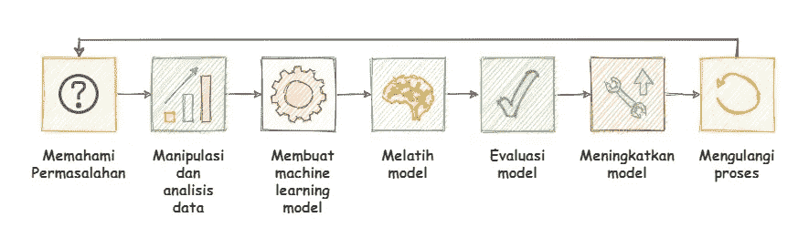

# Membuat Proyek Machine Learning dengan Python — Part 2

> 原文：<https://medium.easyread.co/membuat-proyek-machine-learning-dengan-python-part-2-5a3b33d6aca6?source=collection_archive---------4----------------------->

## Part 2: Membuat, Menganalisis dan Mengevaluasi Model


Photo by [Chris Ried](https://unsplash.com/@cdr6934?utm_source=medium&utm_medium=referral) on [Unsplash](https://unsplash.com?utm_source=medium&utm_medium=referral)

> Artikel ini merupakan lanjutan dari tulisan sebelumnya, [Membuat Proyek Machine Learning dengan Python — Part 1](https://medium.com/easyread/membuat-proyek-machine-learning-dengan-python-part-1-8e8a03095636) (Analisis, Visualisasi dan Preprocessing Data). Pastikan Anda telah membaca part sebelumnya untuk dapat menikmati tulisan berikut.

# Langkah Langkah Membuat Machine Learning Project

Berikut langkah-langkah yang harus dilakukan untuk memulai sebuah proyek *Machine Learning* .



Langkah langkah membuat machine learning project

1.  **Memahami permasalahan.** Pahami permasalahan yang akan diselesaikan, guna mengetahui apa yang perlu dipersiapkan sebelumnya.
    Contohnya: *Machine Learning* apa yang akan saya gunakan menurut data yang saya miliki?
2.  **Menganalisis dan memproses data.** Data mana yang dapat digunakan? Data mana yang seharusnya dibuang? Pada tahap ini dilakukan pengolahan dan analisis data.
3.  **Pembuatan model.** Berdasarkan permasalahan dan data yang ada, pada tahap ini *Machine Learning Model* dibuat.
4.  **Melatih program ( *Machine Learning Model* ).** Model dilatih dengan memberikan data yang sudah diproses sebelumnya.
5.  **Melakukan evaluasi terhadap model.** Apa yang salah dengan modelnya? Kenapa akurasinya rendah?
6.  **Meningkatkan model** . Berdasarkan evaluasi, bagian model mana yang harus diubah? Pada tahap ini *Machine Learning* Model diperbarui.
7.  **Mengulangi semua proses.**

Pada artikel bagian pertama, kita telah melakukan analisis, visualisasi dan preprocessing data. Pada bagian 2 berikut, kita akan meneruskan tahapan membuat *machine learning* dari langkah ke-3 hingga selesai. Sebelum melanjutkan, Saya ingatkan bahwa saat ini data yang kita miliki telah terpisah menjadi empat, yaitu `**x_train**` , `**x_test**` , `**y_train**` , dan `**y_test**` .

# Langkah 3: Membuat Machine Learning Model

*Machine learning* model dibuat dengan tujuan spesifik sesuai dengan permasalahan yang dimiliki. Maka dibuatlah banyak *machine learning* model untuk memecahkan setiap masalah. Permasalahan itu contohnya *classification* dan *regression* .

Namun, dengan *library* sklearn, sudah terdapat banyak *machine learning* model yang siap dipakai. Kita hanya perlu menentukan model mana yang tepat untuk masalah yang kita miliki. Model, disebut juga dengan *estimator* atau algoritma. Sklearn sendiri memiliki *map* untuk menentukan *estimator* yang tepat untuk masalah yang kita punya.


Machine learning map on [sklearn](https://scikit-learn.org/stable/tutorial/machine_learning_map/index.html)

> Jika gambar tersebut tidak terlihat jelas, silakan mengikuti link pada gambar untuk mengunjungi dokumentasi dari sklearn.

Untuk kasus kita kali ini, bisa mulai *map* dari awal. S *amples* (data) yang kita miliki lebih dari 50, yaitu 200 dan kita akan memprediksi kategori yang memiliki label ( *supervised classification problem* ), maka kita masuk ke bagian *classification model* . Data yang kita miliki kurang dari 100 ribu maka model/ *estimator* /algoritma yang akan kita gunakan adalah *Linear* SVC.

```
# Import linear SVC model dari sklearn
**from sklearn.svm import SVC**# Membuat objek dengan nama "model" dengan memanggil SVC()
**model = SVC(gamma='scale')**
```

Terdapat parameter *gamma* pada `**SVC()**` , namun untuk saat ini Anda tidak perlu khawatir dengan hal tersebut, ikuti saja prosesnya terlebih dahulu karena nanti akan dibahas lebih lanjut pada bagian peningkatan model.

# Langkah 4 : Melatih Machine Learning Model

Setelah kita memiliki model yang tepat, selanjutnya kita melatih model terhadap data latihan yang kita miliki.

```
# Melatih model dengan data latihan
**model.fit(x_train,y_train)**
```

Jika Anda menjalankan satu perintah tersebut dalam satu kode blok maka akan memberikan output berupa estimator dan parameternya.

```
**SVC(C=1.0, cache_size=200, class_weight=None, coef0=0.0, dicession_function_shape='ovr', degree=3, gamma='scale', kernel='rbf',max_iter=-1, probability=False, random_state=None, shrinking=True, tol=0.001, verbose=False)**
```

Proses latihan model hanya akan berlangsung beberapa detik saja. Hal itu disebabkan karena beberapa faktor, yaitu data yang kita miliki hanya sedikit dan *machine learning* model yang dipilih adalah model yang sederhana. Setelah model selesai latihan, sekarang saatnya untuk menguji latihannya, dengan cara menggunakan model untuk memprediksi data tes.

```
# Membuat prediksi terhadap data tes
**prediction = model.predict(x_test)**
```

Sekarang kita memiliki hasil prediksi yang berupa *numpy array* . Model memprediksi data dalam `x_test` yaitu `jenis kelamin` , `usia` , `tekanan darah` , `kolesterol` , dan `Na_to_K` . Sedangkan hasil prediksinya yaitu `jenis drug` , dimana kita memiliki lima jenis drug.

Jika kita melihat variabel prediction, panjangnya adalah 40, itu karena kita memberikan 40 data pasien kepada model. Nilai pertama dalam array prediksi adalah hasil prediksi untuk data pertama, dan seterusnya.

# Langkah 5: Evaluasi Model

Sekarang kita telah memiliki machine learning model dan model tersebut dapat digunakan untuk memprediksi data tes, namun kita harus menganalisa performa model dan melakukan evaluasi. Caranya adalah dengan membaca *error metrics* .

*Error metrics* setiap permasalahan berbeda beda, untuk permasalahan *classification* terdapat ***accuracy_score* , *precision* , *recall* , *f1-score* , *r2_score*** dan ***confusion matrix*** *.* Untuk *accuracy_score* , *precision* , *recall* , dan *f1-score* dapat diakses dengan satu fungsi saja yaitu *classification_report.*

## 5.1 Analisa Confusion Matrix

`**confusion_matrix()**` akan me-return dataframe. Daripada menganalisa data dari tabel maka lebih mudah jika dilakukan visualisasi. Maka kita gunakan *heatmap* dari seaborn. Seperti biasa, untuk mempermudah proses analisa, dapat dilakukan dengan visualisasi data.

Pada kode diatas terdapat beberapa parameter yaitu `y_test` , yang berisi informasi aktual mengenai jenis kelas yang dimiliki pasien dalam `x_test` dan *prediction* , berisi informasi mengenai jenis kelas yang berasal dari hasil prediksi model terhadap data `x_test` . Berikut hasil visualisasi *confusion matrix* berdasarkan fungsi `**display_conf**`


Visualisasi confusion matrix pada prediksi model

Dengan memvisualisasikan *confusion matrix* , kita tidak hanya tau apakah prediksi benar atau salah, namun juga mengerti dimana letak kesalahannya. Nilai pada setiap kotak adalah jumlah kelas yang diprediksi. Karena kita memiliki 5 kelas, maka bentuk dari confusion matrix adalah 5x5.

Prediksi dikatakan benar jika nilai aktual kelas 0 dan prediksi kelas 0, begitu juga dengan kelas 1,2 dan lainnya. Maka model yang baik akan menghasilkan visualisasi confusion matrix yang berbentuk matrix diagonal dari kiri atas ke kanan bawah.

Karena kita baru saja membuat model maka hasilnya model banyak membuat kesalahan prediksi. Model sangat buruk dalam memprediksi kelas 1,2 dan 3\. Hal ini disebabkan karena kita hanya memiliki sedikit data latihan untuk kelas 1,2, dan 3, sementara kita memiliki data yang cukup untuk kelas 0 dan 4\. Sehingga model kurang berlatih dalam mengenali kelas 1,2, dan 3.

## 5.2 Analisa Error Metrics

Pada *classification report* terdapat *precision* , *recall* , *f1-score* dan *support* . Masing masing matrix tersebut dihitung berdasarkan *confusion matrix* . Namun, untuk *confusion matrix* sendiri adalah bahasan yang besar jika dicantumkan dalam artikel ini. Maka kali ini kita fokus saja pada *r2_score* , *accuracy_score* dan *precission* .

```
**print(f'R2 Score : {r2_score(y_test,prediction)}')
print('Classification Report :')
print(classification_report(y_test,prediction))**
```

Output

```
**R2 Score : 0.22748526123195778**Classification Report : precision    recall  f1-score   support

           0       0.79      1.00      0.88        15
           1       0.00      0.00      0.00         3
           2       0.00      0.00      0.00         4
           3       0.00      0.00      0.00         4
           4       0.52      0.79      0.63        14

    accuracy                           0.65        40
   macro avg       0.26      0.36      0.30        40
weighted avg       0.48      0.65      0.55        40
```

`**R2_score**` adalah sebuah nilai yang menyatakan seberapa sesuai hasil prediksi model mendekati data yang sebenarnya. Semakin besar `r2_score` , maka hasil prediksi semakin dekat dengan data yang sebenarnya. Semakin besar `r2_score` maka model semakin bagus. Nilai maksimum untuk `r2_score` , `*accuracy_score*` , dan `*precission*` adalah 1.00 yaitu 100% dan tidak ada nilai negatif.

Akurasi adalah sebuah nilai yang menyatakan seberapa persen model dapat memprediksi data dengan benar. Semakin besar nilai akurasi maka semakin bagus model yang kita miliki. Sedangkan presisi adalah sebuah nilai yang menyatakan rasio akurasi model. Semakin besar nilai presisi maka semakin bagus model yang kita miliki.

Data yang kita miliki memiliki frekuensi yang tidak seimbang pada setiap kelasnya, maka nilai akurasi tidak benar benar membuktikan kualitas model yang kita buat, maka kita juga perhatikan nilai presisi setiap kelas, khususnya pada kelas 1,2 dan 3 yang memiliki frekuensi data rendah.

# Langkah 6: Meningkatkan Model

Kita telah membuat model yang dapat bekerja, namun kita harus meningkatkan kualitasnya untuk mengatasi perbedaan frekuensi setiap kelasnya. *Machine learning* adalah tentang data, maka untuk meningkatkan model dapat dilakukan dengan berbagai cara.

Diantaranya adalah dengan menambah jumlah data, menggunakan teknik *preprocessing* data yang tepat, memilih *machine learning* model yang lebih tepat, *tuning hyperparameter* model, *cross validation* , dsb. Kali ini kita akan melakukan *tuning hyperparameter* dan menerapkan *cross validation* . Untuk melakukannya kita dapat menggunakan *grid search cv.*

Di dalam `param_grid` terdapat C dan *gamma* yang merupakan parameter yang dimiliki oleh estimator SVC. Sedangkan `cv=5` artinya kita akan melatih model dengan 5 lipatan, dan untuk refit = True adalah untuk mengambil model dengan paramter yang terbaik setelah semua model selesai berlatih.

Cross validation adalah metode untuk membagi data menjadi beberapa segmen dan melakukan tes untuk setiap segmen, sehingga kita bisa mendapatkan model yang paling efektif dalam memprediksi data untuk setiap segmen yang berbeda.


Visualisasi mengenai perumpamaan cara kerja cross validation

Jadi pada tahap ini dibuatlah banyak model dengan konfigurasi parameter yang berbeda beda sebanyak kombinasi yang memungkinkan dari `param_grid` , kemudian diambil satu diantarannya yang terbaik. Itulah maksud dari *tuning hyperparameter* . Untuk mengetahui konfigurasi model yang terbaik, dapat dilakukan dengan

```
# Model dengan parameter terbaik
**best_model.best_estimator_**
```

Output

```
**SVC(C=100, cache_size=200, class_weight=None, coef0=0.0, decision_function_shape='ovr', degree=3, gamma=0.01, kernel='rbf', max_iter=-1, probability=False, random_state=None, shrinking=True, tol=0.001, verbose=False)**
```

Kita dapat mengetahui bahwa model terbaik memiliki parameter `C=100` dan `*gamma* = 0.01` . Sekarang saatnya untuk membuat prediksi dan melakukan evaluasi terhadap model terbaik yang kita buat.

```
# Membuat prediksi dengan model yang telah ditingkatkan
**prediction = best_model.predict(x_test)**# Menampilkan confusion matrix pada prediksi yang baru
**display_conf(y_test,prediction)**
```


Visualisasi confusion matrix pada prediksi model terbaik

```
print(f'R2 Score : {r2_score(y_test,prediction)}')
print('Classification Report :')
print(classification_report(y_test,prediction))
```

Output

```
R2 Score : 0.7081002189248358Classification Report : precision    recall  f1-score   support

           0       0.95      1.00      0.98        20
           1       0.83      0.83      0.83         6
           2       1.00      0.67      0.80         3
           3       0.60      1.00      0.75         3
           4       1.00      0.75      0.86         8

    accuracy                           0.90        40
   macro avg       0.88      0.85      0.84        40
weighted avg       0.92      0.90      0.90        40
```

Sekarang dapat kita analisa bahwa model mengalami kemajuan. `R2_score` yang tadinya 0.2 mengalami kenaikan besar menjadi 0.7, `accuracy_score` yang tadinya 0.65 sekarang menjadi 0.90, dan `precision` untuk kelas 1,2, dan 3 masing masing adalah 0.83, 1.00, dan 0.60\. Dengan hasil seperti ini, maka sudah mantap jika model digunakan untuk kerperluan data nyata yang belum pernah dilihat sebelumnya.

# Langkah 7: Mengulangi Semua Proses

Sekarang Anda telah memiliki model yang berfungsi dengan baik, meski dengan frekuensi kelas yang rendah. Namun Anda masih bisa meningkatkan model dengan mengulangi semua langkah dari awal. *Machine learning* adalah tentang eksperimen, maka Anda dapat memulai dengan menambah data yang baru untuk latihan, mencoba teknik *preprocessing* data yang lain, mencoba *machine learning* model yang lain, dan menggunakan *cross validation* dan *parameter grid* yang lebih kompleks.

# Menyimpan Machine Learning Model

Anda dapat menyimpan *machine learning* model, sehingga Anda dapat menggunakannya untuk melakukan prediksi data di waktu dan program atau script yang berbeda tanpa melatih model dan melakukan semua proses dari awal. Untuk melakukan hal ini, Anda dapat menggunakan *library* pickle.

```
import pickle# Menyimpan model menjadi file .pkl
**with open('AI_DrugClassifier.pkl','wb') as file:
    pickle.dump(best_model,file)**
```

Sekarang Anda memiliki model yang dapat ditransfer, dicopy dan dimuat dalam *script* yang berbeda. Untuk memuat model di *script* yang berbeda, dapat dilakukan dengan cara berikut.

```
# Memuat model dalam file .pkl
**with open('AI_DrugClassifier.pkl','rb') as file:
    model = pickle.load(file)**
```

Untuk memastikan apakah model berhasil dimuat, dapat dilakukan dengan model.best_estimator_

```
**SVC(C=100, cache_size=200, class_weight=None, coef0=0.0, decision_function_shape='ovr', degree=3, gamma=0.01, kernel='rbf', max_iter=-1, probability=False, random_state=None, shrinking=True, tol=0.001, verbose=False)**
```

# Demonstrasi Prediksi Model

Anda dapat membuat python *script* baru untuk mendemonstrasikan prediksi model dengan menginputkan langsung data pasien ke dalam program.

```
> **python demonstrasi-model.py**
Age : 25
Sex : 1
BP : 0
Cholesterol : 1
Na_to_K : 15

Prediction
Patient consumed :  drugA
```

# Membuat Submission di Kaggle

Untuk project ini, sebenarnya pada *submission* di kaggle kita tidak diminta untuk mengirimkan output yang berupa hasil prediksi dari data tes. Namun kita mengirimkan *notebook* yang kita buat.

Pada situs kaggle, kita tidak hanya dapat mencari data, namun juga dapat mencari *notebook* dari orang lain, sekaligus kita dapat menjalankan *notebook* secara online dengan gratis. Untuk mengirimkan *submission* , maka Anda harus menjalankan *notebook* tersebut di situs kaggle.

## Membuat Notebook

Untuk melakukan *submission* , maka Anda harus mendaftar terlebih dahulu di Kaggle. Setelah itu menuju post [*drug classification*](https://www.kaggle.com/prathamtripathi/drug-classification) *,* dan pilih *new notebook* . Gunakan bahasa pemrograman python dan pilih jenis *notebook* dan klik *create* . Sekarang Anda jalankan *notebook* di kernel kaggle, karena Anda sudah membuatnya di jupyter notebook, maka Anda bisa *upload* atau *copy paste* .

Pada kaggle, perhatikan lokasi file data, Anda hanya perlu memodifikasi lokasi file pada saat membaca dengan pandas. Untuk praktisnya Anda dapat *copy path* saja, dan jalankan *notebook* seperti biasa.

## Mengirimkan Notebook

Jika *notebook* sudah selesai, pastikan *visibility notebook* adalah *public* kemudian pergilah ke menu task pada postingan awal. Kemudian klik *submit* , dan pilih *notebook* yang Anda buat sebelumnya. Anda juga dapat melihat *notebook* yang telah saya buat untuk *submission* sebagai panduan. [SVM-Multiclass-Classification | Kaggle](https://www.kaggle.com/philippurwokoap/svm-multiclass-classification)

# Resolusi

Sekarang kita memiliki AI untuk membantu mendiagnosa pasien pengonsumsi narkoba. AI dapat memprediksi jenis narkoba yang dipakai pasien, sehingga model ini dapat digunakan untuk membantu rumah sakit atau badan rehabilitasi dalam mengkategorikan pasiennya. Model ini dapat digunakan sebagai cadangan, jika dokter sedang tidak tersedia atau menangani pasien lain, begitulah permodelannya.

Namun perlu diingat bahwa data di dunia nyata tidaklah sesimpel ini. Akan ada banyak data yang kosong dan tidak lengkap, serta untuk proses analisis dan preprocessing data pun memerlukan waktu dan tenaga tersendiri. Karena project ini hanya untuk latihan bagi pemula, maka tidak masalah. Anda hanya perlu terus berlatih dan pada dasarnya semua jenis ilmu yang ada di dunia ini dapat dipelajari.

## Proyek Open Source

Jika Anda menginginkan kode utuh dari proyek ini, Anda dapat mendownload secara gratis di Github. Bagi Anda yang masih asing dengan Github, maka anda bisa menuju tautan di bawah, dan klik *code* kemudian *download as zip* . Anda dapat mengakses *notebook* untuk dijadikan bahan belajar dan panduan. [**https://github.com/PhilipPurwoko/DrugAI**](https://github.com/PhilipPurwoko/DrugAI)

## Project Deployment and Production

Sebenarnya, saat kita berlatih membuat proyek, harus sampai tuntas hingga tahap produksi. Namun untuk produksi tidak akan saya jelaskan pada artikel ini, mungkin akan saya buat artikelnya pada lain kesempatan. Proyek ini telah saya kerjakan dan saya deploy dan dapat diakses melalui website berikut [https://drugai.herokuapp.com/](https://drugai.herokuapp.com/)

## Apa yang Harus Dipelajari Selanjutnya ?

Anda telah berhasil membuat proyek *machine learning classification problem* , sekarang Anda dapat melanjutkan dengan mempelajari *regression problem* . Carilah data di kaggle, buatlah *notebook* dengan jupyter, gunakan langkah langkah dan metode yang telah Anda pelajari dari panduan ini.

Jika Anda masih belum paham dalam mengerjakan proyek ini, silakan untuk mengulangi dari awal dan pastikan Anda membaca secara urut. Pastikan Anda telah membaca artikel mengenai perkenalan dengan *machine learning* , karena terdapat bahasan fundamental yang harus dipahami. [Mari Berkenalan dengan Machine Lerarning](https://medium.com/easyread/mari-berkenalan-dengan-machine-learning-b4778ff2914a) .

Bagi Anda yang masih asing dengan Github, Github adalah tempat untuk menemukan kode yang bersifat open source. Github adalah sosial media untuk para *programmer* . Dengan Github, Anda dapat berkolaborasi dan mengerjakan proyek bersama orang lain.

> Enjoy Learning !