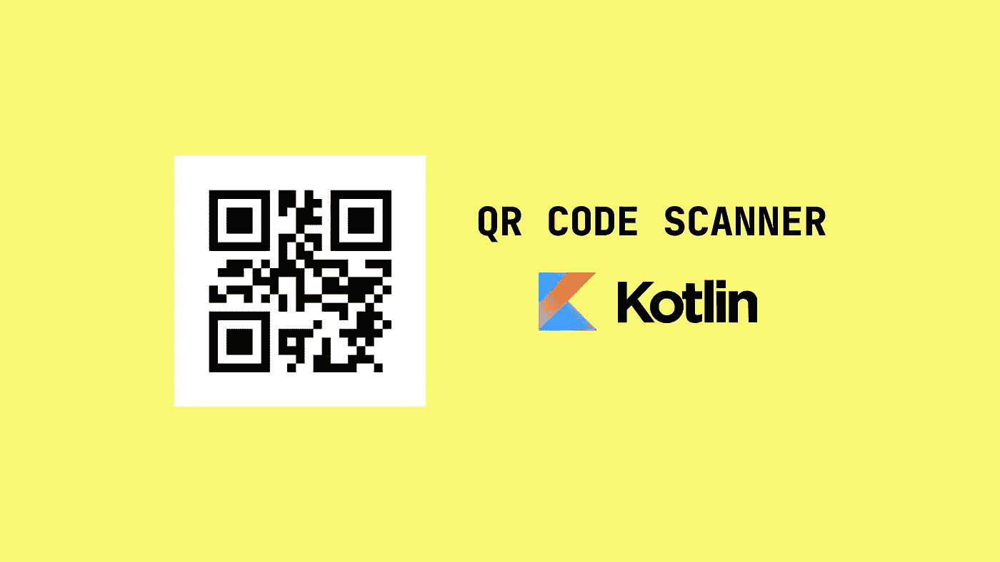
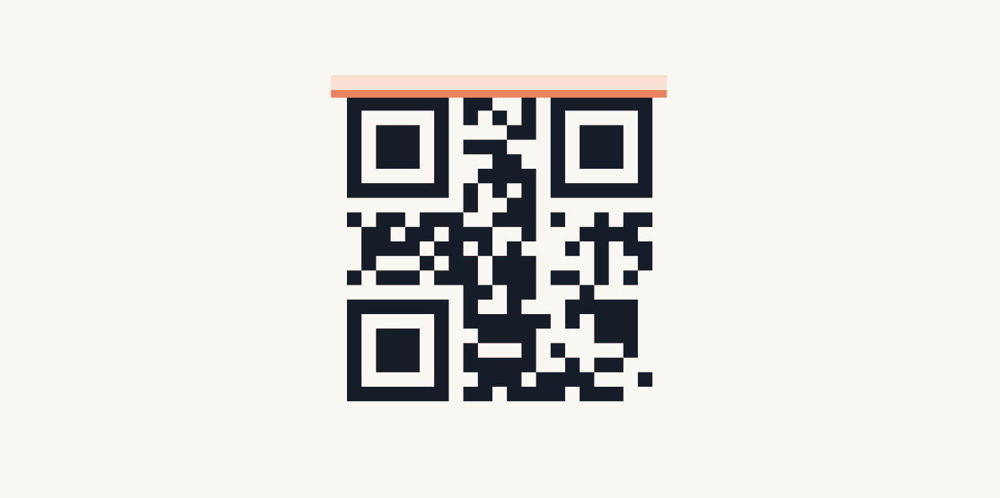
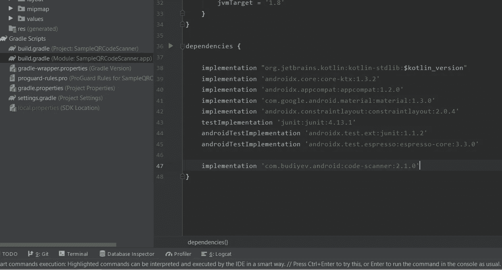
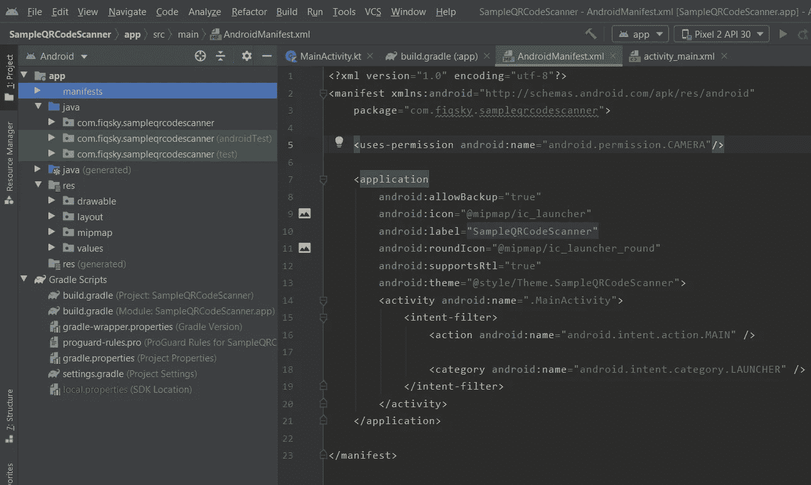
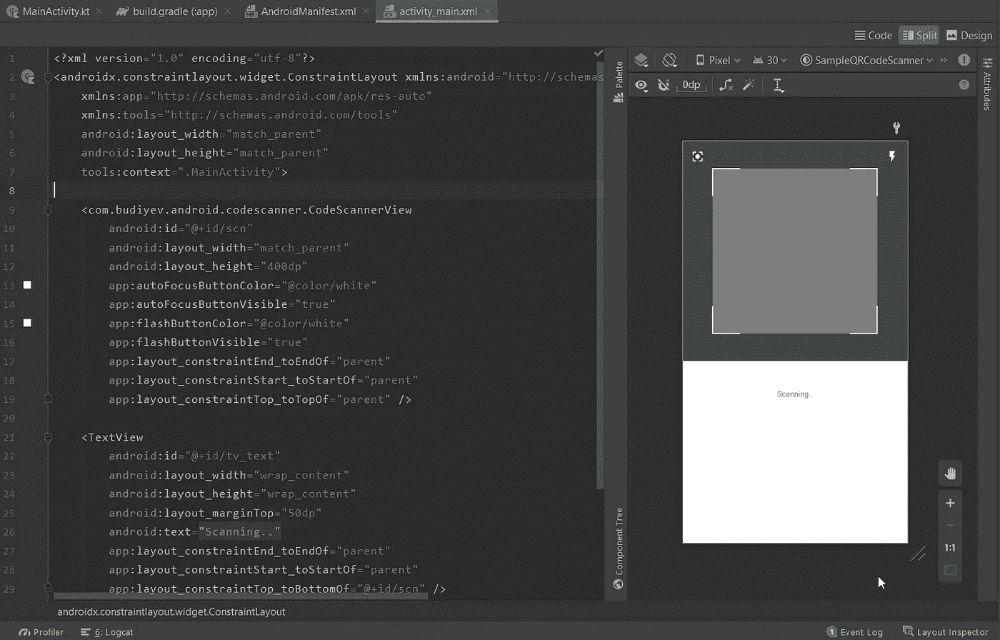

# Membuat QR Code Scanner di Android Menggunakan Kotlin

> 原文：<https://medium.easyread.co/membuat-qr-code-scanner-di-android-kotlin-7181b27db2ec?source=collection_archive---------0----------------------->

## Make a QR Code Scanner with Kotlin



Halo semuanya, lanjut ya, kali ini kita akan mencoba membuat aplikasi *QR Code Scanner* di Android dengan menggunakan bahasa pemograman Kotlin.
*Udah ga sabar kan, yukk!* 😉

## QR CODE SCANNER



Jadi *QR Code Scanner* adalah aplikasi yang digunakan untuk memindai kode batang atau *barcode* untuk mengambil data yang ada didalamnya.

## KOTLIN


Sudah tau lah *yah* mengenai Kotlin, yaitu salah satu bahasa pemrograman yang dapat digunakan untuk membuat aplikasi Android secara Native, dirilis pada 2016 dan pada Google I/O 2017, Google memberikan Kotlin dukungan penuh untuk Android mengantikan Java, dan masih banyak lagi hal menarik lainnya mengenai Kotlin.

# Required

Berikut merupakan beberapa hal yang dibutuhkan sebelum membuat *project ini* .
1\. Memakai *dependencies* dari [**Yuriy Budiyev**](https://github.com/yuriy-budiyev/code-scanner)2\. Menambahkan **< uses-permission …CAMERA/ >**
3\. Code.

# Preparation

Dan ya, yang pertama adalah menambahkan dependensi dari [Yuriy Budiyev](https://github.com/yuriy-budiyev/code-scanner)

```
**implementation 'com.budiyev.android:code-scanner:2.1.0'**
```



*Library* tersebut sudah sangat cukup untuk membuat sebuah aplikasi *scanner* *barcode* , dan berikut adalah beberapa fiturnya.

*   *Auto focus* dan kontrol lampu *flash*
*   Orientasi layar *portrait* and *landscape*
*   Mendukung kamera depan dan belakang
*   *Viewfinder* yang dapat disesuaikan
*   Kotlin *friendly*
*   *Touch focus*

Tidak cuma itu saja, tetapi juga support beberapa format scan seperti.

*   *1D product: UPC-A, UPC-E, EAN-8, EAN-13*
*   *1D industrial: Code 39, Code 93, Code 128, Codabar, ITF, RSS-14, RSS-Expanded*
*   *2D: QR Code, Data Matrix, Aztec, PDF 417, MaxiCode.*

Oke, lanjut yang kedua membuka manifests dan tambahkan *uses-permission* untuk Camera.

```
**<uses-permission android:name="android.permission.CAMERA"/>**
```



Mungkin persiapan nya itu saja, dan *yuk langsung lanjut ke sesi coding!*

# Let’s Code

Sampai disini kita akan buat tampilan layoutnya terlebih dahulu.



layout activity_main

Maka layout yang akan jadi seperti gambar layout `**activity_main.xml**` diatas. Untuk contoh kali ini hanya menggunakan beberapa property layout seperti.

```
app:autoFocusButtonColor="@color/white"
app:autoFocusButtonVisible="true"
app:flashButtonColor="@color/white"
app:flashButtonVisible="true"
app:layout_constraintEnd_toEndOf="parent"
app:layout_constraintStart_toStartOf="parent"
app:layout_constraintTop_toTopOf="parent"
```

Property yang lain bisa dilihat sendiri di [dokumentasi](https://github.com/yuriy-budiyev/code-scanner\) .

Lanjut di `**MainActivity**` kita tambahkan beberapa baris kode.

Berisi beberapa fungsi seperti 1)Request Permissions

```
private fun setupPermissions() {
    val permission = ContextCompat.checkSelfPermission(this, android.Manifest.permission.*CAMERA*)

    if (permission != PackageManager.*PERMISSION_GRANTED*) {
        makeRequest()
    }
}

private fun makeRequest() {
    ActivityCompat.requestPermissions(
        this, *arrayOf*(android.Manifest.permission.*CAMERA*),
        CAMERA_REQ
    )
}

override fun onRequestPermissionsResult(
    requestCode: Int,
    permissions: Array<out String>,
    grantResults: IntArray
) {
    when (requestCode) {
        CAMERA_REQ -> {
            if (grantResults.*isEmpty*() || grantResults[0] != PackageManager.*PERMISSION_GRANTED*) {
                Toast.makeText(
                    this,
                    "You need the camera permission to use this app",
                    Toast.*LENGTH_SHORT* ).show()
            }
        }
    }
}companion object {
    private const val CAMERA_REQ = 101
}
```

dan 2)Scanner itu sendiri

```
private fun codeScanner() {
    codeScanner = CodeScanner(this, scn)

    codeScanner.*apply* **{** *camera* = CodeScanner.*CAMERA_BACK
        formats* = CodeScanner.*ALL_FORMATS

        autoFocusMode* = AutoFocusMode.*SAFE
        scanMode* = ScanMode.*CONTINUOUS
        isAutoFocusEnabled* = true
        *isFlashEnabled* = false

        *decodeCallback* = *DecodeCallback* **{** runOnUiThread **{** tv_text.*text* = **it**.*text* **}
        }** *errorCallback* = *ErrorCallback* **{** runOnUiThread **{** Log.e("Main", "codeScanner: ${**it**.message}")
            **}
        }** scn.setOnClickListener **{** codeScanner.startPreview()
        **}

    }** }
```

Lalu method *lifecycle* agar tidak ada *memory leak* .

```
override fun onResume() {
    super.onResume()
    codeScanner.startPreview()
}

override fun onPause() {
    codeScanner.releaseResources()
    super.onPause()
}
```

# Output

Kalian bisa coba sendiri scan qr code yang kalian buat sendiri dari story “Membuat QR Code Generator” kemarin.
maka hasilnya akan seperti berikut.


# Last Word

Untuk full project disini: [https://github.com/FiqSky/sample-qr-code-scanner](https://github.com/FiqSky/sample-qr-code-scanner)
*Oke deh* , tidak perlu berkata-kata lagi intinya, Terima kasih. 😊
Semoga bermanfaat dan sampai ketemu di tulisan berikutnya. 👋