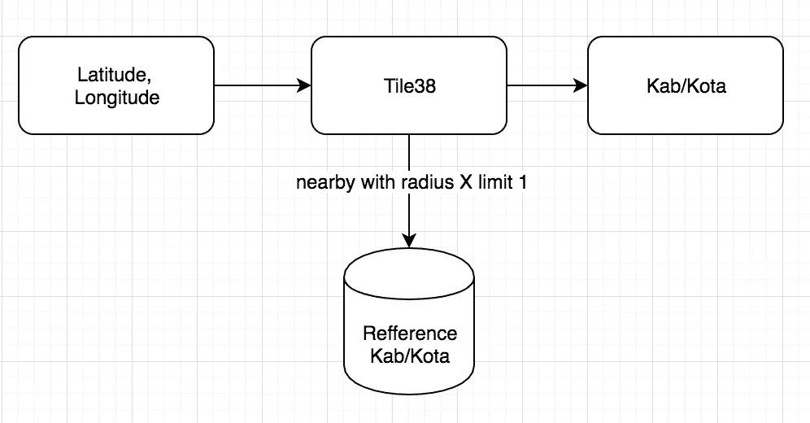
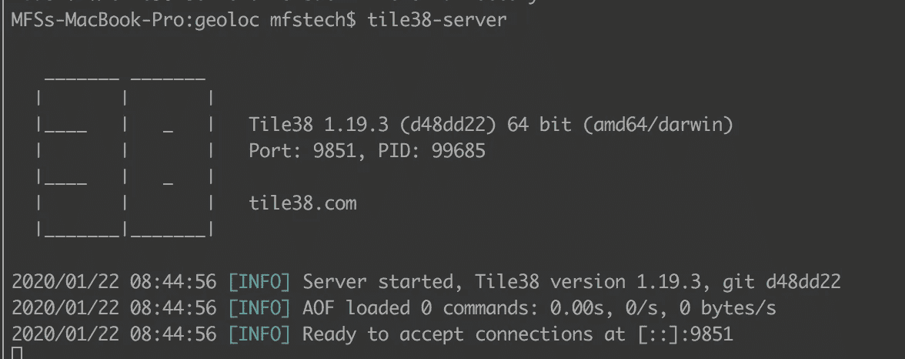
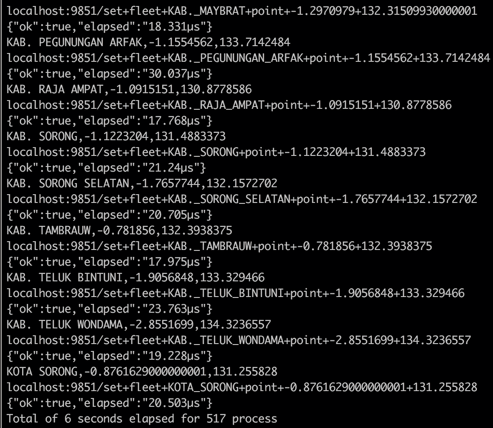
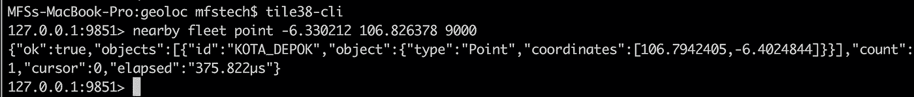
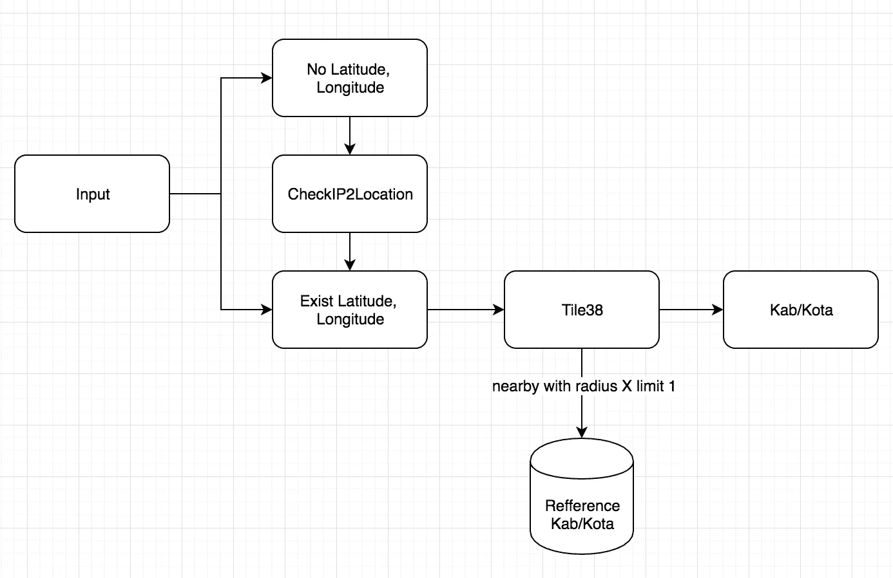
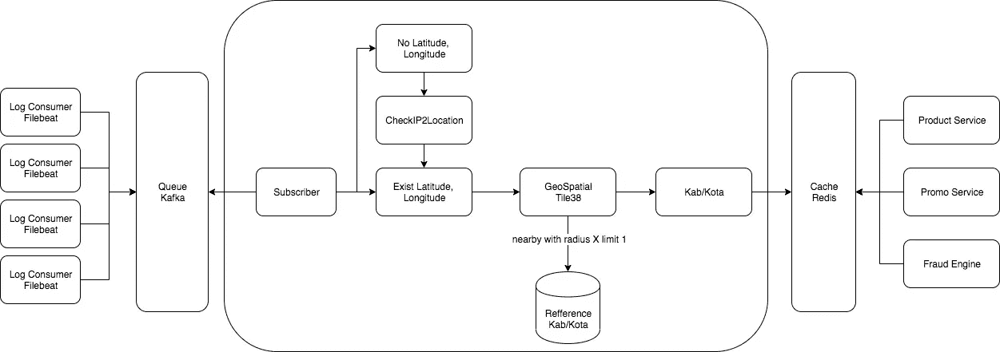

# Membuat Referensi Lokasi Customer

> 原文：<https://medium.easyread.co/membuat-referensi-lokasi-customer-df75810e5a14?source=collection_archive---------5----------------------->

## Simple Tutorial Geospatial Query

Latar belakang dari tulisan ini adalah *project* untuk membuat *pricing product* berdasarkan lokasi. Dengan harga produk yang sesuai lokasi customer diharapkan bisa meningkatkan jumlah transaksi yang pada akhirnya meningkatkan revenue.


[https://postgis.net/](https://postgis.net/)

Hal penting dari *project* ini adalah bagaimana mendapatkan informasi lokasi yang sudah dinormalisasi. Dengan *output* ini, kegunaannya bisa untuk berbagai hal lain berikut:

*   Pricing product berdasarkan lokasi
*   Product Catalog berdasarkan lokasi
*   Promo berdasarkan POI
*   Fraud detection



Flow proses deteksi lokasi dari lat/long

Penggunaan geospatial query (database lokasi dan ruang) pada umumnya menggunakan [PostGIS](https://postgis.net/) yang merupakan modul tambahan di postgreSQL. PostGIS cocok untuk segala jenis kebutuhan query geospatial terutama yang complex dan data yang besar. Karena kebutuhan project ini sederhana dan data referensi yang tidak complex penulis mencoba menggunakan open source [**tile38**](https://github.com/tidwall/tile38) **,** sumber dari referensi [ini](https://news.ycombinator.com/item?id=16526929) .

## ***Langkah-Langkah Menggunakan tile38***

*   **Download dan jalankan tile38 server**

```
**tile38-server**
```



*   **Membuat referensi lokasi**

Penentuan lokasi dan standarisasi nama lokasi sangat penting, karena lokasi ini yang nanti digunakan sebagai referensi, misalnya kita akan mencantumkan lokasi dan harganya di product catalog. Referensi lokasi bisa apa aja, misal kita bisa definiskan sendiri area daya beli tinggi dengan area lat/long perkotaan dan area daya beli rendah di lat/long pedesaan. Di project ini, kita akan mencoba menggunakan data city (kabupaten/kota) indonesia dengan data yang diambil dari [website](https://datahub.io/JemputData/location_id) ini, total 512 kab/kota indonesia.

Selanjutnya kita buat script untuk load data ke tile38

```
#!/bin/bash
start_time="$(date -u +%s)"
server=$1
file=$2
i=0
#telnet 127.0.0.1 9851 <<EOF
while IFS= read -r line
do
    echo "$line"
    IFS=',' #delimiter
    read -r var1 var2 var3 <<< "$line" # Dijadikan array
    key=${var1// /_}
    echo "$server/set+fleet+$key+point+$var2+$var3"
    curl "$server/set+fleet+$key+point+$var2+$var3"
     ((i=i+1))
done < "$file"
end_time="$(date -u +%s)"
elapsed="$(bc <<<"$end_time-$start_time")"
echo "Total of $elapsed seconds elapsed for $i process"
```



*   **Testing lokasi nearby**

Kita coba test dengan menggunakan lat long dimana penulis berada

```
#nearby fleet point {lat} {long} {radius-meter}$ tile38-cli
$ nearby fleet point -6.330212 106.826378 9000
```



## **Problem**

Karena kita bukan perusahaan transportasi yang mengharuskan pelanggan mengaktikan fitur lokasi/gps, sehingga data lat-long tidak selalu dikirim dari apps. Solusinya kita akan mencoba menggunakan lat-long dari IP mobile client.



Flow proses tambahan dengan input IP karena tidak ada lat/long

[**IP2Location**](https://lite.ip2location.com/database/ip-country-region-city-latitude-longitude) ini penyedia translasi dari IP ke beberapa profile seperti region, city, lat/long. Dalam hal ini kita hanya akan menggunakan IP untuk mendapatkan lat/long. Kenapa tidak langsung translasi ke city saja? Karena city belum tentu sama dengan kab/kota referensi kita.

```
import (
 "fmt""github.com/ip2location/ip2location-go"
)func main() {
 ip2location.Open("/Users/mfstech/Downloads/IP2LOCATION-LITE-DB5.BIN")
 ip := "180.249.192.0"results := ip2location.Get_all(ip)fmt.Printf("country_short: %s\n", results.Country_short)
 fmt.Printf("country_long: %s\n", results.Country_long)
 fmt.Printf("region: %s\n", results.Region)
 fmt.Printf("city: %s\n", results.City)
 fmt.Printf("isp: %s\n", results.Isp)
 fmt.Printf("latitude: %f\n", results.Latitude)
 fmt.Printf("longitude: %f\n", results.Longitude)

 ip2location.Close()
}
```

## **Implementasi**

Supaya mudah untuk diimplementasi dan tidak mengganggu *service* yang ada, kita bisa menggunakan arsitektur log aggregator seperti dibawah.



Flow proses keseluruhan deteksi lokasi sehingga menjadi database referensi lokasi

**Keterangan gambar:**

*   Setup log consumer (filebeat) supaya bisa membaca log dan mengirimkan ke Queue (kafka) sebagai sumber data mentah.
*   Proses parsing log untuk mendapatkan key value (key,lat/long) atau (key,IP). Key bisa kita tautkan dengan customerID
*   Deteksi dan normalisasi lokasi dari lat/long atau IP menjadi kab/kota yang penamaannya sudah standard. Proses deteksi ini bisa dibantu dengan penggunaan tile38 menggunakan command nearby.
*   Masukan hasil output key-value (customerID, Kab/Kota) ke repository database (redis) yang nantinya bisa dipakai oleh *service* lain.

## **Kesimpulan**

*   Kita bisa menggunakan geospatial query untuk membuat referensi lokasi customer dengan data mentah lat/long atau IP untuk selanjutnya ditranslate menjadi lokasi yang sudah standard.
*   Ketika ada solusi untuk suatu requirement, coba dibuat sebagai service yang reusable sehingga bisa dibuatkan secara generic dan standard dan bisa dimanfaatkan untuk lebih banyak service.
*   Design pattern log aggregator bisa dimanfaatkan untuk kebutuhan service semisal referensi data.

Terima kasih sudah membaca, semoga tulisan ini bisa bermanfaat atau membuat ide-ide baru buat pembaca :D