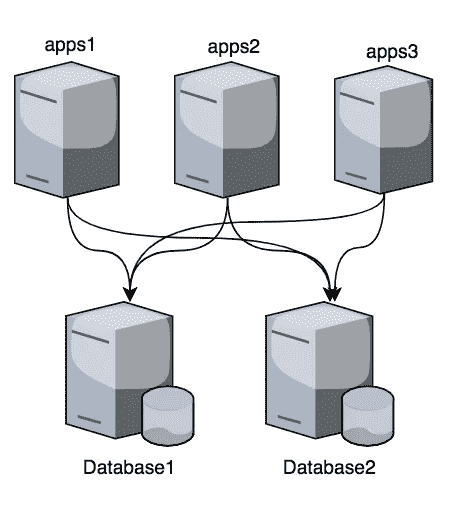
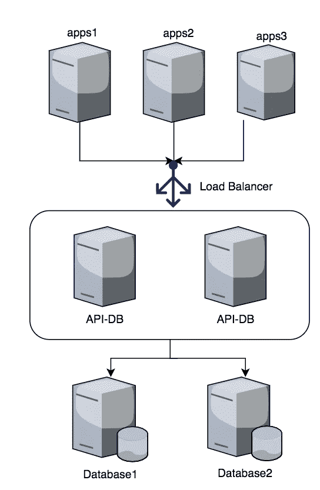

# Akses Mudah Database via API

> 原文：<https://medium.easyread.co/membuat-reusable-akses-database-via-api-279fdd5ec0fb?source=collection_archive---------3----------------------->

Membuat *reusable* koneksi database via API

Salah satu mindset sebagai programmer adalah melihat suatu masalah dan mencari solusi yang reusable. Dalam software development, solusi reusable bisa dalam bentuk fungsi, library,modul atau konsep yang biasa dipakai secara berulang di aplikasi.


“person holding 3x3 Rubik's Cube” by [NeONBRAND](https://unsplash.com/@neonbrand?utm_source=medium&utm_medium=referral) on [Unsplash](https://unsplash.com?utm_source=medium&utm_medium=referral)

**Background**

Apapun aplikasi yang kita bangun, biasanya resources yang paling sering digunakan adalah database. Bahkan mungkin aplikasi tertentu hanya dibangun untuk query dan manipulasi data di database.

Terlepas dari tipe aplikasi monolithic atau microservice, komunikasi ke server database umumnya dibuat di internal aplikasi sebagai berikut:



Komunikasi database per-aplikasi

Arsitektur diatas adalah cara mudah, cepat dan mungkin banyak diimplementasi oleh developer. Akan tetapi ketika ada kebutuhan penambahan aplikasi atau service baru yang membutuhkan database yang sama bisa kita bayangkan betapa banyaknya koneksi dan implementasi yang dibuat di masing-masing aplikasi.

Kekurangan dari arsitekur ini menurut saya adalah sebagai berikut:

1.  Implementasi koneksi pooling dimasing-masing aplikasi sedikit banyak akan memakan resource aplikasi. Semakin banyak aplikasi semakin banyak resource terbuang.
2.  Kita tidak tahu seberapa besar efesiensi per aplikasi atau service menggunakan koneksi database. Karena bisa jadi 1 aplikasi hanya menggunakan komunikasi database sepersekian saja dan sisanya service yang lain.

Disinilah konsep microservice khususnya bicara *independent resource* bisa kita terapkan dengan membuat layer baru berupa API koneksi ke database atau saya sebut dengan istilah API-DB,



Komunikasi database menggunakan middleware API-DB

API-DB merupakan middleware aplikasi untuk handle komunikasi ke database, diantara fungsinya sebagai berikut :

1.  Convert http restAPI menjadi operation query ke database dengan custom query dan parameter yang flexible.
2.  Response query database selanjutnya diconvert menjadi json dan dikembalikan sebagai response ke Client.

Dengan implementasi arsitektur diatas kita bisa mendapatkan beberapa benefit berikut :

1.  Integrasi yang mudah untuk aplikasi/service yang baru yang membutuhkan koneksi ke database. Cukup dengan menyediakan method call Http Request dan parsing result dari Http Response.
2.  Resource penggunaan koneksi database yang lebih efisien karena hanya apps/service yang membutuhkan saja yang akan membuat koneksi berupa http ke API-DB.
3.  Monitoring dan segmentasi yang jelas antara layer database dan aplikasi, sehingga kita bisa melakukan penambahan koneksi dan efisiensi cukup di layer API-DB (misal dengan menambahkan mekanisme caching).

**Implementasi**

Implementasi API-DB ini bisa kita buat dengan bahasa pemrograman apa saja dengan memperhatikan beberapa hal berikut:

1.  **Security** , setiap API dibuat dengan tujuan menggunakan resource yang ada dibelakangnya. Oleh karenanya seberapa penting implementasi security bergantung seberapa *confidential* resource data yang akan diakses.
2.  **Request** , karena kita akan membuat middleware yang akan dipakai oleh beberapa aplikasi untuk komunikasi database, maka diperlukan standard parameter input, untuk API-DB bisa kita define sebagai berikut:

*   *datasource:* parameter yang dibutuhkan untuk koneksi ke database seperti server database, username, maximum pooling, connection dan expiry time connection
*   *query_id:* query yang akan kita panggil dengan menggunakan id

Konfigurasi datasource dan query id yang akan digunakan

*   *custom parameter,* custom parameter yang dimaksudkan disini adalah parameter query yang nantinya akan dimasukan ke dalam query melalui API

```
sqlid.user2=" SELECT * from `user` where **id=[id]** limit 10"
```

dengan config diatas, kita bisa isi variable **id** dengan parameter dari api yang kita panggil.

```
curl -X GET "http://localhost:8080/v1/query/select?ds=localhost&sqlid=user2&**id=1**" -H "accept: application/json"
```

3\. **Response** , response bisa dibuatkan standard dalam bentuk json sehingga client apapun bisa consume dengan mudah.

```
result:
{
"count": 10,
"data": [
  {
    "email": "slene",
    "id": "1",
    "name": "testing"
  },
  {
    "email": "someemail@someemailprovider.com",
    "id": "2",
    "name": "First"
  },
  {
    "email": "someemail@someemailprovider.com",
    "id": "3",
    "name": "First"
  }
  ....
],
"desc": "-",
"success": true
}
```

Untuk full implementasinya bisa didapat di github saya berikut, versi golang

[](https://github.com/qomarullah/godb) [## qomarullah/godb

### api query DB with go lang. Contribute to qomarullah/godb development by creating an account on GitHub.

github.com](https://github.com/qomarullah/godb) 

atau versi java berikut

[](https://github.com/qomarullah/apidb) [## qomarullah/apidb

### layering db connection with rest api. Contribute to qomarullah/apidb development by creating an account on GitHub.

github.com](https://github.com/qomarullah/apidb) 

Demikian sharing komunikasi database menggunakan API versi saya, terima kasih telah membaca sampai akhir. Kalau menurutmu post ini bermanfaat jangan lupa **follow, share dan clap ya! :)** silahkan juga komentar apabila ada yang kurang jelas atau ingin ditanyakan.