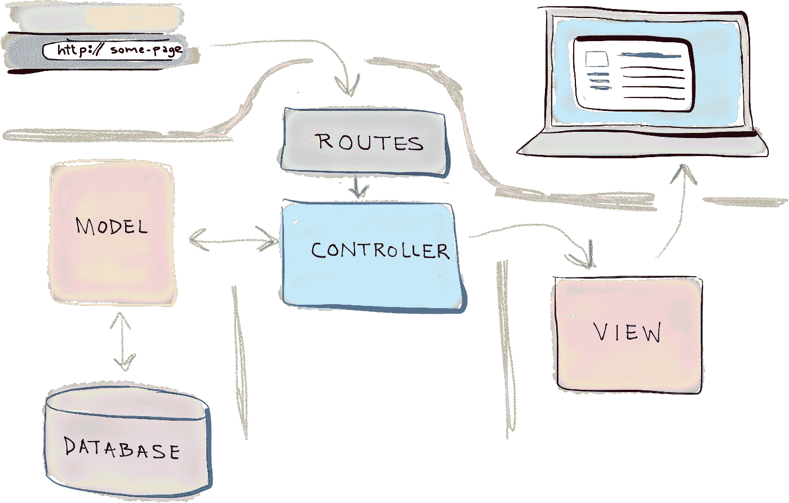
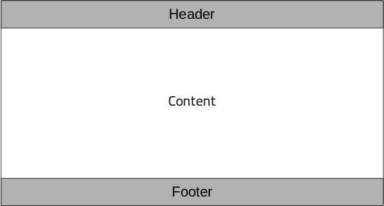

# Membuat Tampilan Web dengan Blade pada aplikasi Laravel — Part I

> 原文：<https://medium.easyread.co/membuat-tampilan-web-dengan-blade-pada-aplikasi-laravel-part-i-c9f5ceee65e6?source=collection_archive---------1----------------------->

## Part 10 — View and Blade


Photo by [Hal Gatewood](https://unsplash.com/@halgatewood?utm_source=medium&utm_medium=referral) on [Unsplash](https://unsplash.com?utm_source=medium&utm_medium=referral)

# Laravel Series List

[**0\. Laravel Series — Belajar Laravel dari Awal yok!**](/easyread/laravel-series-belajar-laravel-dari-awal-yok-c21dc47863da)[**1\. Persiapan untuk Pengerjaan Proyek dengan Laravel**](/easyread/persiapan-untuk-pengerjaan-proyek-dengan-laravel-2f9a99146313)[**2\. Pengenalan Laravel Framework**](/easyread/pengenalan-laravel-framework-1c829b8164af)[**3\. Instalasi Laravel Framework**](/easyread/instalasi-laravel-framework-41eeec1551ef)[**4\. Struktur Folder Laravel Framework**](/easyread/struktur-folder-laravel-framework-299f0225cd55)[**5\. Apa itu Artisan CLI pada Laravel?**](/easyread/apa-itu-artisan-cli-pada-laravel-62a94232a29a)[**6\. Rancang Database-mu dengan Migration Pada Laravel**](/easyread/rancang-database-mu-dengan-migration-pada-laravel-28d419d0089e)[**7\. Mengarahkan Request dengan Router pada Laravel**](/easyread/mengarahkan-request-dengan-router-pada-laravel-a0df91142f51)[**8\. Olah Request dengan Controller pada Laravel**](/easyread/olah-request-dengan-controller-pada-laravel-a77b52235a4b)[**9\. Mudahnya Mengolah Data Menggunakan Model dan Eloquent pada Laravel**](https://medium.com/easyread/mudahnya-mengolah-data-menggunakan-model-dan-eloquent-pada-laravel-80af915c80b5) **10\. Membuat Tampilan Web dengan Blade pada aplikasi Laravel — Part I — (You’re here)** [**11\. Membuat Tampilan Web dengan Blade pada aplikasi Laravel — Part II**](https://medium.com/easyread/membuat-tampilan-web-dengan-blade-pada-aplikasi-laravel-part-ii-9e233233972a)

Setelah belajar mengolah data dengan model, maka selanjutnya adalah bagaimana kita menampilkan data yang ada pada database. Sebelum kita lanjutkan ke materi, mari kita lihat kembali gambar dibawah ini.



Taken from selftaughtcoders.com

Jika kita perhatikan dari gambar diatas, controller akan mengolah data menggunakan model dan akan mengirimkan data untuk ditampilkan pada view. Lalu bagaimana data yang sudah diambil menggunakan model pada controller dapat ditampilkan pada view?

Sebelum mulai dengan kode, berikut adalah gambaran sederhana layout website yang akan kita buat. Akan terbagi menjadi tiga bagian besar, yaitu header, content, dan footer. Header dan footer untuk setiap halaman akan sama sedangkan yang berubah adalah kontennya.



Layout web

# Halaman Home

Kode untuk tampilan home

Potongan kode diatas adalah kode untuk tampilan home. Pada tampilan home akan terdapat satu link yang jika diklik akan mengarahkan kita ke tampilan semua data buku.

```
<a href="/books">
    Click here to load all book
</a>
```

Pada kode diatas, kita perlu perhatikan kode `**href="/books"**` . Arti dari kode diatas adalah jika kita mengklik link yg ada, maka kita akan diarahkan ke router `**/books**` . Laravel akan melakukan aksi jika URL yang kita berikan sesuai dengar router yang sudah kita daftarkan.

# Halaman Daftar Buku

Ketika kita mengklik link pada halaman home, kita akan diarahkan ke router `**/books**` . Berikut adalah potongan kode pada file `**web.php**`

```
Route::*get*('/books', 'BookController@index');
```

Sesuai dengan router yang sudah kita tentukan pada file `**web.php**` , router `**/books**` akan memanggil method `**index**` pada `**BookController**` . Berikut adalah fungsi `**index**` pada `**BookController**` .

```
public function index()
{
    $books = Book::*all*();
    return view('books.index')->with("books", $books);
}
```

Pada fungsi `**index**` , hal yang pertama dilakukan adalah mengambil semua data buku menggunakan model `**Book**` yang sudah kita buat sebelumnya. Semua data buku akan dimasukkan ke variabel `**$books**` . Tahap kedua adalah menampilkan halaman untuk menampilkan daftar buku. Kode `**return** **view('books.index')**` adalah potongan kode yang kita gunakan untuk menampilkan halaman daftar buku. `**books.index**` adalah lokasi file `**index.blade.php**` yang akan kita buat. Dengan memberikan `**books.index**` sebagai parameter, Laravel akan menampilkan file `**/resources/views/books/index.blade.php**` . `**->with('books', $books)**` adalah potongan kode untuk menyertakan data buku yang sudah disimpan pada `**$books**` kedalam tampilan.

Kode untuk tampilan daftar buku

Potongan kode diatas adalah kode untuk tampilan daftar buku. Pada tampilan daftar buku akan terdapat link untuk menambah data buku, menampilkan detail buku, mengubah data buku, dan menghapus data buku.

```
@foreach($books as $index => $book)
    ...
@endforeach
```

Kode diatas adalah kode untuk melakukan perulangan untuk menampilkan data buku yang dikembalikan dari controller. `**$books**` menampung semua data buku dalam bentuk array. Setiap data buku akan ditampilkan satu persatu dengan menggunakan kode `**{{ ... }}**` .

Misalnya kode program `**{{ $book->author }}**` , artinya adalah menampilkan data `**author**` dari suatu buku.

`**<a href="{{ url("/books", $book->id) }}"> {{ $book->title }}**` adalah potongan kode untuk menampilkan link, yaitu judul dari buku. Ketika diklik, link akan mengarahkan kita ke router `**/books/{id}**` , dimana. `**{id}**` adalah ID dari buku.

```
<form method="POST" action="/books/{{$book->id}}">
    {{ csrf_field() }}
    {{ method_field('DELETE') }}

    <div>
        <input type="submit" value="Delete">
    </div>
</form>
```

Potongan kode diatas akan menampilkan satu tombol yang ketika diklik akan mengirimkan request untuk menghapus data buku sesuai ID buku.

# Halaman Menambah Buku

Ketika kita mengklik link `**Add new book**` , maka kita akan diarahkan ke router `**/books/add**` . Berikut adalah potongan kode pada file `**web.php**`

```
Route::*get*('/books/add', 'BookController@create');
```

Sesuai dengan router yang sudah kita tentukan pada file `**web.php**` , router `**/books/add**` akan memanggil method `**create**` pada `**BookController**` . Berikut adalah fungsi `**create**` pada `**BookController**` .

```
public function create()
{
    return view("books.add");
}
```

Pada fungsi `**create**` , satu-satunya hal yang dilakukan adalah menampilkan halaman form menambah data buku. Kode `**return view('books.add')**` adalah potongan kode yang kita gunakan untuk menampilkan halaman form penambahan data buku. `**books.add**` adalah lokasi file `**add.blade.php**` yang akan kita buat.

Berikut adalah kode program untuk tampilan form penambahan buku.

Kode program yang perlu diperhatikan adalah `**<form method="post" action="{{ url('/books') }}"**` . Dengan kode program ini, setiap tombol `**Add**` diklik akan request ke router `**/books**` dengan method `**POST**` dan menyertakan semua isi form sebagai request body.

# Halaman Detail Buku

Ketika kita mengklik judul buku pada halaman daftar buku, kita akan diarahkan ke router `**/books/{id}**` . Berikut adalah potongan kode pada file `web.php`

```
Route::*get*('/books/{id}', 'BookController@show');
```

Sesuai dengan router yang sudah kita tentukan pada file `**web.php**` , router `**/books/{id}**` akan memanggil method `**show**` pada `**BookController**` . Berikut adalah fungsi `**show**` pada `**BookController**` .

```
$book = Book::*find*($id);
return view("books.detail")->with("book", $book);
```

Pada fungsi `**show**` , hal yang pertama dilakukan adalah mengambil data buku sesuai ID yang kita berikan dan menggunakan model `**Book**` yang sudah kita buat sebelumnya. Data buku akan dimasukkan ke variabel `**$book**` . Tahap kedua adalah menampilkan halaman untuk menampilkan detail buku. Kode `**return view('books.detail')**` adalah potongan kode yang kita gunakan untuk menampilkan halaman detail buku.

Berikut adalah kode untuk menampilkan detail buku.

# Halaman Edit Buku

Ketika kita mengklik link `**Edit**` judul buku pada halaman daftar buku, kita akan diarahkan ke router `**/books/edit/{id}**` . Berikut adalah potongan kode pada file `**web.php**`

```
Route::*get*('/books/edit/{id}', 'BookController@edit');
```

Sesuai dengan router yang sudah kita tentukan pada file `**web.php**` , router `**/books/edit/{id}**` akan memanggil method `**edit**` pada `**BookController**` . Berikut adalah fungsi `**edit**` pada `**BookController**` .

```
public function edit($id)
{
    $book = Book::*find*($id);
    return view("books.edit")->with("book", $book);
}
```

Pada fungsi `**edit**` , hal pertama yang kita lakukan adalah mengambil data buku yang akan diubah sesuai dengan ID yang kita berikan. Data buku yang akan diubah akan dimasukkan kedalam variabel `**$book**` . Tahap kedua adalah menampilkan halaman untuk menampilkan mengubah data buku. Kode `**return view('books.edit')**` adalah potongan kode yang kita gunakan untuk menampilkan halaman form pengubahan data buku. `**books.edit**` adalah lokasi file `**edit.blade.php**` yang akan kita buat.

Berikut adalah kode program untuk menampilkan form pengubahan data buku.

Kode program `**<from method="post" action="{{ url("/books, $book->id) }}">**` memiliki fungsi yang hampir sama dengan `**from**` ketika ingin menambahkan buku, bedanya hanya pada routernya saja.

Begitulah cara kita membuat tampilan pada Laravel menggunakan Blade. Masih banyak fitur Blade yang dapat digunakan. Teman-teman bisa mencoba eksplorasi sendiri.

Oh ya, tampilan yang kita buat ini sangat sederhana. Saya tidak ingin membahas bagaimana membuat tampilan yang menarik dengan memanfaatkan CSS dan Javascript pada series ini karena itu dapat dituliskan pada series berbeda. Mungkin [palti sinaga](https://medium.com/u/2706d940c29f?source=post_page-----c9f5ceee65e6--------------------------------) dan [Jhon Harry](https://medium.com/u/4a6dc506be9d?source=post_page-----c9f5ceee65e6--------------------------------) dapat berbagi hal-hal dasar dan sederhana bagaimana mempercantik tampilan website menggunakan CSS dan Javascript.

Sampai jumpa di- *part* berikutnya!


Taken from me.me

Cappy Hoding! ❤️ = ☕️ + 💻