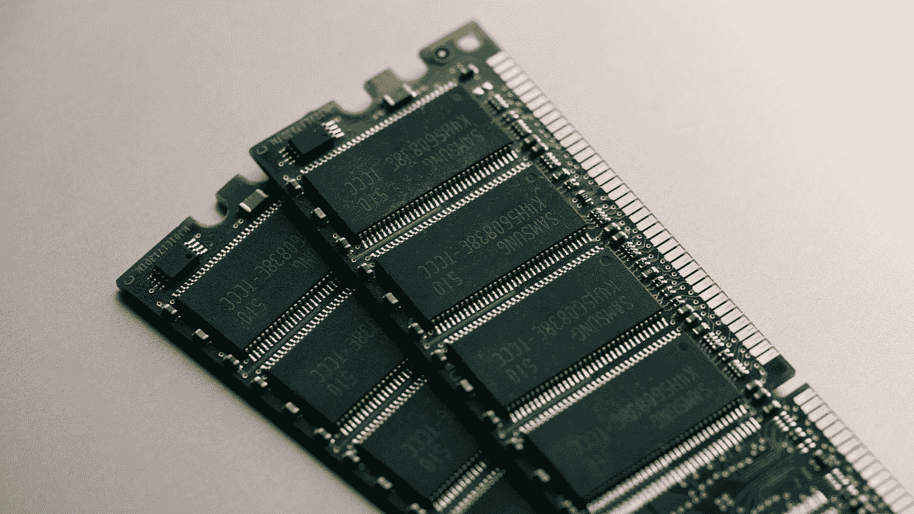
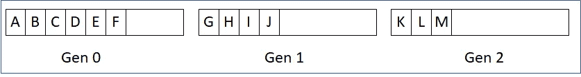

# 中的内存管理和垃圾收集。网

> 原文：<https://medium.com/globant/memory-management-and-garbage-collection-in-net-555e4bbdd08f?source=collection_archive---------0----------------------->

你知道怎么做吗？NET 为我们管理内存？对象是如何在内存中存储和清除的？即使您不知道这个问题的答案，您也可以毫不费力地开发应用程序。但是理解如何分配和释放内存以优化框架的使用是很重要的。



Photo by [Harrison Broadbent](https://unsplash.com/@harrisonbroadbent?utm_source=medium&utm_medium=referral) on [Unsplash](https://unsplash.com?utm_source=medium&utm_medium=referral)

在本文中，我们将讨论。NET 运行库在您请求时分配内存，以及在不使用时如何释放内存。

任何应用程序都由两部分组成:代码本身和数据。

。NET 使用两种数据结构来管理. NET 应用程序的内存:堆栈和堆。

# **堆栈**

从数据结构类中我们知道，堆栈使用后进先出法。英寸堆栈可以存储原始数据类型(如 Int，Double，Boolean，Struct 等)。).。NET 使用堆栈来跟踪方法数据。当调用方法时，NET 创建一个容器(堆栈帧),其中包含完成调用所需的所有数据，包括参数、本地声明的变量以及方法完成后要执行的代码行的地址。当一个方法完成时，它的容器从栈顶移除，执行返回到调用方法中的下一行代码。我举个例子来演示一下。

```
1  void Method1()
2  {
3      Method2(100);
4      Console.WriteLine(″End″);
5  }6  void Method2(int data)
7  {
8      int i = 10;
9      Console.WriteLine(″Method 2 : ″ + data.ToString());
10     Method3(data * i);
11 }12 void Method3(int data)
13 {
14     Console.WriteLine(″Method 3 : ″ + data.ToString());
15 }16 static void Main(string[] args)
17 {
18     Method1();
19 }
```

上面的代码片段简单地调用了“Method1”。“方法 1”调用“方法 2”，“方法 2”调用“方法 3”。下面是调用“Method1”时堆栈的样子。下面是堆栈帧的样子(注意，对控制台的调用。为了简洁起见，不考虑 WriteLine()


注意，当调用“Method2”时，在“Method2”的堆栈框架上创建特定于方法“I”的参数，即“data”和实例变量。调用“方法 3”时也是如此。现在让我们看看当方法执行完毕时会发生什么。这时，返回行(或返回地址)出现，执行返回到调用函数。

但是，如果堆栈存储数据，堆是什么？

# 许多

堆栈只能存储原始数据类型。原始数据类型是通用类型系统(CTS)的一部分。这些也称为值类型。除了这些类型，我们在代码中定义的任何东西，比如类、接口、字符串等等。是引用类型。引用类型的实例(使用 new 关键字创建)可以看作两件事:对象本身(及其所有属性)和指针或引用。引用告诉我们对象在内存中的位置。参考始终是 32 位或 64 位，具体取决于操作系统。当对象存储在堆中时，引用总是存储在堆栈中。考虑下面的代码片段。

```
public class Car
{
    public int id;
    public double width;
    public double height;
}void Method1()
{
    var car = new Car();
    car.id = 1000;
    car.width = 3000;
    car.height = 2000; int number = 10;
}
```

下面是堆栈和堆的样子。


注意到引用类型在堆上被分配了内存。它的引用存储在“Method1”堆栈框架下。引用包含对象的内存地址。另外，请注意，引用类型下的基本类型(即 id、width、height)是在堆上创建的。而对于“方法 1”来说是本地的原始类型“数字”是在堆栈上创建的。

值类型是在堆栈或堆上创建的(基于声明它们的位置)，引用类型总是在堆上创建。值类型的局部变量在堆栈上创建。

只要“方法 1”在运行，它就引用“汽车”对象。一旦它返回，它的堆栈框架就被销毁。这将释放本地分配的内存，即本例中的“number”。它还删除了堆栈框架上的“car”引用。这使得堆上的对象不可访问，因为我们丢失了它的地址。这给了我们一个提示。NET 垃圾收集器知道哪些对象可用于收集。

# 碎片帐集

如上所述，当堆栈框架被销毁时，其中包含的对象引用也被销毁。现在，由于我们丢失了引用(或内存地址)，实际的对象是不可达的。这样的对象在下一个垃圾收集周期运行时可以自由收集。

在上面的例子中，“car”对象引用存在于堆栈中。这种引用称为根引用。现在，根引用指向实际的对象，该对象本身可以包含对属于该类的其他类型的引用。看看下面更新的“汽车”类。

```
public class Engine
{
    public double volume;
    public int cylinders;
    public double power;
}public class Car
{
    public int id;
    public double width;
    public double height;
    public Engine engine;
}void Method1()
{
    var car = new Car();
    car.id = 1000;
    car.width = 3000;
    car.height = 2000; int number = 10;
}
```

下面是堆栈和框架的样子。


请注意，引擎是一个引用，指向实际的对象，该对象也位于堆中。在这里，车是“根参照物”，“发动机”不是。

当垃圾回收开始时。NET framework 需要做的是找到所有根引用，并将这些根引用(包括这些根引用所拥有的所有引用)标记为“正在使用”。如果一个对象最终没有根引用，那么它实际上不能被代码访问，所以它不再被使用，可以被移除。

# 堆的类型

当。NET 应用程序运行时，将创建以下四个内存部分(堆)用于存储。


我们可以集中讨论 SOH 和 LOH。

# 小对象堆

这是一个大小小于 85K 的对象堆。SOH 的垃圾收集涉及压缩。SOH 是连续内存。压缩确保内存是连续的，即在垃圾收集期间，被标记为“使用中”的对象被移动到未被标记为“使用中”的对象的位置上。这样做的好处是内存碎片少。

考虑以下 SOH 在垃圾收集前后的状态(红色的对象可用于收集)。观察 SOH 是如何被压缩以使分配连续的。


SOH Compaction during garbage collection

# 大型对象堆(LOH)

超过 85K 的对象存储在这个堆中。由于性能影响，在垃圾收集期间不会压缩该堆。移动/复制大块内存需要大量的 CPU 时间。LOH 跟踪表中的空闲和已用空间，并尝试将新对象分配到由收集的对象留下的最合适大小的空闲槽中。在下图中观察 LOH 中垃圾收集后内存中是如何出现漏洞的。释放的空间被记录在一个表中，并在分配下一个内存位置时使用。


LOH garbage collection (no compaction)

# 分代垃圾收集

我们已经在垃圾收集中讨论过了。NET framework 需要将所有必需的对象标记为“正在使用”，然后执行堆压缩。如果对象数量巨大，这可能会花费大量的处理时间。为了达到最佳效果。NET 使用分代垃圾回收。

大多数创建的对象都是短命的。通常，对象是在方法中创建的，一旦方法返回，这些对象就可供收集。这样的对象是短命的对象。此外，还有长寿命对象和中等寿命对象，它们是根据“使用中”的时间来分类的。。NET 把他们分为三代。



SOH (Gen 0, 1 and 2)

当发生以下任一情况时，GC 会自动在单独的线程上运行

*   第 0 代达到大约 256 K(在这种情况下只进行第 0 代收集)
*   第 1 代达到大约 2 MB(在这种情况下发生第 0 代和第 1 代收集)
*   第 2 代达到大约 10 MB(在这种情况下，会发生第 0、1 和 2 代收集)

请注意。NET 会根据应用程序的行为修改上述阈值

# 第 0 代

当对象刚刚被创建时，它进入 Gen 0。在每次 GC 操作之后，Gen 0 被清空。因此，Gen 0 中的对象总是新对象，不会被 GC 检查。当 Gen 0 的 GC 发生时，没有被使用的对象被释放，在收集中幸存的对象被移动到 Gen 1。所以，最后，你在 GC 之后得到一个干净的 Gen 0。


Gen 0 garbage collection

观察使用中的对象(A、D 和 F)如何移动到 Gen 1。Gen 0 不干净，无法为新对象分配内存。

# 第一代

第 1 代收集按顺序收集第 1 代和第 0 代。首先检查 Gen 1，正在使用的对象被移动到 Gen 2。然后，检查 Gen 0，使用中的对象被移动到 Gen 1。


Gen 1 garbage collection

请注意，G、J、D 从第 1 代移到了第 2 代。n、Q、S 从 Gen 0 移动到 Gen 1。Gen 0 是干净的。

# 第二代

第 2 代收集被称为“完整收集”，因为它检查所有代。这是最贵的。太频繁的 Gen 2 收集会影响性能。

注意——值得指出的是，用于执行垃圾收集的实际算法只有。NET GC 团队。

# 结论

我试图对这些对象是如何存储、引用和清理的提出一些见解。我几乎不能触及表面，肯定还有很多要学的。我希望你喜欢它，它能帮助你写出更好的代码。

# 参考

你可以在 MSDN 进一步了解内存管理。

这里还有一本克里斯·法雷尔[写的精彩的书。网络内存管理](https://www.red-gate.com/simple-talk/books/net-books/under-the-hood-of-net-memory-management/)