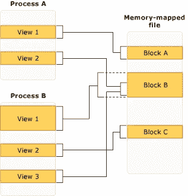

# Java 中的内存映射文件和 MappedByteBuffers

> 原文：<https://medium.com/globant/memory-mapped-files-and-mappedbytebuffers-in-java-4e5819605b20?source=collection_archive---------1----------------------->


在这篇短文中，我们将查看`java.nio`包中的内存 **-** 映射文件`MappedByteBuffer`。该实用程序对于高效的文件读取非常有用。

# **内存映射文件**

内存映射文件是虚拟内存的一个段，它被分配了与文件的某个部分的直接字节对字节的相关性。

*   在内存映射文件中的读取和写入通常由操作系统完成，以将内容写入磁盘。
*   内存映射文件包含虚拟内存中文件的内容。文件和内存空间之间的这种映射使得应用程序(包括多个进程)能够通过直接读取和写入内存来修改文件。
*   对于许多程序员和开发人员来说，Java 中的内存映射文件(Memory-Mapped Files)是一个相当新的 Java 概念，尽管它从 JDK 1.4 起就与软件包“java.nio”一起出现了。
*   在引入 NIO 之后，Java IO 已经相当快了，而内存映射文件提供了 Java 中最快的 IO 操作。
    这就是为什么高性能 Java 应用程序应该使用内存映射文件来持久化数据。
*   Memory Mapped 在高频交易领域已经相当流行，因为在这个领域，电子交易系统需要超快，而交易的单向延迟必须在亚微秒级。

内存映射文件有两种类型:

*   **持久化内存映射文件**:持久化文件与磁盘源文件相关联。当最后一个进程处理完该文件时，数据将保存到磁盘上的源文件中。这些内存映射文件适用于处理超大源文件。
*   **非持久化内存映射文件**:非持久化文件是不与磁盘上的文件相关联的内存映射文件。当最后一个进程处理完文件时，数据将丢失，文件将通过垃圾回收回收。这些文件适用于为进程间通信(IPC)创建共享内存。

# **内存映射文件的优势**

内存映射的主要好处是效率、更快的文件访问、在应用程序之间共享内存的能力、自动内存管理，以及下文将介绍的更多要点

*   通过内存映射访问文件比使用`fread`和`fwrite`等 I/O 功能更快。数据的读写使用操作系统内置的虚拟内存功能，而不必分配、复制到进程拥有的数据缓冲区中，然后再解除分配。
*   随着用户进程处理映射的内存空间，将自动生成页面错误，以从磁盘引入文件数据。
*   如果用户修改了映射的内存空间，受影响的页面会自动标记为脏，并随后刷新到磁盘以更新文件。
*   操作系统的虚拟内存子系统将执行页面的智能缓存，根据系统负载自动管理内存。
*   数据总是页面对齐的，不需要缓冲区复制。可以映射非常大的文件，而无需消耗大量内存来复制数据。

# **内存映射文件的示例**

下图显示了多个进程如何同时拥有同一个内存映射文件的多个重叠视图。
显示内存映射文件的多个重叠视图:



**MappedByteBuffer** 对于映射了相同文件的其他程序也是不可见的；相反，它们将导致创建缓冲区修改部分的私有副本。

```
import java.io.RandomAccessFile;
import java.nio.MappedByteBuffer;
import java.nio.channels.FileChannel;

public class MemoryMappedFile 
{
  static int length = 0x8FFFFFF;  

  public static void main(String[] args) throws Exception 
  {
    try(RandomAccessFile file = new RandomAccessFile("test.dat", "rw")) 
    {
      MappedByteBuffer out = file.getChannel()
                    .map(FileChannel.MapMode.READ_WRITE, 0, length);

      for (int i = 0; i < length; i++) 
      {
        out.put((byte) 'x');
      }

      System.out.println("Finished writing");
    }
  }
}
```

用上述程序创建的文件有 128 MB 长，这可能比您的操作系统允许的空间要大。该文件看起来可以立即访问，因为只有部分文件被放入内存，其他部分被换出。这样，可以很容易地修改非常大的文件(高达 2 GB)。

# 内存映射文件的优缺点

**内存映射文件有几个优点和缺点:**

*   **可能，内存映射 IO 的主要优势是性能，这对于构建高性能系统(如电子交易)非常重要。**
*   **内存映射文件比通过普通 IO 访问标准文件要快得多。**
*   **内存映射 IO 的另一个显著优点是，它允许您加载一个潜在的更大的文件，否则是无法访问的。**
*   **内存映射 IO 的缺点是，它可能会使您的缓存控制器变得复杂，因为设备访问的行为不同于普通的内存访问。**

# ****结论****

**在本文中，我们了解了以下几点:**

*   **内存映射文件比通过普通 IO 访问标准文件要快得多。**
*   **多个进程可以拥有同一个内存映射文件的多个重叠视图。**
*   **内存映射文件的类型。**