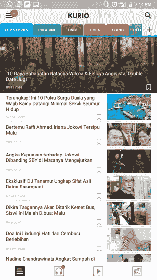
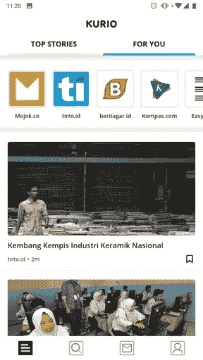
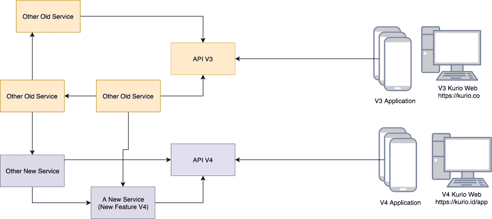
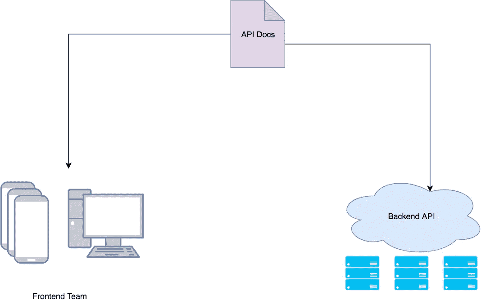
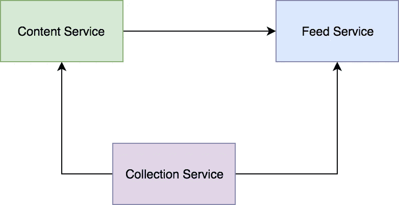
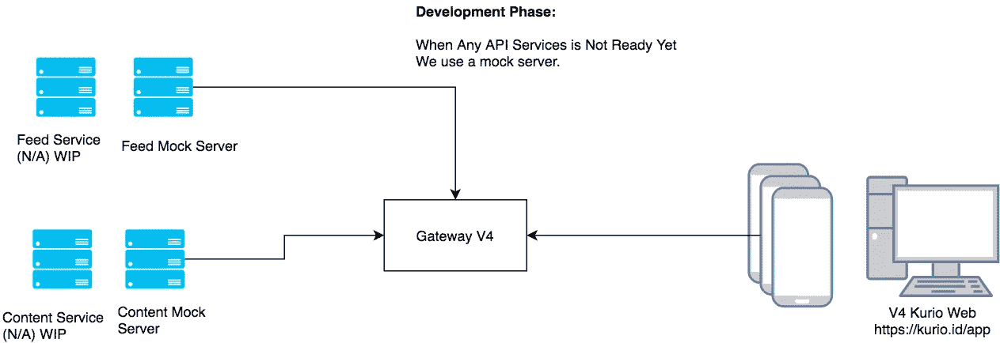

# Mempercepat Proses Development dengan Open API 3

> 原文：<https://medium.easyread.co/mempercepat-proses-development-dengan-open-api-3-8502011b7463?source=collection_archive---------0----------------------->

## And you can do it too!!!

Photo by [lalo Hernandez](https://unsplash.com/@lalonchera?utm_source=medium&utm_medium=referral) on [Unsplash](https://unsplash.com?utm_source=medium&utm_medium=referral)

> Tulisan ini adalah versi Bahasa Indonesia dari [postingan ini](https://toolbox.kurio.co.id/api-driven-development-in-kurio-speeding-up-the-development-process-with-open-api-3-addcc07cb9ce) pada Kurio Engineering Blogs tempat saya bekerja ketika menulis ini.

Baru-baru ini, kami merilis versi terbaru dari aplikasi [Kurio](https:://kurio.id/app) . Dimana pada versi terbaru ini, terdapat banyak perubahan yang terkait dengan UI/UX. Jadi kami benar-benar merombak total aplikasi dari versi sebelumnya V3 ke versi sekarang terbaru V4.

Berhubung karena ini merupakan total perombakan dari versi sebelumnya, maka sudah sewarjarnya terdapat banyak rebuild dan refactor pada sistem kami baik di Backend dan Frontend. Nah, kira-kira perbedaan tampilan V3 (versi lama) dan V4 (versi baru) dapat kita lihat dibawah berikut.

Kurio V3(kiri) and Kurio V4 (tengah dan kanan)

# Development Process

Ketika mengerjakan ini, terdapat 3 tim/divisi yang terlibat, yakni, Mobile Engineer, Backend Engineer, dan Web Developer.

Divisi Mobile, akan membangun aplikasi Kurionya, dan Web Developer akan membangun versi web dari aplikasi Kurio (dapat dilihat di [https://kurio.id/app)](https://kurio.id/app)) serta para penggiat Backend (Backend Engineer) akan mendevelop API yang akan digunakan oleh Mobile app dan Web kurio yang akan dibangun.

Seperti sebelumnya saya sebut diatas, meski cuma rebranding dan rebuild dari UX/UI, di versi V4 ini kami juga melakukan beberapa perubahan di Backend. Sehingga untuk V4 kami pun membuat sebuah gateway yang yang akan dipakai oleh aplikasi V4.

Meskipun kami sudah memiliki gateway untuk V3, tetapi untuk mengurangi *issue* terkait versioning, dan hal-hal tidak terduga kepada aplikasi versi lama ketika develop V4, maka kami pun sepakat membuat API Gateway baru.

Sehingga, arsitektur API kami akan terlihat seperti gambar berikut dibawah.

API Gateway baru untuk menangani request aplikasi V4

## API Driven Development

Nah, berhubungan karena saya adalah Backend Engineer, saya dan tim akan mengerjakan API tentunya. Jika dari bagan di atas, maka kami akan mengerjakan yang sebelah kiri semua integrasi API dan service di backend. Tugas kami tentunya menyiapkan API yang akan digunakan oleh tim Frontend (Mobile dan Web) secepatnya, sehingga mereka bisa dapat bekerja.

Namun, karena kami ke-tiga divisi (Backend, Mobile, Web) mulai *sprint-* nya sama, maka tim Backend pastinya akan blocking tim Frontend untuk bekerja karena bergantung pada API.

Nah, untuk mengurangi delay dan menghindari *blocking* antar tim, kami pun menerapkan metode API Driven Development. Dengan harapan, setiap tim dapat bekerja secara paralel.

API Driven Development ditandai dengan prinsip *API-first design* , maksudnya adalah sebelum development dilakukan, yang kita lakukan adalah mendesign API yang akan kita gunakan dan kerjakan. Kita harus membuat seperti sebuah kontrak antara Backend dan Frontend (Mobile dan Web). Dimana kontrak ini wujudnya berupa API Documentations, yang akan digunakan oleh semua tim yang terlibat.

Dari Authentication, Authorization, Parameter, Resouce dan URL, Method serta Data Structure yang akan kita gunakan, baiknya kita jelaskan semua di dalam kontrak tersebut. Kontrak ini tentunya harus di define oleh tim-tim yang terlibat (Backend dan Frontend). Terserah bagaimana caranya, yang pasti kedua sisi ini harus memiliki satu kesepakatan yang jelas terkait API yang akan digunakan. Untuk kasus Kurio sendiri, kami pertama discuss dengan tim product, lalu oleh tim Backend membuat API specification, yang kemudian di review oleh semua tim terlibat (Backend dan Frontend).

Jika sudah terjalin kesepakatan terhadap semua tim yang terlibat, maka setiap tim dapat bekerja secara independen. Tim Frontend akan mengerjakan Frontend (Mobile dan Web), berdasarkan API Documentations yang sudah disepakatai. Dan selanjutnya tim Backend akan membangun sebuah API sesuai API Documentations. Tim Backend harus benar-benar membangun API sesuai API Docs, jangan berbeda. Jika terjadi perbedaan sedikit saja, maka akan berbahaya saat integrasi ke Frontend. Maka dengan begini, setiap tim dapat bekerja secara paralel.

Selain itu, prinsip API Driven Development juga kami terapkan di Backend.

Seperti saya sebut sebelumnya, kami juga membangun API baru untuk V4 demi mengurangi issue production dan masalah versioning pada V3\. Sehingga terdapat beberapa service baru yang akan kami bangun. Service ini seperti fitur-fitur baru yang dikhususkan hanya untuk V4, atau peremajaan beberapa service lama yang sudah ada, namun hanya untuk V4.

Jadi totalnya, ada 3 service baru yang akan kami kerjakan di Bakcend side. Collection Service, Feed Service, and Content Service. Dan ke-tiga service ini terknoneksi satu sama lain.

Feed service bergantung pada Conten dan Collection Service. Dan Content Service bergantung pada Collection Service. Nah untuk mengerjakan ini ketiga service ini, normalnya, tentu orang akan mengerjakan Collection Service pertama kali, karena terdapat 2 service yang bergantung padanya. Selanjutnya Content service, lalu Feed service.

Nah, itu kan normalnya. Namun kami tidak melakukan hal yang seperti itu. Kami dengan prinsip API Driven Develoment, tentu saja mengerjakan ke-tiga service ini secara serentak. Tim Backend akan kami bagi 3, dan masing-masing tim akan mengerjakan satu service.

Lalu, bagaimana bisa bekerja serentak, jika terdapat ketergantungan antar service? Ya seperti yang saya sebut sebelumnya, dengan tim Frontend. Sesama backend juga melakukan design API pertama kali. Selanjutnya semua bekerja paralel berdasarkan API yang sudah di design tersebut dalam bentuk API Docs.

## Penggunaan Open API 3

Open API 3 adalah sebuah API Specifiation yang cukup lumrah sekarang ini. Jika teman-teman pernah mendengar/menggunakan swagger, maka Open API 3 adalah versi terbaru dari Swagger. Jika sebelumnya kita tahu Swagger 2, makan Open API 3 adalah versi terbaru dari Swagger. Namun bukan dengan Swagger 3, tim swagger malah memberi nama Open API 3\. Untuk alasan penamaannya tidak akan saya bahas disini, kamu bisa cari di Google atau langsung ke [official website](https://swagger.io/blog/news/whats-new-in-openapi-3-0/) -nya

Jadi, tidak perlu bingung jika ada yang sebut Swagger 3 atau Open API 3, ini hanya terminologi yang digunakan oleh orang lain.

Kembali ke topik di Kurio. Sebelumnya, untuk urusan API Specification, pada Kurio versi 3, kami menggunakan APIB (Api Blue Print). Namun, untuk Kurio V4, kami meninggalkan APIB, dan menggunakan Open API 3\. Alasannya, APIB sudah mulai ditingalkan oleh banyak orang, dan Open API 3 juga sudah mulai diadaptasi oleh banyak orang, khususnya yang sebelumnya pengguna Swagger 2, pindah ke Open API 3 tentu tidaklah terlalu ribet.

Lalu, apa yang kami harapkan dari penggunaan Open API 3?

## Generate SDK dengan Open API 3

Jika teman-teman pernah baca postingan kami di post ini: [Leveling Up API Documentation](https://toolbox.kurio.co.id/levelling-up-api-documentation-7c26b37715bb) oleh [M Rifad Ainun Nazieb](https://medium.com/u/c244e0555136?source=post_page-----8502011b7463--------------------------------) , kami menjelaskan bagaimana kami meng-generate SDK berdasarkan API documentation.

*Nah* , tetapi, pada post tersebut adalah konvensi yang kami gunakan pada kurio V3\. Kami masih menggunakan APIB (API Blueprint) sebagai API sepecification kami. Dimana APIB tersebut akan dikonversi ke Swagger 2\. Dan hasil konversi tersebut, kami generate lagi ke client SDK. Dan SDK ini nantinya digunakan sebagai library disetiap project yang membutuhkan. Jelasnya ada di-artikel tersebut, terkait flownya.

Nah, ketika develop V4 ini, kami juga mengharapkan fitur yang sama jika menggunakan Open API 3\. Kami tentunya membutuhkan tools yang serupa fungsinya meski kami tidak menggunakan APIB lagi. Tools serperti generator SDK client berdasarkan API Specification.

Untungnya, kami menemukan satu project open source disini [https://github.com/OpenAPITools/openapi-generator](https://github.com/OpenAPITools/openapi-generator) . Project ini bertujuan untuk men-generate client SDK berdasarkan API Specification yang sudah kami define. Dan dengan SDK ini, kami dapat melakukan API Call tanpa harus menuliskan kodingan-kodingan yang redundant.

Meski ketika menggunakan tools ini, kami melakukan beberapa pengubahan di local fork kami. Karena tidak sesuai dengan yang kami harapkan. Tetapi, meskipun demikian, tools ini sudah sangat membantu kami secara keseluruhan.

Terus, kenapa sih kami butuh SDK? Kenapa harus generate SDK?

Di Kurio, kami menggunakan arsitektur microservices di Backend. Sehingga dengan yang namanya microservices, maka akan terdapat banyak service yang saling terhubung satu sama lain. Setiap service pasti melakukan API Call keservice lain berdasarkan kebutuhan masing masing.

Sehingga, itulah alasannya kami menggunakan SDK. Dimana SDK ini berfungsi untuk mengurangi boilerplate, atau kodingan redundant yang akan ditulis secara berulang-ulang oleh setiap engineer ketika melakukan API Call seperti request builder, client builder dsb.

Sebagai contoh, akan saya coba jelaskan berikut. Contoh berikut adalah contoh ketika kita akan melakukan fetch data dari content service. Kodingannya saya buat dalam Golang (karena kami di Kurio menggunakan Golang). Ini adalah contoh code fetch data dengan API call **tanpa SDK**

using plain request builder to call the API

Jika kita lihat pada fungsi `getArticleDetail()` , terdapat kodingan yang membuat HTTP request ke service lain. Set URLnya, set methodnya, terus tambahkan context, lalu lakukan call API nya, lalu proses response bodynya.

Ini saya buat misalnya hanya untuk fungsi Get Article detail doang. Lalu bayangkan jika kita memiliki banyak endpoint, maka kita akan melakukan kodingan seperti ini secara berulang-ulang di setiap project yang akan kita kerjakan.

Coba bandingkan jika saya menggunakan SDK yang sudah saya generate dari API Specification. Berikut adalah contoh call API dengan SDK yang sudah saya generate.

using generated SDK to call the API

Nah jika kita lihat di kodingan diatas, semua kode untuk request builder, set context, process response body tidak ada lagi. Karena sudah tangani di dalam package SDK yang saya generate (package SDK tersebut adalah private repository)

Dengan cara ini, kita dapat memangkas semua proses yang redundant ketika melakukan API Call. Dan tentu saja ini akan mempercepat proses development API kita di backend.

## Membuat Mock API Server dengan Open API 3

Keuntungan yang kami harapkan ketika menggunakan Open API 3 adalah ketika membuat mock-server. Salah satu sifat API Driven Development adalah, kita harus membuat mock server yang akan digunakan oleh client kita.

Untungnya, ada orang yang langsung ber-inisiatif membuat mock-server tool ini. Dari pada re-invent the wheel, kami pun menggunakannya. Proyeknya dapat dilihat disini [https://github.com/danielgtaylor/apisprout](https://github.com/danielgtaylor/apisprout) .

Proyek ini akan membuat mock-server berdasarkan Open API 3 yang sudah kita definisikan sebelumnya.

Sehingga, meskipun API belum selesai kita kerjakan. Tetapi client kita dapat merasakan suasana API yang nyata dengan menggunakan mock-server berdasarkan Open API 3 yang telah kita define sebelumnya.

Mock server on the development phase

Untuk kasus di Kurio, client kami (Backend) adalah tim Mobile dan Web. Lalu kita tinggal buat mock-server yang mere-presentasikan API yang sebenarnya dan dapat diakses langsung oleh tim Frontend. Dengan begini, baik Backend dan Frontend, dapat bekerja paralel tanpa harus blocking satu sama lain.

# Kesimpulan

Untuk menyimpulkan, **kami di Kurio menggunakan Open API 3 sebagai API Specification** kami. Dan **kami juga menerapkan metode API Driven Development** untuk membangun fitur kami disini.

Dengan metode ini, kami dapat membangun aplikasi Kurio dari Backend sampai Frontend tanpa blocking dan delay. Karena setiap tim bekerja secara independen, setiap tim memiliki referensi kontrak API yang sama. Sehingga dari develop sampai semua beres, ketika integrasi, error yang terjadi hanya sedikit atau bahkan tidak ada.