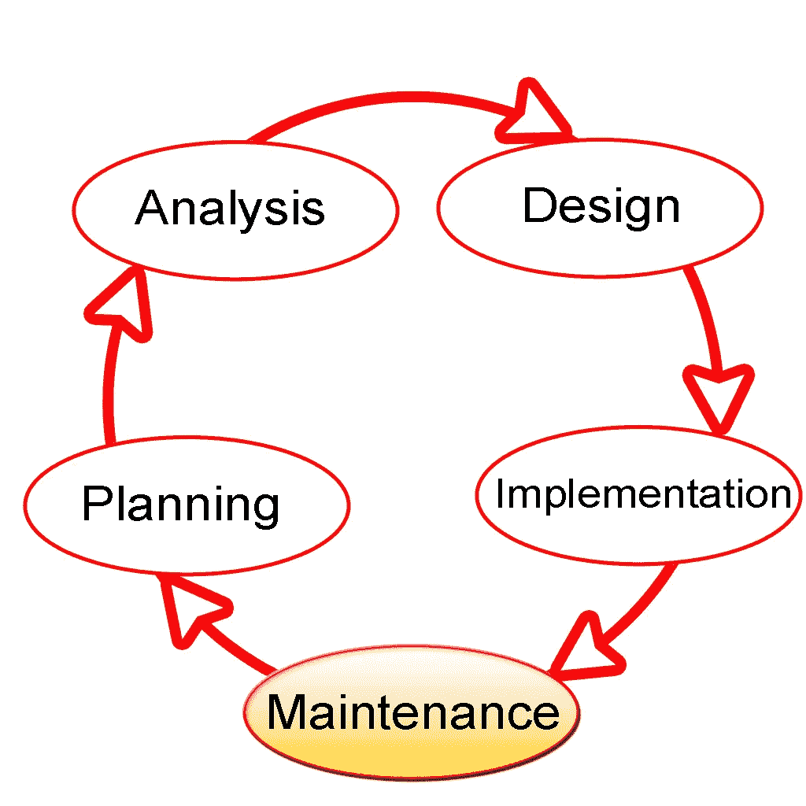
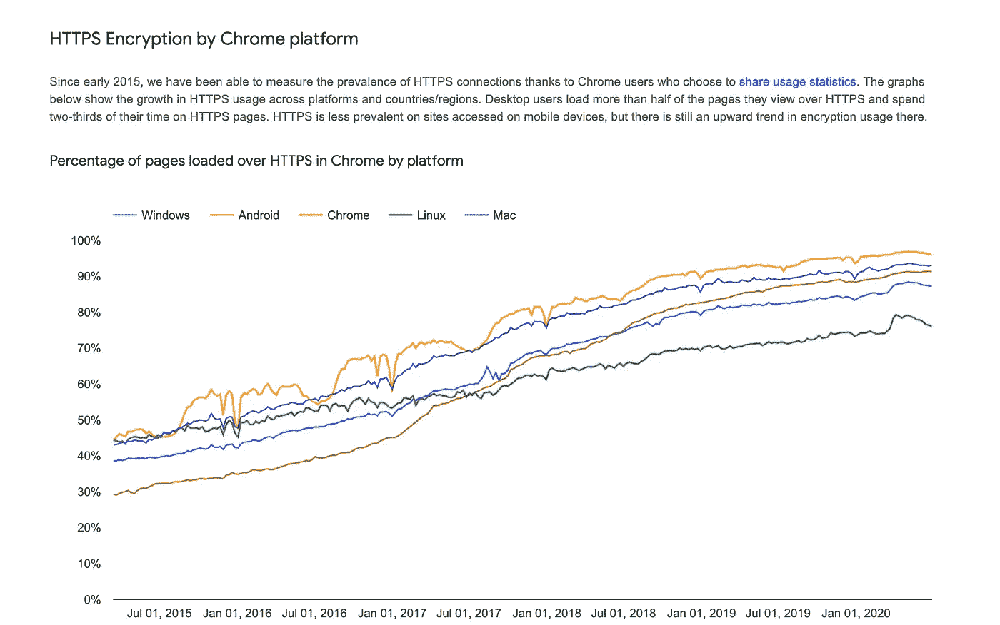

# Mempertimbangkan Aspek Keamanan dan Keandalan Sedari Awal

> 原文：<https://medium.easyread.co/mempertimbangkan-aspek-keamanan-dan-keandalan-sedari-awal-68465a8814da?source=collection_archive---------4----------------------->

## Building Secure and Reliable Systems Series — Part 4

Orang-orang yang berkecimpung di dunia Software Product Development, baik Product Manager maupun Software Engineer-nya pasti mengenal proses di dalam pengembangan sebuah produk perangkat lunak. Apapun framework yang digunakan, baik Agile hingga Waterfall pasti memiliki tahap Requirement Analysis dan Desain, sebelum terjun ke tahap Implementasi kode dari produk tersebut.

Fitur-fitur yang dibutuhkan biasanya lahir dari tahap *requirement analysis,* dan fokusnya seringkali ditempatkan pada fitur-fitur fungsional yang berkaitan langsung dengan penggunanya, misalnya fitur “ *top-up* ” pada sebuah produk *e-wallet* . Ternyata, secara tidak sadar ada “fitur” lain dari produk tersebut yang seringkali dilupakan: *keamanan dan keandalan* produk *.* Keduanya pun seringkali tidak “akur” jika tidak dipertimbangkan dengan matang sedari tahap desain produk; Meningkatkan keandalan dapat mengurangi keamanan, dan sebaliknya. Belum lagi interaksinya dengan fitur utama aplikasi!

Bagaimanakah hubungan aspek keamanan dan keandalan sebuah produk/sistem, dan bagaimana kita bisa menyeimbangkan keduanya? Mari kita bahas di artikel kali ini! Tulisan ini merupakan seri keempat dari intisari buku “Membangun Sistem yang Aman dan Andal ( [Building Secure & Reliable Systems](https://landing.google.com/sre/resources/foundationsandprinciples/srs-book/) )” karya tim SRE Google. Untuk membaca seri lainnya:

# Building Secure and Reliable Systems — Series List

[**1\. Pentingnya Membangun Sistem yang Aman dan Andal**](https://medium.com/easyread/pentingnya-membangun-sistem-yang-aman-dan-andal-a15f7a3f94eb)[**2.1\. Mengenal Lawan-Lawan dalam Membangun Sistem yang Aman dan Andal — Bagian 1**](https://medium.com/easyread/mengenal-lawan-lawan-dalam-membangun-sistem-yang-aman-dan-andal-bagian-1-8d6fb8bb22b3)[**2.2\. Mengenal Lawan-Lawan dalam Membangun Sistem yang Aman dan Andal — Bagian 2**](https://medium.com/easyread/mengenal-lawan-lawan-dalam-membangun-sistem-yang-aman-dan-andal-bagian-2-edf29bb74de0)[**3\. Meningkatkan Keamanan dengan Proksi, Sebuah Studi Kasus di Google**](https://medium.com/easyread/meningkatkan-keamanan-dengan-proksi-sebuah-studi-kasus-di-google-ddfc5e24fd6a) **4\. Mempertimbangkan Aspek Keamanan dan Keandalan Sedari Awal — You’re here**

Siklus Umum pada Pengembangan Produk Perangkat Lunak

# Tujuan dari Desain dan Requirements

Biasanya, requirement untuk fitur-fitur cenderung berbeda dengan requirement keamanan dan keandalan produk tersebut. Mari kita lihat beberapa jenis requirement pada saat mendesain produk:

## 1\. Feature/Functional Requirements

Requirement ini biasanya **berhubungan langsung dengan apa yang dibutuhkan oleh penggunanya secara spesifik, dan dijadikan *use case* atau *user story* untuk sebuah produk.** Feature requirement seringkali dijadikan pertimbangan utama yang menentukan bagaimana sebuah produk didesain. Misalnya, bayangkan bagaimana kamu akan mendesain produk dengan fitur “upload gambar” pada sebuah platform media sosial yang dapat dilihat dan di- *like* teman-teman sebuah pengguna pada platform tersebut.

## 2\. Nonfunctional Requirements

Berkebalikan dengan functional requirement, **requirement ini tidak terkait dengan karakteristik spesifik dari produk, dan lebih berkaitan dengan bagaimana karakter umum dari produk** tersebut. ***Keamanan* dan *Keandalan*** produk **masuk ke dalam kategori ini** . Misalnya, “apakah data pribadi dari seorang pengguna dapat diakses oleh pengguna lain?”, atau “berapa latensi yang harus dicapai untuk produk X?”.

## Functional vs Nonfunctional Requirements

*Functional requirement* biasanya dapat secara langsung menunjukkan hubungan dari sebuah requirement, implementasi kodenya, hingga *tests* yang dilakukan untuk memvalidasi implementasinya. Contohnya pada fitur “upload gambar” tadi, kita dapat membayangkan dengan relatif mudah bagaimana desain dan implementasinya; mungkin ada sebuah Frontend pada browser yang menjadi klien sebuah server Backend yang menerima gambar dari pengguna dan menaruhnya pada penyimpanan cloud menggunakan HTTP. *Testing* yang dilakukan juga berkaitan langsung dengan implementasinya, bagimana test-case yang dapat dilakukan untuk memvalidasi implementasinya untuk memenuhi kebutuhan pengguna?

Sebaliknya, **nonfunctional requirement seperti Keamanan dan Keandalan seringkali sangat abstrak untuk dipikirkan, diimplementasi, dan divalidasi.** Misalnya:

*   Bagaimana sebuah produk dipecah-pecah menjadi komponen-komponen kecil, misalnya microservice?
*   Bagaimana ketersediaan produk terkait dengan ketersediaan dari dependency-dependency produk tersebut (seperti media penyimpanan, jaringan, backend, 3rd party, dll.)?
*   Bagaimana produk dimonitor?
*   Bagimana hubungan “trust” dari komponen-komponen produk?
*   Bagaimanakah aspek keamanan dari bahasa pemrograman, library, platfom, hingga framework yang digunakan?
*   Bagaimana melakukan *audit logging* , deteksi anomali, dan peralatan keamanan lainnya dapat diintegrasi dengan produk?

Mungkin mudah kalau ada tombol “amankan” atau “andalkan” yang dapat langsung diklik untuk meningkatkan keamanan dan keandalan produk; sayangnya tidak demikian. Karena keabstrakannya, **kita dapat melihat Keamanan dan Keandalan sebagai** sebuah **“ *emergent property* ” atau “karakteristik yang muncul”** pada sebuah produk.

[Seni Menyeimbangkan Batu](https://en.wikipedia.org/wiki/Rock_balancing)

# Menyeimbangkan Requirements

Emergent Property seperti Keamanan dan Keandalan cenderung berinteraksi dan berpotensi “mengganggu” terhadap satu sama lain, maupun terhadap fitur utama produk yang ada pada feature reqirements. Untuk melihat interaksi ini dan pentingnya menyeimbangkan ketiganya, mari kita ambil sebuah contoh produk yang dapat memproses pembayaran.

Bayangkan kita sedang mengembangkan sebuah layanan daring penjualan game berbasis perangkat lunak. Requirement fiturnya menspesifikasikan bahwa pengguna dapat melihat katalog game dari aplikasi mobile ataupun web browser, membeli game tersebut, dan harus memilih cara pembayaran. Bayangkan skenario berikut pada saat mempertimbangkan Keamanan dan Keandalan layanan tersebut:

*   **Aspek keamanan dan keandalan**
    Menerima pembayaran memiliki tantangan keamanan dan keandalannya sendiri. Bagaimana melindungi data pribadi pengguna, kartu kredit, hingga alamat? Kita juga mungkin perlu memenuhi standar tertentu seperti PCI-DSS untuk melayani pembayaran dengan kartu kredit.
*   **Keuntungan menggunakan layanan pihak ke-3**
    Mungkin kita dapat menggunakan layanan pihak ke-3 (3rd party) untuk memproses pembayarannya. Dengan begitu, kita dapat menyerahkan tanggung jawab pemrosesan pembayaran ke 3rd party saja; **produk kita tidak lagi perlu menyimpan data pribadi pengguna** , mungkin **kita tidak perlu memenuhi standar PCI-DSS** di pihak kita, kita juga **tidak perlu me-maintain infrastruktur penyimpanan data,** dan layanan pihak ke-3 mungkin memiliki **fitur tambahan** seperti **fraud analysis** yang disediakan untuk memblokir fraud.
*   **Hal yang dikorbankan saat menggunakan layanan pihak ke-3**
    Ada yang harus “dikorbankan” dengan menggunakan layanan 3rd party; misalnya **biaya yang lebih besar** , dan aspek **Keandalannnya** ; Bayangkan bila **layanan pihak ke-3 tersebut *down* ,** produk kita tidak dapat melayani pembayaran lagi. Untuk menangani hal ini, kita mungkin dapat menggunakan dua layanan pihak ke-3 sebagai *backup.* Namun, hal ini bisa saja **membutuhkan usaha lebih untuk melakukan integrasi dengan API masing-masing penyedia layanan** tersebut ke dalam produk kita.
    Atau, kita juga dapat menangani resiko keandalan dengan mengimplementasi sistem queue pada produk kita, untuk mem- *buffer* transaksi pembayaran sebelum dikirimkan ke pihak ke-3\. Pola ini dapat mengizinkan transaksi tetap berjalan dari sudut pandang pengguna, walaupun layanan pihak ke-3 sedang *down.* Namun, hal ini **meningkatkan kompleksitas sistem** dan juga jika sistem queue yang dipakai memiliki fitur *persistence,* kita menyimpan data pembayaran di penyimpananan persisten seperti disk, yang **meningkatkan resiko keamanan** dan membutuhkan kita untuk memenuhi beberapa standar PCI-DSS seperti enkripsi.
*   **Resiko keamanan** Keputusan menggunakan layanan pihak ke-3 juga memiliki pertimbangan keamanan secara langsung. Pertama, **kita mesti memilih vendor yang memiliki sikap keamanan yang setidaknya sama dengan milik kita** . Kedua, **integrasi dengan API pihak ke-3 seringkali melibatkan penggunaan library yang disediakan oleh mereka, sehingga mungkin saja menambah resiko keamanan pada produk kita** . Kita dapat menghindari hal ini dengan cara memilih vendor yang menggunakan library standar open-source seperti REST+JSON atau gRPC.

Dari contoh tersebut, kita dapat melihat efek keputusan desain terhadap interkasi keamanan, keandalan, dan feature requirement dari produk. Rumit bukan?

# Kecepatan Awal vs Kecepatan Jangka Panjang

“ *Velocity* ” atau kecepatan project bergantung dari banyak aspek, mulai dari framework pengembangan yang digunakan, hingga dari dipikirkannya aspek keamanan dan keandalan sistem.

Pada tim yang masih kecil, ada kecenderungan untuk “menunda” masalah keamanan dan keandalan untuk dikerjakan nanti-nanti saja. Biasanya tim beralasan untuk menunda keduanya demi “kecepatan” project —mungkin melakukan aspek keamanan dan keandalan dapat memperlambat pengembangan dan *delivery* dari produk.

Kita perlu menyadari dan membedakan antara **Kecepatan Awal** ( *initial velocity)* dan **Kecepatan Jangka Panjang** ( *sustained velocity)* pada siklus hidup produk. Memilih untuk mengabaikan requirement keamanan, keandalan, dan kemudahan memelihara sistem mungkin dapat meningkatkan Kecepatan Awal project; namun, pengalaman menunjukkan bahwa **mengabaikan mereka seringkali** [***memperlambatmu secara signifikan di kemudian hari***](https://www.datadriveninvestor.com/2019/04/22/strategic-or-tactical-programming-the-road-ahead-for-software-engineers/) ***.*
Mengimplementasi aspek keamanan dan keandalan dikemudian hari** , dibandingkan dengan melakukannya di tahap awal project, **seringkali memiliki ongkos jangka panjang yang besar** , baik pada **usaha maupun biaya** dikarenakan sistem yang sudah dibangun sedemikian sehingga tidak langsung cocok dengan solusi atau pola keamanan/keandalan yang ada — **ujung-ujungnya solusi yang dilakukan seringkali adalah “ *workaround* ” yang tidak ideal dan mahal.**

Misalnya pada sejarah awal-awal Internet dan desain protokol seperti IP, TCP, DNS, dan BGP. Keandalan jaringan — seperti kemampuan menghadapi kegagalan perangkat dan sambungan jaringan — menjadi prioritas utama pada saat itu. Sedangkan keamanan, tidak begitu dipikirkan. Pada saat itu, jaringan komputer awal-awal masih tertutup (tidak seperti internet sekarang yang terbuka), dan komputer-komputer dioperasikan oleh institusi riset dan pemerintah, sehingga asumsinya keamanan tidak begitu diperlukan. Protokol dasar Internet seperti IP, UDP, dan TCP sama sekali tidak memiliki mekanisme otentikasi ataupun mendeteksi serangan integrasi data. Protokol seperti HTTP dan DNS yang berjalan diatasnya pun rentan.

Di kemudian hari, muncullah protokol-protokol yang “menambal” kerentanan tersebut, seperti HTTPS, DNSSEC, hingga IPsec. Namun, men-deploy protokol tersebut secara global terbukti sangat sulit. HTTPS misalnya, saat ini [masih ada saja traffic web yang belum terenkripsi,](https://www.usenix.org/conference/usenixsecurity17/technical-sessions/presentation/felt) walaupun [sudah sekitar 20 tahun dicanangkan](https://tools.ietf.org/html/rfc2818) !

Dalam kata lain, **mengabaikan aspek keamanan dan keandalan merupakan *technical debt* yang dapat memperlambat pengembangan produk kita secara jangka panjang.**

Statistik traffic HTTPS dari Google Chrome

## Investasi untuk Kecepatan Jangka Panjang

Mempertimbangkan hal tersebut, kita tentu ingin sadar dan **memilih investasi teknologi untuk masa depan yang bersifat jangka panjang** . Misalnya, berinvestasi pada workflow dan infrastruktur CI/CD yang dapat mendukung rilis yang andal ke lingkungan produksi, serta mendukung otomasi aspek keamanan. Namun, mengimplementasi hal ini membutuhkan kita untuk melakukan usaha lebih di awal.
Untuk mencapai hal itu, kita memerlukan beberapa hal, misalnya sebagai berikut:

*   Unit Test dan Integration Test yang cukup untuk memastikan tingkat resiko munculnya *defect* atau *bu* g yang dapat diterima saat rilis ke production, tanpa melibatkan usaha manusia di dalamnya (otomasi).
*   Pipeline CI/CD yang andal dan aman.
*   Fitur rollout dan rollback yang bertahap dan diotomasi. Misalnya melakukan deployment bertahap pada lingkungan *development - > staging - > production,* maupun melakukan teknik *canary deployment.*
*   Arsitektur software yang memungkinkan “ [*d* ecoupled rollout](https://landing.google.com/sre/workbook/chapters/configuration-design/) ” dari kode dan konfigurasinya; misalnya Feature-flagging.
*   Siklus rilis yang kecil dan inkremental, didukung oleh pipeline CI/CD yang andal dan aman.

Usaha lebih yang dilakukan di awal tersebut biasanya tidak terlalu besar jika dilakukan sedari awal pada siklus pengembangan produk, mungkin karena ukuran tim dan produk yang masih kecil. Terlebih mengingat manfaatnya yang akan sangat terasa di kemudian hari. Sebaliknya, **workflow pengembangan dengan otomasi testing yang buruk** , **tahap deployment yang manual** , serta **siklus rilis yang besar dan panjang** cenderung **memperlambat project secara signifikan, seiring dengan membesarnya kompleksitas project** !

Selain itu, investasi dan komitmen di awal-awal seperti dapat bermanfaat untuk project segala ukuran. Tapi, **organisasi atau tim yang besar mungkin merasakan manfaatnya paling besar** — **terutama kemampuan untuk “scaling”** , baik dari **segi teknologi/sistem** maupun dari **segi organisasi** .

Menyadari pentingnya aspek Keamanan dan Keandalan pada sistem atau produk sedari awal sangat bermanfaat, terutama untuk menghindari masalah-masalah yang dapat memperlambat atau bahkan merusak di kemudian hari. Walaupun membutuhkan usaha di awal, manfaat jangka panjang yang didapatkan jauh melebihi usaha tersebut! Jadi ingat peribahasa:

> “Berakit-rakit ke hulu, berenang-renang ke tepian. Bersakit-sakit dahulu bersenang-senang kemudian”

*Stay secure and reliable!*