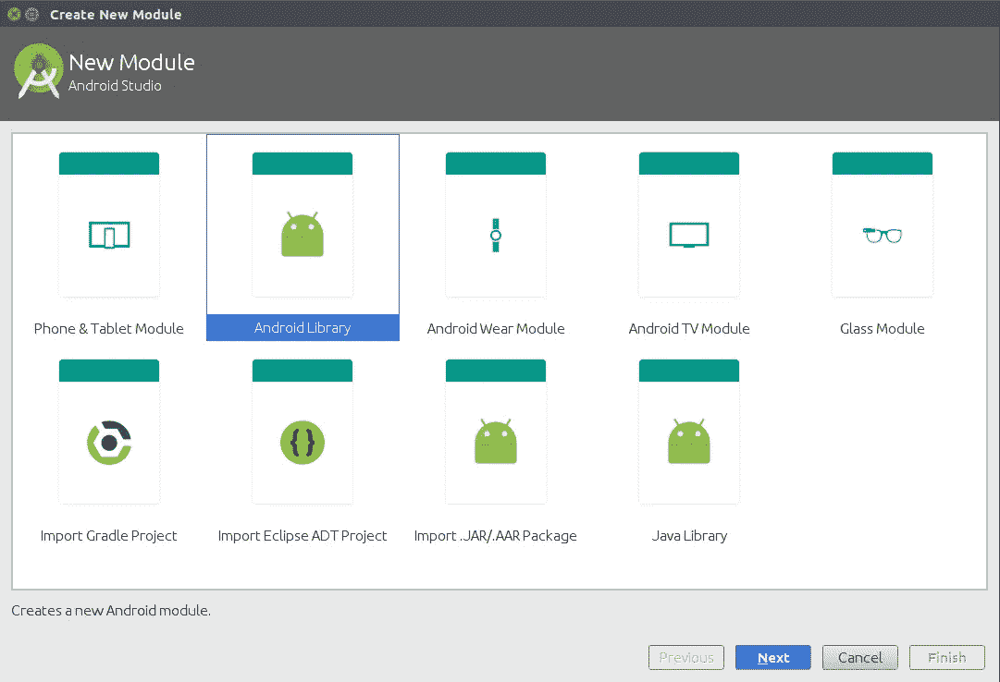
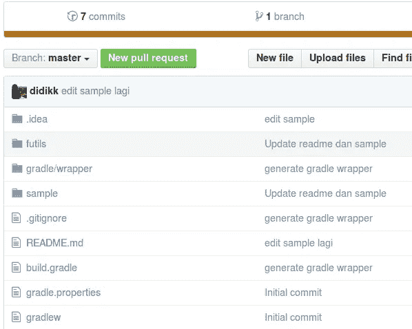
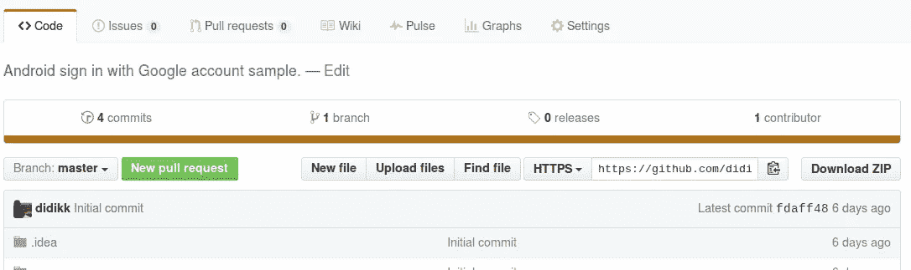
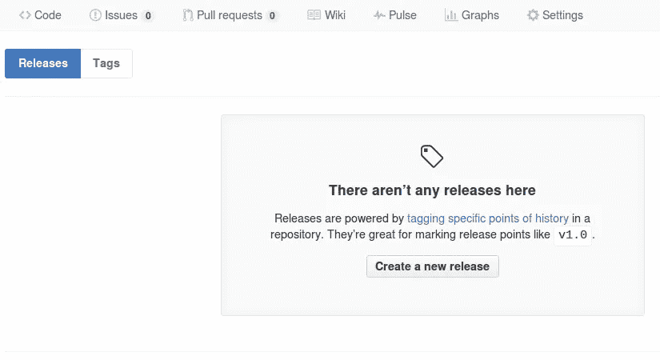
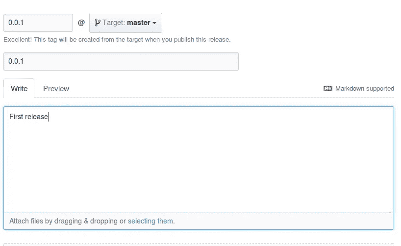
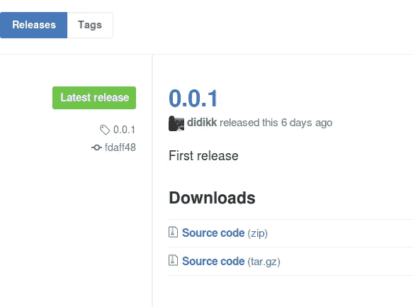

# Mempublikasikan Library Android Buatan Sendiri

> 原文：<https://medium.easyread.co/mempublikasikan-library-android-buatan-sendiri-228849efebf1?source=collection_archive---------1----------------------->

Jadi ceritanya kemarin sempet kepikiran dan pengen tahu gimana sih caranya publish library seperti yang dilakukan orang-orang di luar sana. Kan kelihatannya keren gitu kalau punya library sendiri. Sesuatu yang layak dibanggakan, haha.

Akhirnya setelah nyari sana-sini, ketemulah cara yang paling sederhana di antara beberapa cara yang tersedia. Dan cara itu adalah dengan menggunakan [Jitpack.io](https://jitpack.io/docs/) . Jadi begini langkah-langkahnya.

## **Persiapan**

Sebelum melakukan publikasi, tentu kita harus punya sebuah library terlebih dahulu. Jadi, yang perlu dilakukan adalah:

**1\.** Buat project baru di Android Studio seperti biasa.

**2\.** Selanjutnya kita butuh module baru untuk menampung library yang kita buat.

**3\.** Untuk menambahkan module baru dengan cara klik **File - > New - > New Module** dan pilih Android Library.



Tambah module baru

**4\.** Kemudian isi nama library dan nama module yang kita buat.

**5\.** Nah, selanjutnya silahkan pindahkan library yang kalian buat ke module tersebut.

**6\.** Kita bisa me-rename module ‘app’ menjadi ‘sample’, karena di sana kita akan memberikan sedikit contoh penggunaan dari library yang kita buat.

**7\.** Jangan lupa untuk menambahkan library tersebut ke module sample.

```
dependencies {
    **...** compile project(**':mylibrary'**)
}
```

## Publikasi

Yang perlu diperhatikan dari step ini adalah library yang kita buat harus diupload ke github. Saya asumsikan kalian telah mahir menggunakan git.

**1\.** Agar Jitpack bisa mengenali library buatan kita, kita harus menambahkan plugin [android-maven](https://github.com/dcendents/android-maven-gradle-plugin) .

**2\.** Tambahkan di root buid.gradle

```
buildscript {
    ...
    dependencies {
        **...** classpath **'com.github.dcendents:android-maven-gradle-plugin:1.5'**}
}
```

**3\.** Di build.gradle library tambahkan

```
apply plugin: **'com.github.dcendents.android-maven'** group=**'com.github.GithubUsername'**
```

**4\.** Jika semua sudah siap, silahkan upload project tersebut ke github.

**5\.** Selanjutnya buka repository tersebut di browser.

**6\.** Pastikan terdapat gradle/wrapper di situ. Jika belum ada, silahkan generate dengan menjalankan perintah *./gradle wrapper* di terminal dan push lagi.



Pastikan gradle/wrapper sudah terupload

**7\.** Berikutnya buat release baru untuk repo tersebut dengan cara klik releases.



Klik releases

**8\.** Klik create a new release



Buat release baru

**9\.** Isikan versi dan keterangan release, kemudian klik publish release.



first release

**10\.** Jika sudah maka akan tampil seperti berikut.



**11\.** Langkah terakhir, jalankan perintah berikut di terminal.

```
./gradlew install
```

**12\.** Perintah tersebut digunakan untuk menginstal local maven repository. Dan jika semua langkah-langkah di atas diikuti denga baik, maka library sudah siap digunakan.

## Instalasi

Untuk menggunakan library tersebut kita harus menambahkan repository jitpack.io

```
repositories {
    maven { url **"https://jitpack.io"** }
}
```

Dan tambahkan dependency

```
dependencies {
    **...** compile **'com.github.GithubUsername:namaLibrary:releaseVersion'**
}
```

Demikian, untuk lebih jelasnya bisa membaca dokumentasi dari Jitpack.io [di sini](https://jitpack.io/docs/ANDROID/#publish-android-library) . Dan sebagai tambahan referensi bisa melihat project yang telah saya buat [di sini](https://github.com/didikk/flibs) .