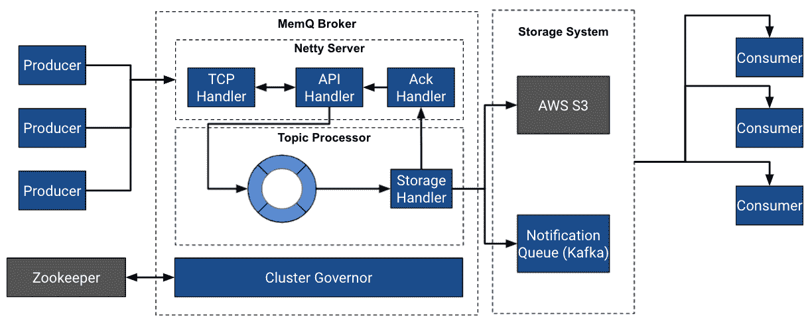

# MemQ:一个高效、可扩展的云原生发布系统

> 原文：<https://medium.com/pinterest-engineering/memq-an-efficient-scalable-cloud-native-pubsub-system-4402695dd4e7?source=collection_archive---------1----------------------->

Ambud Sharma |测井平台技术主管兼工程经理

日志平台支持 Pinterest 上的所有数据接收和传输。Pinterest 日志平台的核心是分布式 PubSub 系统，帮助我们的客户异步传输/缓冲数据和消费。

在这篇博客中，我们介绍了 MemQ ( *读作 mem — queue* )，这是一个为 Pinterest 的云开发的高效、可扩展的 PubSub 系统，自 2020 年年中以来一直为我们提供近实时数据传输用例，并补充了 Kafka，同时成本效率提高了 90%。

# **历史**

近十年来， [Pinterest 依赖 Apache Kafka](/pinterest-engineering/optimizing-kafka-for-the-cloud-4e936643fde0) 作为唯一的发布系统。随着 Pinterest 的增长，数据量也在增长，围绕运营超大规模分布式 PubSub 平台的挑战也在增加。大规模运行 Apache Kafka 让我们对如何构建可扩展的 PubSub 系统有了更多的了解。在对我们的 PubSub 环境的运营和可扩展性挑战进行深入调查后，我们得出了以下主要结论:

1.  并非每个数据集都需要亚秒级延迟服务，延迟和成本应该成反比(延迟越低，成本越高)
2.  PubSub 系统的存储和服务组件需要分开，以实现基于资源的独立可伸缩性。
3.  按读取而不是写入排序为特定的消费者使用情形提供了所需的灵活性(不同的应用程序可能对同一数据集有不同的要求)
4.  在大多数情况下，严格的分区排序在 Pinterest 上是不必要的，并且经常会导致可伸缩性的挑战。
5.  Kafka 中的重新平衡成本很高，通常会导致性能下降，并对饱和集群上的客户产生负面影响。
6.  在云环境中运行定制复制是非常昂贵的。

2018 年，我们试验了一种新型的 PubSub 系统，该系统将本机利用云。2019 年，我们开始正式探索如何解决 PubSub 可扩展性挑战的选项，并根据运营成本以及现有技术的再造成本评估了多种 PubSub 技术，以满足 Pinterest 的需求。我们最终得出结论，我们需要一种 PubSub 技术，这种技术基于 Apache Kafka、Apache Pulsar 和脸书 LogDevice 的知识，并且是为云构建的。

**MemQ 是一个新的 PubSub 系统，它在 Pinterest** 增强了卡夫卡。它使用了类似于[阿帕奇脉冲星](https://pulsar.apache.org/)和[脸书日志设备](https://logdevice.io/)的解耦存储和服务架构；但是，它依赖于可插入的复制存储层，即对象存储/ DFS / NFS 来存储数据。最终结果是一个 PubSub 系统，它:

*   处理 GB/s 流量
*   独立扩展、写入和读取
*   不需要昂贵的重新平衡来处理流量增长
*   比我们的卡夫卡足迹高 90%的成本效益吗

# **秘制酱**

MemQ 的秘密在于，它利用微批处理和不可变写入来创建一种架构，在这种架构中，存储层上每秒必要的输入/输出操作数(IOPS)显著减少，从而允许经济高效地使用亚马逊 S3 这样的云本地对象存储。这种方法类似于网络的分组交换(vs 电路交换，即单个大的连续数据存储，如 kafka 分区)。

MemQ 将连续的日志流分解成块(对象)，类似于 Pulsar 中的分类账，但不同之处在于它们被写成对象并且是不可变的。这些“数据包”/“对象”的大小(在 MemQ 内部称为“批处理”)在确定端到端(E2E)延迟方面起着重要作用。数据包越小，以更多 IOPS 为代价写得越快。因此，MemQ 允许以更高的 IOPs 为代价来调整 E2E 延迟。这种体系结构的一个关键性能优势是能够根据底层存储层分离读和写硬件，允许写和读作为可以跨存储层分布的数据包独立扩展。

这也消除了卡夫卡式的限制，为了恢复一个复制品，一个分区必须从头开始重新复制。在 MemQ 的情况下，底层复制存储只需要恢复特定的批处理，在存储故障的情况下，该批处理的副本数量由于故障而减少。然而，由于 Pinterest 的 MemQ 运行在亚马逊 S3 上，存储的恢复、分割和扩展由 AWS 处理，无需 Pinterest 的任何手动干预。

# MemQ 的组件

## **客户**

MemQ 客户端使用种子节点发现集群，然后连接到种子节点以发现元数据和托管给定主题的主题处理器的代理，或者对于消费者，是通知队列的地址。

## **经纪人**

与其他 PubSub 系统类似，MemQ 也有代理的概念。MemQ 代理是集群的一部分，主要负责处理元数据和写请求。

*注意:除非使用读取代理，否则 MemQ 中的读取请求可以直接由存储层处理*

## **集群调速器**

总监是 MemQ 集群中的领导者，负责自动重新平衡和主题处理器分配。群集中的任何经纪人都可以被选为州长，并且它使用 Zookeeper 与经纪人通信，zoo keeper 也用于州长选举。

管理者使用可插入的分配算法做出分配决定。默认情况下，评估代理的可用容量以做出分配决定。调控器还使用此功能来处理代理故障和恢复主题的容量。

## **主题&主题处理器**

与其他 PubSub 系统类似，MemQ 使用了主题的逻辑概念。代理上的 MemQ 主题由一个名为 TopicProcessor 的模块处理。一个代理可以托管一个或多个主题处理器，其中每个主题处理器实例处理一个主题。主题有写分区和读分区。写分区用于创建主题处理器(1:1 关系)，读分区用于确定消费者处理数据所需的并行级别。读取分区计数等于通知队列的分区数。

## **储存**

MemQ 存储由两部分组成:

1.  复制存储(对象存储/ DFS)
2.  通知队列(卡夫卡、脉冲星等))

## 1.复制存储

MemQ 允许可插入的存储处理程序。目前，我们已经为亚马逊 S3 实施了一个存储处理程序。亚马逊 S3 为容错、按需存储提供了一个经济高效的解决方案。MemQ 使用 S3 的以下前缀格式来创建高吞吐量和可扩展的存储层:

*s3:// <七叶树名称> / < (a)批处理中第一个客户端请求 id 的 2 字节哈希> / < (b)集群>/主题/ <主题名称>/*

(a) =用于 S3 内部的分区，以便在需要时处理更高的请求速率

(b)= MemQ 集群的名称

**可用性&容错**

由于 S3 是一个高度可用的网络规模的对象商店，MemQ 依赖它的可用性作为第一道防线。为了适应未来的 S3 重新划分，MemQ 在前缀的第一级添加了一个两位数的十六进制散列，创建了 256 个基本前缀，理论上，这些前缀可以由独立的 S3 分区处理，只是为了将来证明它。

**一致性**

底层存储层的一致性决定了 MemQ 的一致性特征。在 S3 的情况下，对 S3 标准的每次写入(PUT)都保证在被确认之前复制到至少三个可用性区域(az)。

## 2.通知队列

MemQ 使用通知系统向消费者传递数据位置的指针。目前，我们使用 Kafka 形式的外部通知队列。一旦数据被写入存储层，存储处理器生成通知消息，记录写入的属性，包括其位置、大小、主题等。消费者使用此信息从存储层检索数据(批量)。也有可能使 MemQ 代理以效率为代价为消费者代理批次。通知队列还为消费者提供集群/负载平衡。

**MemQ 数据格式**

MemQ 为消息和批处理使用定制的存储/网络传输格式。

MemQ 中最低的传输单位称为日志消息。这类似于脉冲星信息或卡夫卡制作人记录。

LogMessage 上的包装器允许 MemQ 进行不同级别的批处理。单位层级:

1.  批次(持久性单位)
2.  消息(生产者上传单位)
3.  日志消息(单元应用程序交互)

**生产数据**

MemQ 生产者负责向代理发送数据。它使用异步调度模型，允许非阻塞发送发生，而不需要等待确认。

为了隐藏底层存储层的上传延迟，同时维护存储级确认，此模型至关重要。这导致了自定义 MemQ 协议和客户端的实现，因为我们不能使用现有的 PubSub 协议，它依赖于同步确认。MemQ 支持三种类型的 ack:ack = 0(生产者开火&忘记)，ack=1(代理收到)，ack=all(存储收到)。在 ack=all 的情况下，复制因子(RF)由底层存储层确定(例如，在 S3 标准 RF = 3[跨三个 az])。如果确认失败，MemQ 生产者可以显式或隐式触发重试。

**存储数据** MemQ 主题处理器在概念上是一个环形缓冲区。该虚拟环被细分为多个批次，从而简化了写入操作。当消息通过网络到达时，它们被排队到当前可用的批中，直到该批被填满或者基于时间的触发发生。一旦批处理完成，它就被交给存储处理者，以便上传到存储层(如 S3)。如果上传成功，如果生产者请求 ack，则使用 AckHandler 通过通知队列将通知连同批中各个消息的确认(ack)一起发送给它们各自的生产者。

**消费数据**
MemQ 消费者允许应用程序从 MemQ 中读取数据。消费者使用代理元数据 API 来发现指向通知队列的指针。我们向应用程序公开了一个基于轮询的接口，其中每个轮询请求返回一个 LogMessages 迭代器，以允许成批读取所有 LogMessages。这些批处理是使用通知队列发现的，并直接从存储层检索。

**其他特性**
*数据丢失检测:*将工作负载从 Kafka 迁移到 MemQ 需要对数据丢失进行严格的验证。因此，MemQ 有一个内置的审计系统，可以高效地跟踪每条消息的 E2E 传递，并近乎实时地发布指标。

*批处理&流统一:*由于 MemQ 使用外部化的存储系统，因此它能够提供对原始 MemQ 数据运行直接批处理的支持，而无需将其转换为其他格式。这允许用户对 MemQ 执行特别检查，只要存储层可以单独扩展读取和写入，就不用担心寻道性能。根据存储引擎的不同，MemQ 消费者可以执行并发读取，以便在某些流情况下实现更快的回填。

**性能
延迟**

MemQ 支持对存储层的基于大小和时间的刷新，除了一些抑制抖动的优化之外，还支持对最大尾部延迟的硬限制。到目前为止，我们能够通过 AWS S3 存储实现 30 秒的 p99 E2E 延迟，并且正在积极改善 MemQ 延迟，这增加了可以从 Kafka 迁移到 MemQ 的用例数量。

**成本**这些节省来自几个因素，如:
-减少 IOPS
-消除排序限制
-分离计算和存储
-因消除计算硬件而降低复制成本
-放宽延迟限制

**可扩展性**
采用 S3 的 MemQ 可根据读写吞吐量需求按需扩展。MemQ 调控器执行实时重新平衡，以确保只要可以调配计算，就有足够的写入容量可用。代理通过添加额外的代理和更新流量容量要求来线性扩展。如果消费者需要额外的并行性来处理数据，则手动更新读取分区。

在 Pinterest，我们直接在 EC2 上运行 MemQ，并根据流量和新用例需求扩展集群。

**未来工作**
我们正在积极致力于以下领域:
-减少 MemQ 的 E2E 延迟(< 5s)以支持更多用例
-支持与流式&批处理系统的本机集成
-读取时的键排序

# **结论**

MemQ 为 PubSub 提供了一种灵活、低成本的云本地方法。MemQ 今天支持 Pinterest 上所有 ML 训练数据的收集和传输。我们正在积极研究将其扩展到其他数据集，并进一步优化延迟。除了解决 PubSub 之外，MemQ 存储还可以公开使用 PubSub 数据进行批处理的能力，而不会对性能产生重大影响，从而实现低延迟批处理。

请继续关注关于我们如何优化 MemQ 内部以应对可伸缩性挑战和 MemQ 开源版本的其他博客。

# 承认

没有戴夫·伯吉斯和王春燕的坚定支持，MemQ 的建立是不可能的。也非常感谢平-林敏，他是 MemQ 中 bug 修复和性能优化的关键驱动者，使得大规模生产的推出成为可能。

最后，感谢 Saurabh Joshi、Se Won Jang、、Divye Kapoor、Zhao、和伐木团队促成了 MemQ 的推出。

*要在 Pinterest 上了解更多工程知识，请查看我们的* [*工程博客*](https://medium.com/pinterest-engineering) *，并访问我们的*[*Pinterest Labs*](https://www.pinterestlabs.com/?utm_source=medium&utm_medium=blog-article-link&utm_campaign=sharma-november-16-2021)*网站。要查看和申请公开招聘机会，请访问我们的* [*招聘*](https://www.pinterestcareers.com/?utm_source=medium&utm_medium=blog-article-link&utm_campaign=sharma-november-16-2021) *页面。*