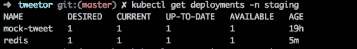
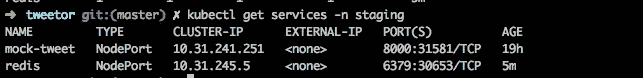
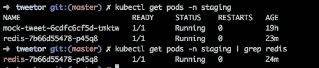
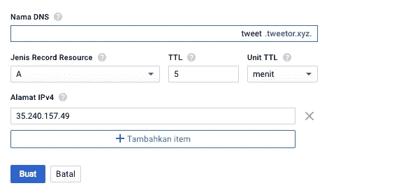
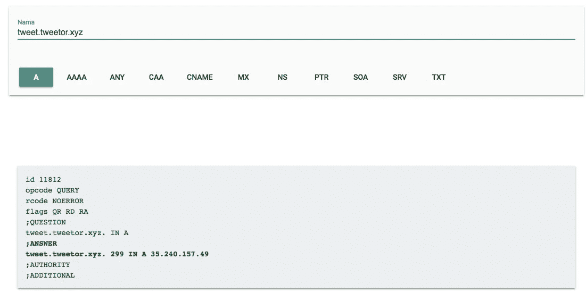

# Men-deploy Aplikasi Golang ke Kubernetes

> 原文：<https://medium.easyread.co/men-deploy-aplikasi-golang-ke-kubernetes-6c91c67f35b5?source=collection_archive---------5----------------------->

## Final Chapter dari Project [Kube-Xmas Series](https://medium.com/easyread/christmas-tale-of-sofware-engineer-project-kube-xmas-9167ebca70d2)


Photo by [Ben White](https://unsplash.com/@benwhitephotography?utm_source=medium&utm_medium=referral) on [Unsplash](https://unsplash.com?utm_source=medium&utm_medium=referral)

Haloo guys, sepertinya saya sudah mulai kelelahan, pinggang saya sudah panas, dan sakit :D, sudah 2 hari berjalan dari tanggal 23 kemarin saya menulis, saya berhenti ketika jam makan dan jam tidur saja :D.

Hari ini, ditanggal 24 Desember 2018 sore, mejelang malam natal, saya berencana menyelesaikan ini semua, dan menjadikannya seperti kado Natal saya kepada seluruh teman-engineer hehe :D **Gaya gw ya bapa, sok bet 🤦‍♂️🙄*

So, tahap terakhir dari series ini adalah mendeploynya ke Kubernetes Cluster yang telah saya buat.

Baiklah, sebelum melangkah jauh, akan ada beberapa jenis konfigurasi yang ada dalam deployment ke kubernetes ini, khususnya yang saya gunakan.

**— Deployment**

```
kind: **Deployment**
apiVersion: apps/v1
metadata:
   name: redis
   namespace: staging
spec:
# dsb etc etc
```

Jika anda melihat konfigurasi seperti ini, maka ini adalah konfigurasi untuk membuat deployment object di kubernetes cluster. Tugasnya jika telah di apply ke kubernetes adalah, membuat pods berdasarkan specs deployment yang kita buat.

Setelah apply ini, kita dapat mengecheck apakah berhasil di apply dengan command :

```
$ kubectl get deployments -n namespace
```



**— Service**

```
kind: **Service**
apiVersion: v1
metadata:
  name: redis
  namespace: staging
spec:
# dsb etc etc
```

Nah, jika melihat konfigurasi seperti ini, maka ini merupakan konfigurasi untuk membuat service didalam cluster kubernetes. Tugasnya adalah membuat portal service agar dapat terkoneksi ke-suatu pods sehingga pods dapat diakses baik internal atau external. Jenisnya ada beberapa seperti `NodePort` , `ClusterIP` , `LoadBalancer` . Jelasnya dapat kamu cari-tahu di documentasi resmi kubernetes.

Untuk melihat service yang berjalan, kamu dapat melakukan command berikut:

```
$ kubectl get services -n namespace
```



— **HorizontalPodAutoscaler**

```
apiVersion: autoscaling/v2beta1
kind: **HorizontalPodAutoscaler**
metadata:
  name: tweetor
  namespace: staging
spec:
# etc etc
```

Selanjutnya adalah HorizontalPodAutoscaler, ini seperti fitur yang ada dalam kubernetes. Tugasnya adalah membuat semacam auto-scaling (horizontal scale), dengan mengatur suatu kondisi, misal (CPU usage 70%) maka service ini akan membuat replica pods untuk menerima request baru.

**— Ingress**

Untuk ingress, sudah saya jelaskan di part sebelumnya. Formatnya di konfigurasi akan seperti berikut:

```
apiVersion: extensions/v1beta1
kind: Ingress
metadata:
  name: mock-tweet
  namespace: staging
  annotations:
    kubernetes.io/ingress.class: nginx
spec:
  rules: 
  - host: mock.tweet.tweetor.xyz
    http:
      paths:
        - path: /
          backend:
          serviceName: mock-tweet
          servicePort: 8000
```

Tugasnya konfig ini adalah mendaftarkan pods kita ke ingress (agar dapat diaksess dari luar cluster). Jelasnya sudah saya utarakan di artikel sebelumnya [disini](https://medium.com/10f2c9c0be16) .

## Deploy Redis Pod

Karena aplikasi tweetor ini bergantung pada Redis, maka pertama saya akan me-deploy redis ke cluter kubernetes saya.

**Perhatian!!** Sangat tidak di-anjurkan untuk deploy Database ke dalam cluster kubernetes. Karena setiap container yang dideploy di kubernetes sifatnya stateless (tidak menyimpan state), dan bisa dimatikan kapan aja.

Untuk database sebaiknya di delploy di server yang terpisah (VPS). Namun karena saya menggunakan redis, dan juga untuk kebutuhan belajar, saya pun men-deploy redis dicluster kubernetes dalam satu pod.

Karena redis ini akan diakses dalam satu cluster, jadi tidak perlu menambahkan ingress, yang saya lakukannya hanya menambahkan deployment nya ke dalam kubernetes cluster

Tidak perlu ribet, langsung apply saja config diatas.

```
$ kubectl apply -f redis-deployment.yaml
```

Dan check hasilnya apakah berhasil

```
$ kubectl get pods -n staging
```



Jika sudah berhasil, seharusnya sudah dapat digunakan.

## Deploy Tweetor API

Selanjutnya adalah deploy tweetor API kita, saya sudah buatkan deployment yamlnya berikut:

Apply saja:

```
$ kubectl apply -f tweetor-deployments.yaml
```

Pastikan dia aktif

```
$ kubectl get pods -n staging
```

Selanjutnya adalah menambahkan Ingress konfig yang juga sudah saya buat berikut:

Apply ingressnya:

```
$ kubectl apply -f tweetor-ingress.yaml
```

Check registered IP nya:

```
$ kubectl get ingress -n staging
```


Selanjutnya menambahkaan IP addressnya: `35.240.157.49` ke DNS kita, kenapa bisa sama denga IP mock-tweet? Karena IP ini adalah IP ingress NGINX yang sudah kita configurasi sebelumnya. Nah, selanjutnya tugas si NGINX yang me-forward semua request by domain-name.



Tunggu beberapa menit sembari me-ngecheck degan `dig tweet.tweetor.xyz`



Nah setelah selesai, seharusnya API kita sudah bisa diakses dan digunakan baik lewat postman atau lewat curl.

```
$ curl tweet.tweetor.xyz/tweets
[]
```

Sampai disini, semua sudah selesai. Saya mohon maaf atas kegabutan ini, tapi saya cukup senang karena cukup productive di malam natal kali ini.

*Aplikasi mungkin tidak bisa jalan dengan benar, banyak kesalahan logic mungkin, kalau sempat akan saya perbaikin. Sepertinya sudah waktunya tidur, saya cukup lelah mengerjakan semua ini dalam 2 hari :D.

**Project repository dan konfigurasi dapat diunduh di** [**github.com/bxcodec/tweetor**](https://github.com/bxcodec/tweetor) .

Beberapa hal mungkin belum terlalu rapih, akan saya update seiring dengan waktu. Dan english version is coming soon :D

## Previous chapter

*   [**Membuat Makefile untuk Aplikasi Golang**](https://medium.com/easyread/membuat-makefile-untuk-aplikasi-golang-5c2d19122b13)

# Merry Christmas Everyone!!!!