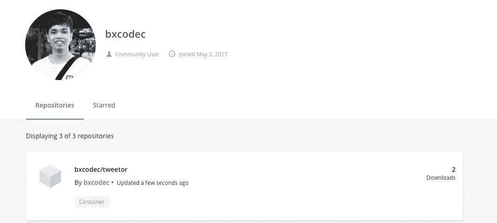

# Men-dockerize Aplikasi Golang

> 原文：<https://medium.easyread.co/men-dockerize-aplikasi-golang-9c32959c657e?source=collection_archive---------0----------------------->

## Part 5 dari Project [Kube-Xmas Series](https://medium.com/easyread/christmas-tale-of-sofware-engineer-project-kube-xmas-9167ebca70d2)


Photo by [Vidar Nordli-Mathisen](https://unsplash.com/@vidarnm?utm_source=medium&utm_medium=referral) on [Unsplash](https://unsplash.com?utm_source=medium&utm_medium=referral)

Haloooo lagi dan lagi 😎. Masih dibagian dari series ini.

**Prerequisite:**

*   Understand how docker works theoretically
*   Previous series

*Nah* diseri ini, saya akan fokus di implementasi *source code* API. Jika sebelumnya, saya fokus di *mock server* , maka kali ini saya fokus di real implementasi dari API berdasarkan OpenAPI 3 *specification* yang sudah saya buat sebelumnya.

*Nah* , API mock sudah jalan, maka idealnya *frontend* juga sudah mengerjakan aplikasi *frontend* berdasarkan spesifikasi API yang telah kita buat. Kalau dalam dunia kerja, saat kita sudah berani memberi *mock server* , maka kita sudah komitmen akan menyelesaikan real API nya hehe :D

Singkat cerita, semisal saya sudah menyelesaikan aplikasinya di Golang. Nah, sementara ketika mau deploy aplikasinya dikubernetes. Bagaimana caranya?

Udah jelas sih, pake docker :D. Nah di artikel kali ini, saya menulis langkah mudah untuk mendockerize aplikasi golang saya, agar nantinya bisa dideploy ke Cluster kubernetes yang telah dibuat sebelumnya: Kube-Xmas.

## Dockerfile

Hal pertama sebelum mendockerize, adalah kita harus mengerti penggunaan *Dockerfile* . Saya akan jelaskan singkat saja, untuk penjelasan lebih lengkap dapat dilihat di documentasi resmi *docker* .

*Dockerfile* ini berperan sebagai *script* intruksi yang akan digunakan oleh *docker command* untuk membuat *image-docker* kita, yang nantinya bisa dirun di *Kubernetes* atau di lokal kita.

Perintah-perintahnya cukup explicit, seperti `COPY` , `WORKDIR` , `RUN` , `EXPOSE` , dsb.

```
FROM alpine:latestRUN apk update && apk upgrade && \
    apk --no-cache --update add ca-certificates tzdata && \
    mkdir /appWORKDIR /appEXPOSE 9090COPY engine /appCMD /app/engine
```

Berikut diatas adalah contoh simplenya. Jika menggunakan *dockerfile* diatas, tentu pertama kita lakukan adalah membuild aplikasi kita lalu menjalankan *docker* -filenya.

`FROM` : Menyatakan base imagenya. Saya menggunakan *alpine* . Linux dengan size terkecil di dunia (10MB).
`RUN` : Saya menjalankan *command* diterminal *container* saya tersebut ketika dibuild
`WORKDIR` : Menyatakan *working directory* kita didalam *container* .
`EXPOSE` : Menyatakan *port* yang *diexpose* oleh *container* kita
`COPY` : Menyatakan membuat salinan file *engine* dari laptop kita ke folder `/app` di container.
`CMD /app/engine` : Menyatakan *command* yang akan diakses ketika menjalankan *container* kita.

*Nah* jika dilihat kembali dengan seksama, *Dockerfile* diatas mengharuskan kita untuk membuild *binary engine* dulu sebelum di *dockerize* . Sehingga untuk men-dokerizenya, kita akan build dulu aplikasi golang tersebut. Lalu menambahkannya kedalam image. Dan image ini yang akan dijalankan oleh Kubernetes.

```
$ go build -o engine main.go
$ docker build . -t bxcodec/tweetor
```

Sampai disini, seharusnya kita sudah berhasil membuat docker-image yang isinya adalah aplikasi kita.

Selanjutnya adalah menambahkannya ke docker-registry. Untuk kasus ini, saya pakai docker hub.

```
$ docker login
# ikuti prosess loginnya
$ docker push bxcodec/tweetormake docker-push
The push refers to repository [docker.io/bxcodec/tweetor]
eb083155cb06: Layer already exists
2ccc1a87678c: Layer already exists
df64d3292fd6: Layer already exists
```

Dan jika kita pergi ke docker-hub saya [https://hub.docker.com/u/bxcodec](https://hub.docker.com/u/bxcodec) , kita akan melihat image yang telah saya push.



## Multi Stages Build Dockerfile

Kelemahan metode yang seperti yang saya lakukan diatas adalah, kita harus hati-hati ketika berurusan dengan os. Jika saya *build* di lokal saya (mac OS) maka ketika aplikasi tersebut di *dockerize* , tidak akan bisa dieksekusi. Karena docker container-imagenya menggunakan base OS alpine.

Untuk mengatasi ini, docker memiliki fitur dengan istilah *multi-stage build.* Sehingga, agar tidak ada kesalahan OS, kita dapat membuat builder dari OS yang sama dengan base image dari aplikasi kita.

```
## Builder
FROM golang:1.10-alpine3.7 as builderRUN apk update && apk upgrade && \
    apk --no-cache --update add git make && \
    go get -u github.com/golang/dep/cmd/depWORKDIR /go/src/github.com/bxcodec/tweetorCOPY . .RUN dep ensure -v && go build -o engine app/main.go## DistributionFROM alpine:latestRUN apk update && apk upgrade && \
    apk --no-cache --update add ca-certificates tzdata && \
    mkdir /app && mkdir tweetorWORKDIR /tweetorEXPOSE 9090COPY --from=builder /go/src/github.com/bxcodec/tweetor/engine /appCMD /app/engine
```

Dengan konsep ini, kita akan membuat satu *docker image* sebagai builder. Lalu hasil *build* tersebut kita *copy* ke *docker image* baru yang isinya hanya aplikasi kita.

```
COPY --from=builder /go/src/github.com/bxcodec/tweetor/engine /app
```

`/go/src/github.com/bxcodec/tweetor/engine` : Folder hasil build dari image `builder` yang kita copy ke folder `/app` di container baru.

Sehingga didalam container yang baru, hanya satu aplikasi dan base image saja dan sizenya pun kecil.

Dengan ini kita tidak perlu build dilocal lagi, karena sudah dilakukan didalam container terpisah.

```
$ docker build . -t bxcodec/tweetor:latest
```

Dan selanjutnya push kembali ke docker-registry

```
$ docker push bxcodec/tweetor
```

Done!!!

Yaay!! Sampai disini saja untuk urusan dockerize aplikasi Golang yang sudah saya buat sebagai implementasi real dari Open API yang saya buat. Selanjutnya adalah membuat environment development dengan docker-compose.

Jadi bocoran, next part adalah, bagaimana saya membuat environment development saya tetap sama terserah OS yang saya pakai apa aja (Linux, MacOS).

## Next

*   [**Membuat Development Environtment Aplikasi Golang dengan Docker Compose**](https://medium.com/bxcodec/membuat-development-environtment-aplikasi-golang-dengan-docker-compose-4e96542c19ea)

## Prev

*   [**Membuat Mock Server dengan OpenAPI 3 di Kubernetes**](https://medium.com/easyread/membuat-mock-server-dengan-openapi-3-di-kubernetes-b9963ed2ac40)