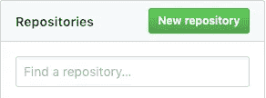
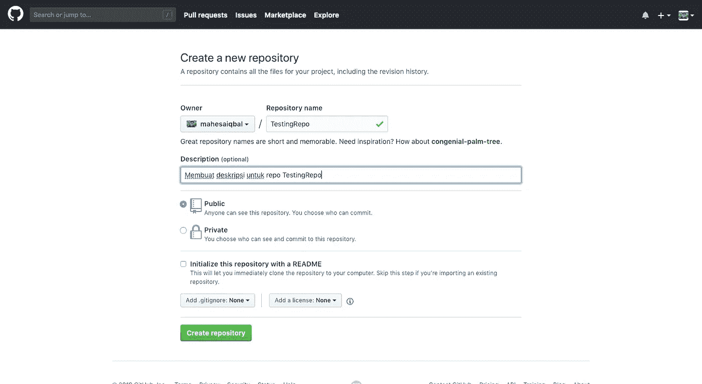
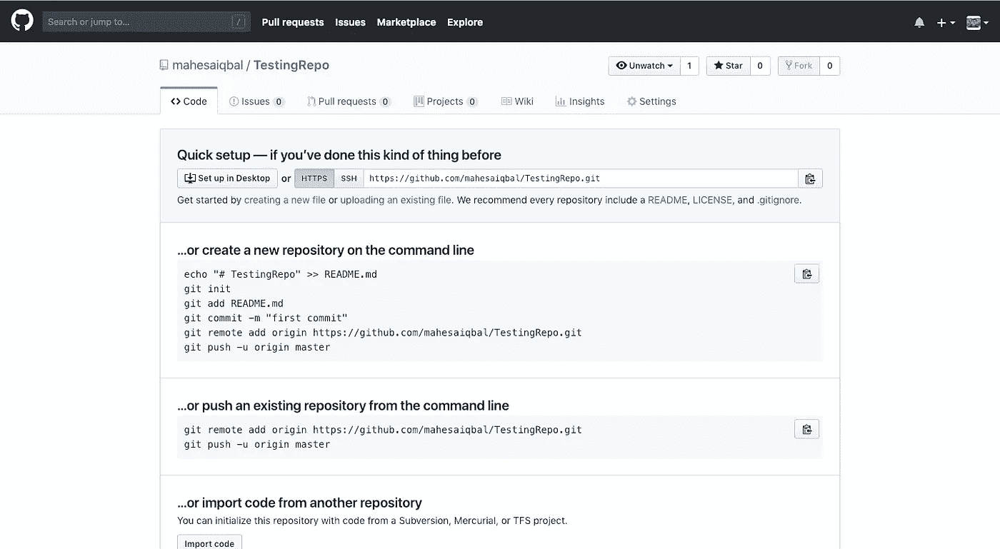
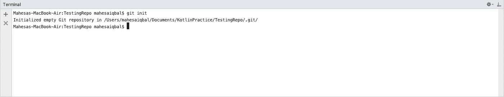
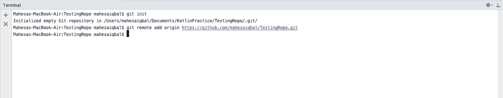
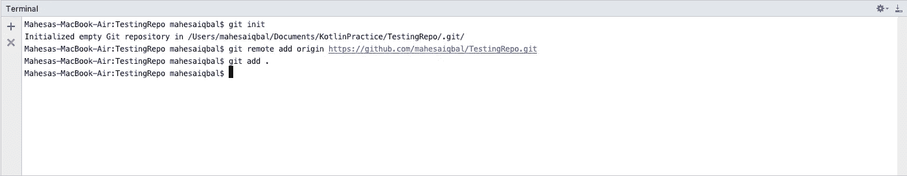
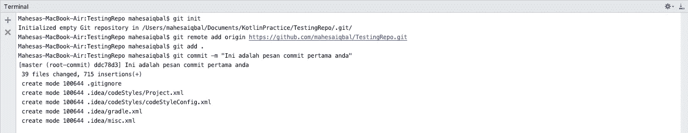
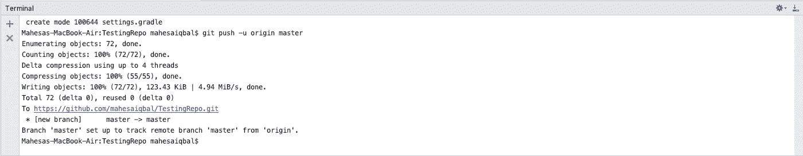
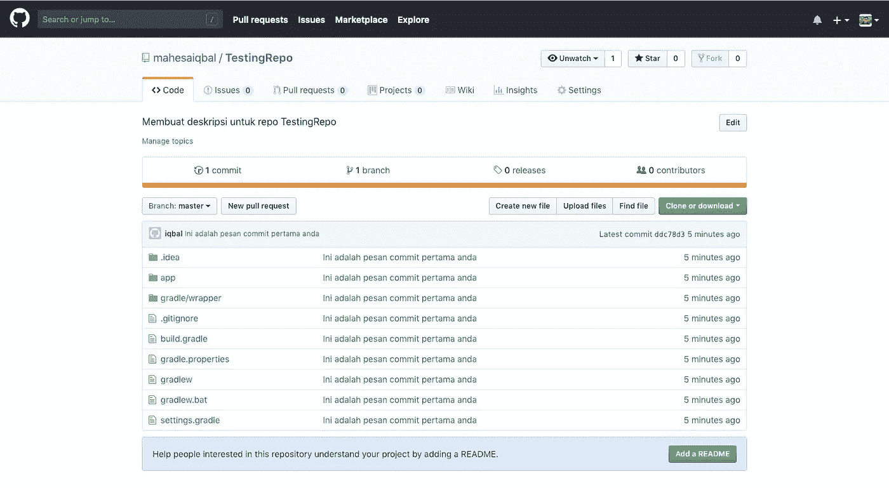

# Menambahkan Proyek Android Studio Ke Github Menggunakan Terminal

> 原文：<https://medium.easyread.co/menambahkan-proyek-android-studio-ke-github-menggunakan-terminal-f95f33864e69?source=collection_archive---------0----------------------->


Saya ingin mencoba untuk mendokumentasikan apa yang telah saya kuasai di platform ini dan ingin sharing dengan sesama, semoga akun ini tidak kena suspend lagi hehe.

Pada tulisan ini, saya ingin mencoba sharing tentang “Bagaimana cara menambahkan proyek aplikasi Android Studio ke Github (VCS) menggunakan Terminal”. Didalam Android Studionya sendiri sudah ada fitur push ke dalam Github yaitu “Share project on Github”, anda dapat dengan mudah menambahkan proyek aplikasi anda ke dalam Github dengan beberapa klik saja. Namun, untuk menambah pengetahuan saja dan bisa anda terapkan di perusahaan tempat anda bekerja sebagai Programmer/Developer atau posisi yang berkaitan dengan dunia Software Development, tentunya pengetahuan tentang git ini memang wajib untuk dikuasai, minimal anda bisa :

1.  Buat repository di Github.
2.  Inisialisasi git didalam proyek aplikasi kita.
3.  Menambahkan remote pada aplikasi yang sedang kita kembangkan/develop agar dapat terkontrol.
4.  Commit & Push proyek aplikasi ke dalam Github.

Pada tulisan ini, kita akan mencoba beberapa hal tersebut diatas.

Pertama yang harus kita lakukan adalah membuat repository di Github. Anda bisa mengunjungi website [Github](https://github.com/) , lalu anda bisa mencoba membuat repository baru dengan klik “New repository” pada tombol berwarna hijau.



Anda akan diarahkan ke halaman ini untuk membuat repository dengan nama dan deskripsi yang anda inginkan.



Tekan tombol “Create repository”, setelah itu anda akan diarahkan ke halaman ini.



Langkah selanjutnya adalah anda bisa kembali ke proyek Android Studionya, buka tab Terminal di bagian bawah Android Studio, lalu ketik command ini :

Untuk inisialisasi git pada proyek Android Studio anda.

```
git init
```



Menambahkan remote pada aplikasi agar dapat terkontrol dengan Github.

```
git remote add origin [https://github.com/mahesaiqbal/TestingRepo.git](https://github.com/mahesaiqbal/TestingRepo.git)
```



Menambahkan semua file/memperbarui semua file yang ada.

```
git add .
```



Commit & Push aplikasi anda ke Github

```
git commit -m "Ini adalah pesan commit pertama anda"
```



```
git push -u origin master
```



Sekarang, anda bisa reload halaman web yang sebelumnya dan akan tampil seperti ini.



Yeayy! sekarang proyek aplikasi Android Studio anda sudah berhasil ditambahkan ke Github anda.

Selamat mencoba ^_^ happy coding!