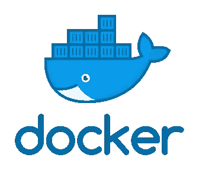

# Mencoba Docker— Insight 1

> 原文：<https://medium.easyread.co/mencoba-docker-insight-1-20d537eb3aaf?source=collection_archive---------3----------------------->


Photo by [Ian Taylor](https://unsplash.com/@carrier_lost?utm_source=medium&utm_medium=referral) on [Unsplash](https://unsplash.com?utm_source=medium&utm_medium=referral)

Selamat datang buat teman-teman yang baru pertama kali *visit* blog saya. Salam kenal.

Yap, kali ini saya lagi *cu·ri·ous* sama Docker. Sebenarnya ada sedikit tuntutan dengan pekerjaan sih. Ahaha. Mari kita belajar sama-sama. Semoga teman-teman yang sedang belajar teknologi ini bisa sedikit terbantu dengan tulisan saya. Cusss lanjut *scroll down* -nya.



[https://miro.medium.com/max/336/1*glD7bNJG3SlO0_xNmSGPcQ.png](https://miro.medium.com/max/336/1*glD7bNJG3SlO0_xNmSGPcQ.png)

S etiap development di kantor, baik sendiri maupun bertim, *issue* yang muncul itu adalah perbedaan versi package antara di *server* atau pun di lokal komputer, atau jika bertim perbedaan versi komputer lokal saya dengan komputer lokal teman-teman lain. Setiap ada *project* kami harus selalu menyamakan versi dari *package* , *runtime* , bahasa pemrograman, ataupun *service* aplikasi lain yang digunakan. Setiap terima *project* seperti itu. Berulang kali harus menyesuaikan. Efek dari *issue* tersebut muncul *issue* lain, yaitu banyak versi dari satu *package* yang ter- *install* di komputer lokal kami. Misalnya versi postgres, akan ada beberapa versi mulai dari 9.x, 11.x, dan mungkin versi yang terbaru versi 13.x. Akibatnya adalah jika sudah tidak digunakan kembali maka hanya akan buang-buang *resource* saja di komputer lokal kami. Itu *issue* yang sering terjadi. Bentuk dari *issue* tersebut saya dan teman-teman mulai menggunakan Docker untuk setiap *development.*

# Docker

> Docker makes development efficient and predictable — docker.com

D **ocker** merupakan seperangkat produk platform sebagai layanan (PaaS) yang menggunakan virtualisasi tingkat OS untuk mengirimkan perangkat lunak dalam paket yang disebut kontainer (Nanti akan saya dibahas lebih lanjut, tetap scroll ke bawah ya).

Pada prinsipnya docker merupakan platform open source untuk membangun, mendistribusikan dan mengatur aplikasi-aplikasi kontainer.

Mari simak mengenai istilah-istilah yang akan ditemui.

# Dockerfile

Jika kamu bayangkan sebuah kue, dockerfile merupakan wadah kue dan bahan-bahan kue. Ada cetakan kue, oven, pengembang kue, mentega, tepung terigu, soda kue, soda api dan lain lain. Begitu pun dengan dockerfile, dockerfile merupakan wadah yang di dalamnya terdapat *base image* , image yang berada di docker hub, dan lain lain.

```
*# Pull base image.
FROM ubuntu:14.04**RUN apt-get install -y –no-install-recommends software-properties-common**# Install Nginx.
RUN \
add-apt-repository -y ppa:nginx/stable && \
apt-get update && \
apt-get install -y nginx && \
rm -rf /var/lib/apt/lists/* && \
echo “\ndaemon off;” >> /etc/nginx/nginx.conf && \
chown -R www-data:www-data /var/lib/nginx**# Define mountable directories.
VOLUME [“/etc/nginx/sites-enabled”, “/etc/nginx/certs”, “/etc/nginx/conf.d”, “/var/log/nginx”, “/var/www/html”]**# Define working directory.
WORKDIR /etc/nginx**# Define default command.
CMD [“nginx”]**# Expose ports.
EXPOSE 80
EXPOSE 443*
```

**Abaikan isinya** . Nanti kita akan belajar command-command yang terdapat di dockerfile.

# Docker Image

Nah, lalu apa itu docker image? Docker image merupakan hasil dari kue yang kita buat. Bisa brownis, kue tart, kue bolu, dan lain-lain. Begitu pun dalam docker image, isi dari image bisa ada package-package di dalamnya, file system, dan lain-lain.

Kita dapat mempublish docker image ke khalayak umum atau hanya sebatas ke rekan-rekan kerja kita juga loh. Kok bisa ? Ada beberapa tempat yang bisa kita gunakan jika ingin mempublish docker image yang sudah kita buat, diantaranya :

## Docker Hub

**Docker Hub is the world’s easiest way to create, manage, and deliver your teams’ container applications. —** [https://hub.docker.com/](https://hub.docker.com/)

Docker Hub terdapat dua tipe yang dapat kita lakukan. Jika teman-teman ingin mempublish dan bisa digunakan oleh orang-orang pada umumnya, kita bisa buat menjadi **public** . Tapi jika kita hanya ingin mempublish image yang telah kita buat dan hanya yang punya akses yang bisa mem-pull image-nya. Kamu bisa membuatnya menjadi **private** .

## Amazon Elastic Container Registry (AWS)


Gambar telah berbicara teman-teman.

## Google Container Registry (Google)

Container Registry is a service for storing private container images. It provides a subset of features provided by Artifact Registry, a universal repository manager and the recommended service for managing container images and other artifacts in Google Cloud. — [https://cloud.google.com/container-registry/docs](https://cloud.google.com/container-registry/docs)

Seperti penjelasan di atas, Google Container Registry merupakan layanan private untuk mempublish image yang kita buat.

# Docker Container

Terus docker container-nya itu apa? Nah, kalau docker container itu merupakan wrapper ketika docker image dijalankan. Container bersifat mengisolasi docker image yang sedang berjalan atau pun sudah mulai terbuat. Dengan container, kita bisa menjalankan image-image lain tanpa mengganggu satu sama lain.

Kita bisa bahas lebih lanjut di tulisan selanjutnya. Sudah saya list materi tentang docker ini apa saja yang ingin saya bahas. Jadi tetap bersabar ya teman-teman.

# Alert!

If you guys come from **Indonesia** and want to support me to writing more and more, hopefully you can give a little bit from your wallet. You can share your gift to some ways,

## Saweria

[https://saweria.co/pandhuwibowo](https://saweria.co/pandhuwibowo)


## Trakteer

[https://trakteer.id/goodpeopletogivemoney](https://trakteer.id/goodpeopletogivemoney)


# Referensi

[](https://www.docker.com/) [## Empowering App Development for Developers | Docker

### Learn how Docker helps developers bring their ideas to life by conquering the complexity of app development.

www.docker.com](https://www.docker.com/) [](https://en.wikipedia.org/wiki/Docker_%28software%29) [## Docker (software) - Wikipedia

### Docker 是一套平台即服务(PaaS)产品，使用操作系统级虚拟化来交付软件

en.wikipedia.org](https://en.wikipedia.org/wiki/Docker_%28software%29) [](https://www.ibm.com/cloud/learn/docker) [## Docker 是什么？

### 了解关于 Docker 的更多信息，Docker 是一个用于构建容器化应用程序的开源平台。

www.ibm.com](https://www.ibm.com/cloud/learn/docker) [](https://andykamt.com/belajar-docker-membuat-container-menggunakan-dockerfile/) [## 我的数字笔记

### 本文介绍了一种包装集装箱的方法，该方法可以将集装箱包装成一个包装形象…

andykamt.com](https://andykamt.com/belajar-docker-membuat-container-menggunakan-dockerfile/)  [## Docker Hub 容器图像库|应用容器化

### 编辑描述

hub.docker.com](https://hub.docker.com/) [](https://cloud.google.com/container-registry/docs) [## 容器注册文档|谷歌云

### Container Registry 是一项用于存储私有容器映像的服务。它提供了由…提供的功能子集

cloud.google.com](https://cloud.google.com/container-registry/docs)