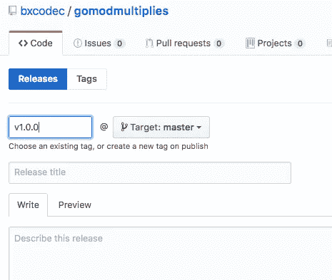
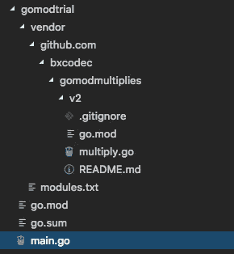
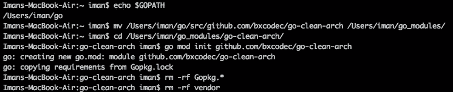

# Mencoba Go Module pada Golang

> 原文：<https://medium.easyread.co/mencoba-go-module-pada-golang-13ae343ce529?source=collection_archive---------1----------------------->

## Belajar menggunakan Go Module fitur Golang terbaru.


Gopher by Gopherize.me

Kemarin saya baru update golang dari v1.10.4 ke versi v1.11\. Setelah cukup membaca *release notes-* nya, saya melihat ada fitur menarik yang dicantumkan dalam [*release notes-* nya](https://golang.org/doc/go1.11#tools) Golang, yakni pengenalan Go Module sebagai langkah awal untuk perjalanan menuju Golang 2 seperti yang disebutkan Dave Cheney di presentasinya di [@qcon](https://twitter.com/QCon) Shanghai [disini](https://dave.cheney.net/paste/the-past-present-and-future-of-go2.pdf) .

Akar masalah dari pembuatan fitur ini adalah dari masalah yang di alami Gopher semenjak dahulu terkait *dependency* *management* . Dengan Go Module, Go developer kini dapat *ngoding* di folder apapun dan tidak terikat pada GOPATH. Jika biasanya kita harus *ngoding* di folder GOPATH, maka dengan Go Module, kita bisa melakukannya dimana aja, malah, jika menggunakan Go Module, disarankan untuk tidak *ngoding* di folder GOPATH. Karena Go Module tidak bekerja di dalam GOPATH.

Untuk membuktikannya, saya pun membuat 2 skenario, saya membuat 2 project di 2 folder berbeda. 1 diantaranya berada di dalam GOPATH. GOPATH saya berada di `/Users/iman/go` .

```
GOARCH="amd64"
GOBIN=""
GOCACHE="/Users/iman/Library/Caches/go-build"
GOEXE=""
GOFLAGS=""
GOHOSTARCH="amd64"
GOHOSTOS="darwin"
GOOS="darwin"
**GOPATH="/Users/iman/go"**
GOPROXY=""
GORACE=""
GOROOT="/usr/local/Cellar/go/1.11.1"
...etc
```

**1\.** **Project didalam folder GOPATH**

Saya pun membuat sebuah folder didalam GOPATH, dan mencoba inisialisasi module di dalamnya, namun tidak bisa.

```
# GOPATH = /Users/iman/go/$ pwd
/Users/iman/go/src/github.com/bxcodec/sample$ go mod init github.com/bxcodec/sample
go: modules disabled inside GOPATH/src by GO111MODULE=auto; see 'go help modules'
```

**2\. Project di luar folder GOPATH**

Selanjutnya diluar folder **GOPATH,** dan berhasil.

```
# GOPATH = /Users/iman/go/$ pwd
/Users/iman/go_modules/sample$ go mod init github.com/bxcodec/sample
go: creating new go.mod: module github.com/bxcodec/sample$ ls
go.mod
```

# Contoh Project Go Module

Selanjutnya saya pun membuat project kecil-kecilan untuk memahami penggunaan module ini.

Secara keseluruhan saya memiliki 2 project:

*   gomodtrial ( [https://github.com/bxcodec/gomodtrial](https://github.com/bxcodec/gomodtrial) )
*   gomodmultiplies ( [https://github.com/bxcodec/gomodmultiplies](https://github.com/bxcodec/gomodmultiplies) )

`gomodmultiplies` adalah *project* dengan fungsi perkalian. Sementara `gomodtrial` adalah *project client* , yang akan meng- *import* `gomodmultiplies` sebagai *dependency* didalamnya.

## Gomodmultiplies

Pertama-tama saya akan membuat sebuah *project* dengan fungsi kecil, yaitu `gomodmultiplies` , dimana *project* ini memiliki fungsi `Multiply` yang menerima deretan angka ( *Variadic Functions* : ditandai dengan “ ***…”*** pada parameternya).

```
package gomodmultipliesfunc Multiply(items ...int64) int64 {
 res := int64(1)
 for _, item := range items {
  res *= item
 }
 return res
}
```

Untuk memulainya saya melakukan *command* berikut.

```
$ mkdir gomodmultiplies$ cd gomodmultiplies$ go mod init github.com/bxcodec/gomodmultiplies
go: creating new go.mod: module github.com/bxcodec/gomodmultiplies$ ls
go.mod$ cat go.mod
module github.com/bxcodec/gomodmultiplies
```

Dan selanjutnya menambahkan fungsi `Multiply` dan push ke github.

```
$ git push origin master
```

Setelah di push, maka modul `gomodmultiplies` sudah dapat kita *import* dan gunakan diprojek yang kita inginkan. Untuk hal ini, saya *import* modul `gomodmultiplies` tersebut pada project `gomodtrial` .

## Import `gomodmultiplies` ke `gomodtrial`

Selanjutnya saya buat *project* baru, sama seperti sebelumnya.

```
$ mkdir gomodtrial$ cd gomodtrial$ go mod init github.com/bxcodec/gomodtrial
go: creating new go.mod: module github.com/bxcodec/gomodmultiplies$ ls
go.mod$ cat go.mod
module github.com/bxcodec/gomodtrial
```

Selanjutnya saya akan *import* `gomodmultiplies` di *project* `gomodtrial` .

```
# get the dependency$ go get -u github.com/bxcodec/gomodmultiplies 
```

Command ini akan membuat file baru `go.sum` dimana isinya akan seperti berikut dibawah, serta mengubah file `go.mod` menjadi:

Dan selanjutnya *import* didalam *project* .

```
package mainimport (
 "fmt" "github.com/bxcodec/gomodmultiplies"
)func main() {
 a, b := int64(10), int64(23)
 res := gomodmultiplies.Multiply(a, b)
 fmt.Println(res)
}
```

Sampai disini saja, maka modul `gomodmultiplies` sudah berhasil di- *import* dan digunakan. Serta project `gomodtrial` juga memiliki independen modul, dan dapat di *compile* dan dijalankan seperti biasa. Dengan Go module ini, kita tidak perlu lagi harus membuat *project* kita didalam GOPATH. Kita bisa menempatkan dimanapun folder *project* kita berada. * *Meskipun sebenarnya, saya lebih suka konsep GOPATH yang terdahulu, karena semua project* `*go*` *saya terpusat dalam satu folder.*

## Go Module Import Library Non Module

Contoh diatas adalah tentang *import* modul ke dalam modul. Yang saya lakukan adalah, membuat satu modul `gomodmultiplies` dan *import* modul tersebut ke modul lain `gomodtrial` . Namun bagaimana kalau *library* yang digunakan belum menggunakan modul?

Setelah mencoba, ternyata tidak ada masalah, seperti disebutkan oleh team Golang, versi baru ini masih *backward* *compatibility* dengan versi sebelumnya.

Untuk mencobanya, saya pun menambah *library* lain pada *project* saya sebelumnya `gomodtrial` .

Saya menambahkan `echo-labstack` , dan membuat simple *endpoint* API.

```
$ **go get github.com/labstack/echo**
go: finding github.com/labstack/echo v3.2.1+incompatible
go: downloading github.com/labstack/echo v3.2.1+incompatible
go: finding golang.org/x/crypto/acme/autocert latest
go: finding golang.org/x/crypto/acme latest
go: finding github.com/labstack/gommon/log latest
go: finding github.com/labstack/gommon/color latest
go: finding golang.org/x/crypto latest
go: downloading golang.org/x/crypto v0.0.0-20181030022821-bc7917b19d8f
go: finding github.com/labstack/gommon v0.2.7
go: downloading github.com/labstack/gommon v0.2.7
go: finding github.com/mattn/go-colorable v0.0.9
go: finding github.com/mattn/go-isatty v0.0.4
go: finding github.com/valyala/fasttemplate latest
go: downloading github.com/mattn/go-colorable v0.0.9
go: downloading github.com/mattn/go-isatty v0.0.4
go: downloading github.com/valyala/fasttemplate v0.0.0-20170224212429-dcecefd839c4
go: finding github.com/valyala/bytebufferpool v1.0.0
go: downloading github.com/valyala/bytebufferpool v1.0.0
```

Dan meng- *import* nya kedalam project saya.

Setelah saya compile, build dan run, tidak ada masalah. Masih berjalan dengan baik sebagaimana mestinya.

# Go module dengan Versioning

Bekerja dengan *versioning* , Go module menggunakan sistem *semantic versioning* . *tentang *semantic* *versioning* dapat dibaca [disini](https://semver.org/) .

Dalam semantic version, *major* dan *minor* adalah berbeda. Major merupakan perubahan besar, dan mungkin tidak *support* lagi ke versi lama. Sementara minor, seharusnya masi support fitur versi lama. Di Golang juga sama, *major* *version* bisa saja berbeda *package* , dan tidak harus *support* versi lama. Sementara perubahan *minor* *version* masih harus satu *package* dan harus *support* fitur sebelumnya.

## Minor Versioning Changes

Saya akan membuat versi awal dari `gomodmultiplies` . Saya akan *release* versi v1.0.0 di github.



release new version

Selanjutnya, saya akan import ke project `gomodtrial` dengan *command:*

```
$ go get github.com/bxcodec/gomodmultiplies@v1.0.0
```

Maka `go.mod` dan `go.sum` akan berubah yang sebelumnya `v0.0.0` menjadi `v1.0.0` .

Kemudian saya akan melakukan *minor* *changes* , saya akan tambahi fungsi `MultiplyInt` dimodule tersebut.

```
package gomodmultipliesfunc Multiply(items ...int64) int64 {
 res := int64(1)
 for _, item := range items {
  res *= item
 }
 return res
}func **MultiplyInt**(items ...int) int64 {
 res := 1
 for _, item := range items {
  res *= item
 }
 return int64(res)
}
```

Dan push ke github, dan *release* versi baru menjadi v.1.1.0\. Nah, agar dapat menggunakan versi baru fungsi tersebut saya tinggal update package tersebut di project yang meng- *import* nya( `gomodtrial` ) atau dapat dilakukan dengan *command* seperti berikut di folder `gomodtrial`

```
go get -u
```

atau

```
go get github.com/bxcodec/gomodmultiplies@v1.1.0
```

Selanjutnya, saya dapat menggunakan fungsi `MultiplyInt` di versi `v1.1.0` .

```
package mainimport (
 "fmt""github.com/bxcodec/gomodmultiplies"
)func main() {
 a, b := int64(10), int64(23)
 res := gomodmultiplies.**Multiply**(a, b)
 fmt.Println(res) c, d := 10, 20
 r := gomodmultiplies.**MultiplyInt**(c, d)
 fmt.Println(r)
}
```

## Major Versioning Changes

Jika saya lihat-lihat, fungsi di modul `gomodmultiples` sangatlah mirip, hanya beda tipe data pada *parameter* nya, untuk hasilnya juga masih sama dalam bentuk `int64`

Sehingga untuk memper-cantik dan me- *simplify* fungsinya, saya pun ubah fungsi tersebut menjadi satu.

```
package gomodmultipliesimport "reflect"func **Multiply**(items ...interface{}) int64 {
 res := int64(1)
 for _, item := range items {
  res *= convertToInt64(item)
 }
 return res
}func convertToInt64(data interface{}) int64 {
 if data == nil {
  return 0
 }
 int64Type := reflect.TypeOf(int64(0))
 v := reflect.ValueOf(data)
 v = reflect.Indirect(v)
 if !v.Type().ConvertibleTo(int64Type) {
  return 0
 }
 res := v.Convert(int64Type)
 return res.Int()
}
```

Saya pun menghapus `MultiplyInt` serta mengubah *parameter* `Multiply` menjadi `interface{}` agar dapat digunakan tipe data `integer` lainnya.

Karena penghapusan fungsi `MultiplyInt` maka ini tergolong dalam *major* *version changes.* Saya pun mengubah `go.mod` saya dan mengubah path module project `gomodmultiplies`

dari:

```
module github.com/bxcodec/gomodmultiplies
```

menjadi:

```
module github.com/bxcodec/gomodmultiplies/v2
```

dan push ke github dan release versi baru: v2.0.0.

## Update Major Version

Karena `gomodmultiplies` sudah release v2.0.0, dan saya juga ingin *project* `gomodtrial` menggunakan versi baru dari `gomodmultiplies` tersebut, saya pun harus update ke *major version* .

Jika sebelumnya, untuk update versi dari v1.0.0 ke v1.10 kita dapat menggunakan *command* `go get -u` maka, kita telah dapat menggunakan fitur yang ada di v1.1.0

Namun, `go get -u` tidak akan mengubah versi library yang kita pakai menjadi `v2.0.0` . Sehingga untuk update ke major version, langkah yang saya lakukan adalah mengubah path import langsung menjadi

```
github.com/bxcodec/gomodmultiplies/v2
```

Selanjutnya lakukan compile dengan go build, maka import kita langsung aktif.

```
package mainimport (
 "fmt"// "github.com/bxcodec/gomodmultiplies"
 "github.com/bxcodec/gomodmultiplies/v2"
)func main() {
 a, b := int64(10), int64(23)
 res := gomodmultiplies.Multiply(a, b)
 fmt.Println(res)
}
```

Jika kita melihat `go.mod` kita akan menemukan hal berikut.

```
module github.com/bxcodec/gomodtrialrequire (
 github.com/bxcodec/gomodmultiplies v1.1.0
 github.com/bxcodec/gomodmultiplies/v2 v2.0.0
)
```

Bahkan dengan Go Module, kita juga dapat menggunakan 2 versi sekaligus, tanpa conflict.

```
package mainimport (
 "fmt""github.com/bxcodec/gomodmultiplies"
 **v2multiplies** "github.com/bxcodec/gomodmultiplies/v2"
)func main() {
 a, b := int64(10), int64(23)
 res := **v2multiplies**.Multiply(a, b)
 fmt.Println(res) c, d := 10, 20
 r := gomodmultiplies.MultiplyInt(c, d)
 fmt.Println(r)
}
```

Dengan seperti ini, `go module` telah menangani masalah yang sering dialami Go developer yakni ketika bergantung pada satu *library* tetapi beda versi.

## Go Mod Tidy

Secara default, golang tidak akan menhapus *dependency* yang tidak kita pakai di `go.mod` untuk menhapusnya, kita dapat menggunakan *command*

```
$ go mod tidy
```

## Go Mod dengan Vendor

Jika kita terbiasa bekerja dengan *vendor* , kita juga dapat menggunakan vendor, dimana semua *dependency* kita akan ditempatkan di dalam folder vendor.

```
$ go mod vendor
```

Command ini akan men *generate* folder `vendor` di *project* kita



vendor setelah go mod vendor

Dan jika ingin *nge* - *build* kita dapat melakukannya dengan *command*

```
$ go build -mod vendor
```

# Migrating From Dep

Setelah mencoba go module, saya juga mencoba memindahkan beberapa project saya dari `dep` ke go module.

Untuk pindah dari `dep` ke go module cukup mudah, langkah-langkahnya sama seperti ketika membuat project baru.

*   Pindahkan project yang menggunakan `dep` yang akan di migrate menggunakan modul ke luar GOPATH (Atau dapat juga dengan men-clone project lama tersebut ke folder baru diluar GOPATH)
*   Init go modulenya
*   Hapus yang tidak berhubungan dengan Go module
*   Lalu build, dan jalankan



migrate from dep

Setelah dibuild, jika kita melihat file `go.mod` dan `go.sum` kita dapat melihat semua list package yang kita gunakan di project tersebut.

Untuk contoh nyatanya, dapat dilihat di project github saya di *branch* [moveToGoModule](https://github.com/bxcodec/go-clean-arch/tree/moveToGoModule) . Sengaja belum saya *merge* ke *branch master* , karena beberapa *tools* seperti `mockery` untuk generate mock function berdasarkan *interface* masih belum *support* go module (saat tulisan ini ditulis). **Tulisan dan repository akan saya update jika mockery sudah support go-module* .

# Cheatsheet Command

```
$ go mod init <nama module>
```

Untuk meng-inisialisasi modul yang akan kita buat.

```
$ **go get -u** # update dependencies secara keseluruhan
$ **go get -u** <package-name> # update dependecies secara sendiri$ **go get -u=patch** #update dependencies ke versi terbaru (patch)
$ **go get <package-name>@<version-tag>** #update dependencies ke specific versi
```

Untuk update dependencies pada modul kita.

```
$ go mod tidy
```

Untuk menghapus dependencies yang tidak kita gunakan pada project dari file `go.mod` .

```
$ go mod vendor
```

Generate folder vendor yang berisi semua depencies yang kita gunakan.

```
$ go build -mod vendor
```

Build project dengan menggunakan vendor di local.

## Kendala

Kendala yang masih saya temukan sejauh ini adalah, ketika benar-benar migrate dari *dependency* *management* lainnya seperti `glide` atau `dep` dsb. Masih banyak *tools* yang belum *support* go-module, seperti layaknya [mockery](https://github.com/vektra/mockery) yang saya pakai untuk generate *mock* - *function* , masih belum *support* mockery secara keseluruhan.

Selain itu, ketika mencoba Go module ini, saya menggunakan VSCode sebagai *editor* saya. Karena editor VSCode saya sudah *full* - *custom* , beberapa *setting* sudah saya custom, ketika *migrate* ke golang 1.11 terdapat banyak *issue* di VSCodenya, sehingga saya terpaksa melakukan *clean* *install* VsCode saya.

Jika terjadi kendala terhadap VSCode ketika *migrate* ke Go Module, mungkin [issue#1532](https://github.com/Microsoft/vscode-go/issues/1532) ini bisa membantu anda. Setelah membaca panjang diskusi para *maintainer* VSCode, saya menemukan beberapa hal yang membantu saya untuk *fixing* *issue* di VSCode ketika *migrate* ke golang module. Atau mungkin kamu dapat memantau perubahan di VsCode terkait fitur Go Module di [Wiki page ini](https://github.com/Microsoft/vscode-go/wiki/Go-modules-support-in-Visual-Studio-Code)

Menurut pendapat saya, untuk saat ini, penggunaan go module pada *production* masih sedikit beresiko, gunakan jika sudah cukup yakin dan bersedia berhadapan dengan *issue* - *issue* yang terkait terhadap go module hehe :D

## Kesimpulan

Setelah mencoba go module, hanya butuh sebentar saja untuk memahaminya. Meskipun tulisan ini cukup panjang, namun sebenarnya konsepnya mudah kok dipahami. Tulisan ini panjang karena banyak-nya contoh code yang saya tampilkan, sehingga memakan *space* tulisan.

Simplenya, dengan fitur Go module yang sekarang, kita sudah bisa menggunakan command `go get` secara maksimal. Dimana selama ini saat kita lakukan `go get` kita sedikit kesulitan saat menangani *library* yang berbeda versi. Dan tentu saja, dengan go module ini, kita tidak perlu lagi memiliki *dependency* *management* lainnya seperti `dep` atau `glide` .