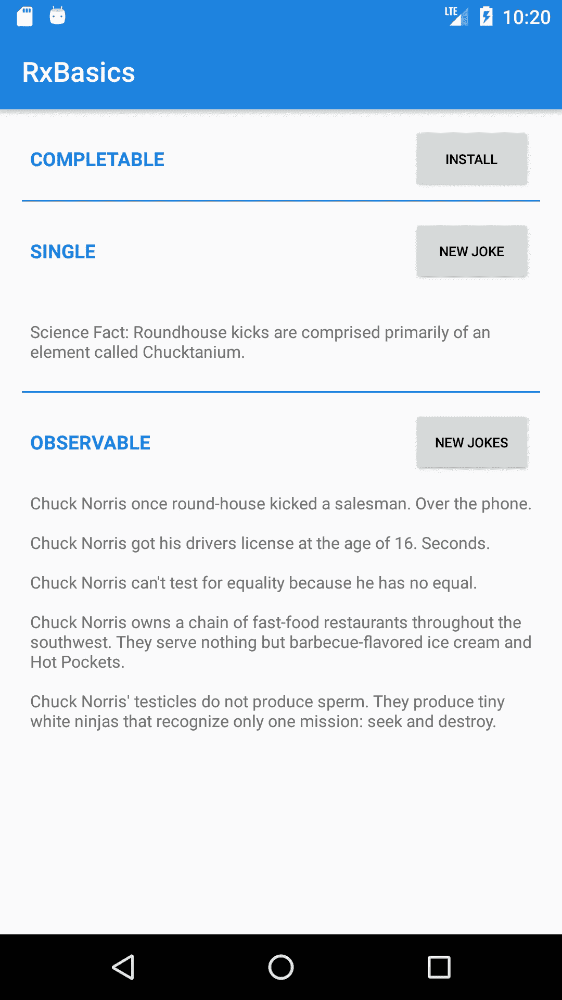

# Mencoba Implementasi RxJava pada Aplikasi Android

> 原文：<https://medium.easyread.co/mencoba-implementasi-rxjava-pada-aplikasi-android-f606a195b7f1?source=collection_archive---------4----------------------->

Reactive Programming with RxJava

Jika kalian mencari referensi bagaimana cara memulai membuat aplikasi sederhana dengan RxJava, mungkin disinilah tempatnya hehe :D

Beberapa waktu yang lalu, saya sendiri kesulitan untuk memahami tentang topik Rx ini. Beberapa kali saya mengunjungi artikel luar yang memang dalam penyampaiannya menggunakan bahasa Inggris, yang saya sendiri masih sulit buat memahaminya, seiring berjalannya waktu, dengan terus mencoba, akhirnya menemukan jawabannya. Dan dalam kesempatan ini saya mencoba untuk menulis di *platform* yang sangat bagus ini untuk *sharing knowledge* kepada pembaca yang antusias.

Wokeh langsung saja kita bahas pelan-pelan mengenai materi kali ini.

# Apa itu Rx (Reactive Extension)?

> It is an API for asynchronous programming with observable streams.
> 
> Ini adalah API untuk pemrograman asynchronous dengan stream yang dapat diamati.

Saya ingin menggambarkan cara kerja Rx dengan ilustrasi *roller coaster* dengan kelereng dibawah ini. Rx memungkinkan untuk mengubah arah rel dan jenis kelereng, warna, bentuk, dan lain-lain. Kita dapat mengamati garis *finish* dari *roller coaster* ini dan menangkap kelereng.

Kita dapat menggunakannya dalam banyak bahasa seperti Python, Kotlin, Swift, Java, JS, PHP, dan sejenisnya. Karena saya adalah pengembang Android jadi saya memilih RxJava & Kotlin. Tapi mau dengan bahasa pemrograman apa pun, prinsipnya masih tetap sama.

## ***Mengapa kita menggunakan Rx?***

Untuk kode yang kuat, mudah dibaca, dan minimal kode yang ditulis.

## **Kapan kita menggunakan Rx?**

Setiap kali kita ingin melakukan operasi *asynchronous* .

# Base Reactive Interfaces

Sebelum kita memulai pembuatan aplikasi, alangkah baiknya hal pertama yang harus kita mengerti konsepnya adalah tentang *Rx base reactive types* atau tipe dasar yang ada didalam Rx.

> Rx base reactive types are Observable, Single, Completable, and Maybe.
> 
> Tipe reaktif dasar Rx yaitu Observable, Single, Completable, dan Maybe.

Keempat tipe dasar diatas bisa berasimilasi dengan *roller coaster* dan emisi (pancaran) ke kelereng.

*   **Completable** , tidak memancarkan elemen, hanya memberitahu hal, yaitu “ *Saya sudah menyelesaikan pekerjaan* ”.
*   **Single** , memancarkan satu elemen saja.
*   **Observable** , dapat memancarkan beberapa elemen.
*   **Maybe** , penyatuan atau penggabungan antara **Single** dan **Completable** . Memancarkan satu atau tidak ada elemen.

Catatan:
**Sejak Rx 2, tipe reaktif tidak dapat menerima nilai *null* . Ini juga berarti bahwa mereka tidak akan pernah memancarkan nilai *null* atau kosong.**

# Hello World

Mari membangun HelloWorld sederhana menggunakan Rx. Kita membutuhkan 2 hal untuk membuatnya berfungsi :

*   **Observable** yang akan memancarkan nilai String “HelloWorld”.
*   **Observer** yang akan berlangganan emisi ke **Observable** .

Untuk membuat *instance* **Observable** , pada dasarnya kita menggunakan operator **just** . Ini mengubah item menjadi yang dapat diobservasi oleh yang memancarkan item itu. Hasil nilainya adalah String “Hello world” tunggal, sehingga sumber **Observable** akan menjadi **Single** .

Sekarang setelah obyek Observable telah dibuat, kita hanya perlu berlangganan (subscribe) ke emisinya.

Selain itu, kita dapat memilih *thread* yang akan mengambil tanggung jawab berlangganan/ *subscription* , jadi pada dasarnya kita memilih *thread* non-UI. Kemudian ketika **Observable** kita memancarkan sebuah hasil nilai, kita akan **Observe** /mengamati nilai pada thread utama/ *main thread* untuk memperbarui UI/tampilan.

Contoh diatas hanya konsep dasarnya saja karena tidak diperlukan tugas *Asynchronous* didalamnya untuk menghasilkan nilai “Hello World”. Sekarang anda sudah memiliki konsep dasar dari Rx. Sekarang mari kita coba membuat contoh yang lebih rumit.

Saya telah mencoba membuat contoh aplikasi Android sederhana untuk mengilustrasikan dari tipe reaktif dasar ( **Completable** , **Single** , dan **Observable** ). Dibawah ini adalah repositori Github yang bisa kalian pelajari. Saya mengimplementasikan *Activity Lifecycle* dan *ViewModel* dengan *LiveData* .

 [## mahesaiqbal/RxBasics

### Learning base reactive interface on RxJava. Contribute to mahesaiqbal/RxBasics development by creating an account on…

github.com](https://github.com/mahesaiqbal/RxBasics.git) 

# Completable

Kali ini, kita tidak akan peduli dengan hasil task/tugas. Yang penting adalah bahwa job/pekerjaan kita berhasil (atau tidak). Contoh paling sederhana yang saya temukan untuk menggambarkan **Completable** adalah mensimulasikan *installation* /pemasangan sesuatu (tidak peduli apa). Jadi, mari kita coba untuk simulasikan *installation* /pemasangan yang membutuhkan waktu 3 detik.

Keren dan sesimple itu kan? Hmm saya tahu anda ingin mencoba melakukan hal-hal yang lebih menarik bukan? Jadi ada contoh dimana kita harus menangani tugas asynchronous menggunakan [API publik](http://api.icndb.com/jokes/random) yang akan menghasilkan data lelucon secara acak. Mari kita coba bagaimana Rx dapat menangani tugas ini.

# API Call with Rx

Kita akan coba membahas bagaimana cara memanggil data dari Restful API di Android. Jika anda tidak sabar dengan performa Rx, lewati saja! ( [Klik link disini](http://api.icndb.com/jokes/random) )

File diatas telah menghasilkan data *JSON* yang dapat diparsing. Mari buat kelas **Joke** dan dapatkan datanya. Berikut cara dasar pemanggilan *URL* dengan *Retrofit2* :

# Single

Untuk API Call yang sudah dibuat, sekarang mari kita buat dan *subscribe* /berlangganan **Single < Joke >** . Perhatikan pada file **JokeApiService.kt** , bahwa fungsi `**randomJoke()**` mengembalikan **Single < JokeApiResponse >** . Kita menggunakan [map](http://reactivex.io/documentation/operators/map.html) operator untuk mengubahnya menjadi **Single < Joke >** .

Mengapa kita tidak menambahkan **loader** untuk menyorot eksekusi latar belakang/ *background* ? Metode `**doOnSubscribe**` dan `**doFinally**` dapat digunakan untuk memanggil suatu tindakan tertentu sebelum *subscription* dan setelah `**onSuccess**` atau `**onError**` .

Keren bukan? Sekarang waktunya kita belajar **Observable** .

# Observable

Untuk berurusan dengan pancaran **Observable** , saya sarankan untuk menggunakan kembali contoh sebelumnya tetapi kali ini kita bisa meminta beberapa lelucon acak dalam satu fluks (aliran). Kita konversikan **Single** sebelumnya menjadi **Observable** dengan `**toObservable()**` . Kemudian, sekarang kita memiliki metode “multi-elemen”, metode **repeat** (n) akan membantu. “ *Ini mengembalikan* ***Observable*** *yang mengulang urutan item yang dipancarkan oleh sumber ObservableSource paling banyak {n} kali.* ”

Apa yang berbeda sekarang? Data yang dipancarkan terdiri dari 3 lelucon. Dan dengan *subscribe* pada sebuah **Observable** , setiap kali ia memancarkan hasil, metode **onNext** dipanggil dengan itu sebagai **Joke** .

Selamat! Anda sudah membaca artikel ini sampai akhir. Good luck!

Happy Reading!

 [## mahesaiqbal/RxBasics

### Learning base reactive interface on RxJava. Contribute to mahesaiqbal/RxBasics development by creating an account on…

github.com](https://github.com/mahesaiqbal/RxBasics.git) 

## Referensi

 [## Android — Jokes REST API call with Rx Java

### If you search a way to start learning Rx ? This article is for you !

medium.com](https://medium.com/@nicolas.duponchel/rx-java-for-beginners-8b7c1e7bfc44) 

*Artikel ini di tulis oleh* [*Mahesa Iqbal Ridwansyah*](https://medium.com/u/423a2702de9a?source=post_page-----f606a195b7f1--------------------------------) *beliau sering menulis artikel mengenai Software Engineering dan Programming. Follow profilnya untuk mendapatkan update-an terbaru artikel-artikel beliau.*

*Jika anda merasa artikel ini menarik dan bermanfaat, bagikan ke lingkaran pertemanan anda, agar mereka dapat membaca artikel ini.*