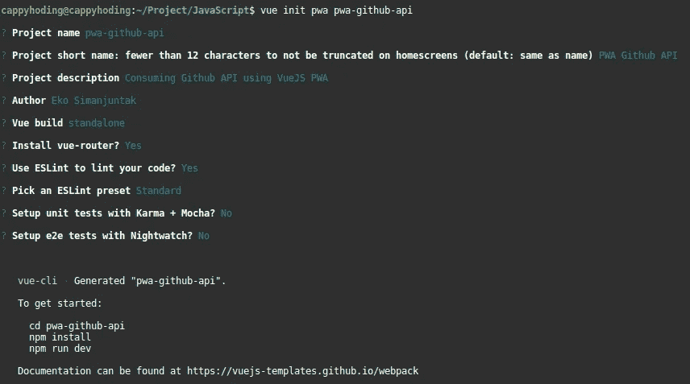
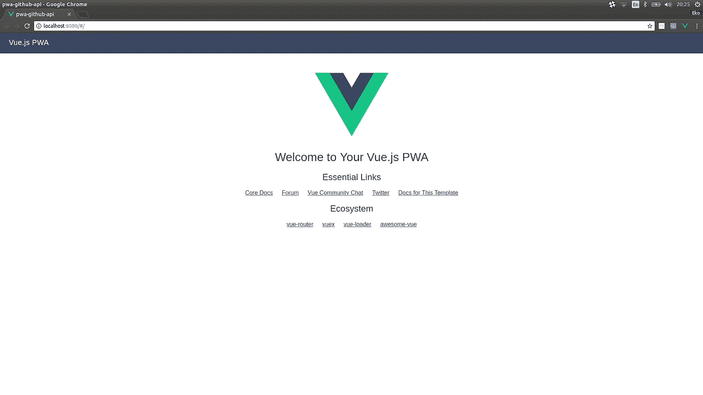
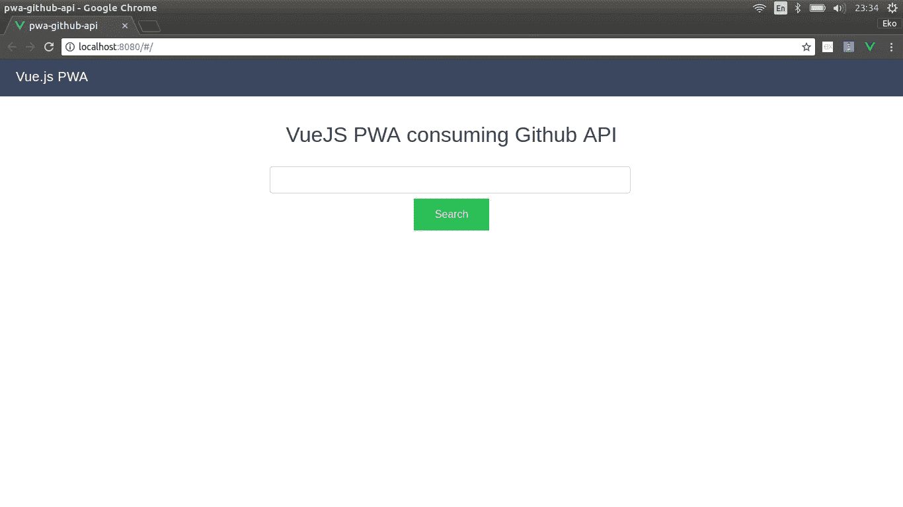
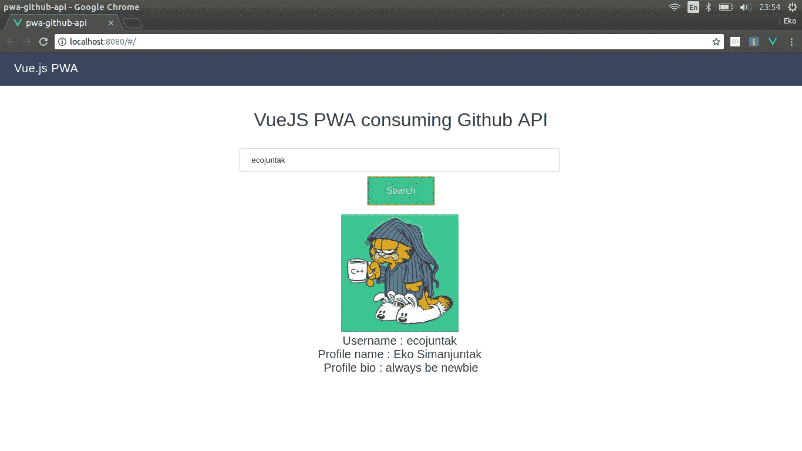
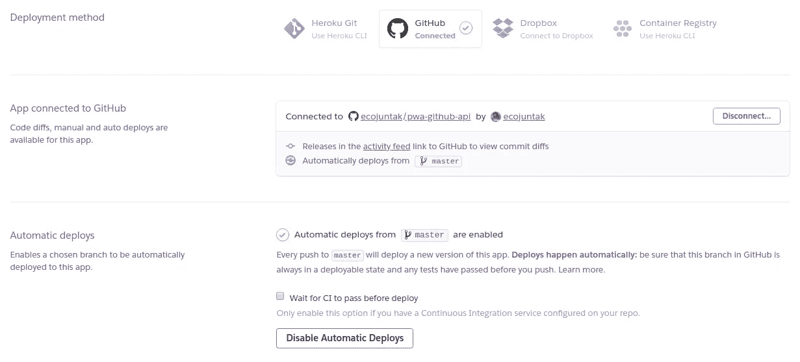
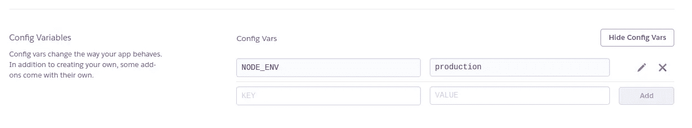
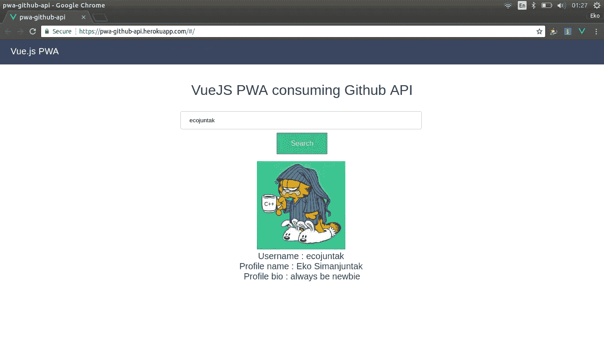
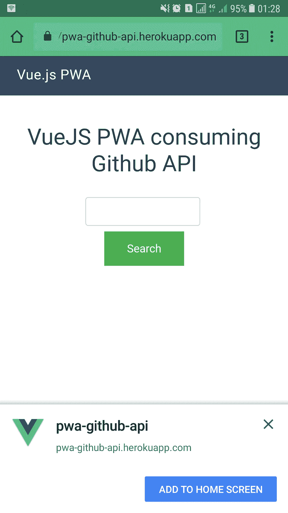
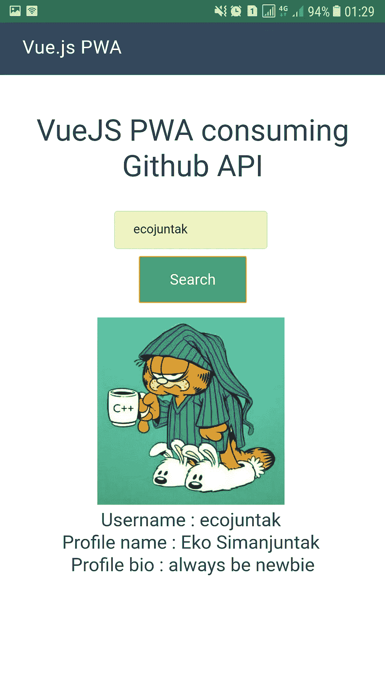

# Mencoba PWA dengan Vue JS dan GitHub API

> 原文：<https://medium.easyread.co/mencoba-pwa-dengan-vue-js-dan-github-api-74b5d815c3bb?source=collection_archive---------0----------------------->


PWA image taken from Google Images

Saat ini saya sedang mengerjakan tugas kuliah, kebetulan untuk tugas ini saya diminta memakai PWA. Awalnya saya ragu, tapi ya saya coba saja. *Lagian* belajar hal baru itu merupakan kegiatan seru. *Nah* , jadi sekarang saya mau mencoba membagikan apa yang saya dapat selama mengeksplorasi tentang PWA.

## 1 . *Creating* PWA dengan Vue JS

Tahapan pembuatan proyek baru PWA dengan VueJS terbilang mudah. Untuk yang belum meng- *install* **vue-cli** , anda dapat menjalankan *command line* berikut pada *console* *favorite* anda.

```
**npm install -g vue-cli**
```

Setelah itu, untuk membuat *project* baru lanjutkan dengan menjalankan *command* *line* berikut

```
**vue init pwa pwa-github-api**
```

Setelah menjalankan *command line* diatas, maka pada *console* yang kita pakai akan muncul beberapa pertanyaan untuk inisialisasi *project* anda.



Lalu jalankan *command line* seperti yang diberikan oleh *console* anda

```
**cd pwa-github-api
npm install
npm run dev**
```

Jika semua *dependency* -nya sudah selesai diunduh dan sudah di *run* , cobalah akses **localhost:8080** untuk membuka aplikasinya. Maka kira-kira tampilan aplikasi pertama kali akan muncul seperti pada gambar ini.



Tampilan Aplikasi pertama kali

## 2\. Creating Service

Untuk bisa menggunakan **Github API** , pada tutorial ini saya akan menggunakan [**Axois**](https://github.com/axios/axios) yaitu *library javascript* yang bertugas menangani *http request* . Untuk menggunakan Axios, pertama sekali tambahkan Axios pada projek yang anda buat sebelumnya.

```
**npm install -s axios**
```

Lalu, pada folder **/scr** , tambahkan folder **/services** sebagai tempat penyimpanan file yang berhubungan dengan *service.* Lalu tambahkan file **Api.js** sebagai *base* dari setiap *service* kita.

Lalu, pada folder yang sama tambahkan juga file **GithubService.js** yaitu file yang akan mendaftarkan *endpoint* Github yang akan kita gunakan tadi.

Pada GithubService.js, terdapat satu fungsi yaitu **searchUser** yang akan kita panggil nantinya dari *component-* nya. Fungsi searchUser akan menerima satu parameter, yaitu berupa *object* yang akan menampung username Github yang akan kita cari.

## 3\. Creating Search Page and Showing the Result

Untuk tampilannya, saya akan menggunakan *component* bawaan yang sudah ada, tapi saya akan mengganti nama *component* **Hello.vue** menjadi **Home.vue** . Untuk masalah penggantian nama itu opsional saja, akan tetapi lebih baik menggunakan nama yang sesuai untuk setiap *class* nya. Kalau anda juga mengganti nama filenya, jangan lupa juga untuk memperbaiki file index.js pada folder **/router** . Berikut adalah file index.js saya setelah mengganti nama component **Hello.vue** menjadi **Home.vue** .

Kemudian, pada Home.vue, saya membuat satu *input field* sebagai tempat menginput username Github yang akan dicari. Kemudian ada satu tombol pencarian yang akan men- *trigger* proses pemanggilan API-nya. Berikut adalah file Home.vue saya.

Berikut adalah tampilan *home* -nya.



Pada *component* Home.vue *,* saya membuat satu fungsi yaitu **searchUserData** . Pada fungsi inilah kita akan memanggil API menggunakan *service* yang sudah kita buat sebelumnya. Pada fungsi searchUserData saya menggunakan **Async/Await** , yaitu cara kita mensederhanakan *code* yang memungkinkan terjadi pemanggilan fungsi secara *asynchronous* . *Keyword await* akan menyebabkan fungsi diberhentikan sementara sampai menerima suatu kembalian berupa *Promise.* Jika belum paham dengan konsep *asynchronous* pada JavaScript, anda boleh membaca [artikel](https://medium.com/coderupa/panduan-komplit-asynchronous-programming-pada-javascript-part-1-fca22279c056) dari saudara [Sastra Panca Nababan](https://medium.com/u/bb0d08550ebe?source=post_page-----74b5d815c3bb--------------------------------)  , yang menurut saya penjelasannya mudah dimengerti.

Kemudian data hasil kembalian dari pemanggilan API akan kita tampilkan pada *page* kita. Data yang dikembalikan dari API adalah berbentuk JSON. Berikut adalah contoh kembaliannya.

Dari data **JSON** diatas, kita bisa mendapat banyak informasi dan bebas menggunakannya. Tapi untuk mempersingkat tutorial ini, saya hanya akan menggunakan `**avatar_url, login, name,**` dan `**bio**` *.* Data inilah yang akan saya tampilkan. Berikut adalah hasil dari percobaan kita sejauh ini.



## 4\. Deploying to Serve

Sejauh ini masih oke, tetapi berbicara mengenai PWA, bukan PWA namanya kalau kita tidak mencobanya pada perangkat *mobile* . Sebelum kita lakukan ujicoba di *smartphone,* kita harus terlebih dahulu men- *deploy* hasil pekerjaan kita. Pada tutorial ini saya akan menggunakan [**Heroku**](https://www.heroku.com) untuk tempat saya men- *deploy* aplikasi PWA tersebut.

Saya akan menggunakan Github sebagai sumber *code* saya, jadi saya harus membuat *repository* baru di Github. Sebelum memasukan semua *code* kita ke *respository* , ada beberapa hal yang harus kita tambahkan diprojek kita.

1.  Pertama, kita harus **men- *generate code*** yang ***ready to production*** *.* Untuk men- *generate code-* nya, kita dapat menjalankan *command line* berikut

```
**npm run build**
```

Ketika *command* selesai dijalankan, maka folder **/dist** akan muncul pada projek kita. Folder inilah yang akan menyimpan semua *code* yang akan digunakan pada *production* nantinya. Pada folder /dist terdapat dua file penting yaitu **manifest.json** dan **service-worker.js** . File service-worker.js adalah file yang akan bekerja untuk meng- *cache* file-file kita nantinya. File-file tersebut perlu di *cache* supaya browser tidak perlu melakukan *request* ulang ke server terlalu sering dan ini merupakan ***basic knowledge*** dari PWA yaitu dengan melakukan *caching* terhapat file-file *static* pembentuk [application shell](https://developers.google.com/web/fundamentals/architecture/app-shell) kita.

2\. Kedua, saya menambahkan satu file yaitu server.js pada *root project* saya. File inilah yang nantinya akan dieksekusi pertama sekali ketika server dijalankan. File ini juga akan menjalankan *code* yang ada pada folder /dist yang sudah di- *generate* tadi. Berikut adalah file server.js saya.

Kemudian saya juga menambahkan beberapa *dependency* pada file **package.json** saya. Dependency yang saya tambahkan dibutuhkan untuk menjalankan server.js yang sudah dibuat sebelumnya. Pada package.json juga saya mengubah pada bagian *scripts* yaitu pada *start.* Ketika script *start* dieksekusi, saya akan menjalankan server.js yang sudah buat sebelumnya. Berikut adalah perubahan pada package.json saya.

```
"scripts": {
    "dev": "node build/dev-server.js",
    **"start": "node server.js",**
    "build": "node build/build.js",
    "lint": "eslint --ext .js,.vue src"
  },
  "dependencies": {
    "axios": "^0.18.0",
    "vue": "^2.5.2",
    "vue-router": "^3.0.1",
    **"express": "~4.9.8",
    "serve-static": "^1.10.0"**
  },
```

Setelah beres dengan *code-* nya, sekarang masukkan semua *code* yang ada ke *repository* anda.

Pekerjaan berikutnya adalah membuat aplikasi baru kita di Heroku. Pertama kita masuk ke *dashboard* Heroku. Kemudian buat aplikasi baru. Setelah aplikasi barunya selesai, pilih tab Deploy pada *dashboard* dan kita akan mengkonfigurasi sumber *code* yang akan dikenali oleh Heroku App-nya.



Setelah selesai, pada bagian bawah terdapat *button* **Deploy Branch.** Klik pada *button* tersebut untuk men-deploy aplikasi kita. Lalu pada tab Setting kita akan menambahkan environment variable yaitu **NODE_ENV = production.**



Kemudian coba jalankan aplikasi anda melalui alat URL yang diberikan pada Heroku. Berikut adalah tampilan setelah kita selesai *deploy.*



Kemudian saya mencoba mengakses URL-nya dari *smartphone* saya dan hasilnya…



Ketika URL-nya diakses dari *browser smartphone,* maka akan muncul permintaan untuk menambahkan aplikasinya pada Home Menu *smartphone* kita. Setelah memilih **Add** **To Home Screen,** maka secara otomatis *icon* dari aplikasi kita akan muncul dilayar *smartphone* .

Sekian hasil eksplorasi saya mengenai PWA. Jika ada yang kurang dimengerti dapat ditanyakan. Kalau ada yang salah juga bisa disampaikan supaya dapat diperbaiki kedepannya. Untuk reponya ada [**disini**](https://github.com/ecojuntak/pwa-github-api) dan hasil *deploy* -nya ada [**disini**](https://pwa-github-api.herokuapp.com/#/) . Semoga bermanfaat.

Cappy Hoding! 😄

*Artikel ini di tulis oleh* [*Eko Simanjuntak*](https://medium.com/u/efc3b4ea41af?source=post_page-----74b5d815c3bb--------------------------------) *beliau sering mengikuti berbagai kompetisi Competitive Programming. Follow profilnya untuk mendapatkan update-an terbaru artikel-artikel beliau.*

*Jika anda merasa artikel ini menarik dan bermanfaat, bagikan ke lingkaran pertemanan anda, agar mereka dapat membaca artikel ini.
Atau jika anda tertarik untuk membagikan cerita anda pada publikasi ini, anda boleh mengirimkan cerita anda ataupun mengikuti langkah-langkah yang ada* [***disini***](https://medium.com/easyread/about-easyread-74b20960e180) *.*