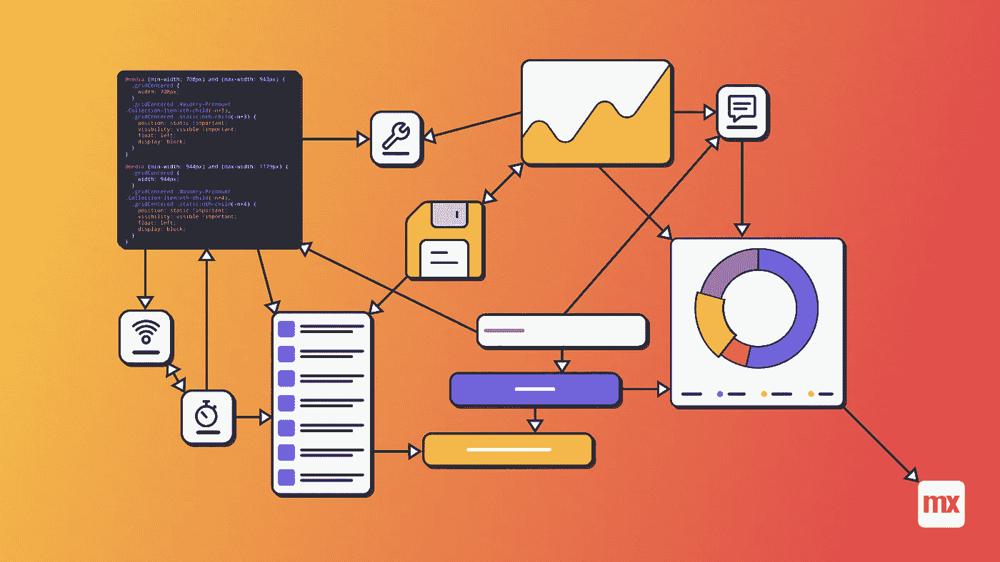
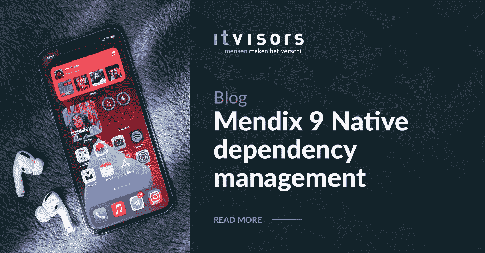

# Mendix 9 原生依赖管理

> 原文：<https://medium.com/mendix/mendix-9-native-dependency-management-2de504ae927c?source=collection_archive---------0----------------------->



# Mendix Studio Pro 9 为我们带来了许多伟大的新功能，随着正式发布的临近，公共测试版已经提供了一些非常好的项目，值得更多的关注。

这篇文章中我想强调的是 [**原生依赖管理**](https://docs.mendix.com/apidocs-mxsdk/apidocs/native-dependencies) 。



Mendix 8 为我们带来了[原生应用](https://docs.mendix.com/refguide/native-mobile)以及将它们构建为真正的 Appstore 应用的选项。但是，有些库需要与设备集成。这可能导致开发人员手动准备 APK 或 IPA 文件:配置本机依赖关系。并在每次更新用于创建 Appstore 应用程序原生模板时恢复配置。

比如我的[原生文件文档模块](https://marketplace.mendix.com/link/component/114252)就有这样的依赖关系，允许我们在设备上查看文件文档。

Mendix 9 消除了这种负担，它允许模块和小部件开发者指定需要哪些本机模块。通过从市场下载内容，本地应用构建者可以获得这些信息。现在，您可以创建应用程序并利用原生构建器中的新功能，而无需担心这些依赖关系。


[https://bit.ly/MXW21](https://bit.ly/MXW21)

对于在你的应用程序中使用现有的内容，这就是全部，技术细节会为你处理。对于那些希望在其应用程序或市场内容中包含本地库的人，让我们来看看这个功能背后的魔力。

Mendix 在关于[声明本机依赖关系](https://docs.mendix.com/apidocs-mxsdk/apidocs/native-dependencies)的文档页中详细描述了它，我将在这里用我的模块作为例子来解释它。

为了让构建器知道您的应用程序需要本地库才能工作，您需要创建一个 JSON 文件。对于可插拔的小部件，它必须与您的小部件的 XML 文件同名，对于 JavaScript 操作，它需要与 JS 操作同名，两种情况下都带有. json 扩展名。对于原生文件文档模块，我选择了`IsNativeFileSystemAvailable` JavaScript 动作，所以我创建了`IsNativeFileSystemAvailable.json`，内容如下:

```
{
    "nativeDependencies": {
        "react-native-file-viewer": "2.1.4",
        "react-native-fs": "2.16.6"
    }
}
```

请注意，您必须使用一个确切的版本，所以版本号中没有^或类似的。

当构建器检测到所需依赖关系中的冲突时，它会弹出一条消息。

注意，你可能已经在你的模块中包含了 JSON 文件，Mendix 8.18.x 没有选择它，但是至少你不需要仅仅为了添加 JSON 文件而维护你的模块的单独版本！

这个特性使得将优秀的 React 原生库引入 Mendix 变得更加容易，而没有保持构建运行的麻烦。只需将小部件或模块添加到您的项目中，就可以确保一切正常工作。开发所需的唯一事情是创建一个开发应用程序，允许开发团队轻松访问本机功能。

## 阅读更多

[](https://bit.ly/MXW21) [## Mendix World 2021 |召集您的应用开发团队 2021 年 9 月 7 日至 9 日

### 好像你需要说服…在一个全球制造商社区，他们想通过探索什么来相互学习…

bit.ly](https://bit.ly/MXW21) 

*来自发布者-*

*如果你喜欢这篇文章，你可以在我们的* [*媒体页面*](https://medium.com/mendix) *或我们自己的* [*社区博客网站*](https://developers.mendix.com/community-blog/) *找到更多类似的文章。*

*希望入门的创客，可以注册一个* [*免费账号*](https://signup.mendix.com/link/signup/?source=direct) *，通过我们的* [*学苑*](https://academy.mendix.com/link/home) *即时获取学习。*

有兴趣更多地参与我们的社区吗？你可以加入我们的 [*Slack 社区频道*](https://join.slack.com/t/mendixcommunity/shared_invite/zt-hwhwkcxu-~59ywyjqHlUHXmrw5heqpQ) *或者想更多参与的人，看看加入我们的* [*遇见 ups*](https://developers.mendix.com/meetups/#meetupsNearYou) *。*