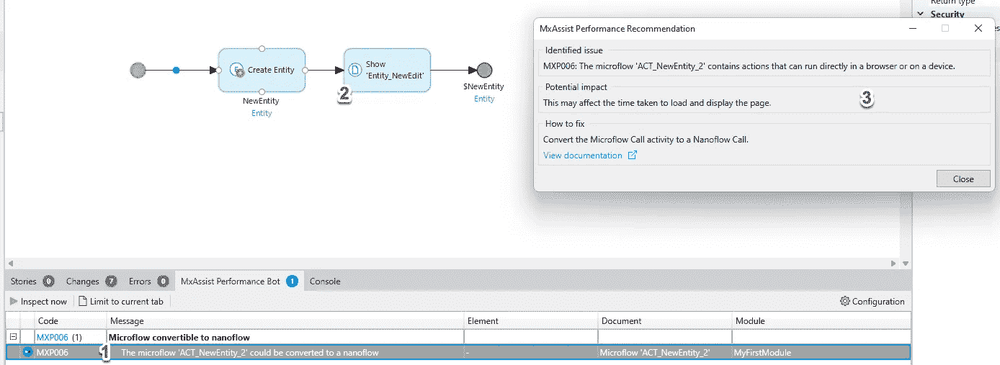

# mendix AI Assist——您的友好同行程序员

> 原文：<https://medium.com/mendix/mendix-ai-assistant-what-makers-should-know-9d3a413ba5d6?source=collection_archive---------4----------------------->

# 学习任何新技术总是具有挑战性。如果你可以在经过训练的人工智能的正确指导下学习，那不是很好吗？用机器人进行对等编程会更有趣，并减少学习过程中的一些障碍和压力。和我一起在这个博客中分享我的旅程(使用 Mendix 9.8.1)。

Mendix 为我们提供了两个合作开发者机器人，分别是 **MxAssist 逻辑机器人**和 **MxAssist 性能机器人。**

MxAssist 逻辑机器人专注于微流，还不能用于纳流。MxAssist Performance Bot 专注于整个应用程序来检查反模式，以帮助制造商避免生产中的关键问题。让我们通过一个简单的工作流例子来深入探讨这个问题。

## **MxAssist 逻辑机器人和 MxAssist 性能机器人**

**提交对象更改的循环中出现错误。**

制造者可以随时禁用逻辑机器人。当它关闭时，逻辑机器人指示器(蓝色圆圈)将不会出现在微流程线上。

当它设置为 on 时，你可以将鼠标放在蓝色圆圈上，机器人会给你几个建议，关于下一步该做什么。

随着您在流中添加更多的活动，它将继续分析并给我们一个新的推荐列表。

此时，您可以决定通过关联检索另一个对象。

通过关联检索对象列表后，机器人可能会建议一个循环动作。

在这个例子中，我试图在一个循环中提交(这是一个众所周知的坏习惯)。通过一个新的循环，我尝试提交 IteratorEntity1 的对象更改。

接下来，我运行了性能机器人检查。在这个场景中，在运行检查之后，机器人发现了这一点并提出了建议。

> 您应该知道在您的项目中有一个错误，将会阻止您运行检查，所以尝试修复所有的错误。

双击列表中的推荐，会跳转到有问题的微流程。带有推荐的动作上方会有一个蓝色的圆圈，你可以点击它查看更多详情。

## **MxAssist 性能机器人**

**索引丢失**

有一个朋友告诉你你的应用程序的弱点在哪里是很好的，一个很好的例子是没有索引的数据网格性能。

不要担心，性能机器人会帮助你。在这个场景中，我有一个将在排序栏中使用属性的数据网格。Performance bot 不仅为我们推荐，而且还为我们提供了轻松“添加索引”的选项

## **MxAssist 性能机器人**

**当实体不持久时，转换为纳流。**

当您有一个包含非持久实体的域模型时。用 nanoflow 来改变页面的调用方式可能更好。

例如，我通过导航菜单中的微流调用一个页面。

使用这个微流

对于非持久实体

Performance Bot 将检测到这一点，并建议将微流改为纳流。

## 最后的想法

总的来说，我发现机器人非常有用。由于我是一名经验丰富的 Mendix 开发人员，我不会太频繁地依赖逻辑机器人，因为我通常知道我想在微流中做什么——但我认为它是一个帮助平台新手学习的好工具。性能机器人是一个很好的工具来检查你的应用程序的性能，当处理大量的数据列表时，我们经常会忘记像索引这样的事情，这会极大地影响性能，这是一个很好的总括来确保疏忽不会导致返工。

## 阅读更多

 [## MxAssist Performance Bot-Studio Pro 9 指南| Mendix 文档

### MxAssist Performance Bot 是一款智能虚拟合作开发机器人，可帮助您提高应用程序的性能…

docs.mendix.com](https://docs.mendix.com/refguide/mx-assist-performance-bot)  [## MxAssist Logic Bot - Studio Pro 9 指南| Mendix 文档

### MxAssist 逻辑机器人是一个人工智能驱动的虚拟合作开发机器人，帮助您建模和配置您的应用程序…

docs.mendix.com](https://docs.mendix.com/refguide/mx-assist-logic-bot)  [## 实施 Mendix 最佳开发实践- Studio Pro 9 操作指南| Mendix 文档

### 在开发您的应用程序时，本文档可作为采用一致的命名和建模约定的参考

docs.mendix.com](https://docs.mendix.com/howto/general/dev-best-practices) 

*来自发布者-*

*如果你喜欢这篇文章，你可以在我们的* [*中页*](https://medium.com/mendix) *找到更多喜欢的。对于精彩的视频和直播会话，您可以前往*[*MxLive*](https://www.mendix.com/live/)*或我们的社区*[*Youtube PAG*](https://www.youtube.com/c/MendixCommunity/community)*e .*

*希望入门的创客，可以注册一个* [*免费账号*](https://signup.mendix.com/link/signup/?source=direct) *，通过我们的* [*学苑*](https://academy.mendix.com/link/home) *获得即时学习。*

有兴趣加入我们的社区吗？你可以加入我们的 [*Slack 社区频道*](https://join.slack.com/t/mendixcommunity/shared_invite/zt-hwhwkcxu-~59ywyjqHlUHXmrw5heqpQ) *或者那些想要更多参与的人，看看加入我们的*[*Meetups*](https://developers.mendix.com/meetups/#meetupsNearYou)*。*