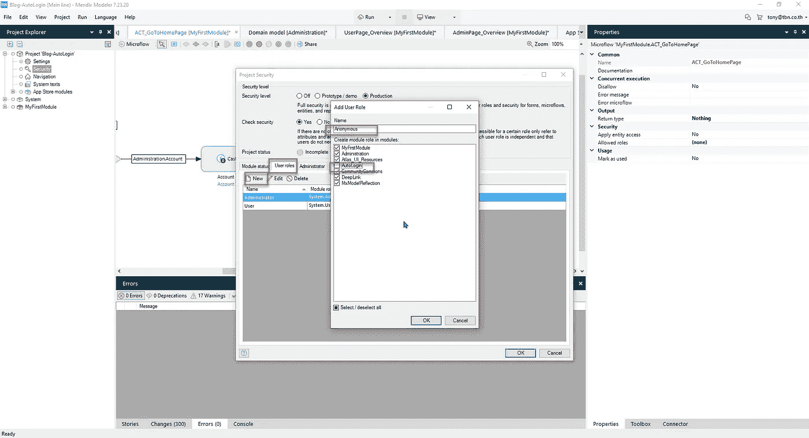

# 使用深度链接和 Mendix 创建自动登录

> 原文：<https://medium.com/mendix/mendix-autologin-with-deeplink-1c8fa92873a8?source=collection_archive---------0----------------------->

# 创建自动登录功能可能是一个相当大的挑战。一个旨在使审批过程更顺畅、更高效的功能可能会很快让开发人员陷入困境。从常规的登录功能，到甚至不需要登录的更复杂的批准过程，如果使用正确，深度链接的功能非常强大。在这个演示中，我将向您展示我们如何使用 Mendix Marketplace 中现有的小部件和模块进行自动登录。

首先，感谢那些为{\\ F2 market place }模块做出贡献的人

*   [自动登录](https://marketplace.mendix.com/link/component/107925)
*   [JavaScript 代码片段](https://marketplace.mendix.com/link/component/43096)
*   [社区公地](https://marketplace.mendix.com/link/component/170)
*   [深度链接](https://marketplace.mendix.com/link/component/43))
*   和[模型反射](https://marketplace.mendix.com/link/component/69)

所有这些都是这个演示项目中需要的模块。话虽如此，让我们开始使用 Mendix Studio Pro 7.23.20 (LTS)。

[https://bit.ly/MXW21](https://bit.ly/MXW21)

创建一个空白项目，导入我上面提到的模块和小部件。下载 AutoLogin 模块后，它已经包含了 javascript 代码片段。

现在我们有了所有需要的模块，但也有 2 个错误。

错误只是关于弹出布局。您可以将这些页面更改为使用 Atlas 弹出布局。

那么错误就会消失。

接下来，我们可以使用项目设置下的启动后微流设置，将深度链接配置为当应用程序启动时自动启动。

此时，您还需要添加一个自动登录 deeplink 请求处理程序，其返回值为布尔值。

接下来，我们需要在应用程序的导航上设置 deeplinkhome 微流。

看看 DeepLinkHome 微流，我们应该在这里实现一些东西，告诉应用程序将特定的用户角色重定向到特定的页面。

从 myfirstmodule 中，创建一个新的微流，命名为 ACT_GoToHomePage。选择“继承分割”(浅绿色菱形)，用 currentUser 对象映射。这个 CurrentUser 是正在访问网页的用户。

添加一个“动作活动”框，选择演员对象

键入输出名称“Account”。

右键单击从当前用户到 CastObject 的红色箭头，然后选择条件值，并选择 Administration.Account

为了消除所有错误，您需要为继承分割定义另外两条路径。

从 account 实体中，我们需要创建一个用于检查帐户类型的 Enum 字段，以便路由到正确的页面。

我们制作了两个页面，分别命名为 UserPage_Overview 和 AdminPage_Overview。

只要做一个简单的标题，看看哪个页面是用于用户或管理员。

现在回到微流 ACT_GoToHomePage。我们转换一个对象帐户，并设置 AccountType 来导航到不同的页面。

在安全设置中，您可以选择生产。

仍然在安全设置中，在“用户角色”选项卡下，我们需要再添加一个角色，命名为“匿名”。自动登录模块从一开始就已经有了这个角色，所以不需要重新选择。

**匿名安全设置**

**用户安全设置**

**管理员安全设置**

**最终安全设置**

在导航菜单中，您必须按如下方式设置管理员导航，以便他们可以访问和配置项目设置。

现在将微流 ACT_GoToHome 添加到 deeplinkhome 微流中。

一切都快完成了，但是我们仍然需要一个带有电子邮件参数的 deeplink 微流。

此时，您可以保存并在本地运行。请记住，当您启用匿名访问时，这意味着您需要有一个供匿名用户登录的登录屏幕。如果您现在在本地运行，您会看到一个白屏，因为没有匿名设置的登录页面。为了解决这个问题，我们需要在 ACT_GoToHomePage 上实现一些东西。匿名和 MxAdmin 角色由 system 初始化。用户，但区别在于，一个是匿名的，而 MxAdmin 不是，它有一个 Admin 角色，Account 对象继承到 System.User。

保存并再次运行，我们可以看到在 MxAdmin 登录后将在另一个页面。

好了，到目前为止一切顺利，我们现在可以设置 deeplink 并创建测试帐户了。

**以管理员身份登录，以便您可以导航到模型反射概述，并使用 mx 反射刷新对象列表。**

然后创建一个新的 deeplink，我们将把它与我们在前面的步骤中创建的微流“ACT_AutoLoginWithEmail”连接起来。

> t**deep link 的结果是
> http://localhost:8080/link/approve？email=YourValue**

现在转到 account，创建 2 个新用户，使用 2 个用户角色来测试自动登录。

所以我有 2 个账户:tony1(用户)和 tony2(管理员)。

如果我通过格式为[http://localhost:8080/link/approve?email=tony1@tbn.co.th](http://localhost:8080/link/approve?email=tony1@tbn.co.th)的深度链接。它应该导航到欢迎用户页面。

我们开始吧

[http://localhost:8080/link/approve?email=tony2@tbn.co.th](http://localhost:8080/link/approve?email=tony2@tbn.co.th)

你可能需要知道的其他事情:这个自动登录功能在 Mendix 8 中也可以工作，但是一些用户将会面临下面的错误。

要解决此问题，请确保您的项目至少升级到 8.18.4 以解决该问题。升级后，您仍会看到如下所示的错误消息。

进入 Mendix Marketplace，搜索“ [javascript 片段](https://marketplace.mendix.com/link/component/43096)”下载 1.3.0 版本，放在项目的 widget 文件夹中。

复制和覆盖后，请再次同步项目，按下 F4 或进入 Studio Pro 左上角菜单中的“项目”,然后单击“同步项目目录”。

您将看到最后一个错误，这是由小部件定义的更改引起的。

右键单击小组件并选择“更新所有小组件”。

再次本地运行并测试。

应该有解决，用户应该被引导到正确的页面，当他们使用深层链接登录。

这是版本 7 和版本 8 项目的 github repo 链接。

 [## qntbkk/BlogAutoLogin

### 在 GitHub 上创建一个帐户，为 qntbkk/blogaotologin 的发展做出贡献。

github.com](https://github.com/qntbkk/BlogAutoLogin.git) 

祝你好运，感谢你的阅读！

## 阅读更多

 [## Mendix World 2021 |召集您的应用开发团队 2021 年 9 月 7 日至 9 日

### 好像你需要说服…在一个全球制造商社区，他们想通过探索什么来相互学习…

bit.ly](https://bit.ly/MXW21) 

*来自发布者-*

*如果你喜欢这篇文章，你可以在我们的* [*媒体页面*](https://medium.com/mendix) *或我们自己的* [*社区博客网站*](https://developers.mendix.com/community-blog/) *找到更多类似的文章。*

*希望入门的创客，可以注册一个* [*免费账号*](https://signup.mendix.com/link/signup/?source=direct) *，通过我们的* [*学苑*](https://academy.mendix.com/link/home) *即时获取学习。*

有兴趣更多地参与我们的社区吗？你可以加入我们的 [*Slack 社区频道*](https://join.slack.com/t/mendixcommunity/shared_invite/zt-hwhwkcxu-~59ywyjqHlUHXmrw5heqpQ) *或者想更多参与的人，看看加入我们的* [*遇见 ups*](https://developers.mendix.com/meetups/#meetupsNearYou) *。*