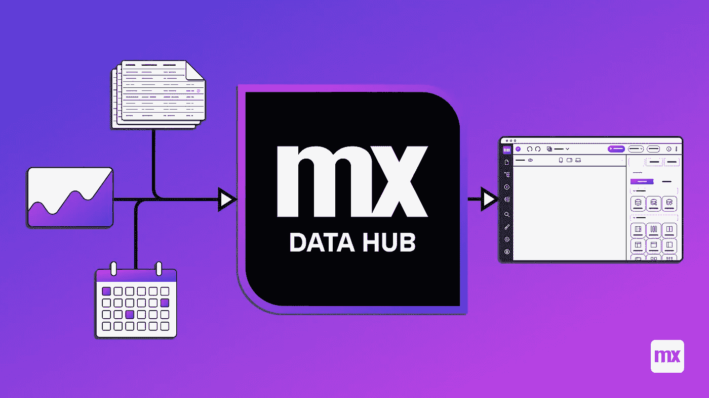
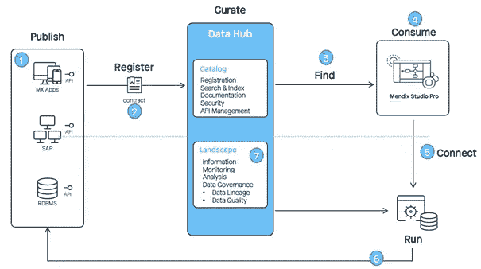
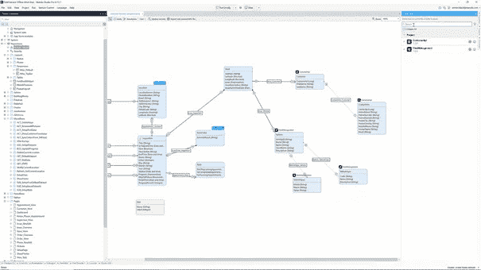
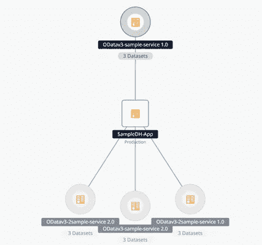
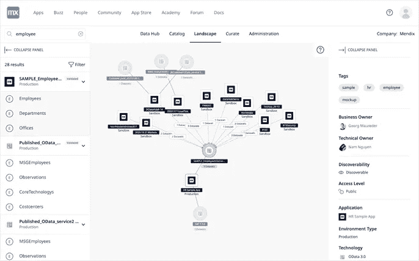

# Mendix 数据中心是整合业务数据的催化剂

> 原文：<https://medium.com/mendix/mendix-data-hub-as-a-catalyst-for-integrating-your-business-data-213608ba43ec?source=collection_archive---------5----------------------->

# **通过数据中心轻松分享您的数据**

自从[宣布](https://www.mendix.com/blog/data-hub-the-low-code-approach-to-data-integration/)Mendix 数据中心以来，Mendix 使得在你的 Mendix 应用程序之间共享数据变得更加容易。虽然第一个版本只支持读取数据，但这已经是在你的 Mendix 环境中以比我们习惯的更简单的方式共享数据的一个重要步骤。也就是说，当前功能集的优势仅适用于 Mendix 应用程序之间的集成。如果有 OData 支持，与其他外部系统的集成将变得快速而简单。

在我们深入细节之前，最好提一下[其他 Mendix](https://www.mansystems.com/blog/mendix-datahub-integrate-at-full-speed?gclid=Cj0KCQjwutaCBhDfARIsAJHWnHu8wP48wzM6AfbwZ0ul6JOnNZEP1r9VmovWGbPG5NR-OwK-toYOs8oaAsCPEALw_wcB) 合作伙伴已经[在 Mendix 数据中心发布了](https://www.timeseries.com/unboxing-the-mendix-data-hub/)文章。有官方的 [Mendix 数据中心文档](https://docs.mendix.com/data-hub/data-hub-catalog/register#1-introduction)，Mendix 还开发了一个[学习路径](https://academy.mendix.com/link/path/111/Share-Data-Between-Apps-Using-the-Data-Hub-Catalog)，让你快速了解如何使用数据中心。当然，在这一领域，Mendix 并不孤单。市场上有更多的数据中心，Gartner 将“数字集成中心”称为下一个大事件。如果你想了解更多，我推荐[这篇文章](https://www.mckinsey.com/business-functions/mckinsey-digital/our-insights/how-to-build-a-data-architecture-to-drive-innovation-today-and-tomorrow)。

现在，让我们来关注一下 Mendix 数据中心。Mendix Data Hub 通过专门为 Mendix 开发人员定制用户体验而与众不同。有一个与 Studio Pro 的本机集成，Mendix 自动检测您的 Mendix 应用程序中发布的服务，并在[数据目录](https://docs.mendix.com/data-hub/data-hub-catalog/)中为您提供一个很好的概览。特别是当您的组织中有许多 Mendix 应用程序时，数据目录有助于您的 DevOps 团队找到满足其业务需求的正确数据。因为需要额外的商业许可，所以需要一个完整的商业案例。

## **两大局限**

显然，Mendix 有一个很长的数据中心路线图。对于当前的产品功能，有两个主要限制:

1.您只能读取数据；尚不支持写回数据。至少不是简单的方法。在 Mendix 中，您需要依靠传统的集成方法。

2.外部系统只支持 OData，因此很难管理所有非 Mendix 应用程序和系统。除了 Mendix，西门子(Teamcenter 和 Mindsphere)和 SAP 产品已经支持 OData，只有在有 OData 支持的情况下，您才能轻松地与外部系统集成。

虽然 Mendix 社区正在等待下一组产品功能，以使其成为一个更完整的产品，但在一些用例中，Data Hub 确实在开发速度和治理方面发挥了作用。

[https://bit.ly/MXW21](https://bit.ly/MXW21)

## **即时搜索和使用数据**

在以 Mendix 应用为主的微服务架构中，组织可以真正受益于数据中心的易用性。一种常见的做法是在需要时按需检索数据，并在您的功能流程中使用它。例如，您想要使用业务数据，如地址或客户信息，这些数据在另一个应用程序中管理，并且是单一来源。您可以调用 REST 服务或使用您的中间件层来获取这些数据，但是您仍然需要在 Studio Pro 中构建几个 REST 服务。

在 Mendix 开发的人都知道做到这一点有多容易，但还是需要一些时间。你将需要其他人的帮助，并且有一些依赖，当然:每一次整合总会有一个陷阱。

这就是紫色实体的**魔力的来源；这些被称为[外部实体](https://docs.mendix.com/refguide/external-entities)。在 Studio Pro 的数据中心窗格中使用目录资源时，拖放足以将其他外部应用程序中的数据添加到您自己的应用程序中。消费者操作是自动生成，几乎不需要身份验证配置。您可以直接在这些神奇的紫色实体上开始构建页面和微流。无需担心分页、排序和检索数据。只需几分钟，您就有了一个可用的集成，在本例中，您可以轻松地使用 Mendix 应用程序中的地址或客户信息，而无需复制数据或构建特定的 REST 服务。**

## **全面了解互联应用**

另一个有用的功能是 Mendix 自动检测和管理哪些 Mendix 应用程序正在使用哪些目录资产。这在一个叫做数据中心景观的漂亮的图形特性中表现出来。来自 [Mendix 文档](https://docs.mendix.com/data-hub/data-hub-landscape/):

> 数据中心环境展示了数据中心中已注册的 OData 服务的图形视图。它提供了在数据中心目录中注册的项目的可视化视图，以及这些项目与使用它们所连接的数据集的应用程序之间的关系。

所以它提供了一个概览，以及漂亮的视觉效果。有了一个类似图形的表示层，Mendix 让它看起来真的很好用。对于集成和中间件产品来说，提供一个自动生成的集成环境概述是很常见的，但是在 Mendix 环境中，直到现在这还是不可能的。

在有数百个服务的实际实践中，给出一个清晰的概述仍然是困难和混乱的。但是，横向视图对于查看服务的哪个版本在哪里使用非常有帮助。作为一名在大型生态系统中运营的 Mendix 开发人员，了解这一点已经非常有价值，因为您将了解到:

1.应用程序之间的关系和依赖关系

2.数据集之间的互连

3.应用程序中使用的数据集的多个版本

4.数据的上下文

## **连接外界**

如果您需要与没有 OData 支持的系统和应用程序集成，该怎么办？Mendix 与合作伙伴合作，在 Mendix 数据中心的基础上提供额外服务。Mendix 的[战略合作伙伴](https://docs.mendix.com/partners/)、西门子和 SAP 都将服务与 Datahub 紧密集成，西门子通过 MindSphere 平台将 IOT 资产的商业智能引入 Data Hub，SAP 通过现成的 OData 服务为各种 SAP 解决方案提供服务。除了战略合作伙伴之外，还有像 iPaaS 平台这样的技术合作伙伴，他们将自己的能力带到了数据中心。

企业 iPaaS eMagiz 作为[的启动合作伙伴](https://www.emagiz.com/en/news-en/press-release-emagiz-as-launching-partner-in-the-mendix-data-hub-partner-program/)，提供了额外的功能，增强了 Mendix 数据中心的能力。通过 eMagiz 目录中的“发布到数据中心”功能，从 eMagiz iPaaS 注册服务和集成非常简单。

## 阅读更多

 [## Mendix World 2021 |召集您的应用开发团队 2021 年 9 月 7 日至 9 日

### 好像你需要说服…在一个全球制造商社区，他们想通过探索什么来相互学习…

bit.ly](https://bit.ly/MXW21)  [## 曲目|门迪克斯世界 2021

### 在今年 Mendix World 开幕之前，手工制作您的议程。浏览专为您量身定制的 8 个专题讲座中的 85 个以上专题讲座…

www.mendix.com](https://www.mendix.com/mendix-world/tracks/) 

*   [https://www . emagiz . com/en/news-en/press-release-emagiz-as-launch-partner-in-the-mendix-data-hub-partner-program/](https://www.emagiz.com/en/news-en/press-release-emagiz-as-launching-partner-in-the-mendix-data-hub-partner-program/)
*   链接到 eMagiz 网站上的原始博客:[https://www . eMagiz . com/en/blogs-en/mendix-data-hub-as-a-catalyst-for-integrating-your-business-data/](https://www.emagiz.com/en/blogs-en/mendix-data-hub-as-a-catalyst-for-integrating-your-business-data/)
*   [https://www.mendix.com/data-hub/](https://www.mendix.com/data-hub/)
*   [https://docs.mendix.com/data-hub/](https://docs.mendix.com/data-hub/)

*来自发布者-*

*如果你喜欢这篇文章，你可以在我们的* [*媒体页面*](https://medium.com/mendix) *或者我们自己的* [*社区博客网站*](https://developers.mendix.com/community-blog/) *找到更多喜欢的。*

*对于希望入门的创客，您可以注册一个* [*免费账户*](https://signup.mendix.com/link/signup/?source=direct) *，并通过我们的* [*学院*](https://academy.mendix.com/link/home) *获得即时学习。*

*有兴趣加入我们的社区吗？你可以加入我们的* [*懈怠社区频道*](https://join.slack.com/t/mendixcommunity/shared_invite/zt-hwhwkcxu-~59ywyjqHlUHXmrw5heqpQ) *或者想更多参与的人，看看加入我们的* [*遇见 ups*](https://developers.mendix.com/meetups/#meetupsNearYou) *。*