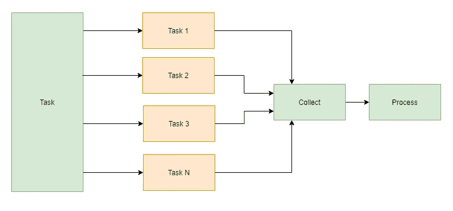

# 使用 Mendix 并行执行微流(并行计算)

> 原文：<https://medium.com/mendix/mendix-executing-microflow-in-parallel-parallel-computing-3e642a7aa0b6?source=collection_archive---------1----------------------->

> 介绍

在本文中，我将讨论我们如何并行执行微流——并行计算，Mendix 中有哪些可用选项，它的缺陷和其他解决方案。

Parallel computing

> 需求和问题(只是为了理解需求)

我必须生成一个 PDF，为了生成 PDF，我必须获得大量(实际上是大量)数据，将它们放在一起，一旦收集完毕，我就可以生成 PDF。

我面临两个问题。按顺序收集数据花费了大量时间。的确，生成 Mendix PDF 本身需要时间，最终，一切都完成了，PDF 在 25 秒后生成。在本文中，我将向您展示我是如何解决数据收集问题以减少时间的。

数据收集是按顺序进行的，这在当今这个拥有强大计算能力和多核处理器的世界是不需要的。因此，我进一步研究:我如何避免顺序处理，进入并行计算来收集所有需要的数据？

> Mendix 选项

我们都知道并体验过流程队列。其中，我们为流程分配一个微流，为处理对象进行排队操作。还有其他核心选项，如来自核心或社区公共的 executeMicroflowInBackground。但是我不确定这些选项是否能完全支持上述并行计算需求。

> 替代解决方案

作为一名 java 程序员，我回归本源，决定用 Java 来做。我想写我自己的线程，看看我如何能解决这个问题。通过花大量时间阅读，我最终有了两个选择:CountDownLatch 和 CyclicBarrier。这些选择真的让我大吃一惊。因为我需要的东西已经在那里了。

我将在下面提供一些阅读链接给那些有兴趣了解更多选项的人。

> 履行

1.  我拆分了进行数据收集的微流，最终得到了逻辑拆分的微流，我可以单独并行执行这些微流。
2.  编写了一个接受微流名称作为参数的 java 操作。
3.  我选择 CountDownLatch 选项，因为我希望一个主线程等待其他线程完成并继续生成 PDF。
4.  对于每个微流，我创建了一个服务线程，它通过传递所需的参数来执行微流。
5.  微流的执行实际上是并行的，而不是顺序的。最后，一旦所有的数据收集完成，我就可以继续生成 PDF 了

> 结论

我能够通过并行运行微流来优化数据收集。因此，如果我有 5 个微流进行数据收集，按顺序执行它们:考虑到 1 个微流需要 4 秒，那么数据收集在 20 秒后完成。在我上面解释的方法中，我能够在 4-5 秒内完成数据收集，还能够减少生成 PDF 所需的时间。

注意:就我所知，这只对持久化的实体有效。由于服务线程在系统上下文中工作，我们仍然必须在微流中提交。

> *参考文献*

 [## 什么是并行计算？定义和常见问题| OmniSci

### 并行计算是一种计算架构，其中几个处理器同时执行多个…

www.omnisci.com](https://www.omnisci.com/technical-glossary/parallel-computing)  [## Java cyclic barrier vs CountDownLatch | bael dung

### 在本教程中，我们将比较 CyclicBarrier 和 CountDownLatch，并尝试了解它们的相似之处和不同之处…

www.baeldung.com](https://www.baeldung.com/java-cyclicbarrier-countdownlatch)  [## Java 中 CountDownLatch 和 CyclicBarrier 的区别

### 在本文中，我们将看到 java 中 CountDownLatch 和 CyclicBarrier 的区别。这个问题是相关的…

javahungry.blogspot.com](https://javahungry.blogspot.com/2018/08/difference-between-countdownlatch-and-cyclicbarrier-in-java.html)