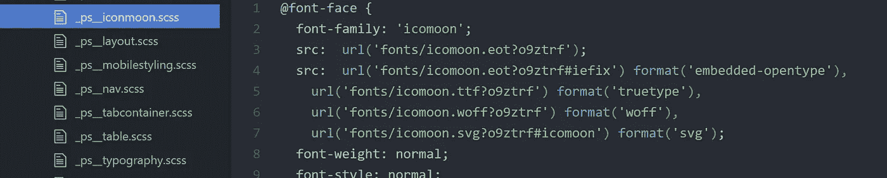

# 如何在 Mendix 中添加字体图标

> 原文：<https://medium.com/mendix/mendix-how-to-add-font-icons-465e2a03884?source=collection_archive---------0----------------------->

## 或者只是一般的字体

> **更新 2021 年 11 月**
> 为 MendixStudio9 查看新博客:[https://medium . com/mendix/how-to-add-font-icons-in-mendix-9-9307 c 2634392](/mendix/how-to-add-font-icons-in-mendix-9-9307c2634392)

所以你想在你的项目中添加一个自定义的字体图标。
在这个例子中，我们将使用 Icomoon，因为这是我从客户的品牌团队那里得到的图标字体。

# 介绍

要将字体添加到 Mendix 项目中，您需要完成两个主要步骤:

*   将字体文件放在正确的目录中。
*   将 CSS 添加到您的 custom.scss

# 放置字体

通常在设计 Mendix 时，你将在 sass 文件夹中工作，但是当放置字体文件时，它们需要放在 CSS 文件夹中:your project \ theme \ styles \ web \**CSS**\ fonts

# 添加 CSS

根据项目的结构，有不同的方法将字体 CSS 添加到 custom.scss 中。

我发现最简单的方法是将字体 CSS 重命名为与你的项目相匹配的名称。对于我当前的项目“_ps__font-icomoon.scss”

然后使用 sass 中的导入功能，添加一行:
"[@ import](http://twitter.com/import)' PS _ font-icomoon '；"

不要忘记用 [Calypso](https://docs.mendix.com/howto/front-end/calypso) 编译你的 sass。

就这样。

玩得开心