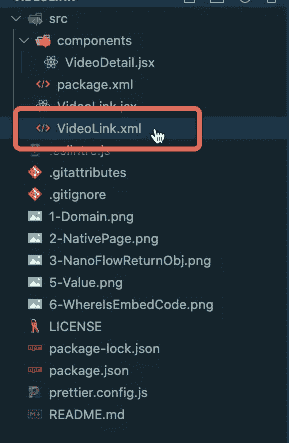
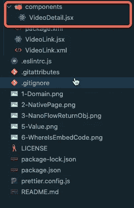
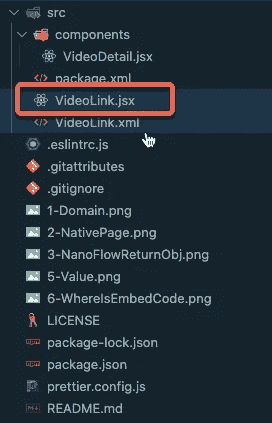
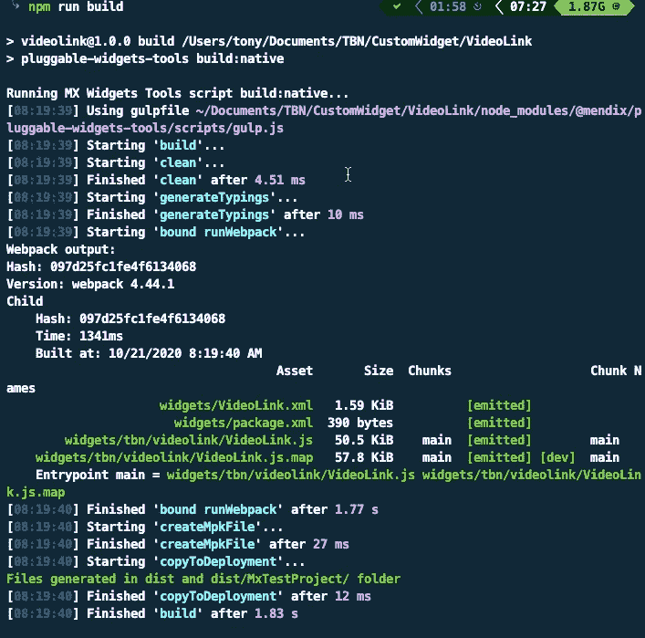
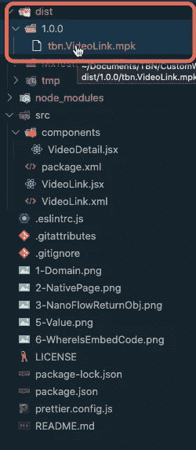
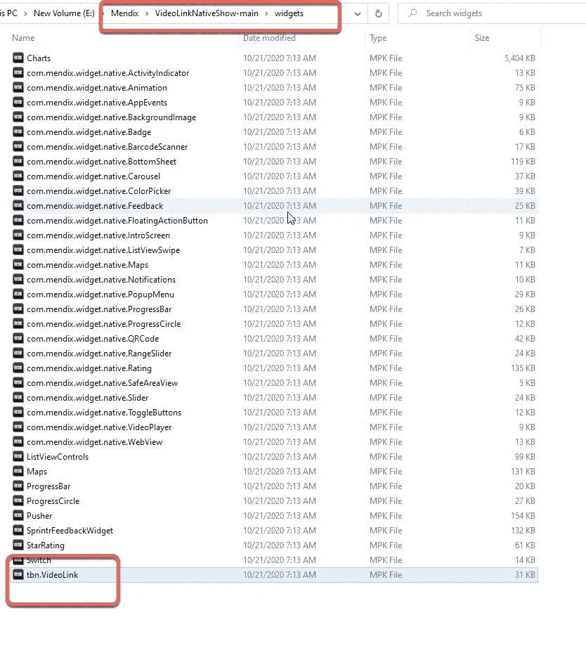
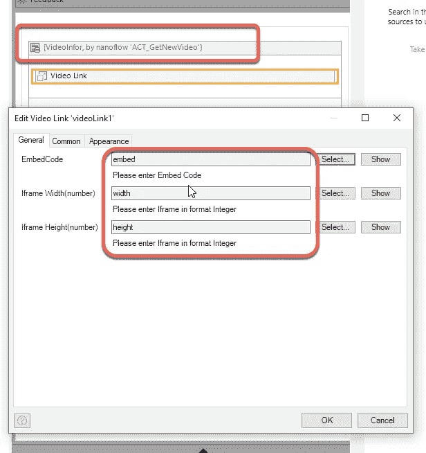

# mendix——如何从 Youtube 建立视频链接

> 原文：<https://medium.com/mendix/mendix-how-to-build-a-video-link-from-youtube-493b2c6df19?source=collection_archive---------0----------------------->


## 当我想将 youtube 视频添加到我的原生移动应用程序中时，我意识到 Mendix 的[视频播放器小工具](https://appstore.home.mendix.com/index.html)只能接受 mp4 文件的 URL。这就是为什么我需要做一个新的部件，可以利用 youtube 的嵌入代码。

## 你可以从这里的[门迪克斯市场下载这个小工具，](https://marketplace.mendix.com/link/component/115010)

**首先，使用** [**可插拔控件教程**](https://docs.mendix.com/howto/extensibility/create-a-pluggable-widget-one#1-introduction) 中的“yo”命令创建一个新的控件

```
*>>yo @mendix/widget VideoLink*
```

**选择 ES6，空项目，无测试模块。**

```
*>>cd VideoLink*
```

**如果有 VSCode，可以用**打开项目

```
*>> code .*
```

**首先，我们需要一个 XML 文件来定义小部件的输入，如嵌入代码、视频帧宽度和高度。**



```
*<?xml version=”1.0" encoding=”utf-8"?>**<widget id=”tbn.videolink.VideoLink” pluginWidget=”true” needsEntityContext=”true” offlineCapable=”true”**supportedPlatform=”Native”**xmlns=”http://www.mendix.com/widget/1.0/" xmlns:xsi=”http://www.w3.org/2001/XMLSchema-instance"**xsi:schemaLocation=”http://www.mendix.com/widget/1.0/ ../node_modules/mendix/custom_widget.xsd”>**<name>Video Link</name>**<description>My widget description</description>**<icon/>**<properties>**<propertyGroup caption=”General”>**<property key=”yourEmbedCode” type=”attribute” required=”true”>**<caption>EmbedCode</caption>**<description>Please enter Embed Code</description>**<attributeTypes>**<attributeType name=”String”/>**</attributeTypes>**</property>**<property key=”yourWidth” type=”attribute” required=”true”>**<caption>Iframe Width(number)</caption>**<description>Please enter Iframe in format Integer</description>**<attributeTypes>**<attributeType name=”Integer”/>**</attributeTypes>**</property>**<property key=”yourHeight” type=”attribute” required=”true”>**<caption>Iframe Height(number)</caption>**<description>Please enter Iframe in format Integer</description>**<attributeTypes>**<attributeType name=”Integer”/>**</attributeTypes>**</property>**</propertyGroup>**</properties>**</widget>*
```

**你需要在你的 mendix widget 项目中安装一个库“**[**react-native-YouTube-iframe**](https://www.npmjs.com/package/react-native-youtube-iframe)**”。**

```
>>*npm install react-native-youtube-iframe*
```



**在 src 文件夹下，您可以看到我们有一个 components 文件夹，默认情况下它是一个 HelloWord 文件。我删除了它，添加了一个新文件，命名为 VideoDetail.jsx**

**我们现在可以从刚刚安装到 VideoDetail.jsx 的库中导入 YoutubePlayer 了**

```
*import YoutubePlayer from “react-native-youtube-iframe”;*
```

通过添加另一个 import 语句，您将能够对这个组件使用 React 钩子。

*从“react”导入 React，{ useRef，useState，createElement }；*

```
*import React, { useRef, useState, createElement } from “react”;*
```

**您可以根据库属性返回结果。**

```
*<YoutubePlayer**ref={playerRef}**height={height}**width={width}**videoId={getid}**play={playing}**onChangeState={event => console.log(event)}**onReady={() => console.log(“ready”)}**onError={e => console.log(e)}**onPlaybackQualityChange={q => console.log(q)}**volume={50}**playbackRate={1}**playerParams={{**cc_lang_pref: “us”,**showClosedCaptions: true**}}**/>*
```

**该组件的完整代码应为**

```
*import React, { useRef, useState, createElement } from “react”;**import YoutubePlayer from “react-native-youtube-iframe”;**const VideoDetail = ({ getid, getheight, getwidth }) => {**const playerRef = useRef(null);**const [playing, setPlaying] = useState(true);**const height = parseInt(getheight, 10);**const width = parseInt(getwidth, 10);**return (**<YoutubePlayer**ref={playerRef}**height={height}**width={width}**videoId={getid}**play={playing}**onChangeState={event => console.log(event)}**onReady={() => console.log(“ready”)}**onError={e => console.log(e)}**onPlaybackQualityChange={q => console.log(q)}**volume={50}**playbackRate={1}**playerParams={{**cc_lang_pref: “us”,**showClosedCaptions: true**}}**/>**);**};* *export default VideoDetail;*
```

*注意:你应该有一个来自 react 导入的“createElement ”,否则它会在你构建小部件时抛出错误。*

**现在转到 VideoLink.jsx**



**我们可以导入组件并将其显示在此页面上。**

```
*import { Component, createElement } from “react”;**import VideoDetail from “./components/VideoDetail”;* *export class VideoLink extends Component {**render() {**return (**<VideoDetail**getid={this.props.yourEmbedCode.value}**getheight={this.props.yourHeight.value}**getwidth={this.props.yourWidth.value}/>**);**}**}*
```

**现在你可以运行命令来构建你的小部件文件了。**

```
*>> npm run build*
```

**成功的构建应该是这样的。**



**您的小部件构建应该位于**



**现在你可以将这个文件复制到你的项目的 widget 文件夹中。**



在本地运行一次您的项目，或者按 F4 同步您的项目目录。然后将小部件添加到页面，您需要将小部件放在数据视图中，该视图将 nanoflow 作为源，它可以返回一个实体。



**完成后，你可以试试“让它成为本地”中的视频链接**

*来自出版商-*

*如果你喜欢这篇文章，你可以在我们的* [*媒体页面*](https://medium.com/mendix) *或我们自己的* [*社区博客网站*](https://developers.mendix.com/community-blog/) *找到更多类似的内容。*

有兴趣加入我们的社区吗？你可以加入我们的 slack 社区 [*这里*](https://join.slack.com/t/mendixcommunity/shared_invite/zt-hwhwkcxu-~59ywyjqHlUHXmrw5heqpQ) *或者对于那些想要更多参与的人，看看加入我们的聚会* [*这里*](https://developers.mendix.com/meetups/#meetupsNearYou)