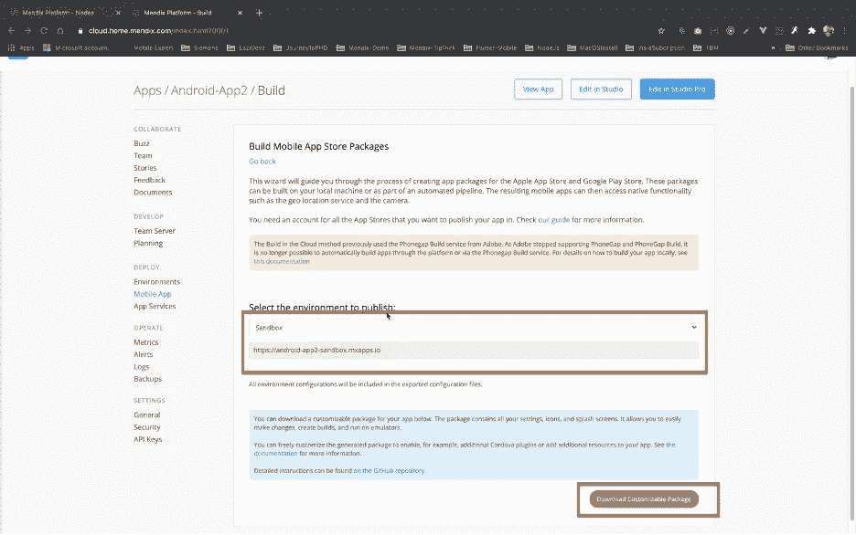
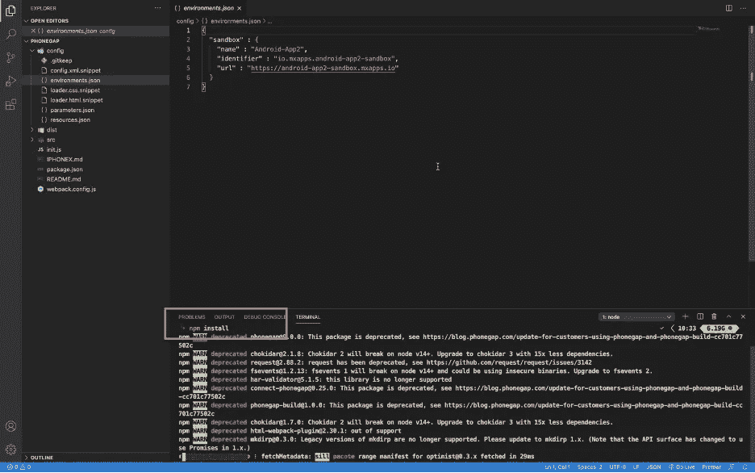
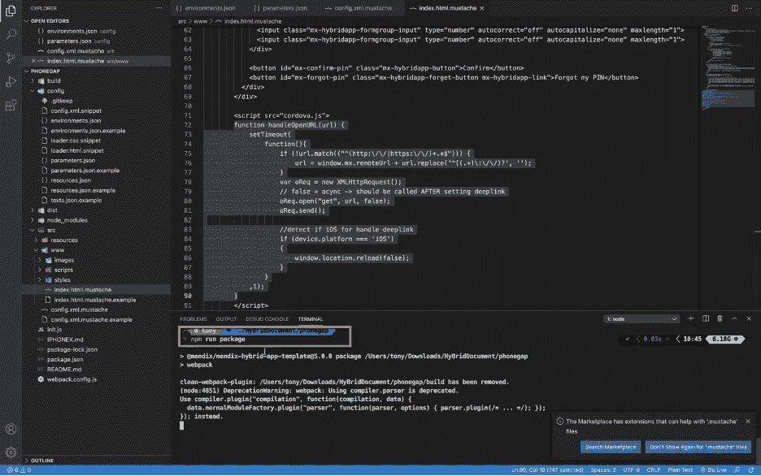
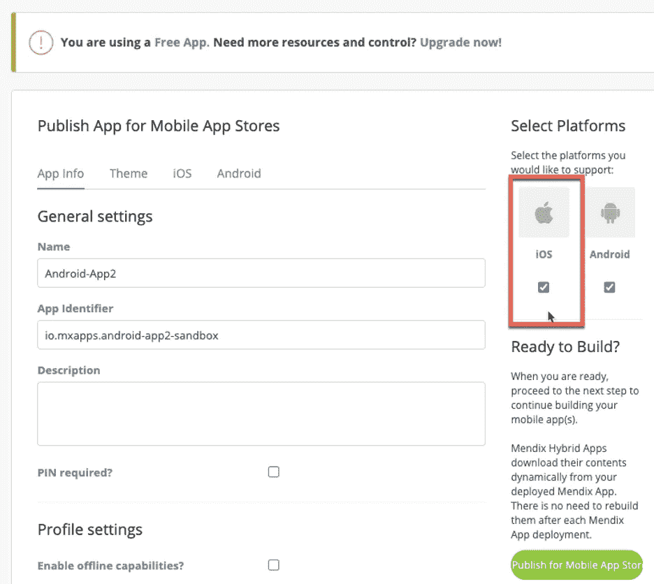

# 使用 Cordova 的 CLI 构建 Mendix 混合应用程序

> 原文：<https://medium.com/mendix/mendix-hybrid-with-cordova-cli-3ef9961341d0?source=collection_archive---------0----------------------->


# 随着 Mendix 使用 Phonegap 的时代即将结束，仍然有许多正在运行的应用程序需要维护。这意味着我们仍然需要使用混合移动应用，至少在一段时间内。因此，我写这篇博客来一步一步地解释，如何建立一个 APK 或 IPA 文件。

## 如何使用 Cordova 的命令行界面构建混合 Android APK？

在 Mendix 上转到您的应用仪表板，并在左侧菜单中选择移动应用。参考下面图 1


Fig. 1\. Your home apps

选择 Android 复选框，并确保您启用了您的应用程序可能需要访问的任何移动功能，如相机、日历或照片库。然后按“发布到移动应用商店”(图 2 和图 3)


Fig. 2\. Permission in mobile application


Fig. 3\. Press Publish to build mobile.

选择您构建应用程序的环境(在这种情况下，它是下拉菜单中的“沙盒”)，它将填充默认的免费应用程序 URL，稍后可以在基于代码的中修改该 URL。然后按“下载可定制的包”，看看图 4



Fig. 4\. Download package

下载完成后，您将获得一个 zip 文件，您可以从中提取代码。(图 5。)


Fig. 5\. Package extraction

用 VScode 打开名为“phonegap”的文件夹，文件夹的结构会是这样的(图 6。)


Fig. 6\. Open phonegap package with vscode.

在 VScode 中打开一个终端。首先运行下面的命令。(图 7)。

```
npm install
```



Fig. 7\. Initiate npm lib in the phonegap project.

在**标识符**处，将“-”更改为“.”，如果你不改变这一点，它可能无法建立。(图 8 和图 9)。


Fig. 8\. Environment variable configuration.


Fig. 9\. Parameter variable configuration.

如果您想要编辑任何插件，您将需要从这些文件“config.xml.mustache”和“index.html.mustache”中进行编辑(图 10 和图 11)


Fig. 10\. Add on cordova plugin in config.xml.mustache


Fig. 11\. Custom JS in index.html.mustache.

然后保存所有文件，并运行命令(图 12)

```
npm run package
```



Fig. 12\. Initiate build package for hybrid app.

您将看到，在命令完成后，文件夹构建将包含 config.xml 和 index.html，类似于那些“小胡子”文件(图 13 和图 14)


Fig. 13\. Plugin appears on build packages


Fig. 14\. JS custom appear on build package.

现在使用命令转到终端中的构建文件夹(图 15)

```
cd build
```


Fig. 15\. Go to build folder.

这里你需要做的是找到安装 Cordova CLI 的方法，这是用这个 [**向导**](https://cordova.apache.org/docs/en/10.x/guide/platforms/osx/) 轻松实现的。

现在运行如下所示的命令(图 16)

```
cordova platform add android
```


Fig. 16\. Add android module via cordova cli.

现在在 build 下有一个文件夹，名为 platforms/android。

在安装插件的情况下，您也可以在上述步骤之后使用 Cordova CLI。(图 17)

```
cordova plugin add cordova-plugin-customurlscheme — variable URL_SCHEME=app2
```


Fig. 17\. Add cordova plugin into the project.

获取 android 文件的最后一步是运行这个命令(图 18)

```
cordova build android
```


Fig. 18\. Build android apk file with cordova cli

如果构建成功，可以在终端输出的最后一行所示的路径中找到 APK 文件。文件路径对于您的设备是唯一的(图 19)。


Fig. 19\. apk file release

为了将 APK 发布到 Google Play，您需要生成一个签名版本。为此，您可以遵循本[指南](https://www.linkedin.com/pulse/how-create-signed-android-apk-apache-cordovausing-cordova-ghatul/)。

## 如何用 Cordova 命令行界面构建混合 iOS

确保在选择 iOS 的情况下从 mendix 下载 phonegap.zip(图 20)。



Fig. 20\. At mendix apps website get ios package.

转到 build 文件夹并运行命令(图 21)。

```
cordova platform add ios
```


Fig. 21\. Add ios module

您还可以在这一步添加任何 Cordova 插件(图 22)。


Fig. 22\. Add cordova plugin

如果要安装任何 pod 依赖项，请使用以下命令转到 platform/ios 文件夹

```
cd platform/ios 
```

然后运行命令来安装任何依赖项(图 23 和图 24)

```
pod install
```


Fig. 23\. Go to ios folder


Fig. 24\. pod install

接下来使用 XCode 打开 iOS 文件夹(图 25)


Fig. 25\. open ios folder with xcode.

在签名和证书菜单中选择“团队”(图 26)


Fig. 26\. Select team and signing certificate

现在，您可以在顶部访问菜单，将您的应用构建到您的 iOS 设备上，用于开发和测试目的，而无需将应用发布到任何在线商店(图 27)。


Fig. 27\. Select device to build and install application.

通常情况下，您会得到以下错误:

```
error: The sandbox is not in sync with the Podfile.lock. Run ‘pod install’ or update your CocoaPods installation.
```

再次转到 XCode，并为 SRCROOT 的构建设置中的自定义路径添加另一个配置(图 28)


Fig. 28\. Add custom path in build setting.

然后返回到构建阶段，并切换到 SRCROOT(图 29)


Fig. 29\. Change the path name in buil phase.


清理构建并尝试再次构建，您将看到成功消息出现(图 30)


Fig. 30\. Build success.

应用程序构建的结果(图 31 和图 32)。


Fig. 31\. App is on iphone now


Fig. 32\. Open App

若要发布到 Apple Store，您需要一个签名的 IPA 文件。为此你可以遵循这个 [**指南**](https://developer.apple.com/documentation/xcode/preparing_your_app_for_distribution) **。**

请记住，发布到 Apple Store 时，有两个配置文件可供您选择。一个是开发，一个是发行。如果您希望您的应用程序可供公众访问，您需要选择分发配置文件。

## 阅读更多信息:

*   [https://docs . mendix . com/how to 8/mobile/publishing-a-mendix-hybrid-mobile-app-in-mobile-app-stores](https://docs.mendix.com/howto8/mobile/publishing-a-mendix-hybrid-mobile-app-in-mobile-app-stores)
*   [https://docs.mendix.com/howto8/mobile/build-hybrid-locally](https://docs.mendix.com/howto8/mobile/build-hybrid-locally)
*   [https://developer.apple.com/app-store/submitting/](https://developer.apple.com/app-store/submitting/)
*   [https://support . Google . com/Google play/Android-developer/answer/9859152？hl=en-GB](https://support.google.com/googleplay/android-developer/answer/9859152?hl=en-GB)

*来自发布者-*

*如果你喜欢这篇文章，你可以在我们的* [*媒体页面*](https://medium.com/mendix) *或者我们自己的* [*社区博客网站*](https://developers.mendix.com/community-blog/) *找到更多喜欢的。*

*对于希望入门的创客，您可以注册一个* [*免费账户*](https://signup.mendix.com/link/signup/?source=direct) *，并通过我们的* [*学院*](https://academy.mendix.com/link/home) *获得即时学习。*

*有兴趣加入我们的社区吗？你可以加入我们的* [*懈怠社区频道*](https://join.slack.com/t/mendixcommunity/shared_invite/zt-hwhwkcxu-~59ywyjqHlUHXmrw5heqpQ) *或者想更多参与的人，看看加入我们的* [*遇见 ups*](https://developers.mendix.com/meetups/#meetupsNearYou) *。*