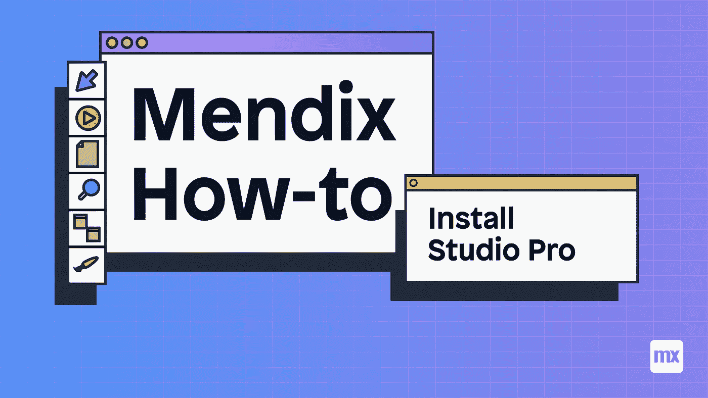
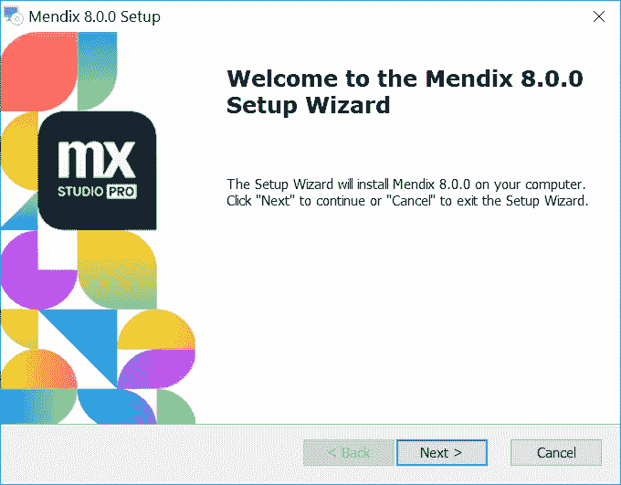
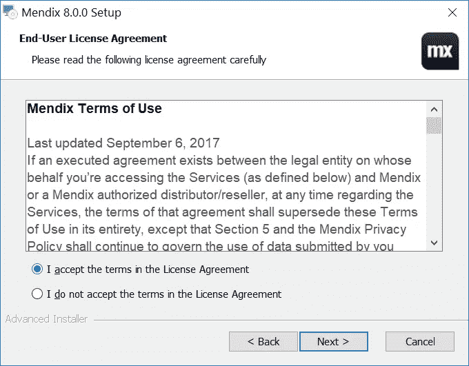
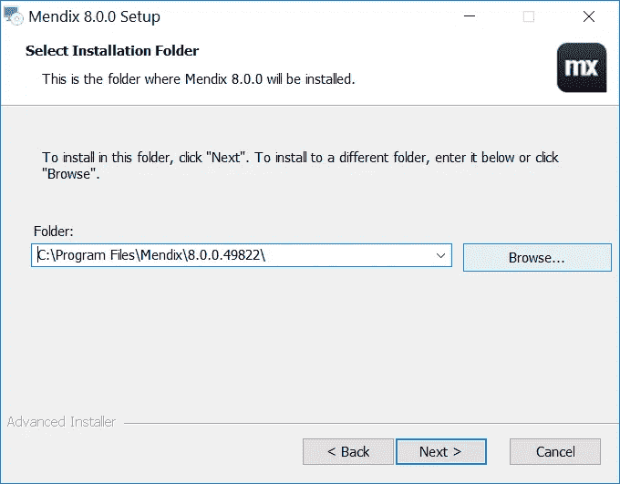
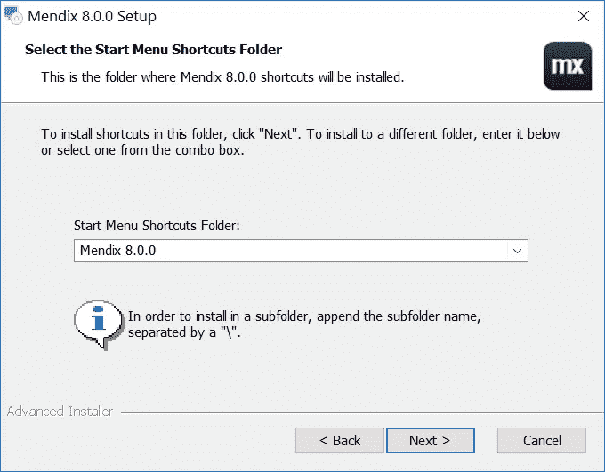
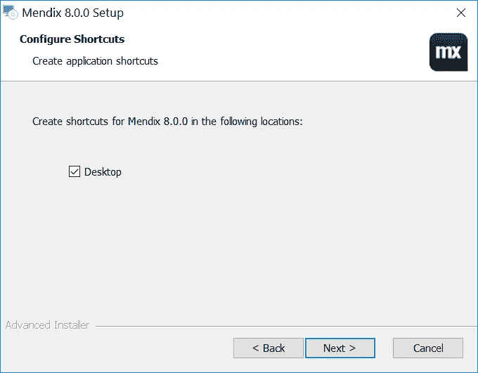
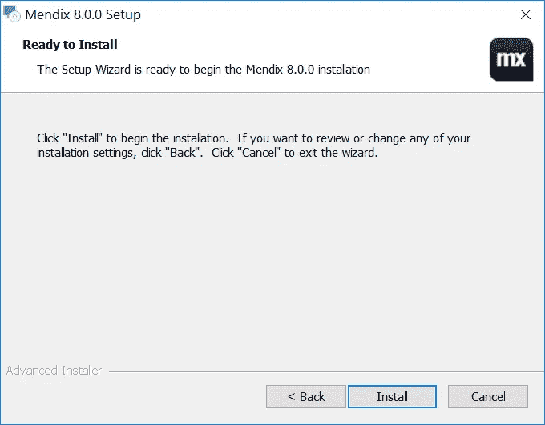
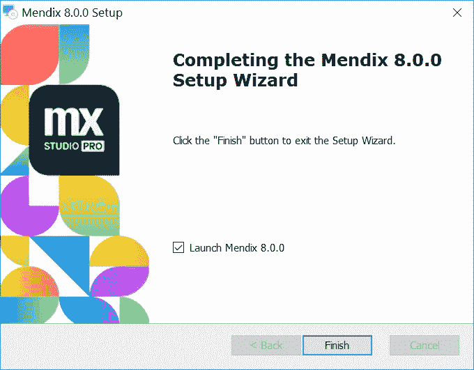

# 如何安装 Mendix Studio Pro

> 原文：<https://medium.com/mendix/mendix-live-how-to-install-studio-pro-5479bdd774c7?source=collection_archive---------0----------------------->

# Mendix World 已经过去几周了，反馈很明确:更多直播内容！这就是我们推出新系列“Mendix Live How To's”的原因。

**每件作品都将是一篇媒体文章以及视频或直播的结合。**

**但是从哪里开始呢？很多时候，当开始一件新的事情时，我发现最好从头开始…从头开始。**

说完这些，让我们开始学习如何安装 Mendix Studio Pro 吧！

# 入门需要什么？

只要您有一个 Mendix 帐户，Studio Pro 安装文件就可以在市场上免费下载。

Mendix Studio Pro 将在大多数现代机器上运行，只要它支持 64 位版本的 Windows 7、8 和 10。Windows 7 必须至少是 Service Pack 1。

Studio Pro 还需要一些框架，如果您的机器没有安装这些框架，它们会自动下载:

*   [微软。NET 框架 4.7.2](https://download.microsoft.com/download/6/E/4/6E48E8AB-DC00-419E-9704-06DD46E5F81D/NDP472-KB4054530-x86-x64-AllOS-ENU.exe)
*   [微软 Visual C++ 2010 SP1 可再发行软件包](http://download.microsoft.com/download/A/8/0/A80747C3-41BD-45DF-B505-E9710D2744E0/vcredist_x64.exe)
*   [微软 Visual C++ 2015 可再发行软件包](https://download.microsoft.com/download/6/A/A/6AA4EDFF-645B-48C5-81CC-ED5963AEAD48/vc_redist.x64.exe)
*   [采用 OpenJDK 11](https://cdn.mendix.com/installer/AdoptOpenJDK/OpenJDK11U-jdk_x64_windows_hotspot_11.0.3_7.msi) 或 Oracle JDK 11(如果您没有安装任何 JDK 11，则从 Mendix 8.0.0 起会自动安装前者)

同样重要的是要注意，Studio Pro 需要访问以下网址才能工作。如果您的防火墙当前阻止了这些，您需要将它们列入白名单。

*.mendix.com

*.mendixcloud.com

*.teamserver.sprintr.com

但是如果你是 Mac 或 Linux 用户呢？不要担心，你总是可以使用运行 windows 的虚拟机，我个人使用 Parallels，但也有其他虚拟机技术可供选择。

# 都整理好了吗？我们走吧！

打开下载的 Mendix Studio Pro 安装文件，您应该会看到安装向导出现。单击“下一步”或按键盘上的 enter 键继续。

还和我在一起吗？接下来选择**我接受许可协议中的条款**并点击**下一步**:

通常，我们会为硬盘上的磁盘空间而苦恼，如果这是你，那么你可能想要改变安装位置，为此**点击浏览，然后选择你想要安装 Studio Pro 的文件夹，然后点击下一步:**

**进入要使用的开始菜单快捷方式文件夹，点击下一步:**

就我个人而言，我讨厌在我的桌面上使用快捷方式，并使用 Mendix 版本选择器访问 studio pro，但如果你想，你可以选择在你的**桌面**上创建 Studio Pro 的快捷方式，然后单击**下一步**:

如果您确定到目前为止的选择，请单击**安装按钮**在您的机器上安装 Studio Pro。

根据你的机器的规格，实际安装时间可能会有所不同，但一旦完成，你可以检查**启动 Mendix 8。X.X** 点击**完成**完成安装并启动 Studio Pro:

# 万一出了问题怎么办？

偶尔，人们在安装 Studio Pro 时会遇到问题。一种解决方法是重新启动系统，如果尚未安装这些必备组件，则单独安装它们。

您可以从上面提供的链接下载先决条件。

根据您从安装程序获得的错误消息，您可以决定安装单个必备组件，也可以尝试手动安装所有必备组件。

之后，您可以重试安装 Studio Pro。

# 您可能想使用的其他软件

如果你在一个开发团队中工作，在某些时候你很可能会与其他开发人员发生冲突，为此你可能需要 [TortoiseSVN](https://tortoisesvn.net/) 。TortoiseSVN 是一个很棒的工具，如果需要的话，可以用来恢复变更或者释放项目锁文件。

Mendix World 2020 发布的最大消息之一是，在不久的将来，Mendix 将使用 [Git](https://git-scm.com/) 作为团队服务器，但目前还不可用。但是请放心，一旦它发布了，我一定会写一些关于它的东西。

该平台最好的特性之一是，您可以用 Java 和 JavaScript 编写定制的代码扩展。

Studio pro 确实有自己的内置代码编辑器用于 JavaScript 操作，但是如果你想构建一个可插入的小部件，你很可能需要使用一个 IDE，比如 [Visual Studio Code](https://code.visualstudio.com/) 。

对于 Mendix 中的定制 Java 操作， [Eclipse](https://www.eclipse.org/) 绝对是您的首选工具。

# 做完了，现在做什么？

如果你正在读这篇文章，这很可能意味着你是门德克斯世界的新手。对于那些不知道下一步该做什么的人，我建议去[学院](https://gettingstarted.mendixcloud.com/link/home)并点击“选择在线学习路径”,以获得符合您需求的正确学习材料。

或者你可以去官方的 [Mendix world](https://www.mendixworld.com/entrance/) 网站看看在 Mendix World 主题演讲中将要发布的内容，那里仍然可以点播，还有很多其他很酷的会议。

最后，这个帖子将被编译成视频，你可以很快赶上直播或点播！

*在你的发展过程中，你有没有遇到什么困难？想要一份专为你打造的个性化指南吗？*

*可以在* [*Mendix 社区 Slack 频道*](https://join.slack.com/t/mendixcommunity/shared_invite/zt-hwhwkcxu-~59ywyjqHlUHXmrw5heqpQ)*@ Ryan mock*联系我