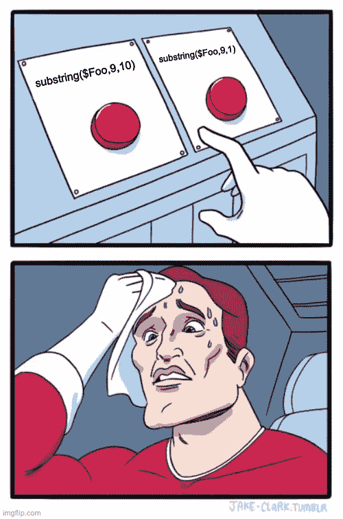
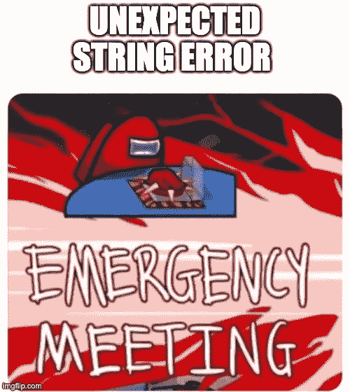

# 如何使用字符串函数调用

> 原文：<https://medium.com/mendix/mendix-live-how-to-work-with-strings-56283f566795?source=collection_archive---------3----------------------->

# Strings，无论你是开发第一个应用程序的新手，还是身经百战的专业开发人员，每个人都会在某个时候遇到麻烦。

即使在 Mendix 中开发了 7 年之后，当涉及到可怕的子串时，我仍然必须检查文档，通常是在盲目相信自己的能力导致我的逻辑出现越界错误之后。

对于任何只想知道事实的人来说，这里有一个到[文档页面](https://docs.mendix.com/refguide/string-function-calls#1-introduction)的直接链接。然而，这篇文章更多的是关于我这些年来所学到的东西，通常是在反复试验之后。

# 基础知识

[字符串串联](https://docs.mendix.com/refguide/string-function-calls#15-string-concatenation) (+)

要组合成字符串，只需在表达式中的 2 之间添加一个加号(+)。别忘了你也可以用它来组合一个字符串和一个数字

4 +'公里' = '4 公里'

[toLowerCase](https://docs.mendix.com/refguide/string-function-calls#2-tolowercase) ()和 [toUpperCase](https://docs.mendix.com/refguide/string-function-calls#3-touppercase) ()

这些都很简单，如果你有一个包含小写的字符串，你可以使用 toUpperCase()来大写字符串中的所有内容，反之亦然。

[长度](https://docs.mendix.com/refguide/string-function-calls#4-length)()

length 函数如其所言，给出了字符串的长度。但是这个函数真正强大的地方是在与 substring()等其他函数结合使用时

# 下一关

[**子串**](https://docs.mendix.com/refguide/string-function-calls#5-substring) **()**

字符串操作的问题是，在你学习的早期阶段经常会被教授。许多人认为，一旦他们理解了要点，就可以继续前进，永远不要回来复习。

随着时间的推移，我们忘记了，或者我们学习了不同的新技术，这可能会导致可避免的错误。

许多缺陷积压工作中很大一部分是子字符串，它们要么超出界限，要么意外执行，产生不寻常的结果。

我几乎可以说，这篇文章的全部观点是告诉你总是要对一个子串函数进行三重检查，如果可能的话，每次使用不同的输入。除非你 100%确定它永远不会失败，否则你当然应该在微流操作上做一些错误处理。

子串的基本功能是为函数提供输入字符串、子串在该字符串中的起始位置，以及子串的可选所需长度(如果没有提供，它将一直到字符串的末尾。

$Foo = '小心错误'

子串($Foo，0，6)

= '小心'

我反复看到的一个错误是假设第二个数字参数是结束位置，而不是字符串的长度。这看起来是一个很小的区别，但是如果你的字符串是 10 个字符，你写了这样的东西:

substring($Foo，9，10)

代替

substring($Foo，9，1)

您将得到一个错误。

# 与子字符串一起工作良好的东西

[查找](https://docs.mendix.com/refguide/string-function-calls#6-find)()和[查找最后一个](https://docs.mendix.com/refguide/string-function-calls#7-findlast)()

如果你知道你的字符串中有哪些元素，你可以用它们来锁定你需要的字符串部分。使用上面的例子

substring($Foo，find($Foo，' the ')，findlast($Foo，' r '))

会给你输出:“错误”。

[trim](https://docs.mendix.com/refguide/string-function-calls#11-trim) ()是一个很棒的功能，有助于使数据在处理时更加一致。有时我们没有考虑空白空间，这可能会影响输出。trim 正如它所说的那样，修剪字符串中的空白。确保总是从第一个字符开始(是 0 而不是 1！)

# 验证数据

验证数据的一个好方法是使用带有正则表达式的 [isMatch](https://docs.mendix.com/refguide/string-function-calls#12-ismatch) ()或 [regex](https://g.co/kgs/rwTcZk) 。

一个常见的例子是确保字符串只包含字母数字字符

ismatch($foo,'^[a-za-z0–9]+$')

=真

因为 isMatch()返回一个布尔值结果，所以它非常适合用于流中的独占分割，或者设置用于向应用程序用户触发验证消息的布尔值。

# 搜索数据

Mendix 在为您自动生成搜索字段方面做得非常好，但是偶尔也需要一些定制的搜索功能。

在这种情况下，xpath 检索中简单的 [startsWith](https://docs.mendix.com/refguide/string-function-calls#9-startswith) ()或 [contains](https://docs.mendix.com/refguide/string-function-calls#8-contains) ()可能是您的最佳选择，无论是在微流中还是作为用户界面中的约束。

# 其他一切

还有几个其他的函数我没有接触过，比如 [replaceAll](https://docs.mendix.com/refguide/string-function-calls#13-replaceall) ()或者 [urlEncode](https://docs.mendix.com/refguide/string-function-calls#urlEncode) ()，但是在我的经验中，这些函数一般用得比较少。

这就是这篇 Mendix How-to 的全部内容，请稍后查看下一版！

*想提交你对未来作品的想法或要求吗？联系我* [*@Ryan M*](/ep/profile/1gg9uA1iUgdDmqkTo2qowQL4SaAjX9zsQB2MwWT9HmlrDYiKilBr) *或者在* [*Mendix 社区闲散频道*](https://join.slack.com/t/mendixcommunity/shared_invite/zt-hwhwkcxu-~59ywyjqHlUHXmrw5heqpQ) 找我