# 使用 Mendix 和 Cmder 在 Windows 10 中构建可插拔小部件的快速指南

> 原文：<https://medium.com/mendix/mendix-make-a-pluggable-widget-in-window-10-543c87bbf979?source=collection_archive---------1----------------------->

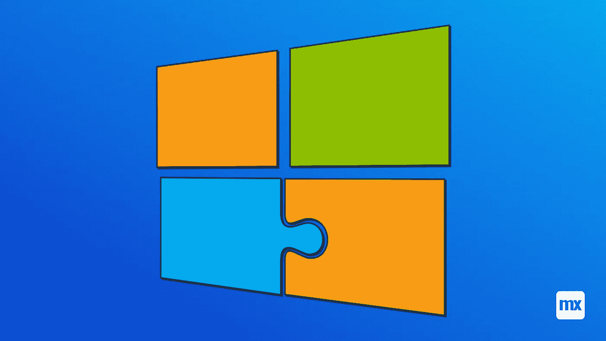

# 新开发人员可能很难在 Windows 10 中编译和构建他们的可插拔小工具。这就是为什么我写了这篇关于如何克服这一点的快速指南。

## 开始之前

我们需要一些工具来管理我们的节点版本，以及一个好的终端来执行我们的命令。

首先，你需要一个好的命令行界面。目前我用的是 **Cmder** 版本 **1.3.18** 。你可以在这里下载[](https://github.com/cmderdev/cmder/releases/tag/v1.3.18)**。**

*它是便携式的，意味着不需要安装。您可以在下载后提取文件，并将其保存在您的驱动器上，然后使用。exe 文件来运行它。*

*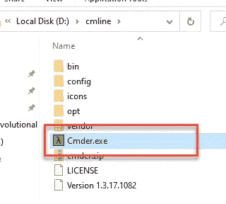*

*第二个是 NVM，它是一个节点模块管理工具。你可以在 Github 这里下载[。当然，这是一个. exe 文件，只需单击“下一步”即可完成安装。](https://github.com/coreybutler/nvm-windows)*

*当您能够获得所有这些工具时，让我们打开 Cmder 并从命令行检查它。*

*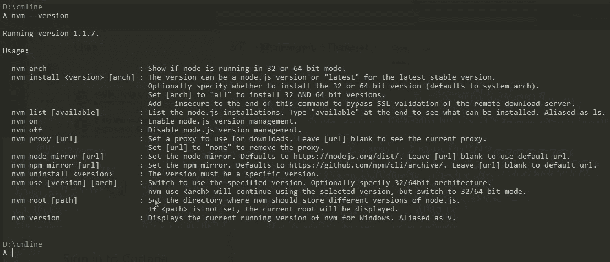*

*要查看当前可用的节点 LTS 版本列表，您可以运行命令*

```
*nvm list available*
```

*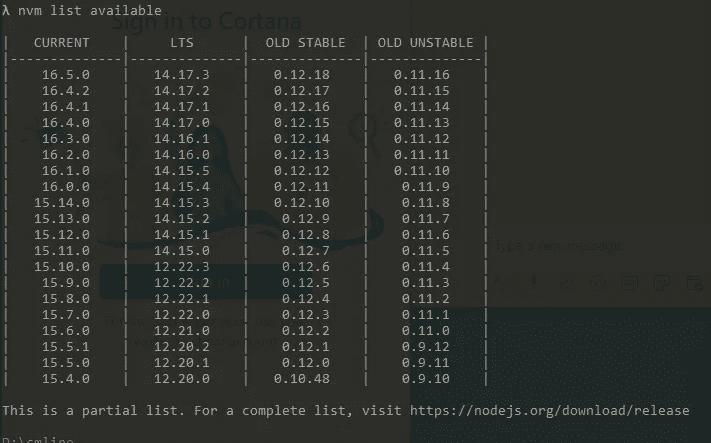*

*要检查当前使用的版本，请运行命令*

```
*nvm list*
```

*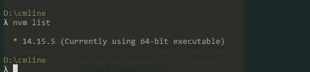*

*要安装特定版本，例如 12.22.3，您可以运行命令*

```
*nvm install 12.22.3*
```

*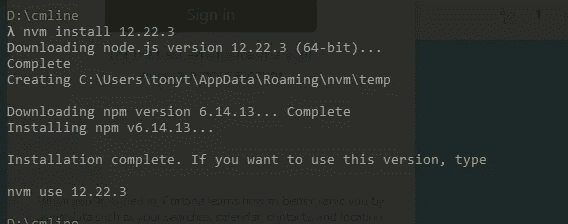*

*安装一个版本后，它不会自动选择为活动版本。要选择新安装的版本，请运行命令*

```
*nvm use 12.22.3*
```

*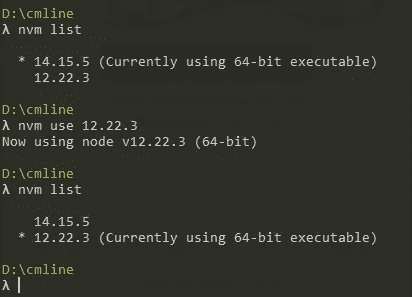*

## *安装约曼*

*现在是门迪克斯部分。在安装 Mendix 小部件生成器之前，您需要安装 [Yeoman](https://yeoman.io/) 。为此，您可以运行以下命令*

```
*npm install -g yo*
```

*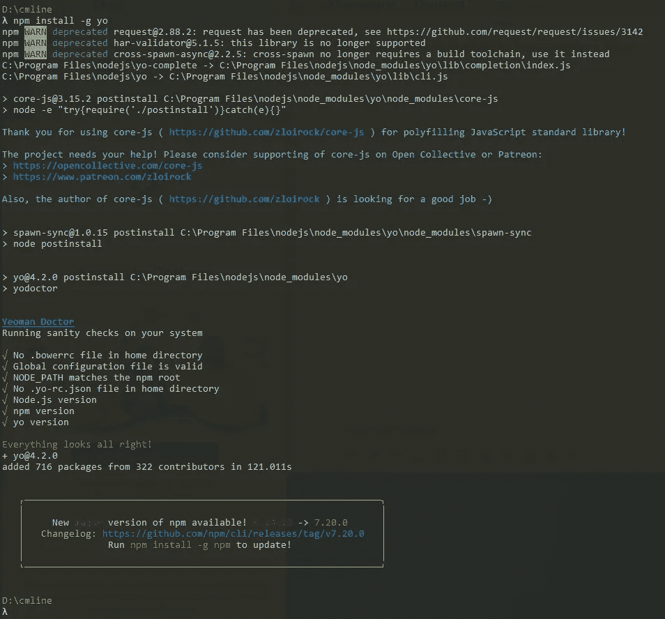*

*现在我们可以安装 Mendix 小部件生成器，它将创建我们的小部件支架。运行命令*

```
*npm install -g @mendix/generator-widget*
```

*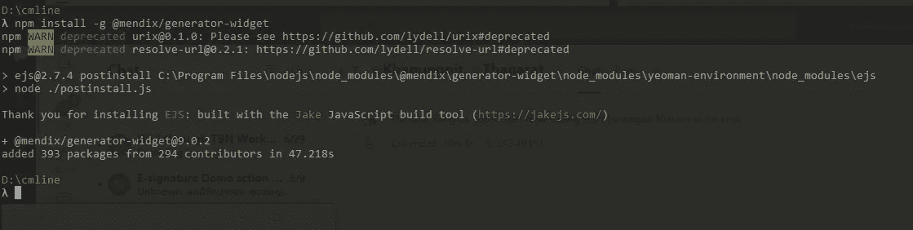*

*为了确保它能正常工作，我们可以创建一个测试小部件，我称之为 test widget。在 Cmder 中导航到您的 Mendix 应用程序的项目目录，并使用命令创建一个名为 CustomWidgets 的文件夹*

```
*mkdir CustomWidgets*
```

*接下来，通过运行命令导航到您刚刚创建的文件*

```
*cd CustomWidgets*
```

*我们现在可以调用之前安装的 Mendix 小部件生成器来创建一个测试小部件，我称之为 test widget。运行命令*

```
*yo @mendix/widget TestWidget*
```

*然后完成发电机所需的所有输入。完成后，您应该会看到类似这样的内容*

*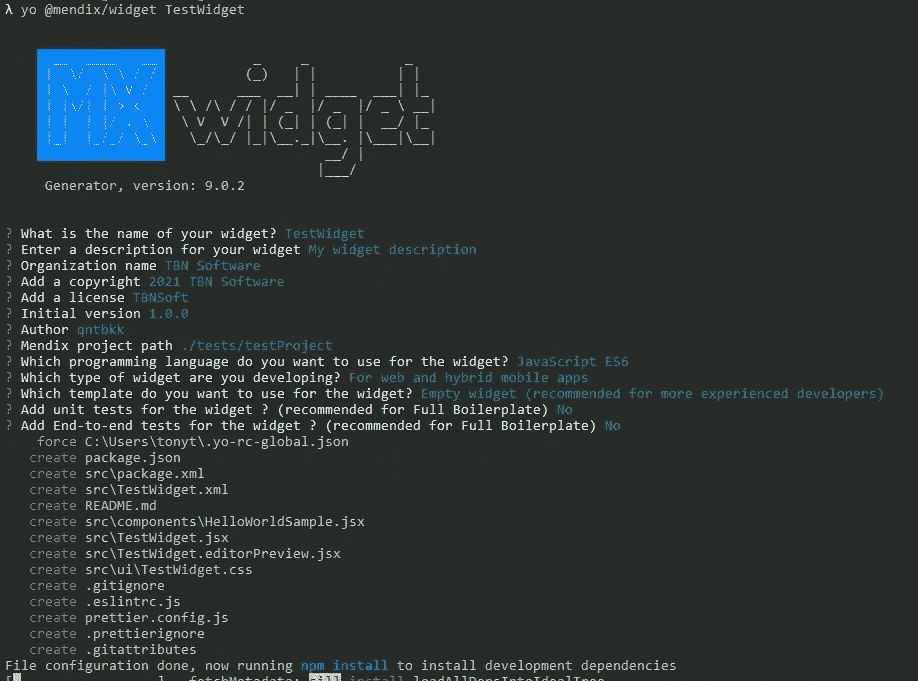*

## *测试构建功能*

*为了确保一切按预期运行，我们可以通过删除 **TestWidget** 文件中的 **dist** 文件夹来测试构建过程，该文件是由我们之前创建的 **CustomWidgets** 文件中的生成器创建的。*

*现在运行命令*

```
*npm run build* 
```

*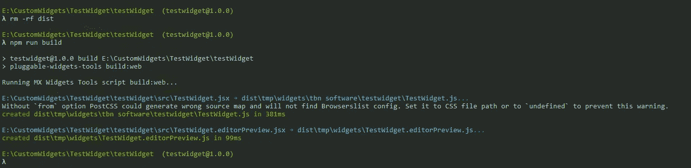*

*你的新部件将会在重新创建的 **dist** 文件中。*

*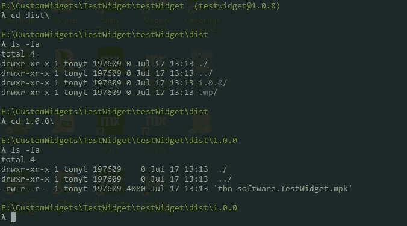*

*完成了。*

## *阅读更多*

*[](https://docs.mendix.com/howto/extensibility/create-a-pluggable-widget-one) [## 构建可插入的 Web 小部件:第 1 部分- Studio Pro 9 操作指南| Mendix 文档

### 可插拔 web 小部件是新一代的定制小部件。这些小部件基于 React 并使用了…

docs.mendix.com](https://docs.mendix.com/howto/extensibility/create-a-pluggable-widget-one)  [## 构建可插入的 Web 小部件:第 2 部分(高级)- Studio Pro 9 操作指南| Mendix 文档

### 新的可插拔小部件 API 使得构建功能完整的小部件变得更加容易。本指南将超越如何…

docs.mendix.com](https://docs.mendix.com/howto/extensibility/create-a-pluggable-widget-two)  [## 可插拔小部件 API-API & SDK | Mendix 文档

### 理解插件的指南。

docs.mendix.com](https://docs.mendix.com/apidocs-mxsdk/apidocs/pluggable-widgets)* 

**来自发布者-**

**如果你喜欢这篇文章，你可以在我们的* [*媒体页面*](https://medium.com/mendix) *或我们自己的* [*社区博客网站*](https://developers.mendix.com/community-blog/) *找到更多类似的文章。**

**希望入门的创客，可以注册一个* [*免费账号*](https://signup.mendix.com/link/signup/?source=direct) *，通过我们的* [*学苑*](https://academy.mendix.com/link/home) *即时获取学习。**

*有兴趣更多地参与我们的社区吗？你可以加入我们的 [*Slack 社区频道*](https://join.slack.com/t/mendixcommunity/shared_invite/zt-hwhwkcxu-~59ywyjqHlUHXmrw5heqpQ) *或者想更多参与的人，看看加入我们的* [*遇见 ups*](https://developers.mendix.com/meetups/#meetupsNearYou) *。**