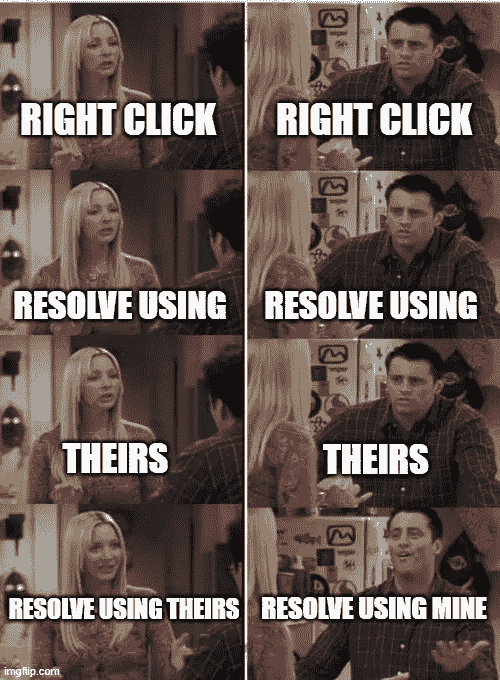
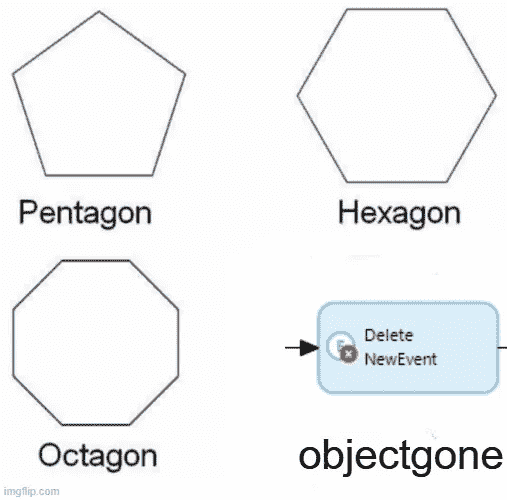
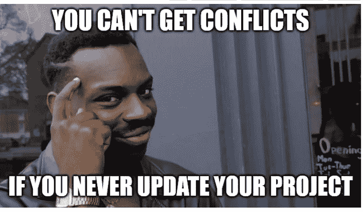

# Mendix 迷因大赛

> 原文：<https://medium.com/mendix/mendix-meme-contest-4f248828b41f?source=collection_archive---------4----------------------->

迷因有趣、古怪、常常荒谬，对一些人来说，甚至有必要让他们忘记那些让我们日复一日忙碌的成年事物。因此，我们注意到严重缺乏 Mendix 迷因来表达我们有时的真实感受，所以我们着手解决这个问题。

> 这种事可能吗？为什么是的，它是！

# 竞赛

从 4 月 20 日到 4 月 23 日，我们举办了一场 Mendix meme 竞赛，要求社区提交他们最有趣和最有创意的 meme。瞧，我们通过我们的社区 Slack 收到了 71 个提交！他们让我们经常在自己的家庭办公室里放声大笑。获胜者是根据😂反应，并获得 100 分对他们的门德克斯水平！

以下是前三名:

“Theirs/mine” by Austin McNicholas

“objectgone” by Maarten Bongers

“You can’t get conflicts” by Paul Ketelaars

我们还挑选了几个员工最喜欢的，奖励 50 分。

“Inline styling” by Jason Teunissen

“jQuery” by Thijs van der Meer

你最喜欢什么？

想要看到更多的迷因，还是自己也有一个精彩的？加入 [Mendix 社区 Slack](http://bit.ly/mendixcommunityslack) 在 [#memes](https://mendixcommunity.slack.com/archives/C012AQ3G8F3) 频道中享受超过 70 个(并且还在增长)的 memes！