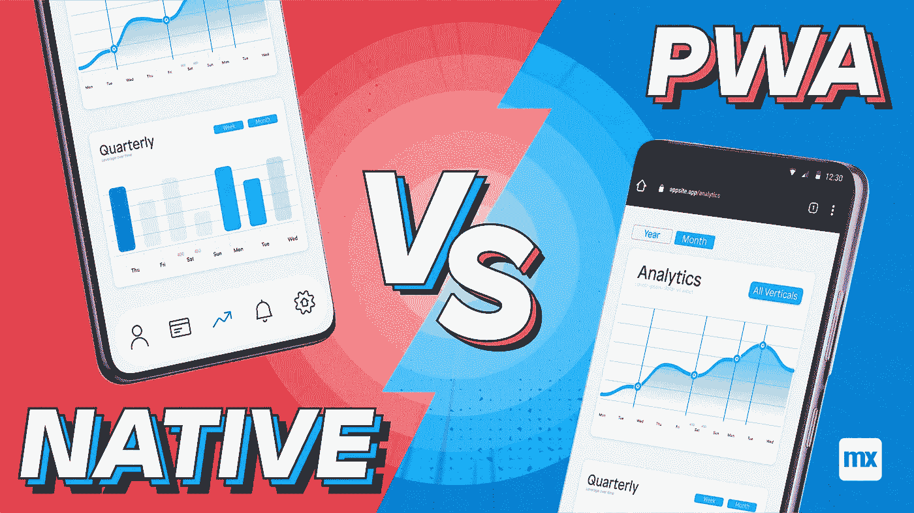

# Mendix Mobile —原生还是 PWA？

> 原文：<https://medium.com/mendix/mendix-mobile-native-or-pwa-c3f484d1eaa3?source=collection_archive---------2----------------------->

Mendix Mobile — Native or PWA?

# Mendix Native 已经推出好几年了，现在看来它确实在上升！我们看到越来越多的公司利用本土技术发布他们珍贵的移动应用。然而，最近 Mendix 还发布了将移动应用程序发布为渐进式网络应用程序(PWA)的选项。最重要的是，由于 Adobe 决定不再继续使用 PhoneGap，Mendix 混合应用程序被弃用。

# 这就留下了在(重新)设计你的移动应用的架构时要问的基本问题:

> **我的移动应用程序应该使用什么技术:Mendix Native 还是 Mendix PWA？**

Mobile Apps

# 本地和 PWA 基础

让我们先来看看这些技术的基础。Mendix Native 建立在 React Native 之上，React Native 是一个基于 JavaScript 的开源框架，用于在屏幕上呈现内容，最初由脸书开发。他们的目标是使用单个代码库，允许部署到所有类型的设备(例如手机、平板电脑、电视)和操作系统(例如 iOS、Android)，同时保持最佳性能，因为他们一直存在跨设备/操作系统的性能问题。Mendix Native 秉承了多平台/多操作系统的精神。

最近，谷歌开发了渐进式网络应用技术。PWA 这个名字本身已经暗示了底层技术:它是一种 web 应用程序，使用经典的 HTML、CSS 和 JavaScript 在屏幕上呈现元素。这也是为什么 2021 年才刚刚发布的 Mendix PWA 技术非常符合我们所熟悉的旧的 Mendix Web 应用程序，并且我们自 2005 年 Mendix 成立以来一直在创建这些应用程序。谷歌的主要目标是让用户更容易访问应用程序，允许用户直接从网站安装应用程序，而不是使用应用程序商店。

# 门迪克斯本土的利弊

我们先从 Mendix 原生技术的三大缺点说起，然后再看优点。首先，由于其 JavaScript 性质，Mendix Native 需要大量使用 Nanoflows，这意味着许多内置于 Mendix(2019 年之前)的旧(混合)应用程序不容易转换为 Native；构建一个合适的本地应用程序所需的数据检索模式与 Mendix 开始使用的更老、更知名的 web/混合应用程序非常不同。当转换一个旧的应用程序到本地，它也必须使用 JSS 重新设计。这意味着将混合应用程序转换为原生应用程序可能是一项昂贵的冒险。此外，必须投入相当大的精力来获取使用这些新的数据范式(非/和持久)和 JSS 风格所需的知识。

其次，Mendix 原生应用程序可能很难发布；具体来说，苹果对什么内容可以发布到它的 AppStore 有相当严格的要求。有很多方法可以解决这个问题。例如，可以使用微软 Intune 或其他专门定制的公司应用程序商店发布应用程序。另一方面，Android 更加开放，允许安装任何应用程序。这意味着，如果你的公司使用 Android 设备，发布将不是一个问题。

最后，Mendix 原生技术涉及代码，这与 Mendix 的低代码本质有些冲突。为了编译一个应用程序，你可能不得不使用 NPM，以及其他各种代码繁重的工具来打包构建。另一个例子是构造用于样式化部件和页面的 JavaScript 样式化类。根据我的经验，这可以很容易地学会，但是这里有一个必须考虑的学习曲线，特别是如果你的开发团队没有传统编码的背景。

读完这篇文章后，你可能想知道为什么要使用 Mendix 原生应用程序？嗯，它可以在所有设备上工作，使用 React 本机框架，因此允许使用框架内的任何东西。一旦发布，您的应用程序将非常有性能。您可以充分利用各种设备功能，如 GPS、推送通知等。你将对你的应用程序的外观和感觉有更好的控制，应用程序可以以这样一种方式构建，即使在离线时也能出色地工作。最后，原生应用有更好的安全性。

# Mendix PWA 利弊

(Mendix) PWAs 的主要缺点是这些应用程序不能像混合应用程序那样充分利用设备的所有功能。推送通知就是一个例子，iOS PWAs 目前不支持推送通知。因此，在选择 PWA 之前考虑应用程序的需求是至关重要的，特别是因为与设备功能的接口是有限的。要全面了解支持的功能，请查看[本页](https://docs.mendix.com/refguide/progressive-web-app/#6-accessing-device-features)。

第二个限制是 Mendix PWA 技术仍然相对较新，这意味着需要克服一些障碍。我们最近在尝试与其他在线资源交互时遇到了一个例子。PWA 本质上是一个已安装的网站，运行在仅限于单个页面的浏览器中。如果你从 Chrome 安装它，那么 Chrome 将用于运行该应用程序。由于 web 导航栏被隐藏，导航到其他页面被阻止。现在，假设您想使用 Microsoft OAuth 2.0 来使用 SSO，您需要被重定向到另一个 web 页面。是的，这是可以做到的，但事实证明这是一个有趣的挑战。这并不是说这项技术不可行，而是需要时间来抚平一些皱纹。

至于 Mendix PWA 技术的优势，主要优势在于它是基于网络的，这意味着旧的混合或网络应用程序可能只需要很少的工作就可以升级到 PWA。在某些情况下，可以简单到勾选一个复选框。所有图片和可存储资源都存储在安装的应用程序中，使 PWA 比网页快得多。最重要的是，Mendix PWAs 不需要发布到任何应用商店，可以直接从网站安装。唯一的缺点是用户可能不熟悉这个范例。

我个人的信念是，这种优越的用户体验将在未来的 Native vs PWA 之战中起到决定性的作用。为什么要麻烦地导航到一个应用程序商店，被迫使用其有限的搜索能力来找到你需要的应用程序，然后安装它，然后才使用它，而它可以像简单的点击一样简单。看看下面这种简单的美吧。

对于建筑利弊的并行比较，我发现这个网站很有启发性。

# 总结:选择正确的技术

通过研究这两种技术的优缺点，我们得出的主要结论是，准确考虑您正在(重新)设计的应用程序的需求是至关重要的。如果主要需求是访问或写入数据，根据我的经验，这是许多 Mendix 应用程序所做的，那么 PWA 可能是一个合适的选择。如果你想快速廉价地转换一个基本的混合应用程序，PWA 可能也是最简单的方法。然而，如果你需要利用各种各样的设备功能，或者如果你想完全控制安全性，那么你可能不得不冒险使用本地技术。一般来说，原生应用比 PWAs 更昂贵，所以最好在开发工作开始之前进行比较。

您是否有兴趣进一步了解这个主题？在 wouter.penris@capgemini.com随时欢迎联系

*#关于:Wouter Penris
Wouter 是凯捷的首席 Mendix 软件工程师。他有教育背景(英语&音乐)和音乐背景(爵士声乐&钢琴)；多潜能者。一名教师花费数年时间来完善尽可能简单易懂地指导学生的艺术，而他现在非常喜欢使用同样的技能来构建具有直观和易于理解的用户体验的高科技产品。他是一个高度创造性的问题解决者，他将研究、技术和美学融入实际的商业价值和建议中。*