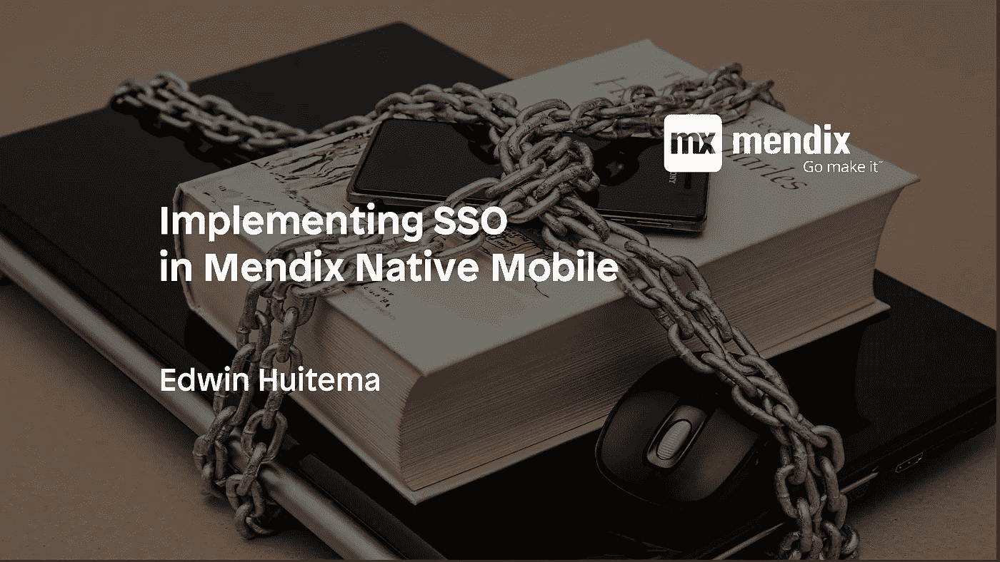
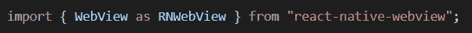
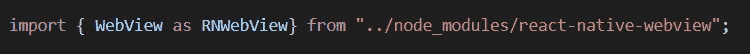
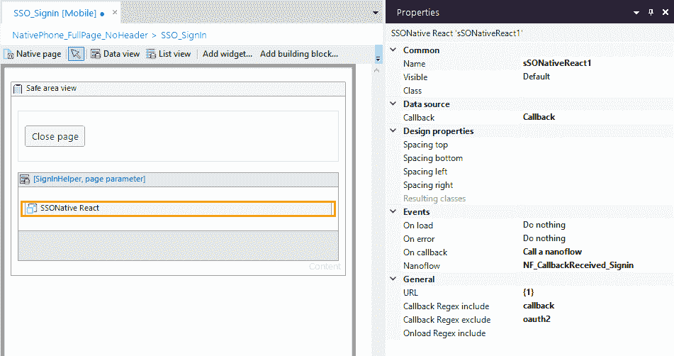
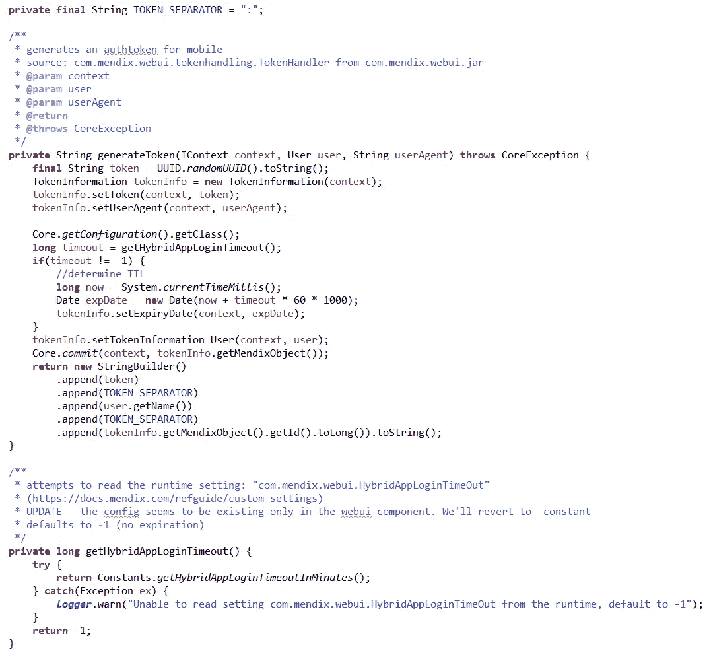
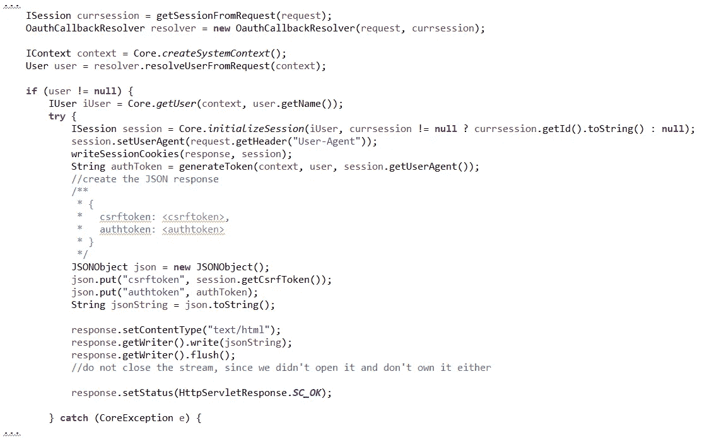
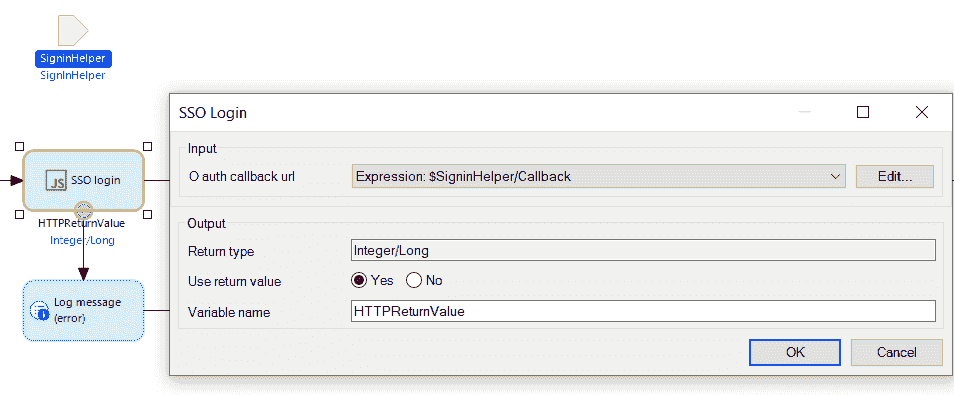
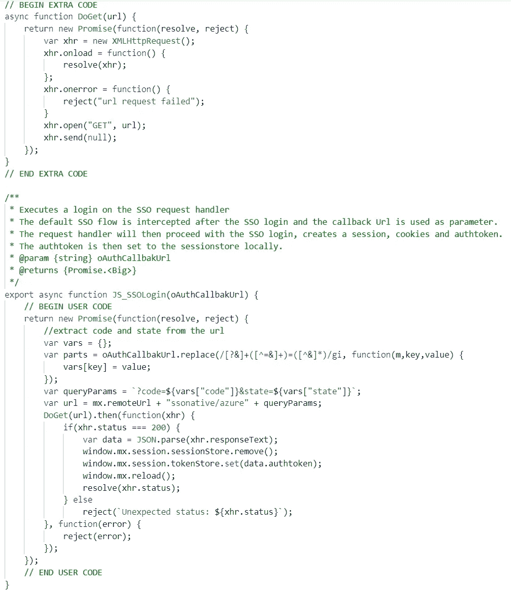
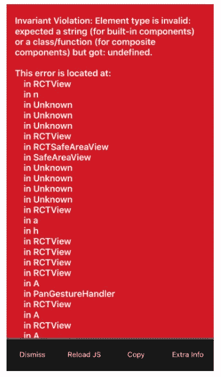

# 在 Mendix Native Mobile 中实现单点登录

> 原文：<https://medium.com/mendix/mendix-native-mobile-with-sso-3b86b962a899?source=collection_archive---------0----------------------->



## 最近，我被要求帮助一个项目，在一个本地移动 Mendix 应用程序上实现单点登录。我喜欢这些问题。他们允许我花一些时间学习新东西，帮助客户解决特定的技术挑战。

由于没有太多关于这个话题的信息，我决定写这个(相当技术性的)博客，分享我的旅程和学习。

该客户所需的单点登录需要使用 OAuth2 协议在 Azure Active Directory 上实现。

这种 SSO 实现的主要挑战是我们要处理两种技术栈。一个是原生移动应用，使用 React native，另一个是 web 环境，处理 Azure 上的登录过程。

该项目最初是在 Mendix 8.5.0 中开发的，后来迁移到了 Mendix 8.9.0。随着 Mendix 8.9.0 的推出，React 本地库出现了一些突破性的变化，这些库已经升级到最新的 0.61 版本。这次升级是一个非常好的改进，需要一些改变，但更多的在后面。

# 第一章:开始

那么，从哪里开始呢？Mendix 善意地指出，该解决方案可能需要一个定制的小部件来登录，使用 React 本地应用内浏览器组件。这个应用内浏览器可以处理 IdentityProvider (IdP，在我们的例子中是 Azure)上的初始登录。登录后，返回的信息应该在 Mendix 本地移动应用程序中以某种方式获得，并用于完成登录过程。这种方法与使用 SSO 的 Mendix 混合离线移动应用程序非常相似。

在这里阅读更多信息:[在一个混合应用程序上使用 Mendix & SAML](https://docs.mendix.com/howto/mobile/implement-sso-on-a-hybrid-app-with-mendix-and-saml) 实现 SSO。

这些信息为我开始自己的旅程提供了一个很好的起点。

# OAuth2

重要的事情先来。让我们在 Mendix 中设置一个到 Azure 的连接，以允许用户使用 OAuth2 用他们的 Azure 帐户登录。

一旦你知道如何在 Azure 中使用 OAuth2 协议，实现起来并不困难。在微软网站、 [OAuth2 和 Active Directory](https://docs.microsoft.com/en-us/azure/active-directory/azuread-dev/v1-protocols-oauth-code) 上有一篇关于这个主题的精彩文章。

简单来说，OAuth2 流程的工作方式如下。首先，在/oauth2/authorize 路径上浏览或重定向到[https://login.microsoftonline.com](https://login.microsoftonline.com)以请求授权码，并提供 oauth2 设置细节，包括回调 url。登录 Azure 后，Azure 使用授权码重定向到回调 url。接下来，在接收服务器端，使用授权代码从/oauth2/token url 请求访问(和刷新)令牌。返回的令牌(id_token)是一个 JSON Web 令牌(JWT ),它包含签名用户的信息。JWT 还包含访问和刷新令牌，该令牌可以用作其他 OAuth2 使能服务的承载令牌。

# 门迪克斯的 OAuth2

Mendix 应用商店提供了一个 Oauth2 模块，由 FlowFabric 开发，可以在这里找到:[开放认证模块](https://appstore.home.mendix.com/link/app/1414/)。该模块处理 Mendix 中的 OAuh2 流。

它在 Mendix "/sigin "中使用一个定制的 requesthandler 来设置 OAuth2 到 Azure 的流程。requesthandler 向 Azure 的/oauth2/authorize url 返回 HTTP 重定向响应，以便浏览器重定向到 Azure，用户能够登录。

登录后，Azure 使用提供的回调 url 将浏览器重定向回 Mendix。回调 url 由自定义 request handler“/callback”获取。该处理程序使用包含的授权代码从 Azure 获取 JWT，并将其传递给微流中的自定义签名，以验证用户并设置正确的角色。

最后，创建一个 Mendix 用户会话，由 requesthandler 返回给浏览器，以授予对应用程序的访问权限。

# 继续前进

因此，在 OAuth2 设置完成后，旅程的下一步将是从 Mendix 本地移动应用程序重定向到 Azure OAuth2 url，以开始登录。

React 本地移动应用程序不是在浏览器中运行的 web 应用程序。因此，不可能立即重定向到 Azure 进行登录。Mendix 提供了一个应用内浏览器小工具来解决这个问题，并允许我们连接到网络。

然而，当 OAuth2 流完成时，我们在应用内浏览器中结束了一个登录会话，但不是在本地应用本身中。

注销时也存在类似的问题。注销将首先在 Azure 上处理。注销后，用户还必须在本机应用程序中注销。

总而言之，下一个挑战是在登录后在本地应用程序中创建一个 Mendix 会话。为了克服这个挑战，我决定编写一个定制的小部件，实现一个定制的应用内浏览器。

# 第 2 章:小部件(8.5.0)

我首先考虑的是找出我可以将哪个 React 本地组件用作应用内浏览器，并将其包装在一个定制的小部件中。该组件应该能够拦截网址，最好有能力在浏览器的网页中执行 JavaScript。

# React-native-webview

在互联网上快速搜索了解到，来自 React-native-community([React native community](https://github.com/react-native-community))的 React-native-webview([React-native-webview](https://github.com/react-native-community/react-native-webview))将是最合适的组件。

它提供了各种有趣的属性和方法，例如:

*   *injectJavaScript* —很棒的特性，例如从加载在浏览器组件中的网站获取信息
*   *停止加载* —对于停止加载过程非常有用，这可能会阻止脚本执行、重定向等
*   *onNavigationStateChange*—允许拦截 URL 加载的事件。非常方便的拦截重定向。正是我们需要的。
*   *onLoadEnd，onError* —用于内务处理的事件，可以通知小部件加载操作完成或发生了错误。

# 小部件设置

使用 Mendix 小部件设置指令([构建可插拔 web 小部件](https://docs.mendix.com/howto/extensibility/create-a-pluggable-widget-one))，可以很容易地使用 CLI 命令启动新的本地移动可插拔小部件项目:

```
yo @mendix/widget
```

注意:使用“TypeScript”作为编程语言，使用“For native mobile apps”作为小部件类型(显然)

生成的小部件项目带有一个 *package.json* 文件。这个文件包含一个有趣的部分“devDependencies”，它为依赖库提供了各自的版本。特别注意:

```
"@mendix/pluggable-widgets-tools": "8.7.0"
"@types/react-native": "0.57.56"
```

因为当我们在第 4 章稍后切换到 Mendix 8.9 时，这些需要升级。

接下来，使用 CLI 命令向我们的项目添加 react-native-webview 组件:

```
npm install react-native-webview --save
```

# 小部件功能

小部件实现本身非常简单。它可以拦截 url 更改，并使用 url 上的正则表达式来确定是否应该调用 onCallback 操作。注意，该动作只能是纳流；本机移动设备不支持微流。

onLoadEnd 事件也有类似的实现，当加载的 url 与某个正则表达式匹配时，就会调用 onLoad 操作。这对注销过程很有用，因为它可以检测用户何时完成在 Azure 上的注销。

完整的小部件源代码可以在这里找到: [SSO 原生 React 小部件](https://github.com/FlowFabric/SSONativeReact-890/)。注意，这已经是 Mendix 8.9.0 的升级版了。

# 怪癖

在我们的小部件中使用 react-native-webview 组件变得很棘手。最初，WebView 组件通过以下 TypeScript import 语句加载到我们的小部件源代码中:



因为我们在项目中安装了这个组件，而没有明确的版本，所以添加了最新的版本，代码可以很好地编译所有的特性。

不幸的是，应用程序在使用小部件时产生了一个错误。经过一些检查，发现 Mendix 已经打包了这个组件的一个旧版本(5.12.1 ),它没有提供所有想要的特性。

这个问题的解决方案是从安装新版本的项目路径中显式引用组件。这将强制在我们的小部件中加载新版本。



# 小部件使用

现在我们已经编写了小部件，让我们看看如何在 Mendix 项目中使用它。



在这个屏幕截图中，小部件被放置在一个带有 SigninHelper 对象的 DataView 内的页面上。

该小部件提供了以下附加自定义属性:

*   *回调*:包含被拦截 url 的属性
*   *加载时*:当加载的 url 与“Onload Regex include”中的正则表达式模式匹配时，触发此事件
*   *On error* :该事件在组件产生错误时触发。
*   *回调时*:当拦截的 url 与“回调正则表达式包含”和“回调正则表达式排除”中的正则表达式模式匹配时，触发此事件
*   *URL* :这是一个文本模板，包含小部件启动时加载的初始 URL。
*   *回调正则表达式包含*:在拦截的 url 上匹配的正则表达式。拦截的 url 必须与此模式匹配
*   *回调 Regex exclude* :在拦截的 url 上匹配的正则表达式。拦截的 url 不能与此模式匹配
*   *Onload Regex include* :在加载的 url 上匹配的正则表达式。加载的 url 必须与此模式匹配

在上面的截图中，小部件是为用户登录而设置的。

SigninHelper 对象提供回调属性，该属性由回调属性中的小部件使用。

小部件的 URL 属性包含“<mendix server="">/sign in”URL。这将启动 Mendix 中的 OAuth2 流，用户将被重定向到 Azure 站点进行登录。</mendix>

小部件的回调拦截设置为只拦截从 Azure 返回 Mendix 的重定向。更详细地，当检测到 url 改变并且 url 包含“callback”而不包含“oauth2”时，调用纳流:NF_CallbackReceived_Signin。nanoflow 在回调属性中接收带有截取的 url 的 SigninHelper 对象。

当 nanoflow 被执行时，我们已经到达了一个交接点，来自小部件的信息(即带有经过验证的 Azure 登录和来自回调 url 的验证码的 webbrowser)流回移动应用程序。

这使我们进入下一步，最后的布线。

# 第 3 章:最终布线

因此，我们已经成功地在 Azure 中登录了用户，并拦截了来自 Azure 的带有验证码的回调 url。所有这些都可以在我们的 Mendix 本地移动应用程序中找到。移动应用程序现在需要一个 Mendix 会话和一个由 Mendix 提供的身份验证令牌才能正常工作。

## 认证令牌？

认证令牌，它到底是什么？简单地说，这个令牌被移动应用程序存储和使用，作为一种长期的身份验证机制。一旦本地存在有效的令牌，用户就不需要每次启动应用程序时都登录。

## 认证步骤

在 Mendix 服务器端需要采取以下步骤:

*   使用回调 url 中提供的身份验证代码从 Azure 获取访问令牌
*   在 Mendix 中验证并查找来自 Azure 的已登录用户
*   将用户角色分配给 Mendix 用户
*   为 Mendix 用户创建 Mendix 会话
*   创建要在移动应用程序中使用的身份验证令牌。向移动应用发送 Mendix 会话和认证令牌

最后，在 Mendix 本地移动应用中:

*   将移动应用程序重定向到主页，这将为登录用户加载主页。

请记住，我们使用的是 Mendix 8.5.0，它还不具备从纳流中调用微流的能力(可从 Mendix 8.8 和更高版本中获得)。这意味着 nanoflow 不能直接调用服务器端逻辑。因此，我决定编写一个自定义请求处理程序，可以从移动应用程序中的自定义 JavaScript 操作调用它。

# 自定义请求处理程序

定制请求处理器将执行上述所有服务器端步骤:

*   从 Azure 获取访问令牌
*   使用微流程在 Mendix 中查找/验证用户并分配用户角色
*   为 Mendix 用户创建 Mendix 会话
*   生成身份验证令牌。
*   返回 Mendix 会话(作为 cookie)和身份验证令牌(JSON)

# 认证令牌研究

由于 Mendix 文档中没有描述如何生成令牌以及如何在移动应用程序中处理它，所以我做了一些研究。

我首先想到的是当 Mendix 处理一个普通的登录请求时，从 Mendix 发送回移动应用程序的 JSON。看起来是这样的:

```
{
   csrftoken: <csrftoken>,
   authtoken: <authtoken>
}
```

authtoken 是下一个研究课题。我创建了下面的 Java 代码，它以与 Mendix 相同的方式生成令牌。



# Requesthandler 结果

下面的 Java 代码片段很好地总结了请求处理程序的任务。



*   OAuthCallbackResolver 类从请求处理程序 url 获取验证码，调用 Azure 的 oauth2/token url 来接收访问令牌，并通过调用包含解析用户的逻辑的微流和为用户分配角色来解析 Mendix 中的用户。
*   为解析的用户初始化会话
*   会话被写入会话 cookie，该 cookie 将在请求处理程序响应中发回
*   生成认证令牌
*   JSON 对象是用创建的会话中的 csrf 令牌和生成的身份验证令牌构建的
*   JSON 在请求处理程序的响应体中返回

# 调用请求处理程序

让我们回到 Mendix 本地移动应用程序。在前一章中，我们结束了从 Azure 接收回调 url 的 nano flow NF _ callback received _ sign in。

为了从我们的 nanoflow 调用请求处理程序，将使用一个 JavaScript 动作，它还处理来自请求处理程序的 JSON 响应。

JavaScript 动作的输入是来自 Azure 的回调 url。



JavaScript 动作将从收到的 url 中提取 Azure 身份验证代码，并使用该代码调用请求处理程序。然后处理来自请求处理程序的结果 JSON。

# 并且 authtoken 将被授予…

在移动应用程序中本地处理 authtoken 是另一个研究课题。通过检查 Mendix 为本地移动应用程序生成的捆绑 javascript 文件，我发现接收到的 authtoken 是按如下方式处理的:

```
window.mx.session.sessionStore.remove();
window.mx.session.tokenStore.set(data.authtoken);
window.mx.reload();
```

reload()语句将导致应用程序重新加载并返回到主页。因为此时有一个有效的会话 cookie 可用，所以用户被重定向到他们配置的主页。

# 产生的 JavaScript 动作



# 第 4 章:Mendix 8.9.0

在完成这个 SSO 解决方案后不久，项目转移到了 Mendix 8.9.0。这在原生手机上引起了一些突破性的变化，如下所述:[发布说明 Studio Pro 8.9](https://docs.mendix.com/releasenotes/studio-pro/8.9#890) 。

# 自定义小部件更改

还记得我在第二章小部件设置部分的 *package.json* 文件中提到的两个感兴趣的库吗？

React Native 0.61 的升级意味着这些库需要升级到更高的版本。我们如何做到这一点？

当然不是在文件本身，而是用 npm。在 CLI 中运行以下命令:

```
npm install @types/react-native@0.61.23 --save-dev
npm install @mendix/pluggable-widgets-tools@8.9.0 --save-dev
```

注意:以管理员身份运行 CLI 以防止出错…

那么，现在这个小部件运行在 Mendix 8.9 上，它完成了吗？几乎..当应用程序启动并加载我们的自定义小部件时，旧的错误再次出现。



为什么？在 Mendix 8.9.0 中，打包的依赖 react-native-webview 库也升级到较新的版本 8.1.2。我们对这个库的 import 语句不再指向特定的项目文件夹，而是需要替换为:


# 这是一个总结

我在这段旅程中获得了很多乐趣，一路上学到了新的东西。很高兴看到许多主题和技术融合在一个单一的顺利工作的解决方案。这就是我认为与 Mendix 合作的伟大之处，一切皆有可能！

去做吧！

# 还有一点..

在自定义小部件中，我使用了字符串属性的文本模板(参见:[可插拔小部件 TextTemplate 属性](https://docs.mendix.com/apidocs-mxsdk/apidocs/property-types-pluggable-widgets#texttemplate))。这些都很棒，因为它们既可以包含静态文本，也可以包含属性中的动态文本。需要记住的一点是，这些是特定于语言的。是的，你猜对了，最初使用的语言是你的移动设备上设置的语言。如果你想知道为什么应用程序在某个设备上运行良好，而在另一个设备上却不能运行…记住文本模板语言依赖。

# 进一步阅读

这篇文章简要地涵盖了许多主题。如果您想了解更多信息，以下链接可能会有所帮助。

*   点击这里了解更多关于在混合移动应用上实现单点登录的信息:[https://docs . mendix . com/how to/mobile/implement-SSO-on-a-hybrid-app-with-mendix-and-SAML](https://docs.mendix.com/howto/mobile/implement-sso-on-a-hybrid-app-with-mendix-and-saml)
*   在这里了解更多关于 OAuth2 和 Active Directory 的信息:[https://docs . Microsoft . com/en-us/azure/Active-Directory/azuread-dev/v1-protocols-oauth-code](https://docs.microsoft.com/en-us/azure/active-directory/azuread-dev/v1-protocols-oauth-code)
*   查看 Mendix 应用商店中的 OAuth2 模块:[https://appstore.home.mendix.com/link/app/1414/](https://appstore.home.mendix.com/link/app/1414/)
*   了解 React native React-native-webview 组件的更多信息:[https://github . com/React-native-community/React-native-webview](https://github.com/react-native-community/react-native-webview)
*   了解更多关于 React 土著社区的信息:[https://github.com/react-native-community](https://github.com/react-native-community)
*   在这里了解更多关于创建自定义本机小部件的信息:[https://docs . mendix . com/how to/extensibility/build-Native-widget](https://docs.mendix.com/howto/extensibility/build-native-widget)
*   在这里了解更多关于可插拔部件的信息:[https://docs . mendix . com/how to/extensibility/pluggable-widgets](https://docs.mendix.com/howto/extensibility/pluggable-widgets)
*   自定义小部件的源代码:[https://github.com/FlowFabric/SSONativeReact-890/](https://github.com/FlowFabric/SSONativeReact-890/)
*   在这里了解更多关于 Mendix 8.9 的信息:【https://docs.mendix.com/releasenotes/studio-pro/8.9#890 
*   了解更多可插拔小部件 TextTemplate 属性:[https://docs . mendix . com/API docs-mxsdk/API docs/property-types-Pluggable-widgets # text template](https://docs.mendix.com/apidocs-mxsdk/apidocs/property-types-pluggable-widgets#texttemplate)

# 关于我

我是一名经验丰富的顾问，拥有超过 7 年的 Mendix 经验和超过 25 年的软件开发经验。目前，我在 Flowfabric/ Mansystems 担任 Mendix 架构师和首席开发人员。