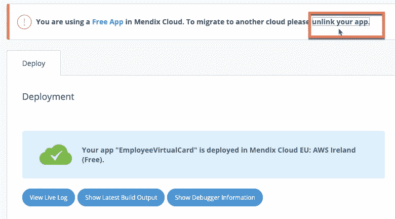
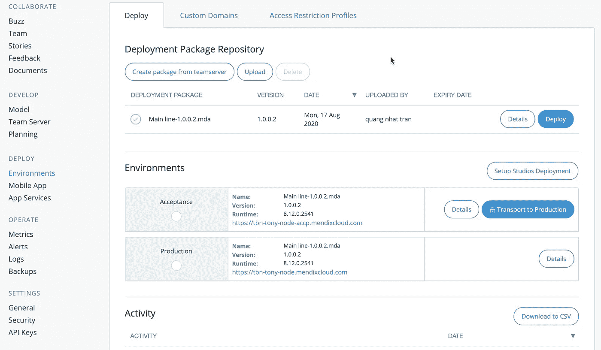
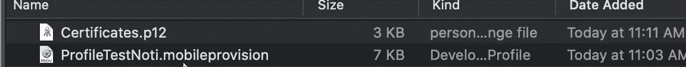
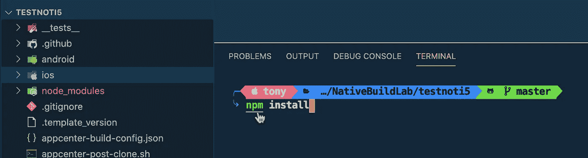

# Mendix 本地推送通知实用

> 原文：<https://medium.com/mendix/mendix-native-push-notification-practical-929951b59398?source=collection_archive---------0----------------------->

使用 firebase 为 ios 和 android 推送通知，这比本地通知更复杂。我正在使用 Mendix 版，并使用本机快速入门模板创建一个新项目。首先，我们需要在 Mendix Appstore 中安装 2 个模块。

*   社区共享
*   加密

most of the app store modules will save under this folder, under the project

我们需要配置加密密钥常量。该值需要包含 16 个字符。

需要添加的重要模块是“推送通知连接器”

**让我们开始对原生模板中的推送通知模块进行一些配置。**

*在 Home_Native 添加 app 事件*

为“加载”和“恢复”调用相同的微流

创建一个新实体，将其命名为“NativeNotification ”,并使用 String(200)创建一个属性“objectGUID”。

创建一个 nanoflow 来创建一个 NativeNotification 对象，并在最后返回它。

在 Home_Native 页面上，将“Data View”小部件添加到页面中，将数据源设置为 nanoflow，并使用上面的 nanoflow。

在数据视图中添加“通知”小部件。只需右键单击橙色高亮矩形，然后选择添加小部件。您可以输入搜索以快速查找。

现在，双击通知。为 GUID 选择一个属性。输入动作名称为“推送”。然后我们将回头定义如何处理这个动作

我们转到导航，并在 web responsive 中添加一个新的菜单项。

应该同步所有未使用的实体，在本机配置文件中下载所有对象

创建 2 个纳流，ACT_OnReceive 和 ACT_OnOpen。每个操作都会创建不同的日志信息。

现在回到 Home_Native，双击“Notification”小部件，用上面的这两个纳流映射动作。无论如何，您需要记住通知操作的名称。我们从一开始就把它命名为“推”。

运行本地和开放 web 响应配置 firebase。

打开 Firebase 控制台创建一个新项目，不要选择分析，因为这将花费一些预算。

打开推送通知管理页面，在 FCM 部分创建一个新的 FCM 项目。

要找到项目 id，请转到 firebase 控制台并从该菜单中获取它，然后

关键 JSON 怎么样。您可以从项目中生成它。

毕竟还是省省吧。

对于 Android 和 IOS，请选择此项

现在，您需要创建 Github 个人访问令牌和应用中心令牌 API 密钥。这部分由于安全原因，我不能展示图片。你可以谷歌一下如何做到这一点。

***查看 Mendix 本地构建器参考文档，并按照说明***

 [## Native Builder — Studio Pro 8 指南| Mendix 文档

### 请更新到 Native Builder 3 . 2 . 1 版。Native Builder 3 . 2 . 1 版包括解决 GitHub 的…

docs.mendix.com](https://docs.mendix.com/refguide/native-builder) 

***在本站获取 nativebuilder.exe 文件***

 [## 本地构建者

### Dropbox 是一项免费服务，可以让你将照片、文档和视频带到任何地方，并轻松分享。从不发电子邮件…

www.dropbox.com](https://www.dropbox.com/sh/hpw7sshut9bco68/AABackrr75rPSgW7u5LBMkMra?dl=0) 

命令应该是这样的。注意图标应该在 ***1024x1024、*** 处，闪屏应该在 ***1440x2560*** 、**处，当你看到——，这表示 2 个破折号。**

## 将包准备到 GitHub 和应用中心的脚本。

*native-builder.exe prepare—github-access-token yourkeyhere—app center-API-token yourkeyhere—Java-home " C:\ Program Files \ Java \ JDK-11 . 0 . 8 "-MX build-path " C:\ Program Files \ Mendix \ 8 . 14 . 0 . 6148 \ modeler \ MX build . exe "-project-path " E:\ Mendix \ testtraining day 4-main \ testtraining day 4 . MPR "-project name test day 4—app-identifier "*

如果一切正常，您将获得以下结果

## ios 的配置授权

*native-builder.exe 配置 ios 添加-授权-项目名称测试日 4-授权通知*

## ios 的配置背景模式

*native-builder.exe 配置 ios 添加-背景-模式-项目名称测试日 4-模式通知*

## 现在，我们可以为测试构建应用程序了

*native-builder.exe 版本—项目名称测试日 4 —应用程序版本“1 . 0 . 0”—版本号 1*

这需要一些时间来完成，我想大约 5-10 分钟。这个以后应该会改进，开发者可以在 studio pro 上搭建。

如果成功，那么您将会在与本地构建器文件夹相同的目录中找到文件夹构建

或者，您可以到应用程序中心进行构建，这需要几分钟时间，完成后，您可以看到下载按钮。

构建完成后，您可以下载 apk 文件。并提交回 Github

在使用 Firebase 的推送通知中，我们需要考虑一个技术架构，我们需要服务器通过 SSL 握手与服务器进行通信。因此，您不能通过在本地运行 Mendix 来发送消息。如果你这样做，它会给你一个错误 403。

我们可以将 Mendix 部署为免费云。但是，我想把 Mendix 云节点作为一个许可节点来介绍。

在您的组织帐户下，选择节点。如果您使用的是企业许可证，应该有节点菜单。

让节点连接到您的 Mendix 应用程序。我想分享一个重要的注意事项，你的应用程序应该在节点能够像这样识别之前断开与免费云的链接

## 如何解除你的应用的链接，并将其从免费云中释放。

在你的开发者账户下进入 Mendix home 的“我的应用”。在“环境”菜单中，您可以在顶部看到“取消应用链接”。

点击这个后，弹出窗口会显示出来，然后按我高亮显示的按钮。您将看到一个持续弹出窗口，要求进行身份验证。

然后你按下“发送短信”。它将发送到您添加到开发人员个人资料中的手机上。

您将看到弹出窗口进行验证。

它会一直要求确认

然后再确认一次

大家都会认为这一步就完成了。然而，这还没有结束。您需要再次单击“取消链接”。

当你点击这个弹出窗口后，你的免费应用就会被解除链接

现在您可以选择节点

## 选择节点后。

当您的应用程序成功连接到节点时，您的屏幕将如下所示

为了进行部署，我们需要像往常一样创建一个新的包。然后点击部署。这将是验收比生产的顺序。我的节点只是一个简单的，对于大的，你可能在验收环境之前有一个测试环境。

让我们看一下验收环境的细节。在 Model Options 选项卡上，可以看到我们刚刚在 Mendix studio pro 上配置的所有信息都将出现在该屏幕上。

## 本机构建器注意事项

***每次在 Mendix Studio Pro 中进行更改并重新部署时，都需要再次运行 nativebuilder.exe 准备和构建。否则，它不会反映你做了什么。***

现在，您可以测试推送通知 Android 应用程序了。

输入信息，然后发送。

您将在下面的视频中看到类似这样的消息。

## iPhone 怎么样。

iPhone 更多的是关于安全性，这是它的本性。我们需要一个签名密钥来创建一个. ipa 文件。

签名构建需要 2 个文件

*   ***配置文件。移动预配***
*   ***证书. p12***

***我们需要一个苹果开发者账号和安装了 Xcode 12 的 MacBook。***

首先，我们需要使用允许推送通知的 app id 选项创建一个标识符。按照下面的步骤

***苹果开发者账户上的标识符***

***使新配置文件包含标识符、证书和设备***

***通过 macOS 钥匙扣*** 导出开发者证书

***最后，我们还有 2 档***

***然后在构建配置下添加应用内中心，然后按“保存并构建”。***

***如何手动建立***

复制 git hub 源代码路径，并在本地克隆它。

如果您的计算机上没有安装 pod，请安装它

用 VSCode 打开您的项目

运行此命令

然后 cd 到 ios

运行此命令

哎呀，有人会像我一样得到这个错误

为什么？因为路径不是指向 Xcode 的点。

要解决这个问题，你必须这样做

然后再次运行下面的命令

然后再次运行 pod 安装

现在使用 Xcode 打开所有 ios 文件夹

然后选择签名

然后只需按下按钮建立

现在，您可以返回 web 后端来推送测试消息。

哎呀，您出错了。

对此的解释是。为了让 FCM 向 IOS 推送通知，我们需要 APNS。这是一项关键服务，我们需要在 Apple 开发者帐户中创建它。获得密钥下载后，您可以添加到 ios 应用程序的“云消息”下的 firebase 项目中

我们开始吧

文件格式应该是这样的

回到 firebase 控制台，将. p8 上传到 firebase 控制台。定义您的. p8 key id 和 Apple 开发团队 id(在您的个人资料下)。如果不能立即添加，只需刷新并再次回来添加即可。

我们再推一次。

结果可能会像下面这个视频。

仅此而已。

下次在 google play 和 apple store 上构建时再见。