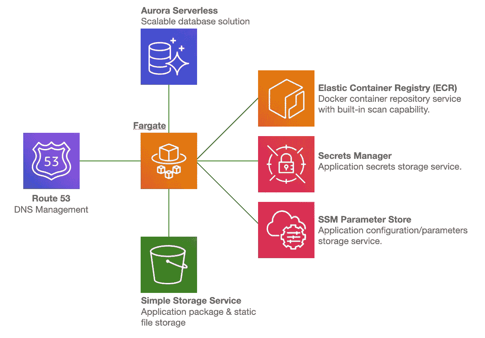

# 面向公民开发者的 Mendix on AWS

> 原文：<https://medium.com/mendix/mendix-on-aws-for-citizen-developers-61a9571ac35f?source=collection_archive---------4----------------------->

# 几个月前，我在一次 Mendix 会议上谈到了 Mendix 和 AWS，以及如何利用 AWS 的力量为您的 Mendix 用户实现不同的目标。在本文中，我将介绍组织中的公民开发人员，以及克服他们面临的一些常见挑战的方法。

对普通开发人员来说，三件重要的事情是:快速迭代、灵活性和保持尽可能低的运行成本。公民开发者通常构建供内部或有限公共使用的应用程序。因此，他们不必担心高可用性、可扩展性或备份和故障转移等因素。一旦应用程序获得利益相关者的支持或认可，这些方面肯定会变得重要。但不是在产品生命周期的这个阶段。另一个重要的方面，尤其是对于内部业务应用程序，是安全性。

我强烈支持开发人员了解他们使用的工具以及他们的应用程序将在其中运行的环境。也就是说，公民开发者关注的是产品和业务逻辑。我们在这里努力实现的是支持他们的过程。因此，下面讨论的基础设施方面应该由基础设施或 DevOps 能力来设置、配置和维护。

## **提议的解决方案**

上图是建议体系结构的简化图。它没有显示应用程序日志的去向(CloudWatch 日志)，也没有显示网络是如何配置的。但这对这次讨论来说并不太重要。

应用程序容器将在 AWS Fargate 上运行，并使用 Amazon Aurora 无服务器数据库集群。简单存储服务(S3)用于存储应用程序静态文件，也可以存储应用程序部署包。Route 53 是一种 DNS 管理服务，并不是严格要求的，但它是我们使用的。启动容器任务时，将从 ECR 中提取容器映像。数据库凭证和 API 密钥等应用程序机密是从 Secrets Manager 中提取的。而诸如日志级别和特定于环境的配置之类的应用配置是从 SSM 参数存储中取出的。与 Secrets Manager 和 Parameter Store 的集成在“任务定义”中指定，在“任务定义”中您可以指定容器的一些配置，因此不需要手动获取和设置机密和环境变量。

## **速度**

首先，我想看看快速迭代。作为开发人员，最令人恼火的事情之一是，做出一个更改需要 2 分钟，但部署该更改却需要 15 分钟。对于生产工作负载，这是没有商量余地的。质量很重要，运行所有必要的测试套件需要时间。另一方面，公民开发人员在不断地调整和测试，不想仅仅为了看看他们的改变是否如预期的那样工作而经历整个构建管道。有了 Docker 容器和一些 AWS 服务，解决方案就变得简单了。从一开始就将应用程序容器化还有一个好处，就是可以简化从 POC 到 SDLC 驱动的生产级应用程序的过渡。

通常，构建容器是为了保存应用程序及其所有依赖项。这个单一的实体将经历从开发到生产的各个阶段。然而，我提出一个稍微修改的方法。我们可以构建一个容器来容纳 Mendix 应用程序运行所需的一切，而不需要实际的应用程序部署包。容器启动后，入口点脚本将从亚马逊 S3 获取部署包，并启动应用程序。是的，这会增加应用程序的启动时间。虽然这对于生产来说是不理想的，但在这个阶段并不重要。这个过程不需要开发人员运行带有容器构建和部署步骤的管道，他们所要做的就是上传一个新的部署包。您甚至可以更进一步进行设置，以便容器通过构建 API 直接从 Mendix 构建服务器获取部署包。

我运行了一个快速测试来检查管道方法和我提出的解决方案之间的速度差异。在测试环境中，从管道执行开始到容器运行通常需要 10 到 15 分钟。在这段时间内，部署包从亚马逊 S3 被拉到构建服务器上，容器被构建并推送到容器存储库(ECR)，任务在 AWS Fargate 上达到运行状态。相比之下，从集装箱启动到能够提供交通服务大约需要 3 分钟。这可能看起来不是很多时间，但是当你处于“最佳状态”时，你最不希望的就是有什么东西打破你的速度。我想强调的是**对于运行在生产环境中的应用程序来说，这是绝对不应该的**，但是对于这个用例来说，这是非常有用的。

## **灵活性**

现在让我们把注意力转移到灵活性上。假设开发的应用程序正在组织内获得牵引力，并快速获得用户。或者测试数据集相当大，并且还在增长。这导致应用程序运行缓慢，陷入困境。如果环境限制对利益相关者的批准产生负面影响，那将是不幸的。如果我们点击一下按钮就能投入更多的资源来解决这个问题，那就太好了。嗯，我们可以！有了 AWS Fargate 和 Aurora Serverless，只需点击一个按钮并重启应用程序。

使用 Fargate，您可以指定容器需要的内存量、想要分配的 CPU 数量以及容器应该在网络中的什么位置运行。没有需要配置、管理或扩展的服务器。Aurora Serverless 可以随着 CPU 负载或连接的增加而扩展，而存储层会随着数据集的增长而自动扩展。

> **注；**尽管 Aurora Serverless 可以根据 CPU 负载或连接进行自动扩展，但我们发现强制更改数据库集群大小并重启应用程序更简单。

## **成本**

对于提议的体系结构中使用的大多数服务，成本计算很简单。如果它在运行，你就要付钱。如果不是，你就不要。这意味着，只需在环境不使用时将其关闭，即可将成本保持在最低水平。这一步甚至可以自动化。通过利用一些简单的指标，如容器的 CPU 或内存利用率，或者应用程序上的登录用户，您可以设置 CloudWatch 警报来触发伸缩事件。例如，这个缩放事件可以在超过 30 分钟无人使用时关闭应用程序。当没有到 Aurora 无服务器数据库的活动连接时，它也会在指定的时间后自动关闭。只需做一点点工作，您就可以将应用程序配置为在有人调用 URL 时自动启动，这又会自动启动数据库。

自动化的做事方式需要一些努力，但是我发现这通常是值得的。如果你使用云编队，你只需要做一次。AWS 还以“现货”定价和“节省计划”的形式提供了两种节省 Fargate 工作负载成本的选择。现货价格比正常的 Fargate 价格便宜大约 75%,但集装箱价格随时可能下跌。有一个 2 分钟的警告，但它并不真正适合无法承受停机时间的应用程序。当您知道每个月将在所有工作负载上使用一定量的 Fargate 资源时，就可以制定节省计划。然后，您可以购买一个储蓄计划，比如说，每月 10 个 CPU 和 20 GB 内存，承诺 1 年或 3 年。您也可以选择不预付、部分预付或全部预付储蓄计划。

**安全性** 谈到安全性，有几个部署决策将决定需要采取哪些措施来确保环境安全。因此，我不打算在这里谈论像警卫或检查员的服务。我也不会谈论安全的网络配置，比如使用 VPC 端点提供服务。相反，我将把重点放在所使用的特定服务的安全性方面。提议的架构利用了几个“完全托管”的 AWS 服务——S3、Aurora 无服务器、ECR、秘密管理器和参数存储。有了这些服务，我们不需要访问底层操作系统，也不需要保护、修补或更新任何东西，我们只需与服务进行交互，AWS 会为我们处理所有这些事情。我们唯一要担心的与安全相关的方面是保护对服务的 API 调用，以及在 Aurora 无服务器的情况下，保护数据库连接。这很容易实现，方法是锁定数据库，使其只能从 VPC 内部访问，最好只能从应用程序访问，并利用 IAM 角色来保护对 AWS 服务的调用。

AWS Fargate 是唯一需要客户方工作的服务。由于客户可以完全控制容器中部署的内容，因此客户有责任确保其安全性。作为弹性容器库(ECR)的一部分，每天每个图像有一次免费的容器图像扫描。此功能执行映像漏洞扫描，并报告任何易受攻击的容器操作系统软件包及其严重性。设置自动每日扫描和报告相对简单，并且可以确保容器操作系统始终处于安全状态。如果检测到漏洞，DevOps 能力可以简单地解决问题并推送新的映像。此扫描不包括应用程序包，但是它们可以构建到部署管道中。

如果是内部项目，可以将这些环境部署为只能在公司网络内访问。大大降低了风险和攻击面。目标是使公民开发者能够在很少或没有依赖他人的情况下完成他们的工作。因此，利用考虑安全性和可伸缩性的服务是有意义的。

上面的架构图显示了单个 citizen 开发人员环境部署。这种设置的一个挑战是在 HTTPS 提供网页服务。

容器上必须安装 SSL 证书。像 Lets Encrypt 这样的服务会有所帮助，但是需要一些配置。应用程序通常部署在应用程序负载平衡器(ALB)后面，除非您要求对所有请求进行端到端加密，否则您可以在 ALB 处终止 SSL。Amazon Certificate Manager 可以提供免费的 SSL 证书供应用程序负载平衡器使用，并将每 13 个月自动更新证书。在所提出的解决方案中没有 ALB 的原因是因为它在不使用时不能关闭。因此存在持续的成本。如果将部署多个公民开发人员环境，运行 ALB 将成为一个选项。ALB 的成本可以在项目之间分摊，并且单个 ALB 可以将流量路由到多个环境。

## 结论

这篇文章着眼于为公民发展创造一个最佳的环境。虽然在生产工作负载中使用像 AWS Fargate 和 Aurora Serverless 这样的服务是非常好的，但是不建议将这种设置用于这种目的。这里介绍的所有内容的好处是，您可以将它们全部放入 CloudFormation 模板中，并创建该环境的副本。这意味着组织中的每个公民开发人员都可以拥有自己的环境。它将仅在使用时运行，并将根据每个开发人员的需求进行扩展。随着应用程序已经容器化，将项目从 POC 阶段提升出来变得非常简单。

## 阅读更多

 [## 无服务器计算引擎-AWS Fargate-亚马逊网络服务

### AWS Fargate 部署和管理您的应用程序，而不是基础架构。Fargate 消除了…的运营开销

aws.amazon.com](https://aws.amazon.com/fargate/)  [## 亚马逊 Aurora 无服务器| MySQL PostgreSQL 关系数据库|亚马逊网络服务

### Amazon Aurora 无服务器是 Amazon Aurora 的一种按需、自动扩展配置。它会自动启动…

aws.amazon.com](https://aws.amazon.com/rds/aurora/serverless/)  [## AWS 系统管理器参数存储

### 参数存储是 AWS Systems Manager 的一项功能，为配置数据提供安全的分层存储…

docs.aws.amazon.com](https://docs.aws.amazon.com/systems-manager/latest/userguide/systems-manager-parameter-store.html)  [## 开发者- Docker

### 世界领先的服务，用于与您的团队和 Docker 社区查找和共享容器图像。对于…

www.docker.com](https://www.docker.com/get-started/) 

*来自发布者-*

*如果你喜欢这篇文章，你可以在我们的* [*中页*](https://medium.com/mendix) *找到更多喜欢的。对于精彩的视频和直播会话，您可以前往*[*MxLive*](https://www.mendix.com/live/)*或我们的社区*[*Youtube PAG*](https://www.youtube.com/c/MendixCommunity/community)*e .*

*对于希望入门的创客，您可以注册一个* [*免费账户*](https://signup.mendix.com/link/signup/?source=direct) *，并通过我们的* [*学院*](https://academy.mendix.com/link/home) *获得即时学习。*

*有兴趣加入我们的社区吗？加入我们的* [*松弛社区频道*](https://join.slack.com/t/mendixcommunity/shared_invite/zt-hwhwkcxu-~59ywyjqHlUHXmrw5heqpQ) *。*