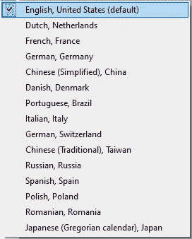
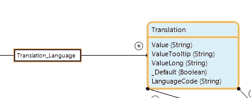
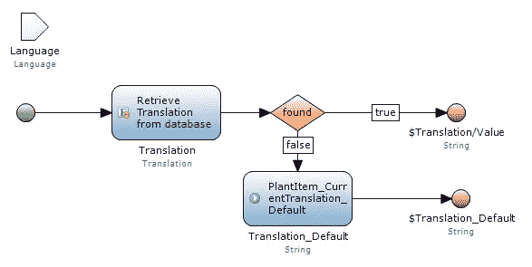
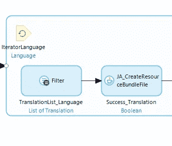
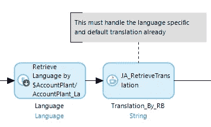

# Mendix:优化运行时语言翻译

> 原文：<https://medium.com/mendix/mendix-optimize-runtime-translations-ae6c7ec35dee?source=collection_archive---------0----------------------->

> 介绍

在这篇文章中，我将讨论运行时翻译，如何在 Mendix(开箱即用)中进行默认翻译，它的缺陷和提高性能的替代解决方案。

在我们当前的产品中，我们必须支持多种语言，以满足国际化需求。目前我们支持 15 种语言。整个产品可以通过现成的 Mendix 翻译功能轻松翻译。

IMAGE_1: Language list in our product

然而，在我们的产品中，我们开发了允许用户添加动态内容的功能，这些内容决定了屏幕上必须呈现的内容。例如，用户可以配置他们的实例，从预定义列表中添加复选框项目的动态列表。同样，他们也可以添加下拉菜单。我们允许用户添加每种语言的这些项目的翻译值。这些值必须按照用户的语言设置显示，这就是全部的目的。

> Mendix 开箱即用解决方案

我们有一个叫做翻译的实体，它现在和语言联系在一起。

IMAGE_2: Translation entity linked to language

然后，我们使用计算的属性，传递用户语言来获得用户语言的翻译。这是并发用户较少的小规模应用程序的救星。下面是我们用于计算属性的微流，它检索基于用户语言显示的适当翻译。

IMAGE_3: Retrieval of Translation provided language or retrieve default

> 开箱即用解决方案的问题

实际的问题是，我们必须将翻译实体与几个其他实体链接起来，以便根据实体的类型检索翻译，同时降低查询的复杂性。尽管如此，它仍然是复杂的。当一个实体与另一个实体相关联时，将会创建一个依赖关系表。因此，任何检索都必须通过连接经过 3 个表，这使得整个检索变得复杂。此外，计算的属性总是在每次检索期间执行。所以，如果有数据库调用，这肯定会影响性能。

> 替代解决方案

凭借我的 Java 经验，我想到了一种替代方法来实现这一点。这不仅减少了这种需求的数据库调用，而且提高了性能。在 Java 中，我们有一个叫做 ResourceBundle 的东西，用于国际化。这也是 Mendix 翻译公司的工作方式。在 model/i18n 下的部署文件夹中查看 Mendix 翻译。

IMAGE_4: Mendix generated ResourceBundle’s

我的解决方案是为定制翻译工具提供 ResourceBundle，以解决这个问题，并将翻译检索的数据库调用减少到零，并提高性能。

> 创建资源捆绑包

*   我写了一个微流，收集系统中每种语言的所有翻译。将翻译列表和语言一起传递给定制的 Java 程序

*   这个 Java 程序将确保为该语言创建一个包含所有可能值的 ResourceBundle。ResourceBundle 使用键=值对方法。于是，我决定用钥匙当<someuniqueid-for-translation>。值=<translation for="" that="" language=""></translation></someuniqueid-for-translation>

Custom generated ResourceBundle’s

*   根据给定的键和语言，编写另一个 Java 程序从 Resourcebundle 文件中检索翻译值。根据 IMAGE_3，在开箱即用的解决方案中，我们必须专门处理默认的翻译值逻辑。但是使用 ResourceBundle 方法，它已经被处理了。

*   注意:除了不涉及任何数据库调用或复杂的查询之外，这个检索逻辑仍然必须用计算属性来调用

> 使用此解决方案的优势

*   没有数据库调用，检索翻译几乎为零
*   提高性能
*   ResourceBundles 被缓存。因此，每次检索都不会进入文件系统

> 结论

希望这篇文章对那些想支持运行时翻译并遇到性能问题的人有所帮助。我故意避免在这里解释 ResourceBundle，因为这是一个需要一些 Java 专业知识的技术主题。如果你想自己尝试一下，我在 ResourceBundle 下面提供了一些链接。

> 参考

 [## Java 资源捆绑包类-Java point

### ResourceBundle 类用于国际化消息。换句话说，我们可以说它提供了一个…

www.javatpoint.com](https://www.javatpoint.com/ResourceBundle-class)  [## 资源包指南| Baeldung

### 许多软件开发人员，在其职业生涯中，面临着开发多语言系统或…

www.baeldung.com](https://www.baeldung.com/java-resourcebundle)  [## 资源包(Java 平台 SE 7)

### resource bundle public resource bundle()唯一的构造函数。(对于子类构造函数的调用，通常是隐式的。)…

docs.oracle.com](https://docs.oracle.com/javase/7/docs/api/java/util/ResourceBundle.html)