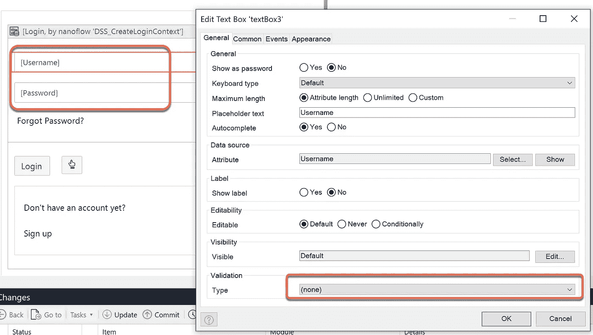
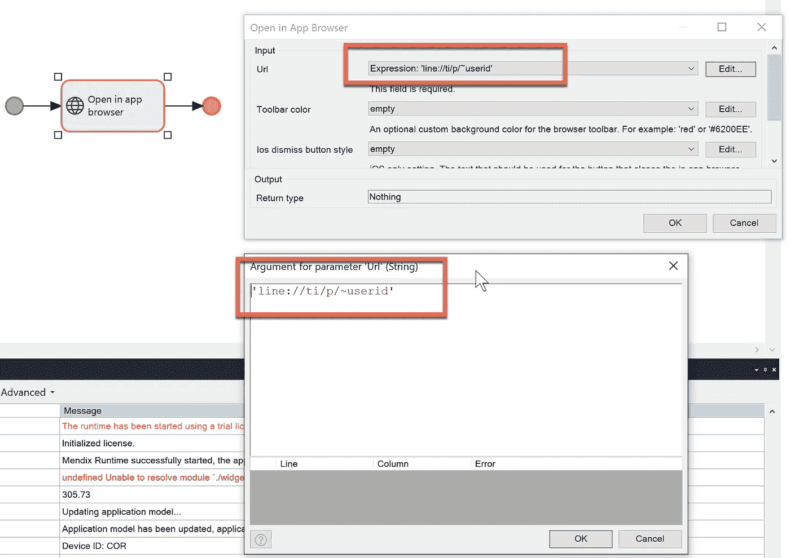

# 新的一年，本地移动的新开始

> 原文：<https://medium.com/mendix/mendix-the-beginning-of-native-mobile-cfdcf5eda969?source=collection_archive---------1----------------------->

**我们如何将手机登录与指纹或人脸识别结合起来？如何在地图中打开一个位置，或者调用一个 REST API？在这里，我将讨论如何掌握 Mendix Native Mobile 的一些最佳特性。**

让我们从 Mendix Studio Pro 中的原生移动快速入门应用程序模板开始。

Mendix studio 提供了几个安全级别，在本研究案例中，我们需要在生产级别启用该项目。

对于本机配置文件，目前在 8.13.1 版本中，我们只能使用角色库来导航特定角色的正确登录页面。

我们现在要做的第一件事是在登录屏幕上添加一个按钮，用于指纹和人脸识别。在一些智能手机两者都有的情况下，lib 将只使用指纹而忽略人脸识别。

默认情况下，本地移动的登录屏幕将验证用户名和密码的必填字段，因此我们不需要表单中的这种验证，我们应该删除它，验证的最佳方式应该放在登录按钮操作上。

Note: Do the same for the password field

在登录按钮，我们添加了一些逻辑来保存设备信息，由于当前版本中 nanoflow 的限制，我们无法在 Mendix Studio Pro 中设置调试断点(nanoflow 中的调试将在 Mendix 版本 9 中发布)。但是，我们可以使用日志消息活动将日志打印到 Mendix Studio Pro 中的控制台选项卡。

to get the device information and log the message after this

对于这个场景，我们需要使用用户名和密码进行第一次登录。在用户的使用过程中，如果他们没有清除数据或杀死应用程序，现有的登录信息应该仍然保留，他们可以通过指纹或人脸识别重新登录。为了保持现有的用户登录，我们使用“设置存储项对象”，该函数的作用类似于 react-native 异步存储。我们可以保存一个对象或一个对象列表。然而，这是用户便利性和应用程序性能之间的权衡。

我将在下一篇博客中解释 native builder，对于这篇文章，我使用了 Make it Native 应用程序，可以在苹果商店和谷歌 Play 中找到。目前，我使用安卓系统。登录成功后，会导航到基于用户登录角色的页面。在登录页面上，我添加了一个按钮来获取存储对象数据，它工作了。

要获取现有的存储对象，我们应该记住键，并将其映射回原始实体。

此时，应用程序有一个存储为“userObject”的对象，其中包含用户名和设备 ID，您可以改进以在对象存储中保留更多字段，我只想演示 Mendix 如何处理本地存储。现在，您退出并按下“手”按钮，通过指纹或面部识别重新登录。

您可以创建一个新的或更好的登录场景，这只是一个示例，提供在本地存储中检查用户的想法。下面的纳米流是手动登录背后的逻辑。

现在，我们完成了登录场景。

## 我们如何通过 mobile native 调用 REST 服务？

从 nanoflow 我们不能调用 REST 服务，我们需要调用一个微流，然后微流调用 REST 服务并将对象(非持久的)返回给 nanoflow。

这是一个例子，是使一个数据视图有一个源作为一个纳米流，这将调用来自 OpenWeather API 的天气服务。

" Nano_CallRestAPI "

the highlight rectangle is an activity calling a microflow

" ACT_GetWeatherData "

Call REST and return an object, this object should be non-persistence

快速看一下“Nano_CallRestAPI”处的最终返回，可以看到最终返回的对象是$Main，包含了 Temp，Temp_min，Temp_max。然后最后要做的是用文本映射属性。

## 怎么做旋转木马？

让我们想象这样一个场景，我们拍一张照片，然后将照片添加到从 system.image 继承的实体中。

然后使用 carousel 小部件来呈现我们刚刚创建的这些图像。

现在我们有了一个关于纳米流的新教训，这是它们如何与持久性实体交互的。下面的 nanoflow 直接向服务器端创建记录，返回对象“NewCameraImage”然后映射到“拍照”活动，假设它成功，然后我们可以直接向服务器端提交记录并同步所有内容。

## 如何当面开线聊天？

“*打开应用内浏览器*”是 nanoflow 中一个强大的活动，有了它，你就能打开 line、脸书、youtube，或者任何本地移动应用。你唯一需要做的就是提供一个应用内浏览器 URL。

## 如何开通线下聊天？

可以用不同 URL 模式打开家庭热线聊天

## 链接怎么分享？

从 nanoflow 获取任何文档文件 URL 或任何类型的 URL，并使用 Share activity，您可以将其与另一个移动应用程序共享。

## 如何打开地图，设置标记点？

打开带有标记和当前用户位置的地图。我们可以使用地图小工具。您可以将地图放入带有 nanoflow 源的数据视图中，以便从应用程序中获取动态数据。在这个例子中，我只想展示它是如何处理静态数据的。

## 如何制作邮件草稿？

使用纳流包含“电子邮件草稿”活动

## 如何导航到某个位置？

当您想要导航到某个地标名称时，这对于旅行应用程序很有帮助。

## 怎么打电话？

## 怎么发短信？

## 如何获取当前位置？

## 如何通过地标名称获取位置？

## 如何通过 lat 和 long 获取位置的名称？

