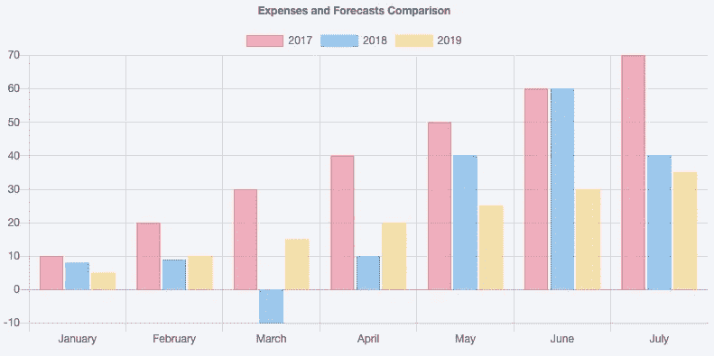

# Mendix 在 Applitools 黑客马拉松中名列榜首

> 原文：<https://medium.com/mendix/mendix-tops-chart-in-applitools-hackathon-971c0c6b7bda?source=collection_archive---------8----------------------->

几个月前， [Applitools](https://applitools.com/) 宣布了他们的在线'[appli tools Visual AI rock star Hackathon '](https://applitools.com/hackathon)。对于不知道 Applitools 的人；这是一家制作工具集的公司，该工具集可用于进行图像比较，以帮助测试自动化。其独特的卖点之一是，它使用人工智能进行智能比较，这有助于避免误报。它可以与大多数常见的测试自动化框架结合使用，如 plain Selenium、WebdriverIO 和 Cypress。

大多数传统的测试自动化框架都是面向测试你的网站的功能正确性，而不是验证它的视觉正确性。用这些框架测试视觉正确性需要你验证所有的 CSS 和 DOM 元素。即使这样，浏览器渲染仍然可能导致问题。Applitools 的想法是截屏比任何数量的 DOM 和 CSS 验证都要好。不仅仅是视觉验证，还包括大多数功能验证。最终，网站上的大多数操作都会导致用户界面的改变。

Applitools 最近在测试领域制造了一些噪音。他们还负责优秀的免费在线学习平台[测试自动化大学](http://testautomationuniversity.com/)。

## **黑客马拉松**

当我们了解到黑客马拉松时，Corina Zaharia 和我(Arjan Blok)决定参加比赛，学习一种我们以前没有经验的工具。黑客马拉松的任务包括 4 个部分:

1.  使用“传统的”方法，使用您想要的任何自动化库或框架，创建覆盖 5 个场景的自动化测试。
2.  创建必要的测试，涵盖相同的 5 个场景，但是现在使用 Applitools 工具集。
3.  针对网站的修改版本(v2)运行您在第 1 部分中创建的测试。您在第 1 部分中编写的测试现在应该可以捕捉到网站版本 2 中引入的所有差异。
4.  针对版本 2 运行使用 Applitools 的测试用例，并确保所有的差异都被捕获。

当然，这些场景在某种程度上是为了让 Applitools 工具集更出色而定制的，但也足够普通，足以与它们相关联。作业的要点是当使用 Applitools 时，你需要更少的代码来实现更好的覆盖率。

我知道这听起来很模糊，所以我将向您展示两个传统方法与 Applitools 方法相比较的例子。

## **登录表单**

我们必须验证登录页面看起来是否正确。所有的文本、按钮、输入和图像都必须经过验证，以便在运行测试后显示 v2 中的差异。

Login form

当然，我从为应用程序页面创建一个[页面对象模型](https://martinfowler.com/bliki/PageObject.html)开始，以抽象出关于实现的任何细节。但是最后，为了找出网站第一版和第二版的最大区别，我需要做一些测试:

Login page tests traditional

在使用 Applitools 时，这就是我拍摄截图所需的全部内容，该截图将捕捉 v1 和 v2 之间的所有视觉差异:

Login page tests Applitools

## **条形图**

我们必须验证条形图是否显示正确，以及网站的 v1 和 v2 之间的任何差异是否被发现。

Bar chart canvas element

原来条形图是单个 DOM 元素；画布元素。这基本上使得它不可能与数据交互或从中读取数据。最后，仍然可以通过在网站上执行一些 JavaScript 来访问用于呈现条形图的源数据。我的测试看起来像这样:

Bar chart tests traditional

我还必须创建一些代码，在网站上执行一些 JavaScript，返回源数据。同样，在使用 Applitools 时，所需要的只是一个屏幕截图来验证图表:

Bar chart tests Applitools

在传统的解决方案中，我也只是覆盖了图表的高度，甚至没有考虑像图表颜色这样的东西。这将需要更多的代码。

如果您对所有其他场景感兴趣，您可以在这里找到我们的存储库:

 [## corinazaharia/appli tools _ 黑客马拉松 _2019

### 与摩卡一起使用 Webdriverio v5。

github.com](https://github.com/corinazaharia/applitools_hackathon_2019)  [## ablok/ApplitoolsHackathon

### 在 GitHub 上创建一个帐户，为 ablok/ApplitoolsHackathon 开发做贡献。

github.com](https://github.com/ablok/ApplitoolsHackathon) 

## **结果**

提交我们的解决方案后，我们耐心地等待了几个星期，等待结果的公布。事实证明，我们都进入了前 10 名(3000 名注册者中)。科瑞娜甚至拿了第一名！

## **Mendix 和 Applitools**

我会推荐使用 Applitools 来测试 Mendix 应用程序吗？如果您正在使用大量定制样式和/或定制组件，Applitools 可以帮助您发现传统自动化会遗漏的潜在问题。测试开发时间也加快了，因为断言将需要更少的代码。另一方面，由于断言不太具体，Mendix 应用程序经常快速变化，因此需要大量维护来管理截图。我猜这取决于你对视觉完美的重视程度。

## **结论**

这次黑客马拉松是了解 Applitools 的一种有趣而富有挑战性的方式。它充分利用了常见的日常场景来展示 Applitools 在速度、简单性和覆盖范围方面明显优于传统方法的地方。Applitools 对于测试包含许多定制组件和/或具有许多定制样式的 Mendix 项目可能是有用的。