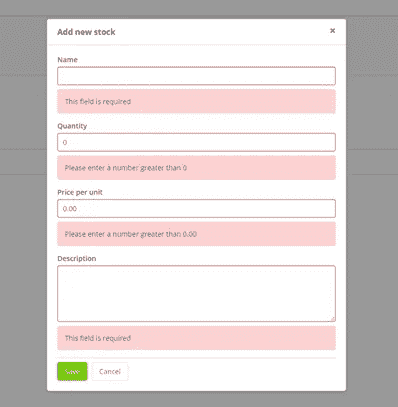
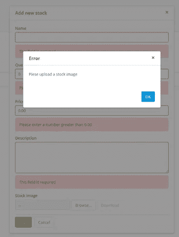
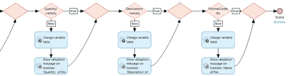
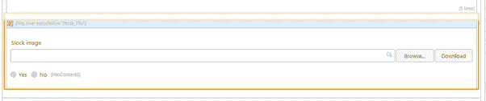
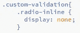
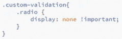
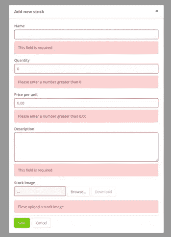
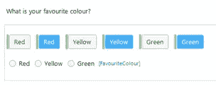

# Mendix UI:通过五个简单的步骤定制文件上传验证！

> 原文：<https://medium.com/mendix/mendix-ui-hack-fix-file-upload-validation-in-five-easy-steps-18a78af914bb?source=collection_archive---------2----------------------->

## 你知道这是怎么回事；这是一个历史悠久的故事。你设计了最漂亮的 Mendix 应用程序，有一个惊人的仪表板，可爱的表单页面，用户界面是品牌的。客户称你为 UX 创世纪

以这一页为例。页面看起来很干净，甚至验证消息看起来也很清晰:

直到有一个新的需求进来，客户希望能够上传一个文件。没问题——你想！

您创建了新的实体，将新的文件上传器添加到您的页面，更新了验证，并在上保存了微流，不再想它了。但是等等，如果你让文件为空，它会给你一个弹出验证，而不是像其他页面上的其他字段那样的页面验证。现在你有两种类型的验证，弹出和内嵌！

但是你的验证微流是有意义的，对吗？如果文件为空，是否在文件上显示验证消息？不幸的是，这不起作用，不管你对你的微流喊得多大声:

然而，有一个简单的方法可以解决这个问题，让你的页面恢复往日的辉煌。

第一步

在您的页面上，在文件上传程序下添加“包含内容”属性，确保将“显示标签”设置为 false:

第二步

更新验证微流以显示针对“HasContents”属性的验证反馈。这将为您的微流提供一个属性来设置验证消息。我们得到一个弹出窗口的原因是因为我们不能选择实际的文件上传者实体来显示验证消息，所以添加这个属性解决了这个问题。

第三步

接下来，打开您的 Sass 文件，并将以下内容添加到您的自定义文件夹中(希望放在一个有意义的适当位置，而不仅仅是 custom.scss 文件，尽管这很有吸引力)…

(For Mendix v7 and below)

(For Mendix v8)

我们在这里所做的，是说任何在我们的“自定义验证”类中的“radio-inline”或“radio”类都将被隐藏。由于这些类只适用于单选按钮，它将只隐藏我们的“HasContents”属性。

第四步

然后在文件上传器和“HasContents”属性周围添加一个新容器，并给它一个类名“custom-validation”(您可以将这个类名改为更合适的名称)。

第五步

最后，编译 sass 文件并运行您的 Mendix 项目。打开您的页面，不要填写任何内容来触发您的验证错误，它应该看起来像这样:

就是这样！你可以回去设计很棒的网页。这种方法不仅适用于文件上传器，如果您需要自定义单选按钮，也可以使用:

在这个实例中，我们构建了改变单选按钮状态的自定义按钮。实际的单选按钮是隐藏的，但仍然用于显示任何验证错误，您最终可以完全控制样式。

这小小的一招就有无限可能！负责任地使用…