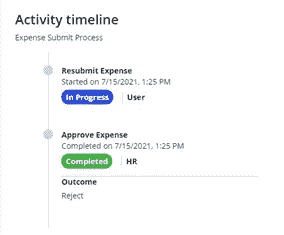

# Mendix 工作流——开发者评论

> 原文：<https://medium.com/mendix/mendix-workflow-a-developers-review-d862b264ee29?source=collection_archive---------3----------------------->

Mendix Workflow — a developers review (Artwork)

# 使用 Mendix 低代码平台已经好几年了，我参与的许多项目都受益于工作流逻辑。所以对于 Mendix 工作流第 9 版的发布，我非常激动！

在 V9 之前，总是可以在 Mendix 中构建工作流类型的流程。然而，这些需要定制的逻辑、微流程和页面，可能需要一些时间来制作。所有这些因素增加了 bug 的可能性，并使领域模型变得混乱，需要额外的实体或属性来跟踪工作流程。Mendix workflow editor 解决了其中的许多问题，并提供了简单、不复杂的开发体验。

## 融入事物的流动

工作流是在应用程序中处理逻辑的一种可视化方式。正如 Mendix 所期望的那样，工作流设计起来很简单，你能想到的一切都很容易得到。 [**用户任务**](https://docs.mendix.com/refguide/user-task) 易于设置并显示在页面中或分配给一组用户。这些页面上的按钮可以链接到任务结果，结果遵循工作流中的不同路径。

可以添加 [**决策**](https://docs.mendix.com/refguide/decision-in-workflows) 以根据条件遵循特定路径，或者可以使用 [**平行分割**](https://docs.mendix.com/refguide/parallel-split) 同时沿着多条路径继续。 [**跳转**](https://docs.mendix.com/refguide/jump-activity) 动作对于将工作流移动到特定动作也非常有用。例如，拒绝任务可能需要跳回到用户提交之前的任务，以便重新编辑数据。

Mendix Basic [https://www.mendix.com/pricing/](https://www.mendix.com/pricing/)

## 我喜欢编辑器的地方是

我喜欢 Mendix 的工作流的原因是编辑器与其他 Mendix 功能无缝集成，允许开发时通常的灵活性标准。标准页面和微流可以用在工作流中(不用说微流有多强大)，逻辑可以用在。除了从工作流中调用微流之外，还可以在微流中执行与工作流相关的活动，即调用工作流或完成用户任务。所有这些都相当简单。

以下是工作流程的一部分的外观示例:

Mendix Workflow Editor

## 探索工作流领域模型

另一个有用的特性是能够从系统模块访问工作流实体。这些实体可用于运行任务和工作流，以及定义任务和工作流定义。这可用于获取任务或工作流本身的属性，如任务名称。开发人员可以以多种方式利用来自这些实体的工作流数据，按照用户的意愿显示它们。

Mendix Workflow System Entities

工作流公共模块提供了一些有用的例子来说明如何使用这些实体。例如，如何显示充满工作流任务的仪表板，或者如何显示工作流中任务路径历史的活动时间线。这使开发人员能够理解这些工作流实体以及如何操作它们，特别是在不同的应用程序可能需要不同的用户体验时，就如何显示、分配和操作工作流任务而言。

## 设计考虑

根据应用程序的不同，可能会有多个逻辑相似的工作流。例如，一家公司对不同的实体可能会有类似的审批流程。存在大量非常相似的工作流、页面和微流的危险，这会使应用程序难以维护。从我最初的经验来看，这似乎可以通过设计具有可重用组件的工作流来克服，例如片段、概括和子微流。

假设我们有一个费用审批工作流，使用代码片段允许工作流中的各种页面(如用于起草费用和审批视图的页面)使用包含核心费用详细信息的相同代码片段。根据工作流程的阶段，所有需要的将是不同结果的按钮。这些片段可以插入到适当的工作流页面中，当需要修改工作流操作、结果和页面时，它们将更加可靠。

为了扩展这个例子，假设有两个工作流；休假审批和费用审批，它们有一些共同的功能。如果我们将两个实体作为一个公共实体的概括，我们可能能够跨两个工作流重用一个批准页面，同时根据专业显示休假或费用数据。我们还可以在所有工作流程中重复使用微流程，即共享一个微流程来发送电子邮件或确定是否需要批准。这些微流可以作为工作流操作公开，因此在编辑工作流时显示在工具箱中。

有许多方法可以创建设计良好的工作流，我在这里提到的方法不一定适用于每个应用程序。有了这个特性，人们很容易对设计感到自满，因为创建一个有效的工作流是多么容易。然而，从我到目前为止的经验来看，使用工作流来制作易于维护、可重用和可读的流程是完全可能的。

## 结论

总的来说，我对工作流编辑器印象深刻，因为它非常好地嵌入了现有的 Mendix 平台。当与现有的 Mendix 功能相结合时，工作流将特别有用。我期待着未来的迭代，我相信，一如既往，将会有一些有趣的增强。

## 阅读更多

 [## 工作流- Studio 9 指南| Mendix 文档

### 工作流是 Mendix Studio 和 Mendix Studio Pro 中的一种可视化语言，允许您解决您的业务问题…

docs.mendix.com](https://docs.mendix.com/studio/workflows)  [## 一般活动- Studio 9 指南| Mendix 文档

### 常规活动允许您管理工作流程中的路径。决策允许您添加条件和…

docs.mendix.com](https://docs.mendix.com/studio/workflows-general-activities)  [## 工作流属性- Studio 9 指南| Mendix 文档

### 本文档描述了工作流属性。有关工作流的用途和元素类型的详细信息，您可以…

docs.mendix.com](https://docs.mendix.com/studio/workflow-properties)  [## 随波逐流还是随波逐流？掌控 Mendix 工作流程！

### 我们生活的所有领域都在经历着转变:商业正在数字化，顾客正在习惯于安排…

medium.com](/mendix/to-go-or-not-to-go-with-the-flow-get-in-control-with-mendix-workflow-f36cab33ff9a) 

*来自发布者-*

*如果你喜欢这篇文章，你可以在我们的* [*媒体页面*](https://medium.com/mendix) *或我们自己的* [*社区博客网站*](https://developers.mendix.com/community-blog/) *找到更多类似的文章。*

*希望入门的创客，可以注册一个* [*免费账号*](https://signup.mendix.com/link/signup/?source=direct) *，通过我们的* [*学苑*](https://academy.mendix.com/link/home) *即时获取学习。*

有兴趣更多地参与我们的社区吗？你可以加入我们的 [*Slack 社区频道*](https://join.slack.com/t/mendixcommunity/shared_invite/zt-hwhwkcxu-~59ywyjqHlUHXmrw5heqpQ) *或者想更多参与的人，看看加入我们的* [*遇见 ups*](https://developers.mendix.com/meetups/#meetupsNearYou) *。*