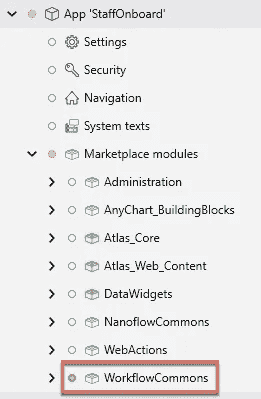
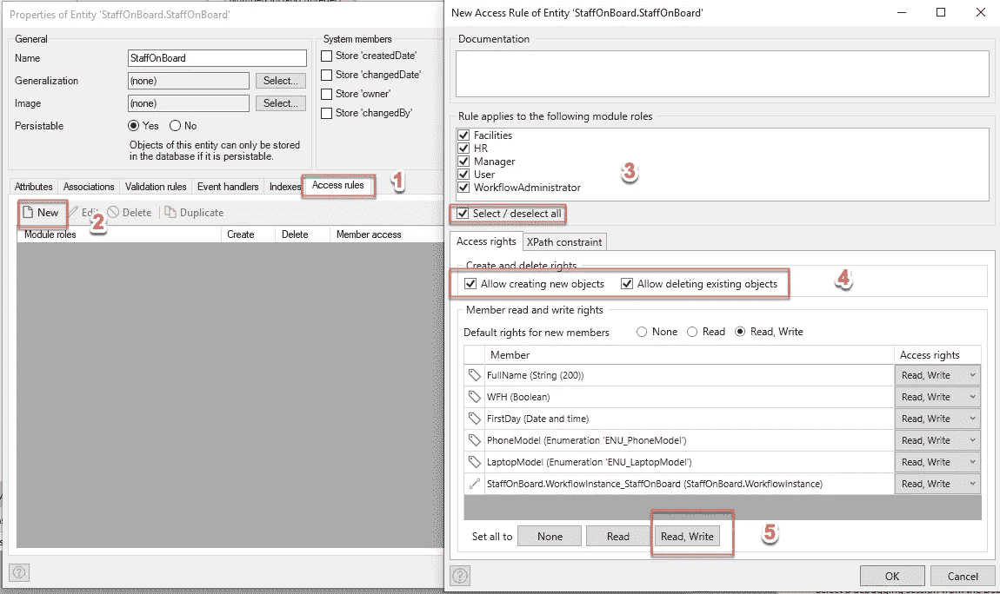
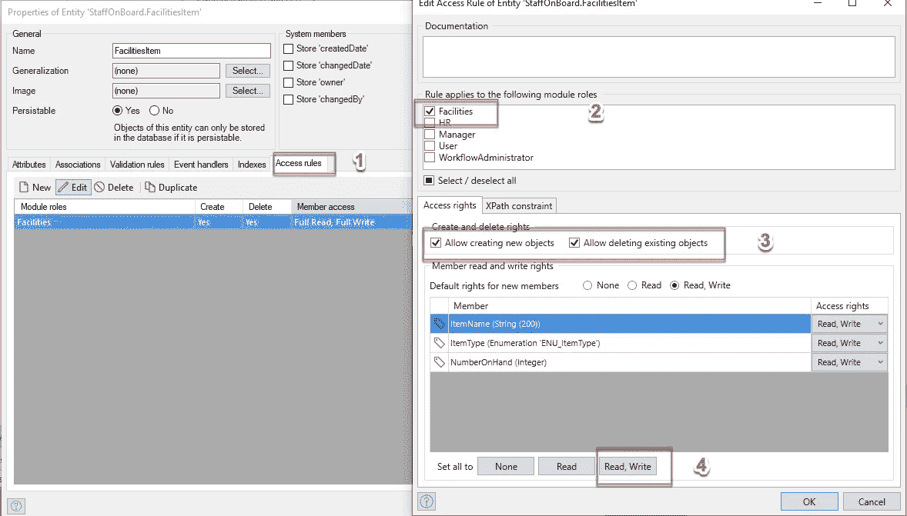
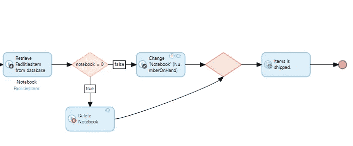
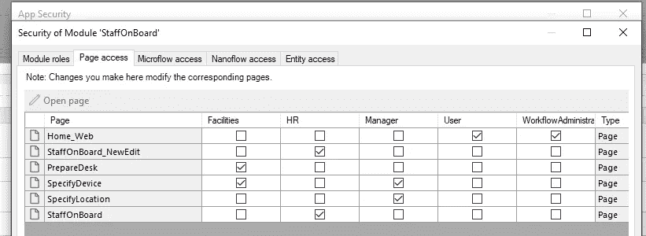
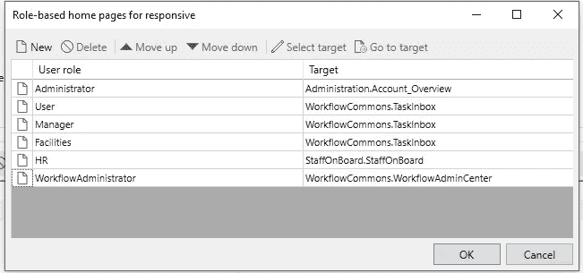

# Mendix 工作流程——概述

> 原文：<https://medium.com/mendix/mendix-workflow-an-overview-a97aadf7cbc1?source=collection_archive---------1----------------------->

Mendix Workflow — An Overview

# 总的来说，业务流程管理(BPM)是一个重要的企业应用程序，它可以帮助组织减少在纸上完成的手工工作，将所有这些文字、excel 文档和 pdf 批准表格转换为数字格式。它使的用户能够维护、跟踪和轻松交付高质量的输出。今天，我将演示 Mendix，这个低代码平台，有能力创建一个 BPM 流程。

> D ***下载源代码*** [***这里***](https://github.com/qntbkk/StaffOnBoard)

 [## GitHub - qntbkk/StaffOnBoard

### 此时您不能执行该操作。您已使用另一个标签页或窗口登录。您已在另一个选项卡中注销，或者…

github.com](https://github.com/qntbkk/StaffOnBoard) 

让我们从 Mendix 版本 9.6 中的员工入职流程示例开始。

首先，我要感谢 Mendix 学院在工作流方面的学习之路。我写这篇博客是为了解释更多的细节，并提供对 Studio Pro 版本 9.6.0 中工作流引擎的新更新的见解。所以让我们开始吧。

请 [**下载 Mendix Studio Pro 9.6.0**](https://docs.mendix.com/releasenotes/studio-pro/9.6#960) ，如果您遇到任何问题，请查看本[指南](https://docs.mendix.com/howto/general/install)以排除安装故障。

# 步骤 1—创建项目

当您打开 studio pro 9.6.0 时，您将看到欢迎页面，其中包含您的项目或应用程序，如下图所示。

选择靠近应用程序屏幕左侧的“创建新应用程序”按钮。然后选择“空白 Web App”。

按下“使用此起点”按钮。

将应用程序命名为您想要的任何名称。我把它命名为“StaffOnboard”。

第一次打开项目时，初始化 team server 和免费云环境可能需要几分钟的时间。如果您想节省时间，您可以在上图中的第二个红色框上将“启用在线服务”设置为“否”，它会将您快速跳转到项目，因为不会有云创建活动，并且该项目将仅在本地运行。您应该会看到如下图所示的屏幕。

# 步骤 2—添加额外模块

该项目需要“工作流公共”模块。要下载，请遵循以下 3 个简单的步骤:

1)转到 Studio Pro 内的 Marketplace 中的“Workflow Commons”并点击“下载”。

2)确认导入。

3)点击“确定”确认导入

当一切完成后，您可以看到该模块将被放置在 marketplace modules 下。

# 步骤 3—更改您的安全设置

将您的应用安全模式更改为生产。

在“用户角色”选项卡上，我们需要为工作流程添加几个角色。按照以下 4 个步骤添加另外 4 个角色。即设施、人力资源、经理、工作流管理员。

按照以下 3 个步骤配置协作室用户角色:

1)在用户角色下，单击新建。

2)将新角色命名为“工厂”，然后单击“模块角色”上的编辑。

3)将新角色指定为所有模块的“用户”，但在主模块中除外，在主模块中，他们应被指定模块角色“设施”。

继续 HR 角色。

继续经理角色。

最后一个是 WorkflowAdministrator 角色。

回到“模块状态”选项卡，模块“数据小部件”有一个实体访问通知。按照以下 6 个步骤解决通知问题。

1)在“模块状态”下，选择 DataWidgets 模块并双击“实体访问”

2)一旦进入实体内部，点击"新建"

3)在“规则适用于以下模块角色”下选择“用户”

4)将“允许创建新对象”和“允许删除现有对象”设置为真，并将新成员的默认权限设置为“读、写”

5)点击"全部设为"进行读取，写入

6)单击“确定”

当一切都完成时。您应该会看到类似下面的内容。

最后，按确定。

# 步骤 4—更改模块名称并创建实体

现在我们可以将模块“MyFirstModule”重命名为“StaffOnBoard”。

在“StaffOnBoard”模块中，我们需要在域模型中创建几个新的实体。

**从名为“StaffOnBoard”的主表开始**

ENU 笔记本电脑模型

ENU _ 手机模型

StaffOnBoard 实体访问设置

**我们需要创建另一个名为$WorkflowInstance 的实体，它将被系统实体$Workflow 泛化。$Workflow 是一个核心 Mendix 实体，当用于创建从它继承属性的对象时，它拥有创建工作流所需的一切。这一切分两步完成，我将在下面展示。确保您与您的 StaffOnBoard 实体建立了一对一的关联。**

1)在实体的属性中，单击选择通用化。

2)选择工作流程并点击确定

将与工作流实体交互的所有用户角色都需要对 WorkflowInstance 实体具有读写权限。

现在，需要定义设施项目。在某些情况下，它应该与采购订单流程相联系。一旦确定了人数，这些采购订单应在新的人数审批流程开始之前触发或变为可用。你可以接受这个想法，并以你自己的方式继续发展。对于这个场景，每当 HR staff 用户触发新的入职流程时，我将自动添加 Facilities 项目。

**设施实体。**

ENU _ 项目类型

设施实体访问设置。

设施项目页面概述

几乎完成了所有的实体。我们还需要另外 4 个实体来配合工作流中的用户任务。

**实体需要指定新员工可以获得的设备。**

ManagerSpecifyDevice 任务的实体访问权限

我们还需要指定员工的工作地点。

实体访问设置

**我们必须为员工分配和准备一张桌子。**

实体访问设置

**我们还可以为他们的移动设备添加一个实体。**

实体访问设置

这就是我的领域模型最终的结果。

# 步骤 5 —创建页面

**要继续，我们需要为人力资源人员创建一个页面，以便能够添加新员工并启动入职流程。**

我创建了一个像这样的页面，要做到这一点，你可以按照以下步骤

1)添加构造块“headerhero”，布局列是自动填充的

2)将按钮添加到“创建对象”,然后如下所示进行配置

编辑页面应该是这样的

访问该页面的角色应该是 HR。

3)列表视图

显示新员工的全名，并允许人力资源部通过“开始入职”按钮开始入职流程。

**要创建工作流程，只需右击模块 StaffOnBoard 并选择“添加工作流程”。**

# 步骤 6-触发工作流

**从 Start Onboarding 按钮，它将触发一个微流。这个微流需要检查手头的设施。如果设施是空的，it 部门将不得不增加一个，以确保新员工能够成功地保留他们工作所需的物品。**

让我们看看整个微流程

1)检查电话是否可用，如果是空的，创建一个新的。如果不是空的，再加一个。

2)与步骤 1 相同，但检查笔记本电脑和办公桌。

3)调用工作流，检查工作流的状态并显示名称。这是开发人员检查工作流状态非常重要的一点。如果是“进行中”,则表示工作流已启动，并已到达第一个用户活动。

**现在我们可以在工作流编辑器中查看工作流的草稿**

一个工作流需要添加 **3 个重要项目**。首先，**工作流实例**我们已经在开始做了。第二个是 **workflowcontext，它是 StaffOnBoard 实体**。第三，**管理页面**。

# 第 7 步—创建工作流

***1)HR 启动入职后，创建一个经理任务，为新员工指定一个设备。***

在下一个选项卡上，显示信息。您可以选择创建新页面

将页面命名为指定设备，并选择布局类型用户任务扩展。

“数据”选项卡用于保存用户任务信息，需要对 System.WorkflowUserTask .进行概括，我们之前已经完成了。

当所有配置完成后，错误应该都消失了。

***2)创建经理任务，为新员工指定一个位置，以便进行设施管理。***

您可以创建一个新页面，就像我们为指定设备所做的那样

同样在“Data”选项卡上，我们将链接到我们在前面的步骤中定义的一个实体——ManagerSpecifyLocation

到目前为止，这就是我们现在所拥有的:工作流中的 2 个用户任务

现在，在经理定义了员工应该在哪里工作之后。工作流程将会分成两个不同的方向。如果用户在家工作，那么设备将发货，我们将扣除设施项目。另一方面，如果工作人员需要在办公室，则应准备好办公桌。

***3)如果工作人员决定在家工作。***

选择属性后，分割的结果将包含 true 或 false。

***4)如果他们在家工作，则运送设备。***

配置应该类似于指定设备和指定位置。然而，该活动的所有者是工厂员工，不再是经理。

不允许工厂员工通过禁用数据视图的可编辑性来调整信息。

数据被映射到从 System.WorkflowUserTask 概括的实体。

如果他们将在办公室工作，准备好书桌。

同样，我们不允许编辑表单数据。

到目前为止的工作流程。

***6)船舶设备逻辑。***

当我们装运设备时，应扣除设备项目。工作流允许我们在用户任务活动之后进行微流调用。

***⑦准备案头逻辑。***

# 步骤 8 —最终项目设置(演示用户、页面访问和导航)。

为了测试这个项目，我们需要设置一些演示用户。

所有用户角色的页面访问权限

转到导航并为每个角色添加主页，如下图所示。我们可以使用 workflow commons 模块中的页面，以及我们之前制作的页面。

将默认主页更改为 StaffOnBoard 页面。

更新菜单，使其类似下图

一旦你完成了，你就可以运行你的应用程序并测试它，下面是我测试应用程序的录音

# 演示视频

# 来源

 [## GitHub - qntbkk/StaffOnBoard

### 此时您不能执行该操作。您已使用另一个标签页或窗口登录。您已在另一个选项卡中注销，或者…

github.com](https://github.com/qntbkk/StaffOnBoard) 

## 阅读更多

 [## 更改工作流状态- Studio Pro 9 指南| Mendix 文档

### 此活动只能在微流中使用。这个活动是在 Studio Pro 9.6.0 中引入的。变更工作流程…

docs.mendix.com](https://docs.mendix.com/refguide/change-workflow-state)  [## 工作流活动- Studio Pro 9 指南| Mendix 文档

### 本文档中描述的活动位于工具箱的工作流活动部分。以下是…

docs.mendix.com](https://docs.mendix.com/refguide/workflow-activities)  [## 工作流共享-市场指南| Mendix 文档

### 工作流公共模块为想要构建工作流的用户提供了现成的入门体验…

docs.mendix.com](https://docs.mendix.com/appstore/modules/workflow-commons) 

*来自发布者-*

*如果你喜欢这篇文章，你可以在我们的* [*中页*](https://medium.com/mendix) *找到更多喜欢的。对于精彩的视频和直播会话，您可以前往*[*MxLive*](https://www.mendix.com/live/)*或我们的社区*[*Youtube PAG*](https://www.youtube.com/c/MendixCommunity/community)*e .*

*希望入门的创客，可以注册一个* [*免费账号*](https://signup.mendix.com/link/signup/?source=direct) *，通过我们的* [*学苑*](https://academy.mendix.com/link/home) *获得即时学习。*

有兴趣加入我们的社区吗？你可以加入我们的 [*Slack 社区频道*](https://join.slack.com/t/mendixcommunity/shared_invite/zt-hwhwkcxu-~59ywyjqHlUHXmrw5heqpQ) *或者想更多参与的人，看看加入我们的*[*Meet ups*](https://developers.mendix.com/meetups/#meetupsNearYou)*。*