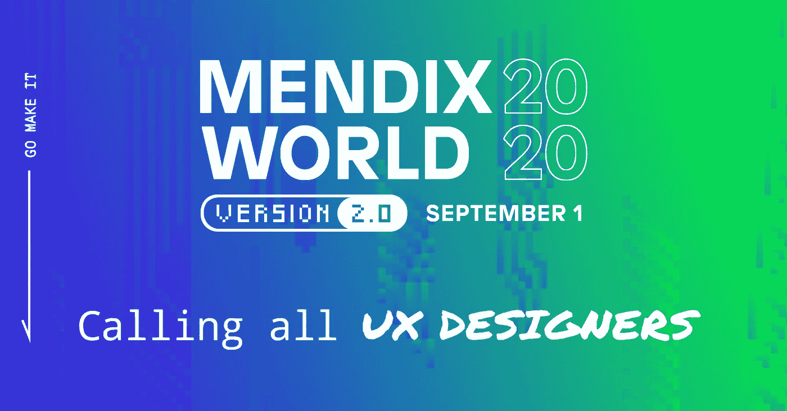

# UX 设计师 Mendix World 2.0 会议前五名

> 原文：<https://medium.com/mendix/mendix-world-2020-uxer-4cd0ab19916c?source=collection_archive---------1----------------------->

多好的一年啊！

对我们大多数人来说，今年带来了很多挑战和机遇。这些挑战之一是举办年度活动。公司要么需要取消他们的活动，要么创造性地创新安全举办活动的意义。

已经走上数字创新道路的公司已经把它推出了公园，用一个精简的演示来解释未来会给我们带来什么(就像索尼的 PS5 reveal &苹果的 Keynote)。

Mendix 选择正面应对这一挑战也是有道理的，因为创新是他们公司文化的一部分，然后将创新提升到一个新的水平。

另一个不断创新的领域是用户体验设计领域。在过去的几年里，用户体验设计领域已经从事后思考变成了成功公司与众不同的东西(AirBnB、优步、谷歌、苹果)。

很高兴看到今年在 [Mendix World 2.0](https://www.mendix.com/mendix-world/?utm_medium=referral&utm_source=CommunityBlog&utm_campaign=GL-CE-2020-09-01-Mendix-World) 上有很多围绕用户体验设计的讲座。

我想是时候介绍我自己了。我叫 Jason Teunissen，在过去的几年里，我的目标是提高 Mendix、Mendix 社区和 Mendix 客户对 UX 设计的理解和质量。

作为一名 UX 顾问，我最喜欢的事情可以用荷兰谚语*来形容:“窥视每个人的厨房。”*我们是仅有的同时参与多个项目的开发人员之一，因此有如此多的学习和成长机会。

UX 设计师不仅是连接用户和技术的粘合剂，也是开发者和利益相关者之间的桥梁。UX 设计的领域也非常广泛，有 UX 研究、视觉设计和前端等子技能，最终都融合成了*‘万金油’*的角色。

因此，为了更好地了解我们的领域，我被要求写一份五大热门话题，关于在 Mendix World 大会上最令人期待的与 UX 有关的演讲。

## 1.[用漂亮的用户界面设计构建应用](https://www.mendix.com/mendix-world/?utm_medium=referral&utm_source=CommunityBlog&utm_campaign=GL-CE-2020-09-01-Mendix-World)

去年，丹尼和耶鲁安做了一个精彩的现场演示，演示了如何使用设计属性让非设计人员创建一个外观优秀的应用程序，为公司意识到 Mendix 中的应用程序也可以看起来很棒铺平了道路。

考虑到 Mendix 今年在 Native Mobile 上投入了多少时间和精力，我打算冒险一试，假设他们已经准备了一个令人印象深刻的演示，展示他们新设计属性的一些较新的小部件和功能。

去年的大部分演讲都做得非常好。然而，我认为舞台上的耶鲁安之间的动态；*悠闲的设计师，*和丹尼；*永远充满好奇和精力充沛的工程师*非常成功地完成了任务。

今年克里斯·霍奇斯将会做报告。对于不知道 Chris 的人来说，他正在 Mendix 领导 UX 革命，我个人非常期待我们今年将会看到的。对于任何 UI 设计师或前端人员来说，这个会议绝对是必看的。

**描述**

好的用户界面设计就像一台冰箱——当它工作的时候，没有人会注意到，但是当它不工作的时候，它肯定会发出臭味 UI 设计是任何应用程序的关键部分，随着我们在日常生活中对技术的依赖越来越大，它的重要性也越来越大。

*做得好的时候，用户甚至不会注意到。但如果做得不好，用户会注意到，并可能决定在未来避开你的业务。一个好的 UI 设计适用于所有人，不管年龄、技术经验或背景如何。加入设计主管 Chris Hodges，学习如何创建、维护和分享漂亮的用户界面设计。*

## 2.[公民发展的未来](https://www.mendix.com/mendix-world/?utm_medium=referral&utm_source=CommunityBlog&utm_campaign=GL-CE-2020-09-01-Mendix-World)

我总是对公民开发者感兴趣。大多数人最初似乎对编码的想法感到厌恶；其中一些人还拥有几乎全功能应用程序的疯狂 Excel 表。让更多的人能够快速创建一个原型可以节省每个人的时间和精力。

拥有更多公民开发者的第二个好处是打破沟通的壁垒。能够在产品所有者、最终用户、利益相关者和开发团队之间进行清晰的交流，可以减少会议和开销，让更多的人“制造有趣的东西”。

我不确定 [Mendix World](https://www.mendix.com/mendix-world/?utm_medium=referral&utm_source=CommunityBlog&utm_campaign=GL-CE-2020-09-01-Mendix-World) 会展示什么，但我希望它能为更多人制作更多应用铺平道路。

**描述**

*每个人都是创客。“开发人员”的定义已经改变，现在有更多的人在开发应用程序。我们相信这只是一个开始，在本次会议中，您将看到 Mendix 如何帮助您将这一趋势提升到一个新的水平:*

*·扩大谁能建造。*

扩展他们可以构建的东西:无代码集成和工作流。

*扩大合作范围。*

## 3.[用 Mendix 设计消费级移动应用](https://www.mendix.com/mendix-world/?utm_medium=referral&utm_source=CommunityBlog&utm_campaign=GL-CE-2020-09-01-Mendix-World)

雅各布定律指出*“用户将大部分时间花在其他网站上。这意味着用户更喜欢你的网站像他们已经知道的所有其他网站一样工作。”*简而言之，用户希望所有的应用程序都像他们习惯的那样直观地工作，不管它是由谷歌还是你当地的面包店制作的。

Mendix 一直非常关注 B2B 应用程序，在这些应用程序中，良好的用户体验似乎不那么重要。随着去年 Native Mobile 的推出，用户对 Mendix 应用的体验有了很大的转变。

Mendix 现在正成为 Xcode、Swift、Android Studio 等 B2C 开发平台的一个可行的竞争对手，但具有低代码平台的速度和通信价值。

**描述**

*我们生活在一个即时满足的世界，即时的结果和轻松的体验是当今客户的标准，提供任何不足都会迅速影响您的用户参与度。*

*借助 Mendix，您无需成为移动专家或技术开发人员，即可构建原生移动应用，提供人们在日常生活中习惯使用的消费级体验。产品经理 Danny Roest 将分享:*

*   *允许您在 Mendix 的基础上构建强大的可重用扩展的特性*
*   *Mendix 客户在他们的应用程序中构建的功能类型，如非接触式支付或聊天机器人，有助于现代用户体验*
*   *如何开始构建您自己的应用程序，协作者可以轻松利用这些应用程序来提高 UI 一致性和开发人员的工作效率*

## 4.[构建符合 WCAG 标准的无障碍应用](https://www.mendix.com/mendix-world/?utm_medium=referral&utm_source=CommunityBlog&utm_campaign=GL-CE-2020-09-01-Mendix-World)

在任何应用环境中，设计一个符合可访问性最佳实践的应用都是一个挑战。在政府组织中，可访问性甚至更为重要，因为政府组织必须符合某些标准，以便尽可能好地为每个人服务。

可访问性也是一件需要花费很多时间的事情，并且是大多数人不会想到的事情，因为他们从来没有必要这样做。然而，世界正变得数字化优先，帮助每个人很重要。

幸运的是，Mendix 可以通过解释这些准则以及如何在下一个 Mendix 应用程序中实现它们，给你一个良好的开端。

**描述**

*尽管疫情冠状病毒对数十亿人造成了前所未有的限制，但对许多残疾人来说，封锁却矛盾地打开了世界。随着社会接受“新常态”，全球有 130 万残疾人，确保我们创造的数字产品和服务为所有人提供平等的访问和机会变得前所未有的重要。*

*但是无论你是开发一个新的应用程序还是改进一个现有的应用程序，你都不应该与确保它们的可访问性相冲突。在这一环节中，我们将分享:*

*·为什么可访问性具有良好的商业意义。*

*·如何交付符合最高可访问性标准和准则的可访问性应用程序，例如 WCAG 2.1 AA 和 section 508。*

*确保无障碍合规的最佳实践。*

## 5.【React Native 入门

去年，Mendix 发布了 React 原生支持，改变了我们许多人对移动开发的看法。能够利用本机特性，同时为多个系统维护一个单一的代码库，还拥有低代码平台的所有好处，有什么不喜欢的呢？

设置 Mendix-React-Native-workflow 与传统的 web 应用程序略有不同，但一旦它启动并运行，您就可以使用来自不断增长的 React Native 社区的组件来扩展您的应用程序。

如果您还没有尝试过 Mendix-React-Native，这将是一个很好的起点。

**描述**

*React Native 是原生移动应用开发的变革者。它消除了在 Swift (iOS)和 Java (Android)中编码的需要，并构建了两个独立版本的应用程序。尽管 React Native 是由脸书创建的，但开发人员社区已经接受了它并继续增强它。在 Stack Overflow 的 2019 年开发者调查中，React Native 是第六大最受欢迎的框架，也是构建原生移动应用的头号框架。参加本专题讲座，了解 React Native 为何是一项需要了解的重要技能，以及 Mendix 如何帮助所有背景的开发人员使用低级代码构建 React Native 应用程序。产品经理 Danny Roest 将展示:*

*   *Mendix React 原生移动应用的架构*
*   *如何使用 React 原生社区的众多可用组件和选项定制和扩展您的应用*
*   *演示如何创建基于第三方组件的小工具*

我很高兴地看到，Mendix 正在加倍努力开发工具，帮助在所有 UX 领域创造更好的最终用户体验，无论是通过更好的视觉设计，支持更多的公民开发者，还是通过创建最终用户平台。

虽然我很好奇，但我已经在想这些工具如何在我们的日常工作中实施，以及它将如何影响我们的客户对执行良好的 UX 设计的重要性的看法。

如果您有任何问题，需要帮助，或者只是想聊聊 UX，您可以在 Mendix Slack @Jason Teunissen 中找到我。

但最重要的是[现在就注册](https://www.mendix.com/mendix-world/?utm_medium=referral&utm_source=CommunityBlog&utm_campaign=GL-CE-2020-09-01-Mendix-World)Mendix World，首先获得所有内容。

那里见！