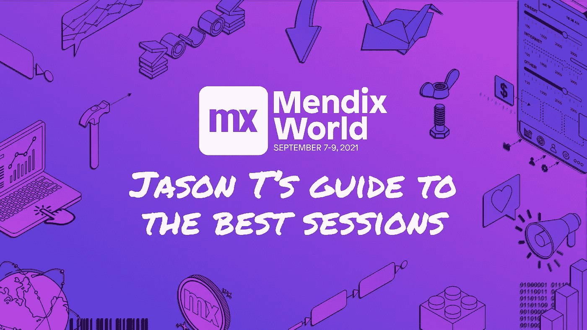
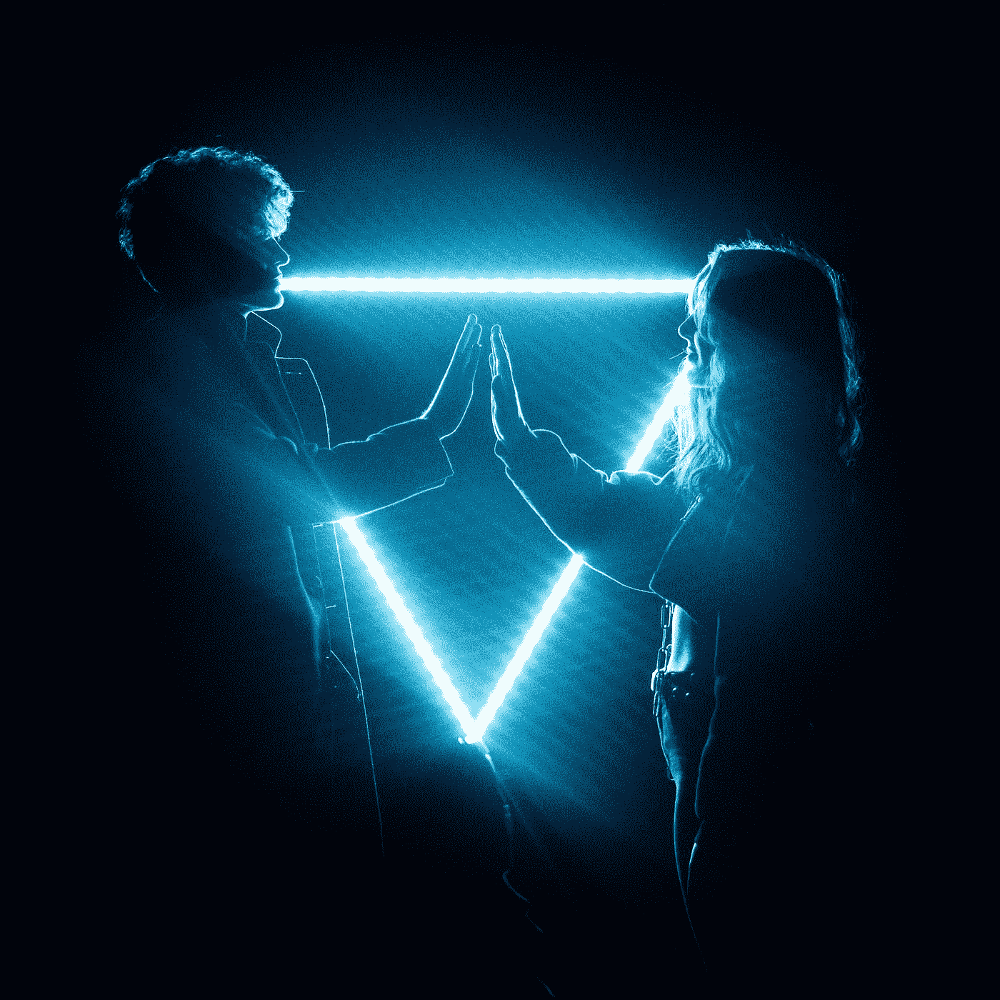
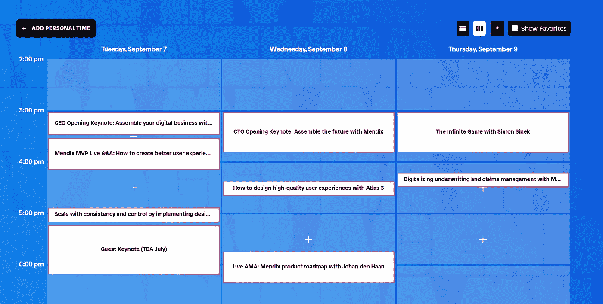

# 门迪克斯世界 2021

> 原文：<https://medium.com/mendix/mendix-world-2021-31367eef816?source=collection_archive---------3----------------------->

## 杰森最佳会议指南

有些人确实对《梦幻界》感到兴奋，而另一些人却不知道它是什么，也不知道为什么其他人会对它感到兴奋。我认为这将给我一个很好的机会来解释为什么今年最大的低代码事件让我兴奋。

## 没有长篇大论，只有 3 个简单的问题

1.  为什么我对 MX 世界感到兴奋(以及为什么你应该去看看)。
2.  MX World 上我最期待的演讲者？
3.  为什么我对[在 MX 世界上演讲](https://events.mendixworld.com/widget/mendix/world21/catalog/session/1613990342138001Cn5G)感到兴奋？

# 1.为什么我对 Mendix World 感到兴奋

大多数人都知道我对低代码非常感兴趣。我 100%赞同每个人都应该被赋予制作应用程序的权利。

许多应用程序都有类似的模式，低代码平台有助于完成大量繁重的工作。

也就是说，我最喜欢的演讲实际上是那些与低代码关系最少的演讲。在过去的几年里，我通过参与一些本来不会有的对话学到了一些东西，比如“女性在 IT 和敏捷转型案例研究中面临的挑战”。

现场会议真的很棒，能够在会议中与其他专家聊天创造了一种社区感，即使我们正在疫情中。

有机会向专家提问也有助于分享知识，我认为这就是像这样的活动的意义所在。

还有一个令人惊叹的数字平台来浏览和管理你的会议(你可以在这里看到)。

[https://bit.ly/MXW21](https://bit.ly/MXW21)

# 2.必看讲座

今年最好的必看演讲，是我将要做的。但是严肃地说，找到最好的谈判是一项艰巨的任务。为了让我的生活更轻松，我决定专注于主持人。一个伟大的演讲者能够:
-轻松地传达复杂的想法和思想。
——让你思考新的想法。
-将枯燥的案例研究转变为令人惊叹的冒险。

如果一个主持人心中有火，我知道他们的故事会被点燃。因此，这是一份充满激情的演讲者名单，我一定会去看看。

Photo by [Tim Mossholder](https://unsplash.com/@timmossholder?utm_source=medium&utm_medium=referral) on [Unsplash](https://unsplash.com?utm_source=medium&utm_medium=referral)

## 杜宾 Upadhyay — [通过结构化协作引领更好的发展](https://events.mendixworld.com/widget/mendix/world21/catalog/session/1617810639459001URyM)

杜宾·乌帕德海是一名来自社区和协作部门的热情的高级服务设计师。过去，我和她就我们作为一个外部低代码 UX 人所面临的一些挑战进行了一些很好的交谈。她正在做一个关于协作的演讲，这对于任何一个 Mendix 团队的成员来说都是非常有趣的。

**将此** [**环节**](https://events.mendixworld.com/widget/mendix/world21/catalog/session/1617810639459001URyM) **添加到您的 Mendix 世界日程**中。

Photo by [Yves Moret](https://unsplash.com/@yvesmoret?utm_source=medium&utm_medium=referral) on [Unsplash](https://unsplash.com?utm_source=medium&utm_medium=referral)

## Ivo Sturm —荷兰铁路公司在 4 周内将客户体验数字化

Ivo Sturm 是最好的门迪克斯 MVP 之一，他已经做了超过 12 年了。这个演讲的前提也很有趣:世界上有些东西在变化，你需要快速适应。我认为这个场景真正展示了 lowcode 的优势，我很期待 Ivo 谈论这个问题。

**将此** [**环节**](https://events.mendixworld.com/widget/mendix/world21/catalog/session/1616066017724001n5PO) **添加到您的 Mendix 世界日程**。

Photo by [Balázs Kétyi](https://unsplash.com/@balazsketyi?utm_source=medium&utm_medium=referral) on [Unsplash](https://unsplash.com?utm_source=medium&utm_medium=referral)

## Christopher Hodges——如何使用 Atlas 3 设计高质量的用户体验

幕后的人，天才设计师，和所有谦卑的家伙，绝对去看看克里斯·霍奇斯说了什么。他将谈论 Atlas 3，它将改变游戏规则，将设计系统推向一致性和自由度的新高度。

**将本次** [**会议**](https://events.mendixworld.com/widget/mendix/world21/catalog/session/16210061579540013M3S) **添加到您的 Mendix 世界日程**中。

Photo by [Noah Buscher](https://unsplash.com/@noahbuscher?utm_source=medium&utm_medium=referral) on [Unsplash](https://unsplash.com?utm_source=medium&utm_medium=referral)

## Jakob Schillinger——边缘状态:更好地连接 OT 和 IT 领域的案例研究

不久前，Jan de Vries 在[播客](https://open.spotify.com/episode/2ymG6K3IFWIu3gIvaSnJTv?si=60b120226ad744f9)中向我介绍了 Jakob Schillinger ，我们谈到了 DnD 对他工作领域的影响，这是一次令人惊叹的演讲。我真的很期待听到他谈论一个案例研究，这超出了我目前的知识领域(合并 OT & IT)，所以我相信我会从这个充满激情的演讲者那里学到很多东西。

**将此** [**环节**](https://events.mendixworld.com/widget/mendix/world21/catalog/session/16177099765060017E2x) **添加到您的 Mendix 世界日程**。

Photo by [Sarah Brown](https://unsplash.com/@sweetpagesco?utm_source=medium&utm_medium=referral) on [Unsplash](https://unsplash.com?utm_source=medium&utm_medium=referral)

## Jaap Bakker—使用 Bee Insurance Suite 支持您的核心保险流程

贾普·巴克绝对是一个值得关注的人。我想我还没见过像他这样精力充沛的人，他将精力投入到有形事物中的能力令人振奋。这个演讲是关于用他们的保险套件扰乱保险市场。看到撼动传统行业的平台，我总是很兴奋。

**将此** [**环节**](https://events.mendixworld.com/widget/mendix/world21/catalog/session/1617206185282001SOLD) **添加到您的 Mendix 世界日程**。

Photo by [Edson Junior](https://unsplash.com/@roinuj16?utm_source=medium&utm_medium=referral) on [Unsplash](https://unsplash.com?utm_source=medium&utm_medium=referral)

# 3.为什么我对在 Mendix World 演讲感到兴奋

传奇人物简·德·弗里斯请我做现场演示。我真的很荣幸能有这个机会，因为我能与成千上万的其他创客分享我的经验和见解。

我们将全力以赴争取我的发言时间，带来一些只有通过现场会议和每个观众的参与才能做到的独特的东西。准备连接和探索我关于无意识偏见和心理学的发现，并学习如何克服你的发现。

**将我的** [**会话**](https://events.mendixworld.com/widget/mendix/world21/catalog/session/1613990342138001Cn5G) **添加到您的 Mendix 世界日程**。

# Mendix 世界平台

顺便说一下， [Mendix world platform](https://www.mendix.com/mendix-world/?utm_medium=partners&utm_campaign=GL-CE-2021-09-06-Mendix-World&mxworld=PAREMEFirs) 有一些很酷的功能，我最喜欢的是这个非常酷的个人时间表，你可以用它来创建自己的播放列表。

## [使用此链接免费注册](https://www.mendix.com/mendix-world/?utm_medium=partners&utm_campaign=GL-CE-2021-09-06-Mendix-World&mxworld=PAREMEFirs)

(真的去做，因为你会忘记，然后像“我以后再做”…但你不会)

在那里见。

*来自发布者-*

如果你喜欢这篇文章，你可以在我们的 [*媒体页面*](https://medium.com/mendix) *或我们自己的* [*社区博客网站*](https://developers.mendix.com/community-blog/) *找到更多类似的内容。*

*希望入门的创客可以注册一个* [*免费账号*](https://signup.mendix.com/link/signup/?source=direct) *，通过我们的* [*学苑*](https://academy.mendix.com/link/home) *获得即时学习。*

有兴趣加入我们的社区吗？你可以加入我们的 [*Slack 社区频道*](https://join.slack.com/t/mendixcommunity/shared_invite/zt-hwhwkcxu-~59ywyjqHlUHXmrw5heqpQ) *或者想更多参与的人，看看加入我们的* [*遇见 ups*](https://developers.mendix.com/meetups/#meetupsNearYou) *。*