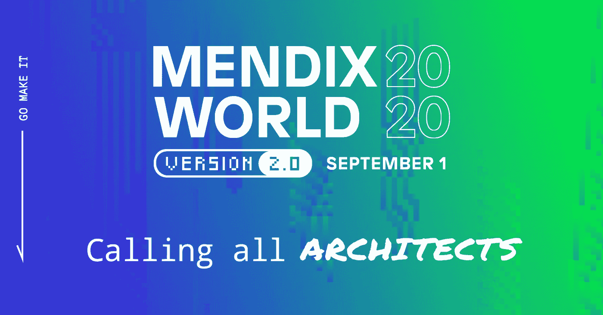

# 架构师应该参加的 Mendix World 版会议

> 原文：<https://medium.com/mendix/mendix-world-version-2-0-sessions-architects-should-attend-809b5d27b8ec?source=collection_archive---------4----------------------->

我们询问了我们的两位 Mendix MVPs，他们都有丰富的架构师经验，他们认为志同道合的技术人员和开发人员将参加什么样的 Mendix World 版本会议。以下是他们不得不说的话。

# 首先出场的是最有价值球员欧文·托恩。让我们看看他有什么要说的…

自 2001 年以来，我一直从事定制软件开发，担任顾问、经理 R&D、架构师，最近五年担任首席技术官。在这 19 年的 IT 生涯中，我在 Mendix 工作了大约 11 年，见证了该平台及其功能的重大成熟。我目前在 FlowFabric 工作，是 Mendix 的早期合作伙伴之一，参与了许多大大小小的 Mendix 项目。我还被选入 Mendix 的 MVP 小组，试图为 Mendix 团队提供反馈和指导。

但是现在你知道我是谁了，我为什么要参加 [Mendix world 2020](https://www.mendix.com/mendix-world/?utm_medium=referral&utm_source=CommunityBlog&utm_campaign=GL-CE-2020-09-01-Mendix-World) ？我参加的主要原因是会见志同道合的人，他们在当今的软件市场中面临着挑战，我对此感同身受。在会议上，我会和以前的同事、竞争对手、创造惊人东西的人或者新的解决方案的人交谈，交朋友。我听到你在想:网络！但在门迪克斯世界却没有这种感觉。这种氛围更像是你在密友的聚会上体验到的，有机会学到很多新东西。学习最新的软件开发和低代码也是我参加 Mendix World 的主要原因之一。

如果你已经在使用低代码开发，你明白我在说什么；如果没有，一定要这样做，因为作为一名架构师，你将很快面临向低代码的转变。Gartner [预测](https://www.gartner.com/en/documents/3956079/magic-quadrant-for-enterprise-low-code-application-platf)到 2024 年，低代码应用程序构建将收集所有应用程序开发功能的 65%以上，知道这需要什么对软件架构师来说是至关重要的，还有什么比 2020 年最大的低代码会议更好的地方来开始你的旅程呢？

很明显，了解软件开发中正在发生的变化，以及未来将继续快速改变架构师的世界，我建议参加 Mendix World 的以下会议，我相信我会的:

## [面向制造商的民主化数据整合](https://www.mendix.com/mendix-world/?utm_medium=referral&utm_source=CommunityBlog&utm_campaign=GL-CE-2020-09-01-Mendix-World)

"*贵组织的数字化需求及其所依赖的数据环境正在以前所未有的速度增长和变化。Mendix 可以通过让更多的制造商共享、查找和使用他们需要的数据来简化集成。”*

随着不断变化的优先事项和基于您业务的独特挑战，拥有一个符合您长期发展愿望的云战略将有助于您发展低代码实践。发现什么是好的低代码云策略。

## [**建立您的移动架构战略**](https://www.mendix.com/mendix-world/?utm_medium=referral&utm_source=CommunityBlog&utm_campaign=GL-CE-2020-09-01-Mendix-World)

"*构建移动应用有很多选择——响应式 web、PWA、混合和原生。你应该选择哪种移动架构？答案是全部。根据 Gartner 的说法，“应用程序领导者应该期望同时使用多种架构，如 web、渐进式 web 应用程序(PWA)、混合和本机。”*

我已经看到了开发移动应用程序的巨大兴趣和增长。令人惊讶的不同之处在于，企业开始在其核心运营应用中考虑移动性，而不仅仅是为客户考虑。为离线本地应用程序设计不同于为服务器始终可用的 web 应用程序设计，因此需要采用不同的架构。

这些会议只是你可以参加的 70 多个会议中的一小部分。最后一个会议是关于数据中心的会议，我当然希望看到很多建筑师。Mendix 平台的这一新组件使您的组织能够安全、轻松地访问公司内外的可用数据。创建集成而不构建它们，从而缩短上市时间，通过控制和治理提高投资回报率。我已经先睹为快了，随着 Mendix DataHub 的引入，系统之间的集成变得如此简单和快速，这让我感到惊讶。必看环节！

# 现在让我们听听诺兰·拉姆齐的意见

Mendix 找到 Ramsey，分享了他对 Mendix World 版架构师应该参加的会议的看法。用诺兰的话说…

在我回答这个问题之前，我觉得一个简短的介绍可能有助于增加我的建议的背景。

在我 IT 职业生涯的前 10 多年里，我专注于通过使用数据来解决业务问题。我从事商业智能和分析工作，并通过专注于数据驱动的解决方案如何产生更可预测的结果，以及实现这一成功所需的方法，成为一名公开发表的专家。沿着这条道路，我获得了许多技术认证，六适马黑带，以及管理信息系统硕士学位。此外，我还在运营、财务和 IT 部门工作过，并专注于我咨询的各个行业。在与麻省理工学院签订了使用 Mendix 的初步合同后，我过渡到了 Mendix 的应用开发工作。我看到了一个平台，它兑现了我在大学期间学习 Comp Sci 时的承诺，有一天我们可以将代码的复杂性抽象到另一层，这样就可以轻松开发出优秀的应用程序。

我联系了 EPI-USE 的领导团队，快速应用开发实践由此诞生，并由我领导。在过去的六年里，我们与 Mendix 建立了平台合作伙伴关系，帮助客户最大限度地采用和利用 Mendix。2016 年，Mendix 邀请我作为最初的 MVP 创始人之一，这在很大程度上是因为我的博客(nolanramsey.com)专注于帮助其他人学习与 Mendix 和低代码相关的各种技能或技术，我试图成为我们客户和开发人员的声音，作为这一责任的一部分。

我对 Mendix World 感到兴奋，因为它的内容将有助于我进一步增长知识。我提倡基于我的商业智能和分析的日子，因为讲故事是最有效的方式来铭记教训。这不是一个新的概念，因为这是历史从一开始就被讲述的方式。但是它经常被遗忘。你可以开发最酷的仪表盘，用奇特的指标来帮助你即时做出决定，但是当你有足够的时间来制定战略时，你会想起那些故事。这是你在这些会议中将学到的东西。你可能不记得名字或故事本身的细节，但你会记得主题和教训。

倾听客户或专家的故事，他们已经在战壕中，经历了你可能遇到或已经遇到的斗争和胜利，这不仅是相关的，而且对寻求理解至关重要。我们必须挑战我们自认为了解的东西来强化它，或者去掉弱点，用更好的解决方案来取代它们。即使您目前不是 Mendix 的客户或架构师，在低代码应用程序平台领域也会有一些重要的故事需要理解，并将它们与您解决问题的方法联系起来。

如果你的学习方法和我的相似，我希望你能考虑下面的课程，它们是我清单上最重要的:

## [从第一款应用开始创建应用组合路线图:规划和融资](https://www.mendix.com/mendix-world/?utm_medium=referral&utm_source=CommunityBlog&utm_campaign=GL-CE-2020-09-01-Mendix-World)

"*让你的第一个应用程序上线是实现你长期低代码愿景的一个重要里程碑。从团队和技术的角度来看，确保你有正确的机制将使你保持持续增长。从思考敏捷的采用到你如何衡量成功。*

要成为一名可靠的企业架构师，您需要了解如何交付您的第一个应用程序，并计划在此基础上取得成功。就像他们说的，如果你在沙子上建房子，你可能会沉下去。我这些年看了很多，觉得自己对这些内容很了解，但我还是会优先考虑这些，要么更深入地肯定我的假设，要么挑战它们，建立更实质性的理解。建筑师和首席开发人员的区别在于，我们知道自己不知道的东西，并且会寻求理解。如果您希望将组织的技术目标与不断变化的业务需求保持一致，您需要了解这些项目是如何获得资金的。

## [面向制造商的民主化数据集成](https://www.mendix.com/mendix-world/?utm_medium=referral&utm_source=CommunityBlog&utm_campaign=GL-CE-2020-09-01-Mendix-World)

"*贵组织的数字化需求及其所依赖的数据环境正在以前所未有的速度增长和变化。Mendix 可以通过让更多的制造商共享、查找和使用他们需要的数据来简化集成。*”

还有谁谈到拥有工具使没有技术背景的最终用户(制造商)能够与不同来源的数据进行交互？我告诉你:商业智能。根据我的经验，要实现这一点，需要架构师和开发人员的共同努力来构建可重用的查询、模块、方法和布局，以允许组织中的 Maker 社区进行他们的发现。本次会议应阐明如何实现这一目标。

## [如何配置&在 Mendix 私有云中部署和/或了解您对 Mendix 多云部署的选择](https://www.mendix.com/mendix-world/?utm_medium=referral&utm_source=CommunityBlog&utm_campaign=GL-CE-2020-09-01-Mendix-World)

*“如果您准备好开始在 Mendix 私有云工作，本课程将引导您通过平台导航开始动手实践！*

了解部署选项对于架构师来说是非常重要的。这些选项会随着时间的推移而增长和发展，保持更新是至关重要的。没有秘密的原因或动机，只是基于事实的教育和你清单上的必备。

## [任何客户成功会议](https://www.mendix.com/mendix-world/?utm_medium=referral&utm_source=CommunityBlog&utm_campaign=GL-CE-2020-09-01-Mendix-World)

在这里，你可以听到客户讨论他们如何应对和解决真正挑战的故事。我们可以无休止地进行推理，但是一旦部署了代码，它能工作吗？它解决了最初理解的问题，还是随着项目的进行而发展？我非常期待参加这些会议，因为尽管它们本质上不是技术讨论，但能够将问题与解决方案联系起来是你在未来几年将记住的，而不一定是 2020 年设计的微服务应该如何版本化。(那也很重要，但是你明白我的意思了！)

这就是作为一名建筑师参加 Mendix World 的建议。无论你参加什么，你都会得到你所投入的，所以带上你的记事本，不要害怕在论坛或社区 Slack 频道上跟进问题。你可以在 Slack @Erwin 't Hoen & @Nolan Ramsey 中找到 Erwin 和 Nolan，但是你必须先在[注册](https://www.mendix.com/mendix-world/?utm_medium=referral&utm_source=CommunityBlog&utm_campaign=GL-CE-2020-09-01-Mendix-World)。现在注册，我们就可以开始谈论它会有多棒。那里见！