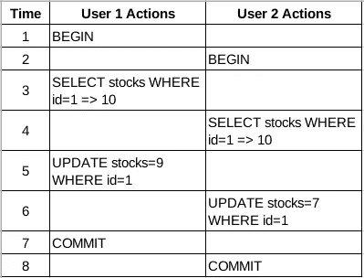
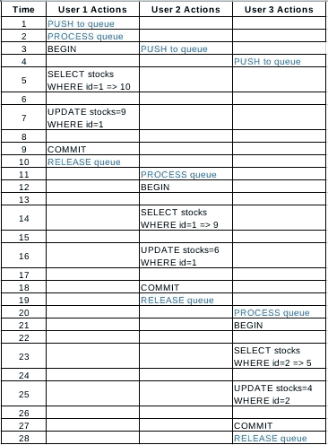
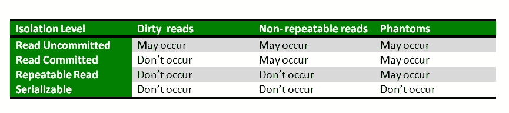
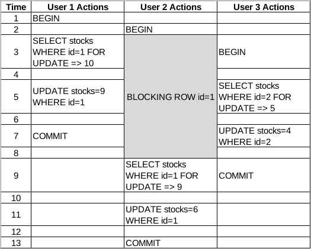

# Handling Concurrent Request dengan Database Locking

> 原文：<https://medium.easyread.co/meng-handle-concurrent-request-dengan-database-row-locking-transaction-1ea5387aa7c1?source=collection_archive---------0----------------------->

## *Handling Concurrent Request with Database Locking*


Credits: [BBC](https://www.bbc.co.uk/cbbc/findoutmore/help-me-out-staying-safe-online)

Kali ini saya akan membagikan pengalaman saya lagi-lagi tentang *how to deal with a concurrent request* . Dulu, saya sempat menulis bagaimana cara meng- *handle* *concurrent request* dengan *queue* di tulisan ini, [**Manajemen Queue untuk Menghandle Concurrent Request dengan Kue.js**](https://medium.com/easyread/manajemen-queue-antrian-untuk-menghandle-concurrent-request-dengan-kue-di-node-js-94e87cc3eea6) **.**

*Nah* , sedikit *flashback* , akan saya jelaskan mengapa kita perlu meng- *handle* *concurrent reques* t. Pada skenario artikel sebelumnya, dicontohkan kita memiliki *table* `**products**` yang memiliki atribut `**stocks**` . Dimana setiap ada pembelian, stok produk yang dibeli harus berkurang sesuai dengan jumlah yang dibeli dan me-reject order jika stok barang tidak cukup.


Struktur table products

Masalah muncul ketika ada lebih dari satu pengguna ingin melakukan pembelian pada waktu yang bersamaan. Di-ceritakan `**User 1**` melakukan pembelian produk `**ID 1**` sejumlah `**1 pcs**` . Di waktu yang berdekatan, `**User 2**` juga melakukan pembelian produk `**ID 1**` sejumlah `**3 pcs**` . Maka akan didapatkan *timeline* seperti dibawah.



Ilustrasi timeline transaksi concurrent request tanpa Queue dan Row Locking Transaction

*Hasil akhirnya?* Tentu saja jumlah stok produk `**ID 1**` adalah `**7**` , padahal seharusnya berjumlah `**6**` karena dikurangi `**1 + 3**` . Fenomena diatas disebut [**Dirty Read**](https://www.geeksforgeeks.org/dbms-dirty-read-in-sql/) , yakni salah satu dari tiga masalah (secara umum) yang ditemui pada *concurrency* *control* pada database. Di antara fenomena yang lain adalah [**Non Repeatable Read**](https://logicalread.com/sql-server-concurrency-nonrepeatable-reads-w01/#.XtCJcp4za3I) dan [**Phantom Read**](https://dotnettutorials.net/lesson/phantom-read-concurrency-problem-sql-server/) . Untuk lebih lengkapnya mengenai ketiga fenomena tersebut, dapat dilihat [disini](https://www.geeksforgeeks.org/transaction-isolation-levels-dbms/) .

Sekarang bagaimana kita menyelesaikan permasalahan ini?

# Menggunakan Queue

Untuk mengatasi hal ini, solusi sebelumnya kita dapat menggunakan *queue* . Penjelasan mengenai *queue* tidak saya jelaskan disini supaya artikel ini tidak bertele-tele. Teman-teman dapat membacanya [disini](https://medium.com/easyread/manajemen-queue-antrian-untuk-menghandle-concurrent-request-dengan-kue-di-node-js-94e87cc3eea6) . Dengan teknik *queue* , kita sudah berhasil menyelesaikan 1 masalah. Namun, apakah cara ini efektif?



Ilustrasi timeline transaksi dengan Queue. Process queue ditandai dengan warna biru, query database warna hitam

Masalah lain muncul saat trafik transaksi meningkat. Jika dalam satu waktu yang sama (selisih sepersekian detik) ada 5 transaksi bersamaan, maka dengan konsep *queue* , User yang melakukan order pertama kali akan dilayani terlebih dahulu, kemudian User ke-dua, dan seterusnya urut satu persatu hingga User terakhir. Jika hanya ada 5 transaksi bersamaan, tentu tidak akan menjadi masalah. Mungkin sedikit ketidaknyamanan hanya akan dirasakan User urutan ke-empat atau ke-lima yang menunggu sedikit lebih lama daripada yang lain. Namun, bila ada 100 transaksi dalam waktu yang sama, tentu akan menjadi masalah. Pengguna terakhir akan menunggu proses *queue* berjalan satu persatu hingga gilirannya tiba. Bahkan dengan ID produk yang berbeda sekalipun. Tentu saja menunggu 100 transaksi membutuhkan waktu yang tidak sebentar dan bisa menimbulkan *scalability issue* .

> Lalu, bagaimana cara yang efektif? Bagaimana cara menghindari kesalahan membaca data sekaligus mempercepat prosesnya?

# Menggunakan Database Row Locking Transaction

Sebelum masuk ke dalam konsep, saya anggap teman-teman sudah mengetahui bagaimana *Database Transaction* pada SQL bekerja. Selanjutnya, saat saya menyebut “antar transaction”, berarti 1 *request* (order) adalah 1 *transaction* sehingga terjadi *concurrency* . *Locking* berarti mencegah eksekusi *query* `**SELECT**` , `**UPDATE**` , `**DELETE**` .

Kita perlu memahami bagaimana ***Isolation Levels*** bekerja. Ada 4 *isolation levels* pada SQL yang akan saya jelaskan dengan ringkas. Untuk pembahasan lebih detil, dapat dilihat [disini](https://blog.gojekengineering.com/on-concurrency-control-in-databases-1e34c95d396e) atau [disini](https://www.geeksforgeeks.org/transaction-isolation-levels-dbms/) .

1.  ***Read Uncommitted*** : Tidak ada isolasi antar *transaction* . Membaca seluruh data, baik sesudah maupun sebelum di- *commit* antar *transaction.* Tidak ada *locking* apapun.
2.  ***Read Commited*** : Hanya membaca data yang sudah di- *commit* sebelum *query begin transaction* dan data yang terisolasi pada *transaction* -nya sendiri. Tidak membaca data yang belum di- *commit* pada *transaction* lain dan data yang sudah di- *commit* setelah *query begin transaction* . *Locking* pada 1 *row record* .
3.  ***Repeatable Read*** : Mirip seperti ***Read Commited*** . Namun melakukan *locking* pada level seluruh *row records* yang tereferensi dalam *query.* Mudahnya, jika kita melakukan query `**SELECT ***` , maka seluruh *table* akan di- *lock* . Jika ada *concurrency* pada data yang di- *lock* , maka akan mengembalikan *error* pada *transaction* kedua dan seterusnya.
4.  ***Serializable*** : Hanya memperbolehkan sebuah *transaction* yang berjalan pada satu waktu. Jika ada *concurrency* , maka akan mengembalikan *error* . *Locking* pada seluruh database.

Daftar isolasi diatas terurut mulai dari level paling rendah hingga paling tinggi. Hubungan mitigasi fenomena *concurrency* *transaction* dan *isolation* dapat dilihat pada gambar dibawah.



Credit: [Geeks for geeks](https://www.geeksforgeeks.org/transaction-isolation-levels-dbms/)

Setelah memahami mengenai *isolation* level, diketahui bahwa masalah yang kita hadapi adalah fenomena ***Dirty Read*** . Oleh karena itu, kita perlu set *isolation level* pada database menjadi ***Read Committed*** . Kita bisa *set isolation* level secara *global* , *session* , atau hanya per *transaction* . Lebih lengkapnya bisa dibaca [disini](https://dev.mysql.com/doc/refman/8.0/en/set-transaction.html) .

> Lalu, mengapa kita tidak set saja ke Repeatable Read atau Serializable sekalian? Kan semakin tinggi tingkat isolasinya, semakin baik?

> ***Jawabannya:*** *Kita tidak memerlukan isolasi yang terlalu tinggi karena* **Repeatable Read** *dan* **Serializable** *tidak mengizinkan adanya* concurrent transaction *. Terlebih, semakin tinggi tingkat isolasi, semakin lambat performanya. Oleh karena itu, sesuaikan tingkat isolasi dengan kebutuhan pada sistem yang dibangun.*

OKE! Kita sudah berhasil men-set isolation level. Apakah sudah selesai? BELUM! Kita hanya baru melakukan setup *isolation levels* . Selanjutnya, kita perlu melakukan *locking* pada *row* yang digunakan untuk bertransaksi dengan cara melakukan sedikit perubahan pada *query* kita. Kita perlu menambah keyword `**FOR UPDATE**` pada akhir query `**SELECT**` .

```
**SELECT stocks FROM products WHERE id=1 FOR UPDATE**
```

Penggunaan *query* `**SELECT … FOR UPDATE**` digunakan untuk melakukan *blocking* *query* `**SELECT**` pada *transaction* lain jika terjadi *concurrency* .
`**FOR UPDATE**` memberitahukan bahwa ada *transaction* yang sedang berlangsung sehingga *transaction* lain harus menunggu hingga proses *locking* di- *release* . *Locking* di- *release* saat *transaction* selesai dan *transaction* berikutnya dapat dilanjutkan. Berikut ilustrasi timeline menggunakan *Row Locking Transaction* .



Ilustrasi timeline transaksi dengan Row Locking Transaction

Bandingkan dengan timeline transaksi dengan *queue* diatas, terlihat perbedaannya bukan?

Selain `**FOR UPDATE**` , juga terdapat keyword yang lain seperti `**FOR SHARE**` dan keyword khusus seperti `**SELECT FOR NO KEY UPDATE**` dan `**SELECT FOR KEY SHARE**` pada Postgres. Untuk penggunaan dan penjelasan lebih lengkapnya, dapat dibaca [disini](http://shiroyasha.io/selecting-for-share-and-update-in-postgresql.html) .

Demikian pengalaman yang dapat saya bagikan. Jika teman-teman mengalami masalah yang sama, semoga sedikit pengalaman saya diatas bisa membantu teman-teman. Apabila terdapat kesalahan dalam penulisan atau teori saya, mohon dibenarkan di kolom komentar.

Terima kasih!

# References

1.  [Manajemen Queue untuk Menghandle Concurrent Request dengan Kue.js](https://medium.com/easyread/manajemen-queue-antrian-untuk-menghandle-concurrent-request-dengan-kue-di-node-js-94e87cc3eea6)
2.  [Dirty read in SQL](https://www.geeksforgeeks.org/dbms-dirty-read-in-sql/)
3.  [SQL Server Concurrency–Non-repeatable Reads](https://logicalread.com/sql-server-concurrency-nonrepeatable-reads-w01/#.XtCL2J4za3J)
4.  [Phantom Read Concurrency Problem](https://dotnettutorials.net/lesson/phantom-read-concurrency-problem-sql-server/)
5.  [Transaction Isolation Levels in DBMS](https://www.geeksforgeeks.org/transaction-isolation-levels-dbms/)
6.  [On Concurrency Control in Databases](https://blog.gojekengineering.com/on-concurrency-control-in-databases-1e34c95d396e)
7.  [13.3.7 SET TRANSACTION Statement](https://dev.mysql.com/doc/refman/8.0/en/set-transaction.html)
8.  [Selecting for Share and Update in PostgreSQL](http://shiroyasha.io/selecting-for-share-and-update-in-postgresql.html)