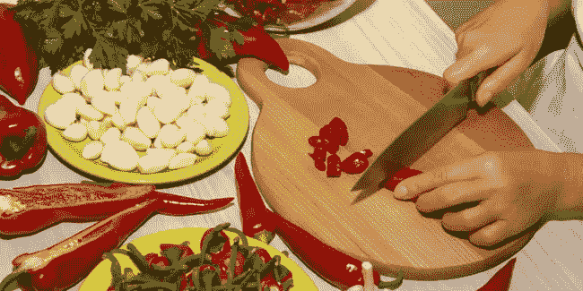
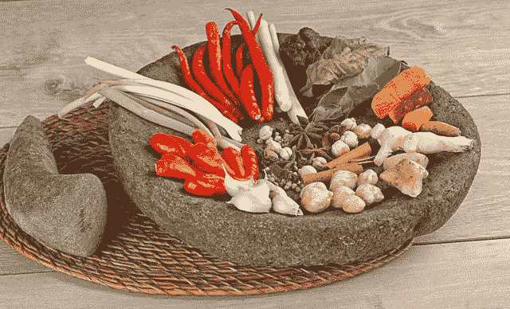

# Mengapa Belajar Satu Bahasa Pemrograman Saja Tidak Cukup?

> 原文：<https://medium.easyread.co/mengapa-belajar-satu-bahasa-pemrograman-saja-tidak-cukup-bc3a5af57be9?source=collection_archive---------6----------------------->

## Alasan seorang programmer perlu mengetahui beberapa bahasa pemograman

Photo by [Chris Ried](https://unsplash.com/photos/LfG7RwMM6g8?utm_source=unsplash&utm_medium=referral&utm_content=creditCopyText) on [Unsplash](https://unsplash.com/search/photos/programming-language?utm_source=unsplash&utm_medium=referral&utm_content=creditCopyText)

Mungkin kamu sering mendapat pertanyaan ini dari orang-orang sekitar kamu atau mungkin juga kamu termasuk salah satu orang yang sering bertanya-tanya mengapa seorang *programmer* perlu mempelajari lebih dari satu bahasa pemograman. *Nah* , untuk menjawab pertanyaan ini, kita dapat menuangkannya ke dalam beberapa analogi berikut.

Sebut saja ada tiga orang anak muda bernama Iman Tumorang, Petra, dan Panji yang tinggal di sebuah kompleks perumahan. Pada suatu hari mereka akan memasak ikan sambal. Di dapur rumah mereka masing-masing, mereka memiliki beberapa alat seperti pisau, ulekan, dan blender.

Untuk memasak ikan sambal, tentunya masing-masing dari mereka harus membuat sambal. Akan tetapi dengan mengandalkan kemampuan masing-masing dalam menggunakan alat, maka sambal yang mereka hasilkan berbeda.

# Analogi #1

Iris cabai taken from Google Image Search

Untuk membuat sambal, terlebih dahulu Iman menyiapkan segala bumbu yang dibutuhkan. Namun karena Iman hanya mengetahui cara menggunakan pisau, setelah Ia selesai menyiapkan bumbunya, mulai dari mengupas bawang dan jahe, ketika Ia hendak membuat sambalnya, Ia pun mengalami kebingungan karena Ia tidak bisa menggunakan ulekan ataupun blender untuk menghaluskan cabainya. Akhirnya sebagai jalan keluar, Ia pun *“memaksakan manfaat”* dari pisau yang Ia miliki untuk membuat sambal, yakni dengan mengiris-iris cabai dan bumbunya sampai halus, lalu digoreng dan dicampur dengan ikan.

# Analogi #2

Ulekan taken From Google Image Search

Dilain rumah, berbeda dengan Iman, Petra yang juga hendak memasak ikan sambal memiliki pengetahuan dalam menggunakan ulekan dan pisau. Namun Ia tidak tahu bagaimana cara menggunakan blender. Sama seperti Iman sebelumnya, Ia pun mempersiapkan bumbu yang diperlukan. Dengan memanfaatkan pisau *hanya untuk* mengupas bumbu yang harus dikupas. Selanjutnya untuk membuat sambalnya, ia menggunakan ulekan untuk menghaluskan cabai dan bumbunya sampai halus, lalu digoreng dan dicampur dengan ikan.

# Analogi #3

Blender cabai taken from Google Image Search

*Nah,* pemuda yang terakhir yang tinggal di seberang rumah mereka, yaitu Panji yang juga hendak memasak ikan sambal berbeda dengan Iman maupun Petra. Panji mengetahui cara bagaimana menggunakan ketiga alat tersebut, yaitu pisau, ulekan, dan blender. Akan tetapi karena lapar dan butuh menyelesaikannya dengan cepat, setelah mempersiapkan bumbunya, ia memilih menggunakan blender untuk membuat sambalnya, lalu di goreng dan dicampur dengan ikannya.

Berdasarkan ketiga analogi di atas, kita dapat menyimpulkan bahwa ikan sambal yang dihasilakn Iman tentu saja tidak sempurna. Karena Ia hanya menggunakan pisau untuk membuat sambalnya, sehingga tentu saja sambal yang Ia buat tidak jadi. Yang Ia hasilkan hanyalah cabai iris, bukan sambal. Ikan sambalnya bisa dikatakan bukan ikan sambal melainkan ikan yang diirisi cabai. Karena Iman cuma menggunakan pisau dalam menyiapkannya.

Lalu berbeda dengan Petra, Ia tentu saja akan menghasilkan ikan sambal yang sempurna, karena Ia menggunakan ulekan. Bumbu sambal yang Ia buat sangat halus, dan sempurna karena digiling dengan ulekan dengan sepenuh hati. Namun untuk menyelesaikannya, Ia membutuhkan waktu yang lebih lama.

*Nah* , demikian juga dengan Panji yang menghasilkan ikan sambal yang cukup sempurna, namun tidak sehalus dari sambal yang Petra hasilkan. Akan tetapi Ia dapat menyelesaikan masakannya dengan cepat, karena hanya sekali *cetek* , blendernya memutar dan menggiling cabai dan bumbu yang Ia telah siapkan.

# Bahasa Programming hanyalah sebuah Alat

Dari analogi diatas, coba kaitkan dengan pengembangan perangkat lunak yang ada di sekitar kamu. Pisau, ulekan, maupun blender dapat kita sebut sebagai bahasa pemograman. Sedangkan ikan sambal dapat kita sebut sebagai perangkat lunak yang akan dikembangkan.

Dari **Analogi #1** kita dapat mengambil penjelasan bahwa terkadang terdapat beberapa yang orang memaksa satu bahasa untuk segala kebutuhan, baik dari *backend* , *frontend* , dan lain sebagainya hanya karena yang Ia mengerti hanya bahasa tersebut.

Sedangkan dari **Analogi #2** dan **Analogi #3** , dapat menjelaskan perdebatan bahasa pemograman yang sering terjadi di kalangan *engineer* sekarang ini. Kalau digambarkan lagi kelanjutan dari analogi diatas, misalnya ibu-ibu yang sering berdebat seperti berikut.

U: Geng ulekan
B: Geng Blender

> U: “pakai ulekan itu lebih sempurna, lebih terasa sambalnya, rasanya lebih enak.”
> 
> B: “enggak, menurut saya pakai blender itu yang lebih bagus lho yah. sekali cetek udah selesai. terus tangan gak capek”

***Well, again, it’s just a tool,*** dan ***taste*** masing masing *programmer* . Sama halnya dengan bahasa pemograman, itu hanyalah alat. Tergantung dari *taste* juga, dan hal *external* lainya terkait *cost* dan sejenisnya yang harus dipertimbangkan saat menggunakannya. Ada bahasa pemograman yang dengannya kita dapat mengerjakan dengan cepat, tetapi mungkin hasilnya tidak terlalu sempurna jika menggunakan bahasa pemograman lainnya.

Jadi, untuk itulah mengapa seorang *programmer* , paling tidak perlu mengetahui 2 atau lebih bahasa pemograman. Jangan seperti **Analogi #1** . Jika kamu seperti analogi tersebut, kamu akan memaksa satu bahasa yang kamu kuasai kesemua jenis aplikasi, yang dimana pada akhirnya hanya akan membuat hasil atau aplikasimu tidak berjalan secara sempurna. Mungkin kelihatan sempurna, akan tetapi pasti akan memiliki kekurangan jika dibandingkan ketika kamu menggunakan bahasa pemograman lainnya yang lebih sesuai, mungkin dari segi *performance* atau dari segi *fast-delivery,* dsb.

Semakin banyak alat yang kamu tahu, semakin banyak cara yang bisa kamu temukan dengan alat tersebut. Semakin banyak bahasa pemograman dan teknik yang kamu tau, semakin banyak juga solusi yang bisa kamu pertimbangkan ketika membangun sebuah perangkat lunak 😃

Ya begitulah pendapat ideal saya. Akan tetapi, saya kembali mengingatkan bukan maksud saya kita hanya menjadi fokus mempelajari semua bahasa programming. Tetapi pelajari bahasa pemograman yang benar-benar ideal dan pas pada pokok masalah yang hendak kamu selesaikan. Misalnya, pelajari Java jika kamu hendak membangun aplikasi Android, bukan malah belajar Golang, atau PHP. Atau pelajari JavaScript jika hendak mengerjakan *frontend* secara *full* dan bukan belajar Java, apalagi CPP 😅

Selamat bereksplorasi!!