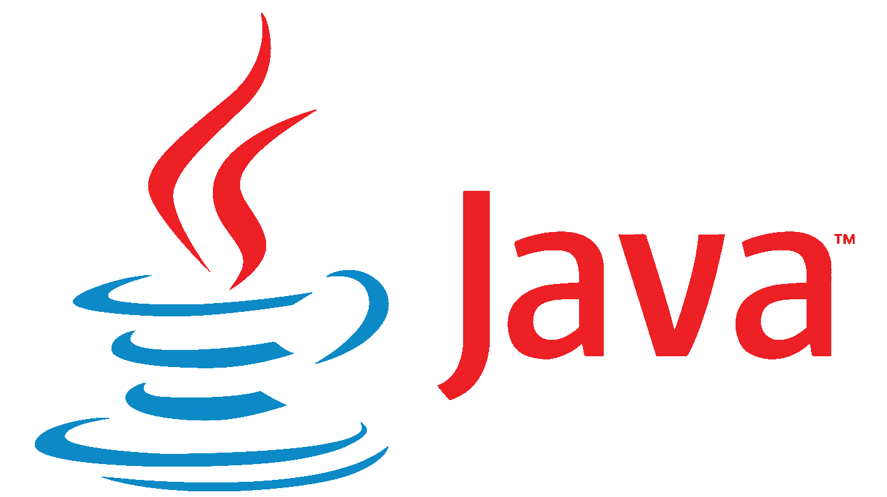
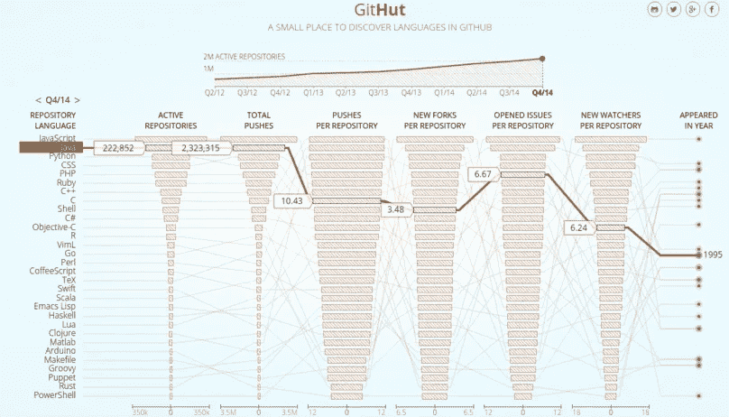

# Mengapa Memilih Java?

> 原文：<https://medium.easyread.co/mengapa-memilih-java-6b0491146494?source=collection_archive---------4----------------------->

Sumber : [https://logos-download.com/wp-content/uploads/2016/10/Java_logo_icon.png](https://logos-download.com/wp-content/uploads/2016/10/Java_logo_icon.png)

Java adalah salah satu bahasa pemograman yang berorientasi pada objek yang dikembangkan oleh *Sun Microsystem,* perusahaan yang terkenal dengan *Workstation* *UNIX high-end* .

## **Mengapa menggunakan Java?**

Kelebihan:

*   ***Multiplatform*** . Kelebihan utama dari Java adalah dapat dijalankan di beberapa *platform* /sistem operasi komputer, sesuai dengan prinsipnya yaitu tulis sekali, jalankan dimana saja.
*   ***OOP*** ( *Object Oriented Programming* - Pemrograman Berorientasi Objek) yang artinya semua aspek yang terdapat di Java adalah objek.
*   **Perpustakaan yang lengkap** . Java terkenal dengan kelengkapan *library* /perpustakaan(kumpulan program-program yang disertakan dalam pemrograman Java) yang akan memudahkan *programmer* dalam membangun aplikasinya.
*   **Bergaya C++** . Bagi mahasiswa yang memulai pemograman dengan belajar C ataupun C++, untuk belajar Java tidak terlalu sulit karena memiliki sintaks yang mirip.
*   **Pengumpulan sampah otomatis** .

Dibalik kelebihan Java tersebut, terdapat pula kekurangannya yaitu diperlukan memori yang lebih banyak tetapi dengan perkembangan teknologi hal ini tidak menjadi masalah karena harga memori yang semakin murah.

## Bagaimana dengan komunitasnya?

Merujuk pada salah satu sumber yaitu github, untuk saat ini Java adalah salah satu bahasa pemograman yang paling banyak digunakan. Ini membuktikan bagaimana Java dapat membantu para developer untuk mempermudah pengembangan aplikasi.

Sumber : [http://githut.info/](http://githut.info/)

*Nah* , bagi teman teman *developer* yang ingin belajar tentang Java dan *framework* yang disediakan oleh Java, dalam artikel saya selanjutnya, saya akan membahas sedikit demi sedikit. ***Keep learning!***

## **Referensi**

[https://10menit.wordpress.com/artikel/sejarah-perkembangan-java/](https://10menit.wordpress.com/artikel/sejarah-perkembangan-java/)