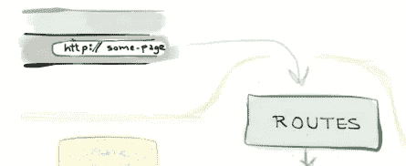
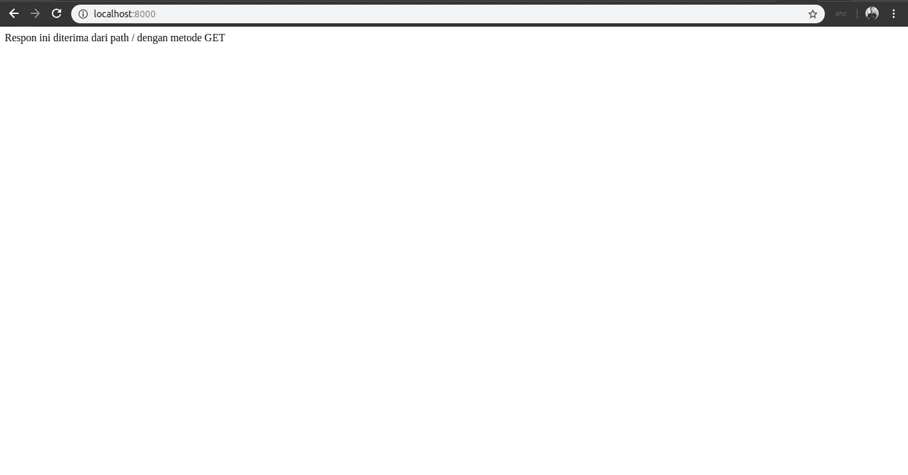
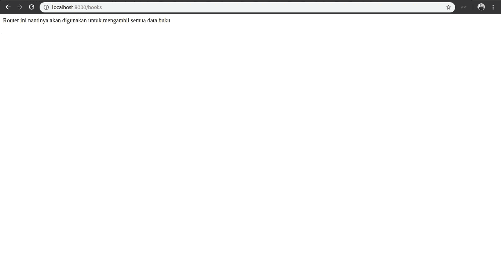
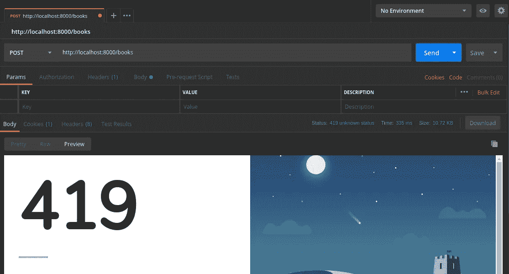

# Mengarahkan Request dengan Router pada Laravel

> 原文：<https://medium.easyread.co/mengarahkan-request-dengan-router-pada-laravel-a0df91142f51?source=collection_archive---------1----------------------->

## Part 7 — Router


Photo by [_M_V_](https://unsplash.com/@_m_v_?utm_source=medium&utm_medium=referral) on [Unsplash](https://unsplash.com?utm_source=medium&utm_medium=referral)

# Laravel Series List

[**0\. Laravel Series — Belajar Laravel dari Awal yok!**](https://medium.com/easyread/laravel-series-belajar-laravel-dari-awal-yok-c21dc47863da)[**1\. Persiapan untuk Pengerjaan Proyek dengan Laravel**](https://medium.com/easyread/persiapan-untuk-pengerjaan-proyek-dengan-laravel-2f9a99146313)[**2\. Pengenalan Laravel Framework**](https://medium.com/easyread/pengenalan-laravel-framework-1c829b8164af)[**3\. Instalasi Laravel Framework**](https://medium.com/easyread/instalasi-laravel-framework-41eeec1551ef)[**4\. Struktur Folder Laravel Framework**](https://medium.com/easyread/struktur-folder-laravel-framework-299f0225cd55)[**5\. Apa itu Artisan CLI pada Laravel?**](https://medium.com/easyread/apa-itu-artisan-cli-pada-laravel-62a94232a29a)[**6\. Rancang Database-mu dengan Migration Pada Laravel**](https://medium.com/easyread/rancang-database-mu-dengan-migration-pada-laravel-28d419d0089e) **7\. Mengarahkan Request dengan Router pada Laravel— (You’re here)** [**8\. Olah Request dengan Controller pada Laravel**](https://medium.com/easyread/olah-request-dengan-controller-pada-laravel-a77b52235a4b)[**9\. Mudahnya Mengolah Data Menggunakan Model dan Eloquent pada Laravel**](https://medium.com/easyread/mudahnya-mengolah-data-menggunakan-model-dan-eloquent-pada-laravel-80af915c80b5)[**10\. Membuat Tampilan Web dengan Blade pada aplikasi Laravel — Part I**](https://medium.com/easyread/membuat-tampilan-web-dengan-blade-pada-aplikasi-laravel-part-i-c9f5ceee65e6)[**11\. Membuat Tampilan Web dengan Blade pada aplikasi Laravel — Part II**](https://medium.com/easyread/membuat-tampilan-web-dengan-blade-pada-aplikasi-laravel-part-ii-9e233233972a)

Pada part ini saya akan membahas mengenai *router,* yang kalau saya bilang ini adalah pintu dimana segala sesuatu dimulai. Tidak jelas? Ya memang :D

Untuk memulai pembahasan mengenai *router* mari kita perhatikan kembali gambar dibawah ini. Gambar dibawah ini menjelaskan bagaimana sebenarnya aliran kerja *framework* Laravel dari awal sampai akhir. Tidak percaya? Ya sudah percaya saja dulu.


Taken from selftaughtcoders.com

Jadi apa itu *router?* Secara sederhana, *router* adalah komponen yang kita gunakan untuk mengarahkan *request* kita untuk mendapat *response* yang kita inginkan. *Response-* nya bisa dalam bentuk *view* ataupun data dalam bentuk JSON dan XML.



Router menerima URL yang dikirimkan.

Dari pernyataan diatas, akan muncul pertanyaan bagaimana kita mengirimkan *request.* Untuk setiap *request* dikirimkan melalui menggunakan *Hypertext Transfer Protocol (HTTP).* Untuk mengirim *request* melalui *HTTP* kita akan menggunakan *Uniform Resource Locator (URL).* Jika kita perhatikan gambar diatas, *URL* yang kita akses dari *browser* akan ditangani oleh *router.*

Karena kita akan menggunakan *HTTP,* ada baiknya jika kita kenal dulu dengan *HTTP Verbs. HTTP Verbs* adalah metode-metode yang kita gunakan ketika melakukan pengiriman *request.* Metode-metode yang dimaksud adalah GET, POST, PATCH, PUT, dan DELETE. Berikut adalah penjelasan kegunaan dari setiap metode.

*   **GET** , digunakan untuk pengambilan data
*   **POST** , digunakan untuk penambahan data
*   **PATCH** dan **PUT** , digunakan untuk pengubahan data
*   **DELETE** , digunakan untuk penghapusan data

Sebenarnya masih ada beberapa *HTTP Verbs* lagi, tetapi dengan memahami *HTTP Verbs* diatas sudah cukup untuk bisa langsung mempraktikkan penggunaan *router* pada Laravel.

# Daftarkan *Router* -mu

Pada folder `**routers**` terdapat file `**web.php**` . Kita akan mendaftarkan semua *routers* kita pada file `**web.php**` . Pertama sekali, hapus semua kode program dan komentar pada file `**web.php**` kecuali *tag* pembuka PHP. Lalu tambahkan kode program berikut pada file `**web.php**` teman-teman.

Sebelum kita mencoba mengakses *router* kita, ada baiknya kita membedah kode program diatas.

*   `**Route**` , adalah kelas Router yang ada pada aplikasi kita. Kita menggunakan kelas ini untuk mendaftarkan *router* kita.
*   `**::get**` , adalah *static method* pada kelas Router yang kita gunakan untuk menentukan *HTTP Verbs* mana yang akan dipakai. Bisa digantikan dengan *HTTP Verbs* yang lain, menjadi seperti `**::post**` , `**::put**` , dan `**::delete**` .
*   `**/**` , adalah *path* yang kita gunakan untuk menentukan kode program mana yang akan kita eksekusi nantinya untuk mendapatkan *response* .
*   `**function() {}**` , adalah *closure function* yang bersifat anonim (tanpa nama) yang akan dieksekusi ketika terdapat *request* yang memiliki kesamaan *path* dan metode dengan *router* yang kita daftarkan.

Untuk mencoba mengakses *router* kita, terlebih dahulu jalankan aplikasi Laravel teman-teman dengan perintah `**php artisan serve**` . Setelah aplikasinya berjalan, akses `**localhost:8000**` melalui *browser* dan kita akan mendapatkan hasil seperti dibawah ini.



Respon dari path /

Lalu saya mencoba untuk mengakses *path* yang lain, misalnya `**/books**` dan saya mendapatkan tampilan berikut.



Respon dari path /books

Pada `**web.php**` kita sudah mendaftar beberapa *router* dengan *path* `**/books**` . Tetapi ketika saya mengaksesnya melalui *browser* , saya hanya bisa mengakses path `**/books**` yang menggunakan metode GET. Lalu bagaimana saya bisa mengakses path `**/books**` yang menggunakan *HTTP Verbs* lainnya? Hal ini tidak bisa kita lakukan jika hanya menggunakan *URL bar* pada *browser* kita. Setiap *request* yang dilakukan melalui *URL bar* pada *browser* secara otomatis menggunakan metode GET. Untuk mengirimkan *request* dengan menggunakan *HTTP Verbs* lainnya, kita bisa menggunakan [Postman](https://www.getpostman.com/) . Pada aplikasi Postman, kita bisa menentukan *HTTP Verbs* mana yang ingin kita gunakan.

Saya mencoba untuk mengirimkan *request* dengan *path* `**/books**` dan menggunakan metode POST melalui aplikasi Postman. Ternyata saya masih mendapatkan *error* seperti dibawah ini.



HTTP error 419 akibat tidak menyertakan CSRF Token dalam *request*

HTTP *error* dengan kode ***419 Unknown Status*** adalah *error* pada aplikasi Laravel yang disebabkan karena kita tidak menyertakan CSRF Token pada *request* kita *.* CSRF Token adalah sebuah *string* acak yang digunakan untuk mengamankan aplikasi kita dari serangan bertipe CSRF. Apa itu CSRF dan CSRF Token teman-teman bisa baca [disini](https://stackoverflow.com/questions/5207160/what-is-a-csrf-token-what-is-its-importance-and-how-does-it-work) .

Untuk setiap *router* pada aplikasi Laravel yang menggunakan metode selain metode GET harus menyertakan CSRF Token pada *request* -nya. CSRF Token sendiri akan di- *generate* oleh `view` secara otomatis. Maka dari itu kita harus men- *disable* pemeriksaan CSRF Token untuk setiap *request* sehingga kita bisa mengirimkan *request* melalui aplikasi Postman tanpa pemeriksaan. ***Tapi hal ini tidak disarankan untuk pengembangan selanjutnya, karena akan membahayakan aplikasi teman-teman. Saya men-disable CSRF protection-nya hanya untuk mempermudah simulasi saja.**

Untuk men- *disable* CSRF, bisa dilakukan dengan men- *comment* VerifyCsrfToken *middleware* pada file `app\Http\Kernel.php` . Berikut potongan kode programnya.

VerifyCsrfToken::class di komen pada baris ke 18

Setelah VerifyCsrfToken di- *disable* , teman-teman bisa kembali mengirimkan *request* melalui aplikasi Postman dan seharusnya tidak terjadi *error* lagi.

# Path Parameter pada Router

Pada *router* yang kita daftarkan, kita bisa melemparkan parameter melalui *path* . Parameter ini akan sangat berguna ketika nantinya kita mengerjakan aplikasi kita. Contoh penggunaan *path* parameter adalah ketika kita ingin mengakses data dengan *id* tertentu, maka kita akan menyertakan *id-* nya pada *path.* Misalnya kita ingin mengakses data buku dengan *id* 1, maka *path* -nya adalah `**/books/1**` . Misalnya kita ingin menghapus data buku dengan *id* 5, maka *path* -nya adalah `**/books/5**` .

Implementasinya pada *router* kita adalah sebagai kode program berikut.

Mari kita bedah kode program diatas.

*   `**/books/{id}**` , adalah *path* yang akan menampung satu parameter yaitu `**id**` .
*   `**function($id)**` , adalah *closure method* yang akan dijalankan ketika *path* `**/books/{id}**` dipanggil. Untuk mendapatkan nilai dari `**id**` , kita perlu menambahkan parameter pada *closure method* kita. Untuk penamaan variabelnya bebas sesuai keinginan teman-teman, tetapi saya sarankan menggunakan penamaan yang jelas dan mudah dimengerti.

# Query Parameter pada Router

Jika diatas kita membahas *path* parameter, maka sekarang kita akan membahas *query* parameter. Berbeda dengan *path* parameter, *query* parameter tidak perlu didefinisikan pada *router* . Lalu bagaimana kita menggunakannya?

Kita bisa menggunakan query parameter dengan cara menambahkan query pada akhir URL. Query yang dimaksud adalah seperti berikut

```
**localhost:8000/books?id=1**
```

`?id=1` adalah *query* parameter yang kita kirimkan. `id` adalah nama variabel yang kita berikan dan `1` adalah nilai dari variabel tersebut. Kita juga bisa melemparkan lebih dari satu *query* parameter pada request kita dengan cara seperti berikut.

```
**localhost:8000/books?id=1&title=TheLostLabirin&author=Anonymous**
```

Dari URL di atas, terdapat tiga parameter yang dikirimkan yaitu `**id**` dengan nilai `**1**` , `**title**` dengan nilai `**TheLostLabirin**` , dan `**author**` dengan nilai `**Anonymous**` . Kita perlu menambahkan *ampersand symbol* ( & ) untuk memisahkan setiap parameter. Lalu bagaimana kita mengakses parameter yang sudah dikirimkan?

Teman-teman bisa kembali memperhatikan *router* dengan *path* `**/books**` dan metode GET. Mari kita bedah kode programnya.

*   `**/books**` , adalah *path-* nya
*   `**function(Request $request)**` , adalah *closure method* yang menerima satu parameter yaitu `**$request**` yang merupakan instansiasi dari kelas `**Request**` . Untuk itu kita perlu mengikutsertakan kelas `**Request**` pada file `**web.php**` dengan cara menambahkan kode program `**use** **Illuminate\Http\Request;**` setelah *tag* pembuka PHP.
*   Untuk mengakses parameter yang sudah dikirimkan, kita menggunakan *object operator* yaitu `**->**` . Maka untuk mengakses parameter `**id**` kode programnya adalah `**$request->id**` .


Taken from me.me

Sampai jumpa di- *part* berikutnya!

Cappy Hoding! ❤️ = ☕️ + 💻