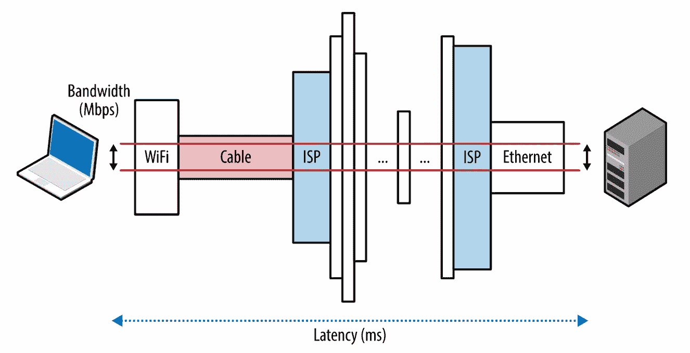
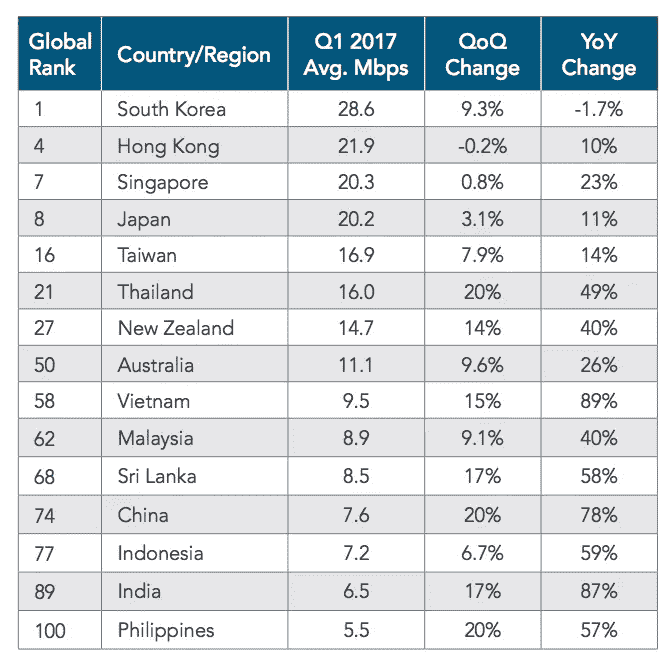

# Mengenal Jaringan Komputer lebih dekat: Latency dan Bandwidth

> 原文：<https://medium.easyread.co/mengenal-jaringan-komputer-lebih-dekat-latency-dan-bandwidth-279607e2cfa3?source=collection_archive---------0----------------------->

## Perbedaan Latency dan Bandwith dalam dunia Internet


Photo by [Thomas Jensen](https://unsplash.com/@thomasjsn?utm_source=medium&utm_medium=referral) on [Unsplash](https://unsplash.com?utm_source=medium&utm_medium=referral)

Kecepatan Internet telah menjadi hal yang sangat krusial di kehidupan kita sehari-hari. Di era digital ini, pernah gak sih kamu menemukan situs web atau aplikasi *mobile* yang lambat sekali sewaktu dibuka? Pasti pernah kan! Kamu akan merasa jengkel, *ngomel* , dan pada akhirnya menyerah tidak jadi membuka situs tersebut.

Hal ini sangat manusiawi dan studi pada bisnis *online* menunjukkan:

*   Situs yang **lebih cepat** akan membuat pengguna lebih *engaged* ( *user engagement* ) *.*
*   Situs yang **lebih cepat** akan membuat pengguna lebih setia ( *user retention* ).
*   Situs yang **lebih cepat** akan membuat konversi bisnis yang lebih baik.

Secara psikologis bisa dijelaskan dengan tabel ini:

persepsi manusia terhadap waktu

Ya, kata kuncinya adalah **kecepatan** . Untuk membuat situs atau aplikasi dapat diakses pengguna dengan cepat, ada banyak sekali faktor. Saya akan membahasnya dari kacamata jaringan. Tulisan ini merupakan seri pertama dari ringkasan buku “ [High Performance Browser Networking](https://hpbn.co/) ”, cocok untuk kamu yang ingin mengenal jaringan komputer lebih dekat dan juga panduan mengenai bagaimana membuat situs web supaya bisa diakses jutaan pengguna dengan cepat. Mari kita mulai dengan dua komponen utama yang mempengaruhi kinerja dari lalu lintas jaringan Internet: *latency* dan *bandwidth* .



Latency dan *bandwidth* (sumber: [hpbn.co](https://hpbn.co/assets/diagrams/9f12afe5ca29ba5c2ad555fcee5bd568.svg))

***Latency*** adalah waktu yang diperlukan paket dari saat dikirim sampai diterima tujuan. ***Bandwidth*** adalah *throughput* maksimal dari jalur komunikasi *logical* maupun *physical* .

Kalau ini sulit dimengerti, analoginya seperti sebuah jalan tol Bandung-Jakarta. *Latency* merupakan waktu yang diperlukan mobil berangkat dari Bandung sampai tiba di Jakarta. *Bandwidth* merupakan lebar jalan tolnya *. Throughput* adalah berapa banyak mobil yang bisa melalui jalan tol pada satu waktu.

Dengan memahami bagaimana *latency* dan *bandwidth* bekerja, kita bisa mendalami karakteristik dari jaringan Internet, seperti TCP, UDP, dan berbagai macam aplikasi-aplikasi protokol di atasnya.

# Berbagai Komponen yang Membentuk Latency

Konsep *latency* terbilang sederhana, tapi seringkali informasi-informasi penting di dalamnya tersembunyi. Setiap sistem terdiri dari banyak sumber dan komponen yang menambahkan delay pada waktu secara keseluruhan, agar sebuah pesan berhasil diterima oleh penerima. Kita harus bisa mengerti apa saja komponen ini dan apa dampaknya terhadap kinerja jaringan secara keseluruhan.

Yuk kita lihat sebuah *router* pada jaringan Internet lebih dekat. *Router* bertanggung jawab untuk menyampaikan pesan antara klien dan server. Beberapa komponen pada *router* yang memberikan dampak pada keseluruhan *delay* :

***Delay* propagasi:** waktu yang diperlukan sebuah pesan untuk pergi dari pengirim sampai diterima oleh penerima, merupakan fungsi dari jarak dibagi dengan kecepatan.

***Delay* transmisi:** waktu yang diperlukan untuk mendorong seluruh bit dari paket ke dalam *link* , merupakan fungsi dari panjang paket dan *rate* data dari *link.*

***Delay* pemrosesan:** waktu yang diperlukan untuk memproses *header* paket, memeriksa kesalahan ( *error* ) pada tingkatan bit, dan memutuskan tujuan paket.

***Delay* antrian:** waktu yang diperlukan untuk paket menunggu pada antrian sampai bisa diproses.

Total waktu *latency* adalah penjumlahan dari semua *delay* di atas, dengan beberapa catatan. *Delay* propagasi bergantung pada jarak dan medium tempat sinyal bergerak (melalui medium optik *fiber* , sinyal bergerak dengan kecepatan 200 juta meter per detik, atau 2/3 kecepatan cahaya).

*Delay* transmisi bergantung pada *rate* data yang tersedia pada *link* transmisi, tidak ada hubungannya dengan jarak antara klien dan server. Misalnya, kamu ingin mengirimkan berkas 10 Mb melalui dua macam *link* : 1 Mbps dan 100 Mbps. Kamu akan membutuhkan 10 detik untuk menaruh seluruh berkas “ke dalam kabel” dengan *link* 1 Mbps, dan cukup 0,1 detik saja dengan *link* 100 Mbps.

# Latency Propagasi

Seperti kata Einstein di pelajaran SMA, kita mengenal teori relativitas: kecepatan cahaya merupakan kecepatan tercepat dimana energi, benda, dan informasi dapat bergerak. Pada saat ini, kita perlu mengapresiasi para *engineer* yang telah berhasil merekayasa medium optik *fiber* , yang berhasil membuat sinyal bergerak relatif mendekati kecepatan cahaya, dan membuat hidup kita lebih enak.

sinyal latency terhadap daerah

Kecepatan cahaya memang cepat, tapi perlu waktu lebih dari 160 milidetik untuk bolak balik ( *round-trip* — RTT) dari Jakarta ke New York. Perhitungan ini pun sangat optimisitis, karena sebenarnya pada setiap *hop* di perjalanan, akan ada penambahan *delay routing* , pemrosesan, antrian, dan transmisi *.* Sebagai hasilnya, waktu RTT sesungguhnya antara Jakarta dan New York ada di antara 200–300 milidetik.

Apakah ini “cepat”? Bisa ya, bisa juga tidak. Tapi menurut tabel psikologis yang saya jelaskan di awal artikel, *delay* ini belum akan membuat seorang pengguna geram. Intinya, untuk melayani jutaan pengguna dengan *experience* terbaik dan tetap membuat mereka *engaged* pada berbagai layanan yang tersedia, **situs atau aplikasi perlu melayani dalam hitungan ratusan milidetik** . Untuk menggapai kesuksesan, *latency* jaringan harus dikelola dengan sangat hati-hati, dan menjadi parameter terukur yang menjadi target pada semua fase pengembangan produk.

# Latency Last-Mile

Sayangnya, kebanyakan *latency* yang signifikan bukan disebabkan oleh penyeberangan samudera dan antar benua, melainkan karena masalah yang bernama *last-mile* . Agar Internet bisa sampai ke kantor atau rumah kamu, ISP lokal perlu untuk menghubungkan kabel ke perumahan, menggabungkan sinyal, dan meneruskannya ke node *routing* lokal. Pada kenyataannya, tergantung dari tipe konektivitas, metode *routing* , dan teknologi yang digunakan, beberapa *hop* di awal ini bisa menghabiskan puluhan milidetik sendiri.

Mari kita lihat hasil `traceroute` dari komputer saya di Jakarta:

```
$ traceroute google.com
traceroute to google.com (216.239.38.120), 64 hops max, 52 byte packets
 1  192.168.100.1 (192.168.100.1)  1.868 ms  0.986 ms  0.900 ms
 2  180.252.96.1 (180.252.96.1)  3.452 ms  3.287 ms  2.763 ms
 3  125.160.0.45 (125.160.0.45)  2.861 ms  4.756 ms  2.884 ms
 4  61.94.171.97 (61.94.171.97)  3.345 ms  3.703 ms  3.266 ms
 5  180.240.190.54 (180.240.190.54)  23.097 ms  16.784 ms  31.053 ms
 6  180.240.190.53 (180.240.190.53)  16.808 ms  37.478 ms  18.643 ms
 7  * * *
 8  180.240.204.122 (180.240.204.122)  26.685 ms
    180.240.204.86 (180.240.204.86)  20.794 ms  21.430 ms
 9  72.14.223.88 (72.14.223.88)  18.688 ms
    72.14.217.146 (72.14.217.146)  19.467 ms  20.504 ms
10  * * *
11  108.170.234.69 (108.170.234.69)  19.072 ms
    x.1e100.net (216.239.38.120)  17.220 ms  16.422 ms# hop ke-1: router wireless lokal
# hop ke-11: server Google
```

Pada hasil di atas, paket mulai dikirimkan dari kota Jakarta, kemudian lompat ke datacenter Telkom Indonesia, ke datacenter Telkom International di Singapura, akhirnya dilewatkan ke datacenter Google dan sampai ke tujuan di hop ke-11\. Semua proses terjadi dalam waktu rata-rata 17 milidetik. Cukup cepat, mengingat paket bisa saja sudah berpindah-pindah ke banyak daerah di Asia Tenggara.

*Latency* *last-mile* bervariasi antar ISP karena perbedaan teknologi yang digunakan dan waktu saat mengakses. Sebagai pengguna Internet, kalau kamu ingin meningkatkan kecepatan akses situs, pastikan untuk membandingkan *latency* *last-mile* dari berbagai penyedia ISP yang ada di daerah kamu. ***Latency* , bukan *bandwidth* , adalah *bottleneck* kinerja dari kebanyakan situs.** Untuk mengerti alasannya, kita perlu memahami cara kerja protokol TCP dan HTTP yang akan saya bahas pada tulisan-tulisan berikutnya.

# Bandwidth pada Jaringan Core dan Edge

Optik *fiber* berfungsi sebagai “pipa cahaya”, lebih tebal sedikit daripada sehelai rambut, dirancang untuk mengirimkan cahaya antar kedua ujung kabel. Optik *fiber* punya *bandwidth* sangat lebar karena masing-masing *fiber* bisa membawa berbagai macam kanal panjang gelombang ( *wavelength* ), melalui proses yang disebut sebagai *wavelength-division multiplexing* (WDM). Maka, total *bandwidth* dari *link fiber* adalah perkalian antara *rate* data setiap kanal dengan jumlah kanal *multiplex* .

*Backbone* jaringan, atau *link-link fiber* , membentuk berbagai jalur data *core* dari Internet yang dapat memindahkan ratusan terabit per detik. Hanya saja, kapasitas yang tersedia pada *edge* sangat bergantung pada teknologi yang digunakan: *dial-up* , DSL, kabel, *wireless* , *fiber-to-the-home* , atau bahkan kinerja dari *router* lokal. *Bandwidth* yang tersedia untuk pengguna merupakan fungsi dari kapasitas *link* terendah antara klien dan server tujuan.

Berikut data dari Akamai Technologies yang mengoperasikan CDN global:



Bandwidth rata-rata di Asia Q1 2017 (sumber: [Akamai report](https://www.akamai.com/us/en/multimedia/documents/state-of-the-internet/q1-2017-state-of-the-internet-connectivity-report.pdf))

Indonesia berada pada peringkat ke-77 dunia dengan rata-rata 7.2 Mbps. Sebagai referensi, menonton video HD *streaming* memerlukan antara 2 sampai 10 Mbps tergantung dari resolusi dan codec. Maka, pengguna Internet rata-rata di Indonesia belum bisa sepenuhnya menonton HD tanpa terputus-putus ( *lag* ). Video yang bukan HD bisa ditonton dengan lancar pada jaringan *edge* , tapi tentunya ini akan mengkonsumsi kapasitas *link* , bukan sesuatu yang baik bagi rumah dengan banyak pengguna di dalamnya.

Kita semua menginginkan ISP dengan *link* *bandwidth* yang tinggi, tapi ini tidak menjamin kualitas kinerja seacara *end-to-end.* Hanya karena *bandwidth* menjanjikan *rate* data tinggi, bukan berarti kamu bisa mengharapkan kinerja yang sama dari server *remote* yang sedang kamu akses. Jaringan dapat mengalami *congestion* pada node tertentu karena permintaan yang tinggi, kegagalan *hardware* , serangan pada jaringan, atau alasan lainnya. Variasi dari kinerja *throughput* dan *latency* merupakan properti dari jaringan. Mengelola, mengatur, dan mengadaptasi perubahan “cuaca jaringan” ini merupakan tugas yang cukup rumit.

# Memiliki *Bandwidth Tinggi dan Latency Rendah*

Permintaan pengguna soal *bandwidth* tinggi berkembang cepat, karena berkembangnya *video streaming,* yang menghasilkan setengah lalu lintas Internet dunia. Walaupun tidak murah, ada beberapa strategi yang dapat meningkatkan kapasitas: menambahkan *fiber* baru, men- *deploy link-link* baru pada *route-route* yang penuh ( *congested* ), atau meningkatkan teknik WDM untuk mentransfer data lebih banyak melalui *link* yang ada.

Kita tidak bisa membuat cahaya bergerak lebih cepat, namun kita bisa membuat jarak antara klien dan server lebih dekat. Untuk meningkatkan kinerja situs dan aplikasi yang kita kembangkan, kita harus bisa merancangnya dengan selalu memikirkan limitasi dari ketersediaan *bandwidth* dan kecepatan cahaya: **mengurangi *round-trip-time* (RTT), memindahkan data mendekati klien, dan mengembangkan aplikasi yang bisa menyembunyikan *latency* melalui *caching* , *pre-fetching*** *,* dan teknik-teknik lainnya yang akan saya bahas pada tulisan-tulisan berikutnya.

Penulis merupakan penggiat sistem Cloud, Kubernetes, dan Container di Indonesia. Ia seorang [CNCF ambassador](https://www.cncf.io/people/ambassadors/) , [Google Developer Expert](https://developers.google.com/community/experts) , dan Kubernetes maintainer. Gabung dengan grup [telegram Kubernetes dan Cloud Native Indonesia](http://t.me/kubernetesindonesia) untuk diskusi berbagai hal menarik seputar perkembangan teknologi Cloud Native, atau bantu menerjemahkan [dokumentasi Kubernetes](http://kubernetes.io/id) ke [bahasa Indonesia](http://bit.ly/k8s-docs-id-m3) .