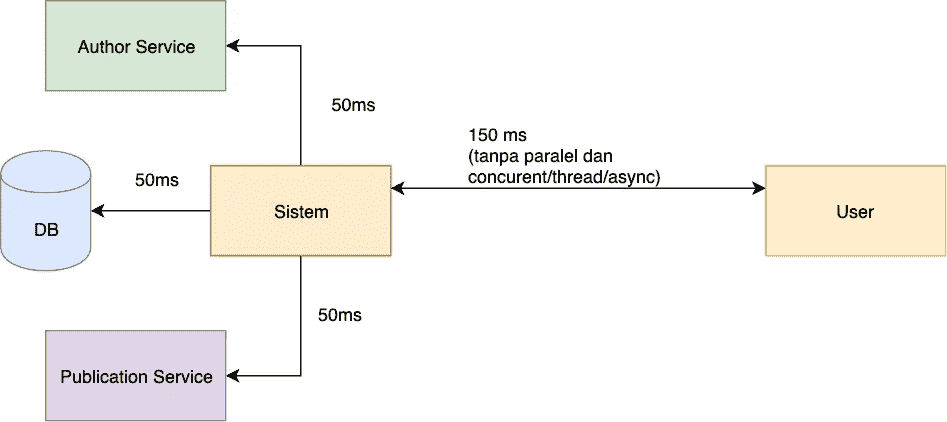
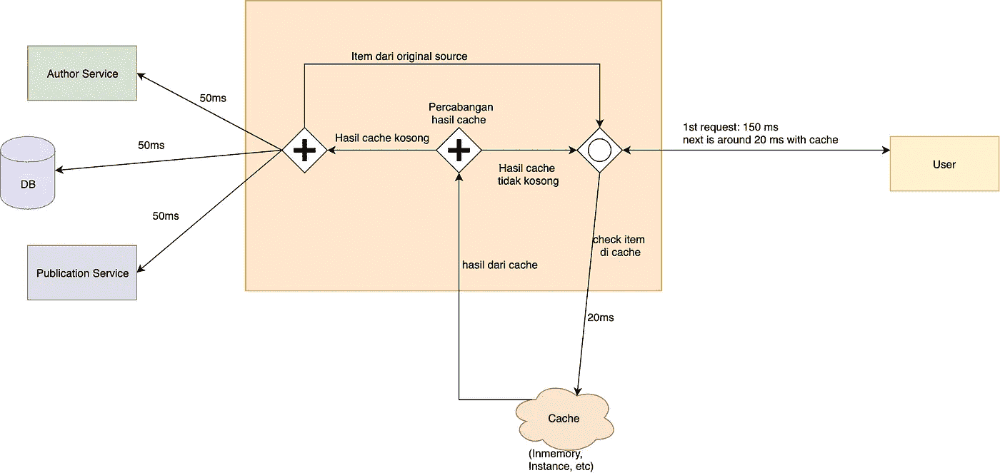
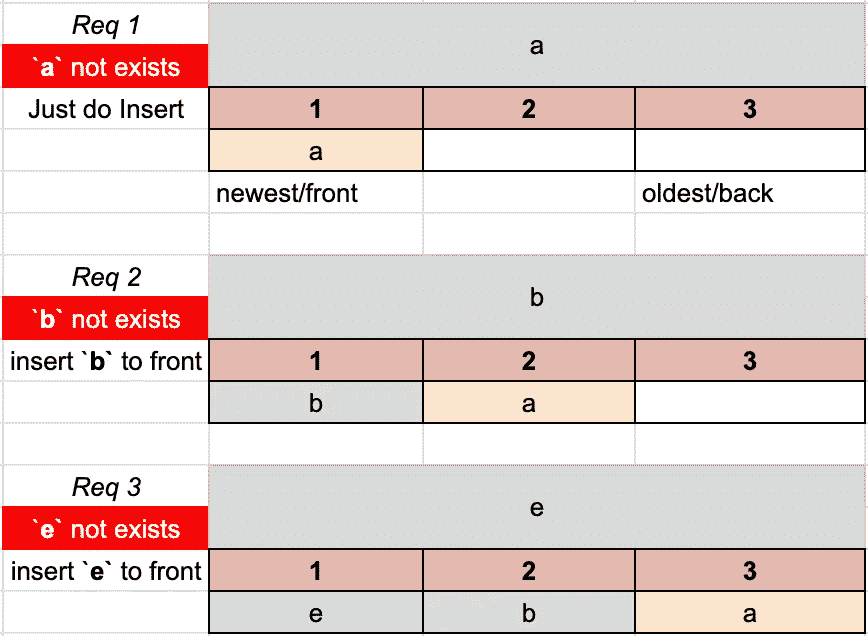
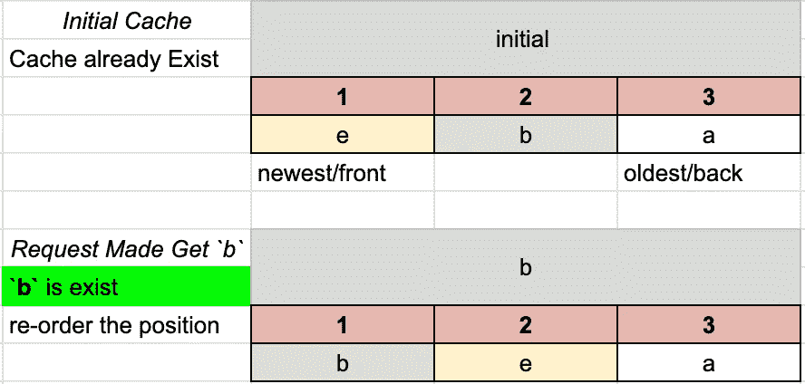
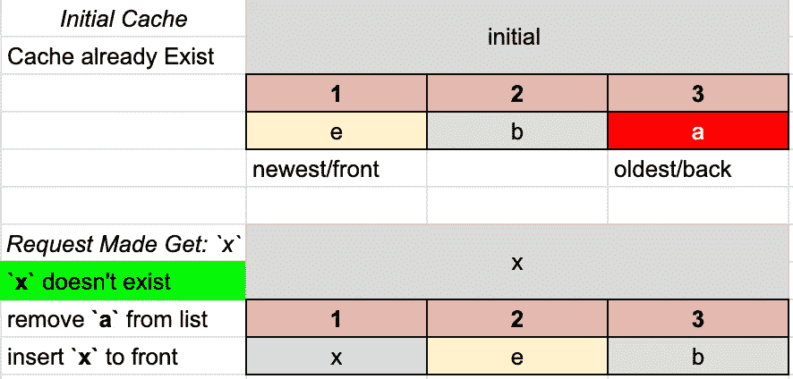

# Mengenal Jenis-Jenis Algoritma Cache

> 原文：<https://medium.easyread.co/mengenal-jenis-jenis-algoritma-cache-d03be94d72a7?source=collection_archive---------2----------------------->

## Mengenal Prinsip Dasar dari Algoritma Cache dan atau Page Replace Algorithm


Photo by [Matt Artz](https://unsplash.com/@mattartz?utm_source=medium&utm_medium=referral) on [Unsplash](https://unsplash.com?utm_source=medium&utm_medium=referral)

TLDR; (Too Long, Didn’t Read):

*   Sedikit penjelasan tentang Cache.
*   Saya sedikit menjelaskan perbedaan LRU dan LFU.
*   Saya sempatkan membuat simple library Go (Golang) dengan implementasi dari LRU dan LFU di sini [https://github.com/bxcodec/gotcha](https://github.com/bxcodec/gotcha) .

Dalam dunia Software Engineering, ada sebuah istilah yang cukup lazim disebut dan diketahui oleh para engineer, yakni “cache”. Cache atau dalam bahasa Indonesia disebut [Tembolok](https://id.wikipedia.org/wiki/Tembolok_(komputer)) .

## Apa itu Cache?

Versi Wikipedia, menyatakan cache adalah [mekanisme](https://id.wikipedia.org/wiki/Mekanisme) penyimpanan [data](https://id.wikipedia.org/wiki/Data) sekunder berkecepatan tinggi yang digunakan untuk menyimpan data / instruksi yang sering diakses¹.

Prinsip kerja cache sangatlah sederhana, yakni menyimpan sementara data/file yang nantinya dapat digunakan secara berulang oleh sistem tersebut.

Jika dibuat dalam sebuah analogi, saya akan berikan contoh seperti sebuah warung makan.

Sebut saja, terdapat sebuah warung makan, dimana terdapat berbagai menu. Salah satu menu andalahnya adalah minuman Es Teh Manis. Teh manis yang dicampur dengan es batu. Es Teh Manis adalah menu paling favorit di warung makan tersebut. Saat pembeli bingung mau memilih minum apa, pasti jawaban tercepat yang disebutkan adalah Es Teh Manis.

Untuk membuat segelas Es Teh Manis, dibutuhkan 4 bahan, yaitu air putih, bubuk teh (celup/saring), gula, dan es. Dan untuk membuat segelas Es Teh Manis kita sebut saja butuh 5 menit untuk best-case, worst-case mungkin bisa sampai 10 menit kalau pembuatnya perfectsionis :D.

Nah, misalnya di warung makan tersebut, sedang ada rombongan yang makan, dan sangat ramai. Sehingga banyak pesanan menumpuk, khususnya pesanan Es Teh Manis, sebut saja semua pelanggan memesan Es Teh Manis, jika sang pelayan membuat Es Teh Manis dengan sistem pergelas, maka sangat lah lama.

Jalur cepatnya adalah, untuk memangkas beberapa hal yang tidak penting, sang pelayan pun berinisiatif untuk membuatnya ke dalam satu Teko teh manis lalu di tuang satu persatu ke dalam gelas beserta Esnya. Tentu dengan metode ini penyajian Es Teh Manis akan menjadi lebih cepat.


Iced Tea from Google Image Search

Untuk membuat teh langsung satu teko mungkin butuh 10menit. Namun untu menuangkanya kedalam gelas butuh 1 Menit pergelasnya. Hitung kotor, satu teko sebut saja setara 6 gelas. Jadi total untuk server 6 gelas sekitar 16 Menit.

Bandingkan jika disajikan secara satu-persatu didalam gelas, untuk membuat Es Teh Manis pergelasnya satu-persatu butuh 5 menit x 6 gelas sekitar 30 menit-an. Hemat 14 Menit jika menggunakan Teko.

Nah dari analogi diatas, bisa kita cocokkan kedalam sebuah sistem dan cache.
Sistem bisa kita ibaratkan sebagai Rumah Makan tersebut. Lalu pelanggan pada analogi tersebut bisa kita sebut sebagai user pada sistem kita. Lalu Teko pada analogi tersebut yang dibuat oleh pelayan bisa kita ibaratkan menjadi `cache` .

Misalnya adalah kita sebut saja Medium adalah sistem kita. Suatu ketika seorang terkenal menulis di Medium, lalu Medium pun mengirim push notification ke aplikasi mobile Medium. Push tersebut adalah artikel yang baru dipublish oleh orang tersebut di Medium.

Dan saat push notif tersebut dibuka, maka di aplikasi Medium akan melakukan request get article detail semisal seperti berikut.

```
GET /article/56234505
```

Nah, untuk mendapatkan article detail, misal banyak proses yang berat.

*   Get from DB
*   Get Author name from Author Service
*   Get Publication name from Publication Service

Nah misalnya per-aksi yang dilakukan membutuhkan 50ms. Lalu karena ada 3 aksi(syncronize belum menggunakan concurent/paralel/thread) maka total waktu yang dibutuhkan adalah 150ms/requestnya setiap user.

Jika ada 1000 user yang membuka push notif tersebut, maka akan ada 1000 user secara bersamaan melakukan request yang secara bersamaan dengan permintaan yang sama.

Maka setiap user akan rata-rata membutuhkan 150ms masing-masing user. Jika dihitung costnya secara “akumulatif”, 150 * 1000 = 150.000ms total akumulatif semua proses itu.



sistem tanpa cache

Saat-saat seperti inilah, cache itu bisa digunakan. Untuk kasus sistem tersebut, kita bisa menggunakan cache. Misal untuk mengambil dari cache hanya butuh 20ms atau malah lebih kecil.

Coba kita pasang langsung cache pada semua proses itu, jadi yang 150ms hanya terjadi pada user pertama saja. Selanjutnya user berikutnya akan menggunakan data dari cache. Sehingga, tidak perlu proses panjang, hanya sekali ambil dari cache, saja dan hanya butuh 20ms saja. Sudah hemat 130ms (150–20) secara akumulatif tanpa menggunakan async/thread/paralel.



sistem dengan cache

Sehingga, ketika user melakukan request artikel detail, sistem kita tidak perlu lagi akses Database, service Author dan Publication, tinggal mengambil data dari cache saja.

Nah seperti itulah, kira-kira cara kerjanya cache dalam kehidupan sehari-hari pada context yang masih mudah dan sederhana :D.

# Algoritma pada Cache

Dahulu kala, ketika saya baru mengenal tentang `cache` awalnya saya berpikir itu hanyalah sesimple sebuah `hashmap` yang dimana ada `key` dan `value` .

Pada cache, kita dapat retrieve dan set value dengan kompleksitas O(1) saja. Karena untuk insertion dan retrieve pada hashmap juga adalah O(1), jadi saya pikir ya cache itu hanya sebatas hashmap saja.

Namun, semakin kesini, saya pun pelajari makin dalam, dan saya melihat ini seharusnya seperti pelajaran basic yang penting dan harusnya ada diperkuliahan, tetapi sayang tidak saya dapatkan dulu, atau saya lupa mungkin :D 😈

Beberapa hari belakangan saya pun belajar tentang Cache dan algoritma yang digunakan, dan saya pun tersadar, cache tidak hanya sesimple hashmap saja hehe.

Sebenarnya ada banyak algoritma Cache, tetapi untuk mengecilkan scope. Saya hanya akan bahas 2 algoritma saja. Kedua tersebut adalah berikut.

*   LRU: Least Recently Used
*   LFU: Least Frequently Used

Untuk algoritma lain, seperti ARC, 2Q, etc, silahkan di cari saja. Semua algoritma tersebut mempunya kekurangan dan kelebihan. Dan biasanya di pakai di sistem operasi dan untuk disk management di OS.

2 Algoritma ini saya pilih karena pada Redis (aplikasi Cache yang sangat terkenal sekarang ini) menggunakan LRU algorithm untuk redis v3 kebawah, dan untuk redis v4 keatas mereka memperkenalkan LFU algorithm.

Jadi Redis memang memakai 2 Algoritma ini untuk sistem mereka. Jelasnya bisa di baca disini tentang algoritma Cache yang digunakan Redis: [https://redis.io/topics/lru-cache](https://redis.io/topics/lru-cache)

## Cache Least Recently Used (LRU) Algorithm

Nah, yang pertama adalah LRU. LRU adalah salah satu algoritma page replacement yang biasa digunakan dalam Arsitektur Komputer, yaitu bagaimana OS melakukan manajemen memori dan alokasi memori sehingga proses yang dilakukan akan cepat.

Prinsip kerja LRU sama seperti namanya, Least Recently Used. Jadi yang paling lama tidak dipakai (di retrieve) oleh user yang akan dihapus jika terjadi overflow size.

Untuk jelasnya, saya akan coba buat skenario simple terkait LRU cache, semoga mudah dipahami.

Semisal, terdapat 3 fragment/node atau kotak kosong yang akan di isi oleh value atau yang kita sebut item yang di cache. Nah 3 fragment inilah yang akan kita isi berulang-ulang, dan mekanisme pengisiannya itulah kita menggunakan LRU.

Jika disimpulkan LRU konsepnya mirip dengan seperti Stack tetapi bukan stack. Jika stack konsepnya adalah LIFO, tetapi LRU berdasarkan pemakaian yang terakhir yang paling lama dilakukan(Least Recently Used).

Untuk insertnya, mirip dengan Stack, setiap ada insert cache-item baru, maka item tersebut akan diposisikan di urutan paling depan.

Contoh:



Insert new item to LRU cache

Lalu jika dari banyak list yang ada di dalam cache terdapat request yang hit, dimana itemnya ada di dalam cache maka item tersebut akan diletakkan di posisi depan.

Contoh:



Reorder by recently used

Nah, lalu, jika suatu saat ada kondisi dimana cache list sudah penuh. Dan terdapat request untuk insert new cache item untuk disimpan ke dalam cache. Karena Cachenya listnya dibatasi (misal 3) dan sudah penuh, makanya akan dilakukan penghapusan dari Fragment cache list.

Ketika penghapusan Item, yang dihapus adalah item yang posisinya paling belakang. Dimana item tersebut adalah item yang sangat paling lama tidak dipakai ~ Least Recent Used (LRU) item.

Contoh:



remove LRU item.

Nah itu saja. Konsepnya adalah, jika hendak insert ke dalam cache, setiap item baru akan diposisikan didepan. Jika melakukan retrieve item dan itemnya ada, maka item tersebut juga akan diposisikan di paling depan.

Selanjutnya, jika harus menghapus karena ada item baru, maka item yang dihapus adalah item yang ada dipaling belakang yang merupakan item yang tidak dipakai lagi.

## Cache Least Frequently Used (LFU) Algorithm

Kemudian adalah algoritma LFU. Algoritma LFU adalah jenis algoritma yang mirip penggunaannya seperti LRU. Jika pada algoritma LRU kita mengurutkan posisi cache item berdasarkan recent (yang baru saja dipakai), maka LFU mengurutkan berdasarkan item yang paling sering kita gunakan (frequent).

Jika pada LRU setiap kali terdapat aksi yang insert/get maka item tersebut akan berada disposisi depan. Tetapi LFU, akan dilakukan counter(penghitungan). Jika insert item, counternya default: 1\. Lalu setiap kita lakukan aksi *retrieve* item, maka counter item tersebut akan bertambah.

Sehingga diposisi depan, adalah item yang memiliki counter paling banyak. Dan diposisi belakang, item yang counternya paling sedikit. Dan sama seperti LRU, jika terdapat penghapusan, maka item yang dihapus adalah item yang paling belakang.

## Kesimpulan

Jadi setelah belajar banyak tentang LRU dan LFU, saya pun tersadar, cache itu bukan hanya sekedar HashMap. Meskipun menggunakan HashMap didalamnya, tetapi masih ada beberapa algoritma yang harus dipikirkan untuk mengatur urutan penghapusan dan manajemen memori.

Jika kita membuat simple cache sistem, dengan memanfaatkan HashMap, jika kita tidak memikirkan bagaimana metode penghapusan item, maka HashMap tersebut akan gendut, dan semakin besar size map, maka semakin banyak memori yang digunakan, yang nantinya dapat menyebabkan OOM (Out of Memory).

Tetapi dengan menerapkan Algoritma LFU/LRU sebagai metode penghapusan item, maka akan menjamin Cache tersebut tidak akan *grow* secara terus-menerus dan dan tidak menyebabkan OOM karena sudah ada batasan fix jumlah item yang bisa dicache, dan penghapusan setiap prosesnya.

Lalu Kemudian, tanpa banyak pikir panjang, sebelum ilmunya hilang, saya pun meng-implemetasikan LRU dan LFU pada sebuah library kecil. Saya pun membuat sebuah libary in memory cache yang bisa digunakan secara langsung di Golang.

Kamu bisa lihat library yang saya buat disini: [https://github.com/bxcodec/gotcha](https://github.com/bxcodec/gotcha) . Library ini saya buat dengan 2 algoritma yang bisa di switch LFU dan LRU. Sebenarnya library ini adalah hal kecil, karena sudah banyak library sejenis diluar sana, tetapi untuk pembeda dari yang lain, plannya saya akan tambahkan dengan konsep Expiry time dan manajemen Maximum memory.

Ini masih proses pengembangan, masih banyak yang harus saya benahi, agar lebih rich dan multiguna. Tetapi untuk sekedar Setter Getter in memory Cache, library ini sudah dapat digunakan.

Jika teman-teman tertarik untuk belajar bersama, teman-teman bisa gunakan libary tersebut, dan submit issue atau buat Pull Request (PR). Hehe

## References

*   [1] Tembolok(komputer) [https://id.wikipedia.org/wiki/Tembolok_(komputer)](https://id.wikipedia.org/wiki/Tembolok_(komputer))