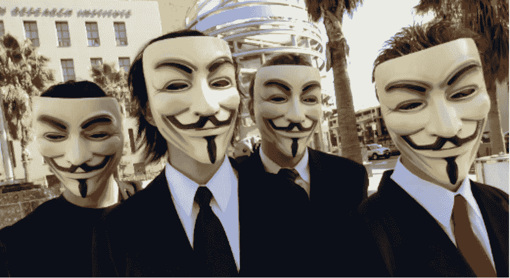

# Mengenal Lawan-Lawan dalam Membangun Sistem yang Aman dan Andal — Bagian 1

> 原文：<https://medium.easyread.co/mengenal-lawan-lawan-dalam-membangun-sistem-yang-aman-dan-andal-bagian-1-8d6fb8bb22b3?source=collection_archive---------1----------------------->

## Building Secure and Reliable Systems Series — Part 2.1

Pada bukunya “The Art of War”, Sun Tzu berkata:

> “Jika kamu **mengenal lawanmu dan mengenal dirimu sendiri** , kamu akan **memenangkan ratusan pertarungan** . Jika kamu mengenal dirimu sendiri tapi tidak mengenal lawanmu, untuk setiap kemenanganmu kamu juga akan mengalami kekalahan. Jika kamu **tidak mengenal lawanmu dan dirimu sendiri** , kamu akan **selalu kalah dalam pertarungan** ”.

Walaupun bukan merupakan sebuah pertarungan sungguhan, membangun sistem yang aman ( *secure* ) dan andal ( *reliable* ) dapat dibayangkan seperti sebuah pertarungan melawan segala “lawan” yang dapat mengancam keamanan dan keandalan sistem kamu. Tentu saja mengenal dengan seksama lawan yang kamu hadapi sangat penting untuk membangun sistem yang tahan terhadap lawan-lawan tersebut. Yuk kita kenali apa saja aspek-aspek yang dimiliki lawan keamanan dan keandalan sistem!

Tulisan ini merupakan bagian pertama dari seri kedua intisari buku “Membangun Sistem yang Aman dan Andal (Building Secure & Reliable Systems)” karya tim SRE Google. Untuk membaca seri lainnya dapat dilihat dibawah berikut

# Building Secure and Reliable Systems — Series List

[**1\. Pentingnya Membangun Sistem yang Aman dan Andal**](https://medium.com/easyread/pentingnya-membangun-sistem-yang-aman-dan-andal-a15f7a3f94eb) **2.1\. Mengenal Lawan-Lawan dalam Membangun Sistem yang Aman dan Andal — Bagian 1 — You’re here** [**2.2\. Mengenal Lawan-Lawan dalam Membangun Sistem yang Aman dan Andal — Bagian 2**](https://medium.com/easyread/mengenal-lawan-lawan-dalam-membangun-sistem-yang-aman-dan-andal-bagian-2-edf29bb74de0)[**3\. Meningkatkan Keamanan dengan Proksi, Sebuah Studi Kasus di Google**](https://medium.com/easyread/meningkatkan-keamanan-dengan-proksi-sebuah-studi-kasus-di-google-ddfc5e24fd6a)[**4\. Mempertimbangkan Aspek Keamanan dan Keandalan Sedari Awal**](https://medium.com/easyread/mempertimbangkan-aspek-keamanan-dan-keandalan-sedari-awal-68465a8814da)

Pada Agustus 1968, Clifford Stoll, seorang sysadmin pada Laboratorium Lawrence Berkeley mendeteksi sebuah serangan pencurian informasi rahasia milik pemerintah Amerika pada sistem komputer mereka. Stoll mengambil langkah tidak biasa, yaitu [membiarkan pelaku mengakses sistem mereka](http://pdf.textfiles.com/academics/wilyhacker.pdf) , dan tim Stoll mencatat setiap aktivitas yang dilakukan oleh si pelaku. Aktivitas tersebut berlangsung selama 10 bulan! Melalui informasi yang didapatkan, tim Stoll melacak kembali dan menangkap si pelaku yang [ternyata berasal dari Jerman](https://en.wikipedia.org/wiki/Markus_Hess) !

Ingat kasus [mati listrik total](https://en.wikipedia.org/wiki/2019_Java_blackout) alias blackout di pulau Jawa tahun 2019? Penyebabnya? [Awalnya Pohon Sengon dikira sebagai “pelakunya](https://www.kominfo.go.id/content/detail/20484/hoaks-listrik-mati-massal-karena-pohon-sengon-di-ungaran-pemalang/0/laporan_isu_hoaks) . Selidik punya selidik, ternyata kelalaian [PLN-lah penyebabnya](https://ombudsman.go.id/news/r/ungkap-hasil-investigasi-pemadaman-listrik-ombudsman-pln-lalai) .


Pohon Sengon

Kedua hal tersebut merupakan contoh lawan-lawan keamanan dan keandalan sistem. Pada **konteks *keandalan*** , lawan-lawan yang dihadapi biasanya memicu kegagalan sistem dengan ***tidak sengaja*** , dan bentuknya juga biasanya abstrak (misalnya kegagalan PLN tadi merupakan kesalahan pada perangkat keras sistem dan kelalaian pemeliharaan). Namun, pada **konteks *keamanan*** , lawan-lawan yang dihadapi **pasti adalah manusia** , yaitu orang yang **secara *sengaja* melakukan serangan terhadap sistem** .

Mungkin kamu membayangkan para penyerang adalah orang-orang yang mengenakan topeng dan hoodie, dan melakukan serangannya untuk terlihat keren atau menyampaikan pesan tertentu. Tapi, tidak semua pelaku memiliki rupa seperti itu. ***Siapa saja yang memiliki waktu, informasi, dan dana yang cukup dapat melakukan serangan terhadap sistem yang kamu miliki.*** Oleh karena itu, penting bagi kamu untuk mengenal betul siapa yang sedang menyerang sistem kamu, dan bagaimana mereka melancarkan serangannya.

Ada tiga cara yang sangat membantu untuk mengenal para pelaku tersebut, yaitu dengan ***mengetahui motif-motif pelaku*** , ***profil-profil umum pelaku*** , dan ***bagaimana cara pelaku melakukan serangan*** . Pada bagian pertama tulisan ini, kita akan membahas motif-motif pelaku dan profil-profil pelaku. Cara pelaku melakukan serangannya akan kita cakup pada bagian kedua.

# Motif-Motif Pelaku

Secara prinsip, para pelaku pasti adalah ***manusia* *yang memiliki motif tertentu*** (setidaknya sampai sekarang masih manusia saja). Kamu dapat membayangkan dirimu berada pada posisi mereka, apa kira-kira yang memotivasimu melakukan serangan terhadap suatu organisasi atau perusahaan? Dengan cara berpikir itu, kamu akan sangat terbantu dalam merancang sistem, maupun saat menanggulangi insiden keamanan. Berikut berapa motif serangan:

*   ***Bersenang-senang*** : Hanya untuk kesenangan semata.
*   ***Supaya terkenal*** : Misalnya untuk pamer *skill* teknis dan terlihat keren, pelaku dapat melakukan serangannya.
*   ***Aktifis*** : Untuk menyampaikan pesan, biasanya pesan politis.
*   ***Finansial:*** Untuk mendapatkan uang.
*   ***Memeras*** : Memaksa korban untuk melakukan hal tertentu.
*   ***Manipulasi*** : Mencapai tujuan tertentu, misalnya dengan menyebarkan misinformasi atau memanipulasi data politik.
*   ***Spionase*** : Untuk mendapatkan informasi berharga (misalnya memata-matai). Biasanya pelaku dengan motif ini adalah agen intelejen.
*   ***Kerusakan*** : Untuk menyabotase sistem, menghancurkan data, atau mematikan sistem sehingga tidak dapat digunakan.

Seorang penyerang mungkin memiliki beberapa motif tersebut secara bersamaan. Saat merancang sistem, kamu harus mempertimbangkan **kombinasi motif-motif** tersebut!

# Profil-Profil Pelaku

Setelah mengetahui motif-motif pelaku, kita dapat lebih dalam mempelajari motivasi mereka dengan mencari tahu profil-profil penyerang. Pada bagian ini, kita akan menjelajahi profil-profil pelaku yang umum diketahui. Tapi ingat, ***tidak ada serangan-serangan atau pelaku-pelaku yang sama persis*** . Daftar ini hanyalah gambaran untuk membantumu mempertimbangkan pelaku.

```
***Meretas vs Menyerang***Kita biasa mendengar istilah "meretas" atau "peretas". Istilah tersebut mungkin bernada negatif, karena kita seringkali membayangkan seorang peretas adalah orang dengan maksud jahat yang menyerang sistem komputer. Namun, sebenarnya kata "meretas" dapat memiliki makna yang lebih luas. Kata tersebut sendiri berasal dari Bahasa Inggris "hacking", yang jika ditelusuri ternyata penggunaannya berasal dari Massachusets Institute of Technology (MIT), dan saat itu mengacu pada aktifitas usil menggunakan sistem komputer tanpa maksud jahat. Oleh karena itu, pada seri tulisan ini mari bedakan "meretas/peretas" (tanpa maksud jahat) dan "menyerang/penyerang" (bermaksud jahat).
```

## Penggemar Komputer (Hobbyist)

Para peretas komputer pertama adalah orang-orang yang memiliki rasa ingin tahu terhadap cara komputer bekerja. Umumnya, mereka dimotivasi oleh *rasa keingintahuan* . Mereka meretas untuk bersenang-senang, dan biasanya meretas secara etis, tidak merusak sistem, serta tidak melewati batas-batas aktivitas kriminal.

## Periset Kerentanan Sistem

Para periset kerentanan sistem ( *vulnerability researcher* ) menggunakan pengetahuan mereka pada bidang keamanan secara profesional. Mereka melakukannya sebagai pekerja penuh waktu, paruh waktu, atau bahkan bisa jadi secara tidak sengaja menemukan [kekutu](https://twitter.com/ivanlanin/status/963068164618706944) pada sistem.
Banyak periset juga berpartisipasi dalam program *bug bounty* yang umum diselenggarakan oleh perusahaan-perusahaan. Biasanya, mereka termotivasi untuk *membuat sistem menjadi lebih baik* , serta melakukannya dengan tidak merusak sistem atau melanggar hukum. Contohnya adalah *Red Team* dan *penetration tester* yang sengaja dipekerjakan oleh perusahaan-perusahaan untuk tujuan ini.

## Pemerintah dan Penegak Hukum

Organisasi pemerintah seperti Badan Intelijen Negara, Satgas Siber Polri, *negara-negara lain* dapat memperkerjakan ahli-ahli keamanan untuk mengumpulkan informasi intelijen, bagian dari operasi militer, atau menegakkan hukum terhadap para kriminal.

**Melindungi Sistem dari Pelaku Pemerintah** Saat merancang sistem, kamu harus secara seksama berpikir apakah sistem kamu dapat menjadi sasaran para pelaku atau agen pemerintah ( *baik negara sendiri maupun negara lain* ).
Apakah organisasi atau perusahaan kamu melakukan aktivitas yang menarik perhatian mereka? Misalnya, apabila organisasimu membuat teknologi mikroprosesor untuk militer Indonesia; mungkin saja negara lain tertarik mendapatkan teknologimu!
Biasanya, agen pemerintahan juga tertarik pada informasi komunikasi pribadi, data lokasi, dan informasi sensitif lainnya. Pusatkan pertahanan pada aset-aset tersebut!

## Hacktivist

*Hacktivism* adalah aksi menggunakan teknologi untuk menggerakan perubahan sosial atau politik. Misalnya, aksi *deface* pada situs pemerintah untuk mengganti laman depan situs tersebut dengan pesan politik tertentu, atau melakukan serangan *denial-of-service* yang menyebabkan situs pemerintahan tidak dapat diakses. Tidak seperti tipe-tipe penyerang lainnya, biasanya para hacktivist akan ***mempublikasikan aktifitas mereka untuk mendapatkan reputasi publik*** .



Grup Hacktivist [Anonymous](https://en.wikipedia.org/wiki/Anonymous_(group)) biasanya melancarkan serangan bermotif politik ke institusi pemerintahan

**Melindungi Sistem dari Hacktivist**
Kamu perlu memikirkan apakah organisasi atau bisnismu terkait dengan topik kontroversial yang dapat menarik perhatian hacktivist. Misalnya layanan *hosting* web, blog, maupun video; atau terkait dengan HAM atau perlindungan hewan; atau layanan *messaging* . Jika ya, kamu mungkin perlu mengimplementasikan sistem keamanan yang tahan banting dan berlapis, dapat menghadapi serangan DoS, dan juga memiliki sistem untuk melakukan *backup* dan *restore* dengan cepat.

## Pelaku Kriminal

Biasanya, para pelaku kriminal melakukan kejahatan siber yang mirip dengan kejahatan fisik. Misalnya, *mencuri uang, memalsukan identitas, pemerasan, bahkan perencanaan pembunuhan* .
Pelaku kriminal biasanya memiliki kemampuan teknis yang luas, seperti membuat peralatan (skrip/kode) yang canggih untuk menyerang. Pada 2014–2015, pelaku kriminal dari China [mencuri informasi dari beberapa perusahaan hukum](https://www.sec.gov/news/pressrelease/2016-280.html) untuk memprediksi merger dua perusahaan dan kemudian membeli sahamnya sebelum merger. Mereka untung hingga beberapa juta dolar!
Pelaku kriminal juga dapat bekerja untuk pihak lain; perusahaan, kampanye politik, kartel, dan organisasi lainnya dapat membayar penyerang untuk tujuan masing-masing.

**Melindungi Sistem dari Pelaku Kriminal** Saat merancang sistem yang tahan dari serangan pelaku kriminal, perlu diingat bahwa mereka cenderung menyerang dengan cara yang paling mudah dan murah. Jika kamu dapat membuat sistemmu cukup tahan banting dan tahan serangan, mereka mungkin lebih memilih untuk menyerang korban lain. Oleh karena itu, pertimbangkanlah komponen sistem mana yang mungkin menjadi sasaran mereka, dan bagaimana cara membuat serangan mereka menjadi lebih sulit dan mahal.

## Sistem Otomasi dan Kecerdasan Buatan

Sistem penyerangan otomatis dan kecerdasan buatan adalah tipe penyerang yang sangat canggih dan relatif baru. Pada 2015, departemen riset pertahanan Amerika DARPA membuat lomba Cyber Grand Challenge untuk merancang kecerdasan buatan yang dapat belajar dengan sendirinya untuk berinteraksi dengan lingkungannya, dan juara satunya berhasil membuat sistem itu! Hal ini memungkinkan adanya serangan-serangan di masa depan yang dapat dilakukan tanpa dikontrol oleh manusia secara langsung, atau bahkan bukan berasal dari motif manusia! Seram juga ya..

**Melindungi Sistem dari Serangan Otomatis**
Untuk melindungi sistem dari serangan otomatis, kamu juga perlu secara otomatis menjalankan mekanisme-mekanisme pertahanan sistemmu. Hal ini akan dibahas pada seri-seri selanjutnya.


Kecerdasan Buatan mungkin suatu saat dapat melancarkan serangan atas kehendak sendiri

## Orang Dalam

Setiap organisasi pasti memiliki orang dalam: yaitu **orang yang diberikan kepercayaan untuk memiliki akses terhadap sistem internal atau informasi rahasia milik organisasi** . *Insider risk* atau *resiko orang dalam* adalah ancaman yang bersumber dari mereka. Seseorang menjadi *insider threat* atau *ancaman orang dalam* saat mereka dapat melakukan aktivitas jahat, lalai, atau yang tidak disengaja yang dapat menyebabkan kerusakan terhadap organisasi.

Orang dalam dapat dikategorikan menjadi tiga:

*   **Orang dalam pihak pertama** : misalnya pekerja, anak magang, direktur, hingga komisaris.
*   **Orang dalam pihak ketiga** : konsultan, vendor, auditor, kontributor open-source, partner komersial, dll.
*   **Orang yang terkait dengan orang dalam** : keluarga, teman sekamar, teman-teman.

**Orang Dalam Pihak Pertama** Keberadaan orang dalam pihak pertama di dalam organisasi tentu untuk menyokong tujuan bisnis secara langsung. **Sebagian besar insiden sistem terjadi karena pihak pertama dengan akses langsung terhadap sistem** . Selain pada sisi keamanan, orang dalam pihak pertama yang memiliki akses ***juga dapat menjadi ancaman pada segi keandalan sistem*** .
Pada Februari 2017, layanan penyimpanan berkas dari Amazon Web Services, S3, [mengalami kegagalan pada sistemnya yang mengakibatkan S3 tidak dapat diakses](https://www.theverge.com/2017/3/2/14792442/amazon-s3-outage-cause-typo-internet-server) . Pelakunya? Salah ketik pada saat memasukkan perintah pada sistem!

**Orang Dalam Pihak Ketiga** Naik daunnya software open-source membuat kemungkinan adanya *insider threat* yang merupakan orang yang bahkan belum pernah ditemui secara langsung oleh organisasi.
Bayangkan jika perusahaanmu membuat software yang di-open-source dan menerima Pull Request dari kontributor publik. Sekarang, selain para pekerja, perusahaan memiliki “orang dalam” baru yaitu para kontributor tersebut. Bayangkan bila ada kontributor yang melakukan Pull Request yang bermaksud jahat (misalnya menyisipkan sebuah trojan), atau melakukan perubahan kode yang mengakibatkan menurunnya performa signifikan yang dapat mengakibatkan gagalnya sistem pada *production* . Tentu kamu harus mengimplementasikan **mekanisme kontrol seperti review dan *testing* yang mumpuni untuk mencegah hal seperti itu** .

**Orang yang Terkait dengan Orang Dalam** Saudara atau teman dari dua jenis orang dalam di atas juga dapat menjadi “orang dalam” apabila mereka mendapatkan akses terhadap sistem, misalnya melalui akses yang dimiliki oleh orang dalam. **Hal ini seringkali terabaikan pada saat merancang sistem yang aman.** Bayangkan bila seorang admin sistem membawa pulang laptopnya pada akhir pekan dan dibiarkan terbuka tanpa dikunci, siapa yang tahu apa yang dapat terjadi apabila ternyata anggota keluarga atau temannya diam-diam mengaksesnya? Perlu diingat bahwa **orang di hadapan laptop belum tentu adalah orang dalam itu sendiri.**

## Threat Modelling Ancaman Orang Dalam

[*Threat Modelling*](https://en.wikipedia.org/wiki/Threat_model) atau pemodelan ancaman sangat penting untuk membantumu mengetahui ancaman-ancaman yang ada terhadap organisasi dan kemudian merancang sistem yang aman dan andal. Untuk memodelkan ancaman orang dalam, ada banyak framework (kerangka kerja) yang tersedia, mulai dari yang sederhana hingga yang kompleks. Google menggunakan threat modelling berikut dalam perancangan sistemnya:


Tabel Framework Treat Modelling Insider Risk yang digunakan oleh Google

Kamu dapat memasangkan tiap butir pada satu kolom di tabel di atas dengan butir-butir pada kolom-kolom sebelahnya. Jika ada pelaku/peran lain pada organisasimu, dapat ditambahkan pada kolom pertama. Dari hasil kombinasinya, misalnya kamu bisa memodelkan *threat* berikut:

*   Seorang *engineer* dengan akses terhadap *source code* yang tidak puas dengan hasil performance reviewnya dan *membalas dendam* dengan *menyusupkan* kode untuk mencuri *data pengguna* .
*   Seorang *analis keuangan* sedang menyiapkan *laporan keuangan* perusahaan dan *salah memasukkan data pengali* yang mengakibatkan laporan pendapatan keuangan berbeda hingga 10x lipat dari aslinya.
*   Anak dari seorang *SRE* menggunakan laptop orang tuanya dan menginstal game yang berisi malware yang mengakibatkan laptopnya terkunci dan membuat SRE tersebut tidak dapat menangani insiden serius yang terjadi pada sistem.

**Merancang Sistem agar aman terhadap ancaman orang dalam** Saat merancang sistem yang aman dan andal terhadap ancaman orang dalam, penting diingat bahwa manusia tidak sempurna dan pasti suatu saat membuat kesalahan. Selain merancang sistem yang aman terhadap serangan dengan maksud jahat, pikirkan juga bagaimana *mencegah* kelalaian manusia!

Saat merancang sistem, penting untuk dipikirkan bahwa *siapa saja yang memiliki akses terhadap sistem tersebut maupun datanya dapat menjadi (atau dipakai untuk) penyerang sistem juga* . Berikut beberapa prinsip yang akan sangat membantu untuk merancang sistem agar lebih aman terhadap ancaman orang dalam:

*   **Least Privilege** : berikan akses sesedikit mungkin yang cukup untuk melaksanakan tugas, *selama* melaksanakan tugas saja.
*   **Zero Trust** : jangan pernah percaya siapapun di dalam maupun di luar lingkup sistem organisasi. Google menggunakan “proksi aman” yang harus digunakan bahkan oleh orang dalam untuk mengeksekusi operasi terhadap sistem.
*   **Multi-party Authorization** : mengharuskan lebih dari satu orang untuk mengeksekusi operasi yang sensitif.
*   **Business Justification** : mengharuskan untuk menyediakan dokumen alasan atau tujuan mengakses data sensitif.
*   **Auditing and detection** : me-review semua log akses dan mendeteksi apakah akses-akses tersebut normal.
*   **Recoverability** : kemampuan untuk memulihkan sistem dari tindakan yang destruktif.

Prinsip-prinsip tersebut akan dibahas lebih lanjut di dalam seri-seri mendatang.

Pada bagian pertama ini, kita telah membahas motif-motif dan profil-profil lawan yang dihadapi oleh sistem yang aman dan andal. Pada bagian kedua, kita akan membahas metode-metode yang digunakan oleh para lawan untuk menyerang sistem.

Stay tuned! 🎧